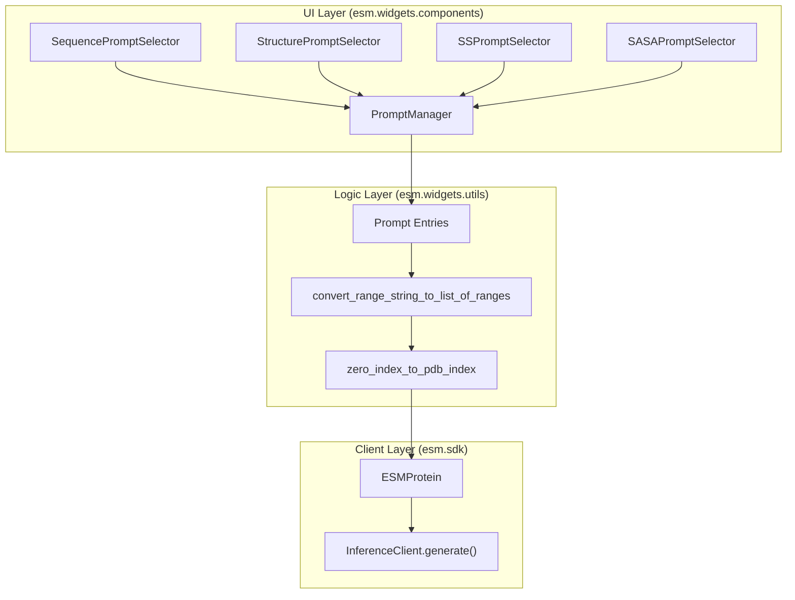
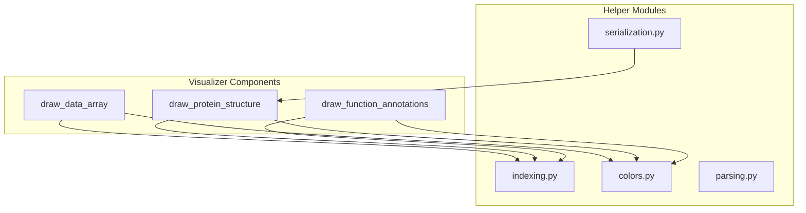

# Prompt Selectors & Results Visualizer

> **Relevant source files**
> * [esm/widgets/components/results_visualizer.py](https://github.com/Biohub/esm/blob/82ee3555/esm/widgets/components/results_visualizer.py)
> * [esm/widgets/components/sasa_prompt_selector.py](https://github.com/Biohub/esm/blob/82ee3555/esm/widgets/components/sasa_prompt_selector.py)
> * [esm/widgets/components/secondary_structure_prompt_selector.py](https://github.com/Biohub/esm/blob/82ee3555/esm/widgets/components/secondary_structure_prompt_selector.py)
> * [esm/widgets/components/sequence_prompt_selector.py](https://github.com/Biohub/esm/blob/82ee3555/esm/widgets/components/sequence_prompt_selector.py)
> * [esm/widgets/components/structure_prompt_selector.py](https://github.com/Biohub/esm/blob/82ee3555/esm/widgets/components/structure_prompt_selector.py)
> * [esm/widgets/utils/drawing/colors.py](https://github.com/Biohub/esm/blob/82ee3555/esm/widgets/utils/drawing/colors.py)
> * [esm/widgets/utils/drawing/draw_category_array.py](https://github.com/Biohub/esm/blob/82ee3555/esm/widgets/utils/drawing/draw_category_array.py)
> * [esm/widgets/utils/drawing/draw_function_annotations.py](https://github.com/Biohub/esm/blob/82ee3555/esm/widgets/utils/drawing/draw_function_annotations.py)
> * [esm/widgets/utils/drawing/draw_protein_structure.py](https://github.com/Biohub/esm/blob/82ee3555/esm/widgets/utils/drawing/draw_protein_structure.py)
> * [esm/widgets/utils/indexing.py](https://github.com/Biohub/esm/blob/82ee3555/esm/widgets/utils/indexing.py)
> * [esm/widgets/utils/prompting.py](https://github.com/Biohub/esm/blob/82ee3555/esm/widgets/utils/prompting.py)
> * [esm/widgets/utils/serialization.py](https://github.com/Biohub/esm/blob/82ee3555/esm/widgets/utils/serialization.py)
> * [esm/widgets/views/esm3_prompt_preview.py](https://github.com/Biohub/esm/blob/82ee3555/esm/widgets/views/esm3_prompt_preview.py)

The `esm.widgets` package provides a suite of interactive Jupyter components for manipulating protein data and visualizing model outputs. This section details the specialized prompt selector components—which allow users to define constraints across sequence, structure, and annotation tracks—and the visualization utilities used to render the resulting proteins, including pLDDT-colored structures and functional annotation maps.

## Overview of Prompt Selectors

Prompt selectors are interactive widgets designed to populate a `PromptManager` [esm/widgets/utils/prompting.py](https://github.com/Biohub/esm/blob/82ee3555/esm/widgets/utils/prompting.py)

 Each selector targets a specific modality (track) of the ESM3 model. They share a common pattern: providing a visual representation of the protein (e.g., a contact map or sequence string), a range selection mechanism (sliders or manual input), and a way to commit these selections as prompts for generation or prediction tasks.

### Data Flow for Prompt Selection

The following diagram illustrates how user interactions with the widgets translate into data structures used by the inference clients.

**Prompt Selection to API Payload Data Flow**

Sources: [esm/widgets/components/sequence_prompt_selector.py L13-L20](https://github.com/Biohub/esm/blob/82ee3555/esm/widgets/components/sequence_prompt_selector.py#L13-L20)

 [esm/widgets/components/structure_prompt_selector.py L19-L25](https://github.com/Biohub/esm/blob/82ee3555/esm/widgets/components/structure_prompt_selector.py#L19-L25)

 [esm/widgets/components/secondary_structure_prompt_selector.py L13-L21](https://github.com/Biohub/esm/blob/82ee3555/esm/widgets/components/secondary_structure_prompt_selector.py#L13-L21)

 [esm/widgets/components/sasa_prompt_selector.py L12-L20](https://github.com/Biohub/esm/blob/82ee3555/esm/widgets/components/sasa_prompt_selector.py#L12-L20)

 [esm/widgets/utils/parsing.py L9](https://github.com/Biohub/esm/blob/82ee3555/esm/widgets/utils/parsing.py#L9-L9)

 [esm/widgets/utils/indexing.py L25-L26](https://github.com/Biohub/esm/blob/82ee3555/esm/widgets/utils/indexing.py#L25-L26)

---

## Modality-Specific Selectors

### Sequence Prompt Selector

The `create_sequence_prompt_selector` function [esm/widgets/components/sequence_prompt_selector.py L13-L20](https://github.com/Biohub/esm/blob/82ee3555/esm/widgets/components/sequence_prompt_selector.py#L13-L20)

 renders the protein sequence with HTML-based highlighting. It supports:

* **Highlighting**: Uses `apply_highlighting` [esm/widgets/components/sequence_prompt_selector.py L96-L130](https://github.com/Biohub/esm/blob/82ee3555/esm/widgets/components/sequence_prompt_selector.py#L96-L130)  to wrap residues in `` tags with background colors derived from the `PromptManager`.
* **Line Breaking**: Automatically wraps sequences based on `line_length` [esm/widgets/components/sequence_prompt_selector.py L88-L94](https://github.com/Biohub/esm/blob/82ee3555/esm/widgets/components/sequence_prompt_selector.py#L88-L94)
* **Masking Options**: A toggle between "Custom range" and "Fully masked" [esm/widgets/components/sequence_prompt_selector.py L39-L44](https://github.com/Biohub/esm/blob/82ee3555/esm/widgets/components/sequence_prompt_selector.py#L39-L44)

### Structure Prompt Selector

The `create_structure_prompt_selector` function [esm/widgets/components/structure_prompt_selector.py L19-L25](https://github.com/Biohub/esm/blob/82ee3555/esm/widgets/components/structure_prompt_selector.py#L19-L25)

 provides a dual-view interface for structural prompting:

1. **Contact Map**: An `imshow` plot of the $C\beta$ adjacency matrix (8Å threshold) [esm/widgets/components/structure_prompt_selector.py L26-L27](https://github.com/Biohub/esm/blob/82ee3555/esm/widgets/components/structure_prompt_selector.py#L26-L27)
2. **3D Visualization**: An interactive `py3Dmol` view rendered via `draw_protein_structure` [esm/widgets/utils/drawing/draw_protein_structure.py L8-L12](https://github.com/Biohub/esm/blob/82ee3555/esm/widgets/utils/drawing/draw_protein_structure.py#L8-L12)

It handles coordinate conversion between zero-based indexing and PDB residue indexing using `pdb_range_to_zero_range` [esm/widgets/utils/indexing.py L38-L44](https://github.com/Biohub/esm/blob/82ee3555/esm/widgets/utils/indexing.py#L38-L44)

### Secondary Structure & SASA Selectors

Both `create_secondary_structure_prompt_selector` [esm/widgets/components/secondary_structure_prompt_selector.py L13-L21](https://github.com/Biohub/esm/blob/82ee3555/esm/widgets/components/secondary_structure_prompt_selector.py#L13-L21)

 and `create_sasa_prompt_selector` [esm/widgets/components/sasa_prompt_selector.py L12-L20](https://github.com/Biohub/esm/blob/82ee3555/esm/widgets/components/sasa_prompt_selector.py#L12-L20)

 utilize the `draw_data_array` utility [esm/widgets/utils/drawing/draw_category_array.py](https://github.com/Biohub/esm/blob/82ee3555/esm/widgets/utils/drawing/draw_category_array.py)

 to render 1D tracks.

* **SS3**: Uses `pydssp` to assign secondary structure (Helix, Strand, Coil) from coordinates [esm/widgets/components/secondary_structure_prompt_selector.py L143-L147](https://github.com/Biohub/esm/blob/82ee3555/esm/widgets/components/secondary_structure_prompt_selector.py#L143-L147)
* **SASA**: Computes Solvent Accessible Surface Area using the `ProteinChain.sasa()` method [esm/widgets/components/sasa_prompt_selector.py L133-L135](https://github.com/Biohub/esm/blob/82ee3555/esm/widgets/components/sasa_prompt_selector.py#L133-L135)

Sources: [esm/widgets/components/sequence_prompt_selector.py L13-L175](https://github.com/Biohub/esm/blob/82ee3555/esm/widgets/components/sequence_prompt_selector.py#L13-L175)

 [esm/widgets/components/structure_prompt_selector.py L19-L195](https://github.com/Biohub/esm/blob/82ee3555/esm/widgets/components/structure_prompt_selector.py#L19-L195)

 [esm/widgets/components/secondary_structure_prompt_selector.py L13-L163](https://github.com/Biohub/esm/blob/82ee3555/esm/widgets/components/secondary_structure_prompt_selector.py#L13-L163)

 [esm/widgets/components/sasa_prompt_selector.py L12-L135](https://github.com/Biohub/esm/blob/82ee3555/esm/widgets/components/sasa_prompt_selector.py#L12-L135)

---

## Results Visualization Utilities

The visualization subsystem converts model outputs (tensors or `ESMProtein` objects) into human-readable plots and 3D structures.

### create_results_visualizer Dispatch Pattern

The `create_results_visualizer` function [esm/widgets/components/results_visualizer.py L21-L36](https://github.com/Biohub/esm/blob/82ee3555/esm/widgets/components/results_visualizer.py#L21-L36)

 acts as a central dispatcher for rendering generated `ESMProtein` samples. It takes a `modality` string (e.g., "sequence", "structure", "sasa", "secondary_structure", "function") and a list of `ESMProtein` objects. Based on the modality, it calls a specific `create_*_results_page` function to generate the appropriate visualization.

For example, if `modality` is "structure", it sorts samples by pTM score [esm/widgets/components/results_visualizer.py L38-L43](https://github.com/Biohub/esm/blob/82ee3555/esm/widgets/components/results_visualizer.py#L38-L43)

 and then calls `create_structure_results_page` [esm/widgets/components/results_visualizer.py L85-L90](https://github.com/Biohub/esm/blob/82ee3555/esm/widgets/components/results_visualizer.py#L85-L90)

 This function then uses `draw_protein_structure` to render the 3D models.

**`create_results_visualizer` Dispatch Flow**

Sources: [esm/widgets/components/results_visualizer.py L21-L132](https://github.com/Biohub/esm/blob/82ee3555/esm/widgets/components/results_visualizer.py#L21-L132)

### Structural Rendering

The `draw_protein_structure` function [esm/widgets/utils/drawing/draw_protein_structure.py L8-L12](https://github.com/Biohub/esm/blob/82ee3555/esm/widgets/utils/drawing/draw_protein_structure.py#L8-L12)

 is the primary utility for 3D visualization. It takes a `ProteinChain` and a list of `highlighted_ranges` (start, end, color).

* **Implementation**: It initializes a `py3Dmol.view` [esm/widgets/utils/drawing/draw_protein_structure.py L16-L17](https://github.com/Biohub/esm/blob/82ee3555/esm/widgets/utils/drawing/draw_protein_structure.py#L16-L17)  and applies styles using the `cartoon` representation [esm/widgets/utils/drawing/draw_protein_structure.py L18-L23](https://github.com/Biohub/esm/blob/82ee3555/esm/widgets/utils/drawing/draw_protein_structure.py#L18-L23)
* **pLDDT Coloring**: When rendering structures from model predictions, `create_structure_results_page` [esm/widgets/components/results_visualizer.py L250-L259](https://github.com/Biohub/esm/blob/82ee3555/esm/widgets/components/results_visualizer.py#L250-L259)  can color the protein by pLDDT scores, providing a visual indication of prediction confidence. It uses a colormap from blue (low confidence) to red (high confidence) [esm/widgets/components/results_visualizer.py L254-L255](https://github.com/Biohub/esm/blob/82ee3555/esm/widgets/components/results_visualizer.py#L254-L255)

### Functional Annotation Visualization

Functional annotations are visualized as a linear map of features using the `dna_features_viewer` library.

* **`draw_function_annotations`**: Converts a list of `FunctionAnnotation` objects into a `GraphicRecord` [esm/widgets/utils/drawing/draw_function_annotations.py L25-L27](https://github.com/Biohub/esm/blob/82ee3555/esm/widgets/utils/drawing/draw_function_annotations.py#L25-L27)
* **Color Mapping**: Annotations are colored by their InterPro entry type (e.g., Domain, Family, Site) using a predefined `type_colors` mapping [esm/widgets/utils/drawing/draw_function_annotations.py L28-L30](https://github.com/Biohub/esm/blob/82ee3555/esm/widgets/utils/drawing/draw_function_annotations.py#L28-L30)
* **Backend Management**: Uses a `use_backend("agg")` context manager [esm/widgets/utils/drawing/draw_function_annotations.py L15-L22](https://github.com/Biohub/esm/blob/82ee3555/esm/widgets/utils/drawing/draw_function_annotations.py#L15-L22)  to ensure thread-safe headless rendering of matplotlib figures into `ipywidgets.Image` objects [esm/widgets/utils/drawing/draw_function_annotations.py L77-L81](https://github.com/Biohub/esm/blob/82ee3555/esm/widgets/utils/drawing/draw_function_annotations.py#L77-L81)

### 1D Track Visualization

The `draw_data_array` function [esm/widgets/utils/drawing/draw_category_array.py](https://github.com/Biohub/esm/blob/82ee3555/esm/widgets/utils/drawing/draw_category_array.py)

 provides a flexible way to render categorical or continuous 1D data.

| Feature | Description |
| --- | --- |
| **Categorical** | Maps discrete integers to colors via `category_color_mapping` [esm/widgets/utils/drawing/draw_category_array.py L27-L55](https://github.com/Biohub/esm/blob/82ee3555/esm/widgets/utils/drawing/draw_category_array.py#L27-L55) |
| **Continuous** | Uses a `matplotlib` colormap and `Normalize` for values like SASA [esm/widgets/utils/drawing/draw_category_array.py L103-L109](https://github.com/Biohub/esm/blob/82ee3555/esm/widgets/utils/drawing/draw_category_array.py#L103-L109) |
| **Highlights** | Draws bounding boxes around specific ranges to indicate selected prompts [esm/widgets/utils/drawing/draw_category_array.py L82-L92](https://github.com/Biohub/esm/blob/82ee3555/esm/widgets/utils/drawing/draw_category_array.py#L82-L92) |

Sources: [esm/widgets/components/results_visualizer.py L21-L36](https://github.com/Biohub/esm/blob/82ee3555/esm/widgets/components/results_visualizer.py#L21-L36)

 [esm/widgets/components/results_visualizer.py L250-L259](https://github.com/Biohub/esm/blob/82ee3555/esm/widgets/components/results_visualizer.py#L250-L259)

 [esm/widgets/utils/drawing/draw_protein_structure.py L8-L27](https://github.com/Biohub/esm/blob/82ee3555/esm/widgets/utils/drawing/draw_protein_structure.py#L8-L27)

 [esm/widgets/utils/drawing/draw_function_annotations.py L25-L83](https://github.com/Biohub/esm/blob/82ee3555/esm/widgets/utils/drawing/draw_function_annotations.py#L25-L83)

 [esm/widgets/utils/drawing/draw_category_array.py](https://github.com/Biohub/esm/blob/82ee3555/esm/widgets/utils/drawing/draw_category_array.py)

---

## Implementation Details

### Coordinate and Indexing Utilities

The system relies on `esm/widgets/utils/indexing.py` to bridge the gap between model-centric zero-indexing and biologist-centric PDB indexing.

* **`zero_index_to_pdb_index`**: Retrieves the original residue number from the `ProteinChain.residue_index` array [esm/widgets/utils/indexing.py L25-L26](https://github.com/Biohub/esm/blob/82ee3555/esm/widgets/utils/indexing.py#L25-L26)
* **`pdb_index_to_zero_index`**: Uses `np.argwhere` to find the array position corresponding to a PDB residue number [esm/widgets/utils/indexing.py L17-L22](https://github.com/Biohub/esm/blob/82ee3555/esm/widgets/utils/indexing.py#L17-L22)

### Visualizer Component Architecture

Sources: [esm/widgets/utils/indexing.py L1-L45](https://github.com/Biohub/esm/blob/82ee3555/esm/widgets/utils/indexing.py#L1-L45)

 [esm/widgets/utils/drawing/draw_category_array.py](https://github.com/Biohub/esm/blob/82ee3555/esm/widgets/utils/drawing/draw_category_array.py)

 [esm/widgets/utils/drawing/draw_protein_structure.py L8-L12](https://github.com/Biohub/esm/blob/82ee3555/esm/widgets/utils/drawing/draw_protein_structure.py#L8-L12)

 [esm/widgets/utils/serialization.py L18-L23](https://github.com/Biohub/esm/blob/82ee3555/esm/widgets/utils/serialization.py#L18-L23)