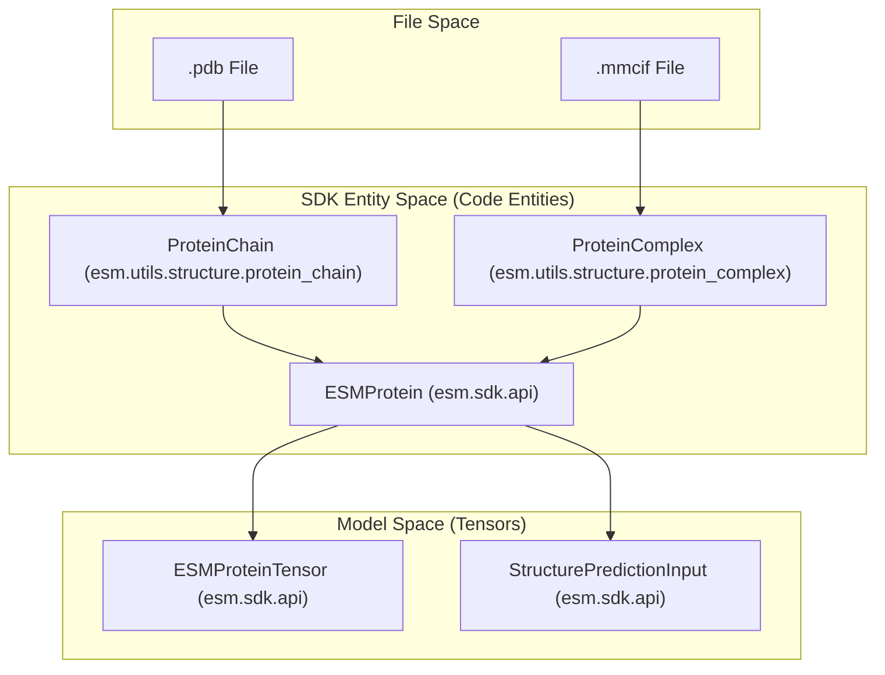
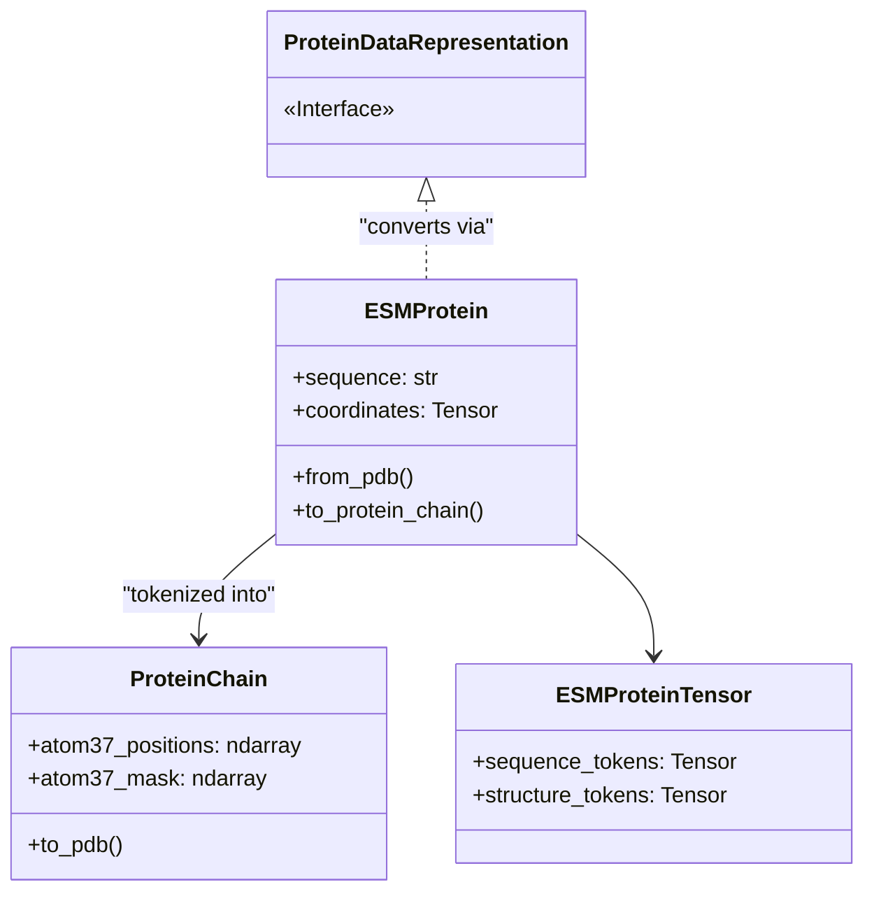

# Protein Data Representations

> **Relevant source files**
> * [esm/sdk/api.py](https://github.com/Biohub/esm/blob/82ee3555/esm/sdk/api.py)
> * [esm/utils/structure/metrics.py](https://github.com/Biohub/esm/blob/82ee3555/esm/utils/structure/metrics.py)
> * [esm/utils/structure/protein_chain.py](https://github.com/Biohub/esm/blob/82ee3555/esm/utils/structure/protein_chain.py)
> * [esm/utils/structure/protein_complex.py](https://github.com/Biohub/esm/blob/82ee3555/esm/utils/structure/protein_complex.py)

Proteins in the ESM codebase are represented across multiple levels of abstraction, ranging from raw structural files (PDB/mmCIF) to high-level SDK objects for API interactions, and finally to tensor representations used by the transformer models. This multi-layered approach ensures that structural biology data is consistently handled while remaining compatible with deep learning workflows.

### Representation Layers Overview

The codebase transitions between three primary representation spaces:

1. **File/Structural Space**: Raw data parsed from `.pdb` or `.mmcif` files using libraries like `biotite`.
2. **SDK Entity Space**: Pythonic objects like `ESMProtein` and `ProteinChain` that encapsulate sequence, structure, and metadata.
3. **Tensor/Model Space**: Tokenized integer tensors and coordinate tensors (Atom37) used as inputs to ESMC, ESM3, and ESMFold2.

The following diagram illustrates the flow of data through these representations:

#### Protein Data Flow Diagram

**Sources:** [esm/sdk/api.py L27-L137](https://github.com/Biohub/esm/blob/82ee3555/esm/sdk/api.py#L27-L137)

 [esm/utils/structure/protein_chain.py L143-L155](https://github.com/Biohub/esm/blob/82ee3555/esm/utils/structure/protein_chain.py#L143-L155)

 [esm/utils/structure/protein_complex.py L44-L55](https://github.com/Biohub/esm/blob/82ee3555/esm/utils/structure/protein_complex.py#L44-L55)

---

### Core Data Entities

#### ProteinChain & Atom37 Format

The `ProteinChain` class is the fundamental unit for single-chain structural data [esm/utils/structure/protein_chain.py L149-L167](https://github.com/Biohub/esm/blob/82ee3555/esm/utils/structure/protein_chain.py#L149-L167)

 It utilizes the **Atom37** indexing scheme, which maps every residue to a fixed-size 37-atom vector, ensuring a consistent tensor shape regardless of the amino acid type.

* **Key Capabilities**: PDB/mmCIF parsing, geometric utilities (RMSD, lDDT), and coordinate normalization.
* **For details, see [ProteinChain & Atom37 Format](/Biohub/esm/4.1-proteinchain-and-atom37-format)**.

#### ProteinComplex & MolecularComplex

For multi-chain assemblies and heterogeneous systems (including DNA, RNA, and ligands), the codebase provides `ProteinComplex` and `MolecularComplex`.

* **ProteinComplex**: Handles assemblies of multiple `ProteinChain` objects [esm/utils/structure/protein_complex.py L150-L167](https://github.com/Biohub/esm/blob/82ee3555/esm/utils/structure/protein_complex.py#L150-L167)
* **MolecularComplex**: A more generalized, flat representation of atoms designed for all-atom modeling tasks.
* **For details, see [ProteinComplex & MolecularComplex](/Biohub/esm/4.2-proteincomplex-and-molecularcomplex)**.

#### ESMProtein (SDK Interface)

The `ESMProtein` class is the primary entry point for users of the ESM SDK [esm/sdk/api.py L27-L54](https://github.com/Biohub/esm/blob/82ee3555/esm/sdk/api.py#L27-L54)

 It acts as a container for multiple "tracks" of data:

* **Sequence**: Amino acid string [esm/sdk/api.py L29](https://github.com/Biohub/esm/blob/82ee3555/esm/sdk/api.py#L29-L29)
* **Coordinates**: `torch.Tensor` of shape `(L, 37, 3)` [esm/sdk/api.py L33](https://github.com/Biohub/esm/blob/82ee3555/esm/sdk/api.py#L33-L33)
* **Annotations**: Secondary structure (SS8), SASA, and InterPro function annotations [esm/sdk/api.py L30-L32](https://github.com/Biohub/esm/blob/82ee3555/esm/sdk/api.py#L30-L32)

**Sources:** [esm/sdk/api.py L27-L54](https://github.com/Biohub/esm/blob/82ee3555/esm/sdk/api.py#L27-L54)

 [esm/utils/structure/protein_chain.py L149-L167](https://github.com/Biohub/esm/blob/82ee3555/esm/utils/structure/protein_chain.py#L149-L167)

---

### Transitioning to Model Tensors

To perform inference, SDK objects must be converted into tensors. This process involves tokenizing categorical tracks (like sequence and function) and preparing coordinate frames for structural tracks.

#### Data Conversion Mapping

| From | To | Mechanism |
| --- | --- | --- |
| `.pdb` / `.mmcif` | `ESMProtein` | `ESMProtein.from_pdb()` [esm/sdk/api.py L69-L75](https://github.com/Biohub/esm/blob/82ee3555/esm/sdk/api.py#L69-L75) |
| `ESMProtein` | `ESMProteinTensor` | `esm.utils.encoding.tokenize_protein` [esm/sdk/api.py L236-L240](https://github.com/Biohub/esm/blob/82ee3555/esm/sdk/api.py#L236-L240) |
| `ESMProtein` | `StructurePredictionInput` | `ESMFold2InputBuilder.build()` [esm/sdk/api.py L537-L540](https://github.com/Biohub/esm/blob/82ee3555/esm/sdk/api.py#L537-L540) |

#### Structure Prediction Input Builder

The `ESMFold2InputBuilder` prepares complex payloads for structure prediction [esm/sdk/api.py L537-L550](https://github.com/Biohub/esm/blob/82ee3555/esm/sdk/api.py#L537-L550)

 It handles the assembly of Multiple Sequence Alignments (MSAs), templates, and conditioning (e.g., pocket or distogram constraints) into a `StructurePredictionInput` object.

* **For details, see [Structure Prediction Input Builder](/Biohub/esm/4.3-structure-prediction-input-builder)**.

#### Code-to-System Mapping

The following diagram bridges the high-level representation concepts to the specific classes and methods used to manipulate them.

**Sources:** [esm/sdk/api.py L27-L49](https://github.com/Biohub/esm/blob/82ee3555/esm/sdk/api.py#L27-L49)

 [esm/sdk/api.py L195-L210](https://github.com/Biohub/esm/blob/82ee3555/esm/sdk/api.py#L195-L210)

 [esm/utils/structure/protein_chain.py L149-L167](https://github.com/Biohub/esm/blob/82ee3555/esm/utils/structure/protein_chain.py#L149-L167)