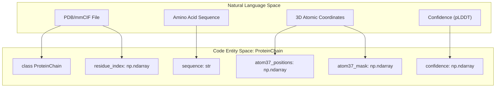
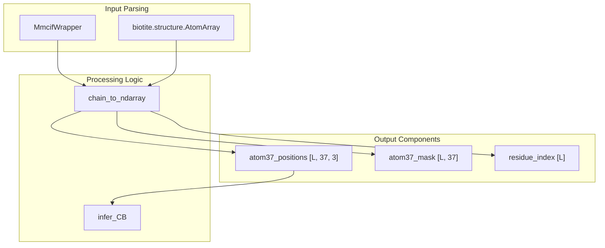

# ProteinChain & Atom37 Format

> **Relevant source files**
> * [esm/utils/residue_constants.py](https://github.com/Biohub/esm/blob/82ee3555/esm/utils/residue_constants.py)
> * [esm/utils/structure/aligner.py](https://github.com/Biohub/esm/blob/82ee3555/esm/utils/structure/aligner.py)
> * [esm/utils/structure/atom_indexer.py](https://github.com/Biohub/esm/blob/82ee3555/esm/utils/structure/atom_indexer.py)
> * [esm/utils/structure/mmcif_parsing.py](https://github.com/Biohub/esm/blob/82ee3555/esm/utils/structure/mmcif_parsing.py)
> * [esm/utils/structure/protein_chain.py](https://github.com/Biohub/esm/blob/82ee3555/esm/utils/structure/protein_chain.py)
> * [esm/utils/structure/protein_structure.py](https://github.com/Biohub/esm/blob/82ee3555/esm/utils/structure/protein_structure.py)

The `ProteinChain` class and the Atom37 format serve as the primary structural data representations within the ESM repository. This system provides a fixed-indexing scheme for all-atom coordinates, enabling consistent tensorization for machine learning models while maintaining compatibility with standard bioinformatics formats like PDB and mmCIF.

## Atom37 Representation & Fixed Indexing

The Atom37 format is a standardized representation where every residue is allocated 37 atom slots. This ensures that structural data can be represented as fixed-shape tensors, regardless of the specific amino acid type.

* **Fixed Indexing**: Atoms are mapped to indices 0-36 based on `residue_constants.atom_order` [esm/utils/structure/protein_chain.py L122-L126](https://github.com/Biohub/esm/blob/82ee3555/esm/utils/structure/protein_chain.py#L122-L126)
* **Atom37 Positions**: A `np.ndarray` of shape `(L, 37, 3)`.
* **Atom37 Mask**: A boolean mask of shape `(L, 37)` indicating the presence of specific atoms [esm/utils/structure/protein_chain.py L152-L153](https://github.com/Biohub/esm/blob/82ee3555/esm/utils/structure/protein_chain.py#L152-L153)
* **Coordinate Handling**: The format supports selenium-to-sulfur conversion for MSE residues, placing selenium coordinates in the sulfur (SD) column [esm/utils/structure/protein_chain.py L125-L127](https://github.com/Biohub/esm/blob/82ee3555/esm/utils/structure/protein_chain.py#L125-L127)

### Atom Order Constants

The mapping of atom names to indices is defined in `residue_constants.py`. For example, backbone atoms typically occupy the first few slots (N, CA, C, O).

| Atom Name | Index (Typical) | Group |
| --- | --- | --- |
| N | 0 | Backbone |
| CA | 1 | Backbone |
| C | 2 | Backbone |
| CB | 3 | Sidechain |
| O | 4 | Backbone |

Sources: [esm/utils/structure/protein_chain.py L91-L139](https://github.com/Biohub/esm/blob/82ee3555/esm/utils/structure/protein_chain.py#L91-L139)

 [esm/utils/residue_constants.py L148-L202](https://github.com/Biohub/esm/blob/82ee3555/esm/utils/residue_constants.py#L148-L202)

## The ProteinChain Class

The `ProteinChain` dataclass is the core container for single-chain structural data. It encapsulates sequence, coordinates, and metadata.

### System Mapping: Data to Code

The following diagram illustrates how biological structural data is mapped into the `ProteinChain` code entity.

"Structural Data Mapping"



Sources: [esm/utils/structure/protein_chain.py L149-L164](https://github.com/Biohub/esm/blob/82ee3555/esm/utils/structure/protein_chain.py#L149-L164)

### Factory Methods

`ProteinChain` provides several static methods to instantiate objects from various sources:

* `from_pdb(path_or_buffer)`: Parses standard PDB files [esm/utils/structure/protein_chain.py L284](https://github.com/Biohub/esm/blob/82ee3555/esm/utils/structure/protein_chain.py#L284-L284)
* `from_mmcif(path_or_buffer, chain_id)`: Extracts a specific chain from an mmCIF file [esm/utils/structure/protein_chain.py L307](https://github.com/Biohub/esm/blob/82ee3555/esm/utils/structure/protein_chain.py#L307-L307)
* `from_rcsb(pdb_id, chain_id)`: Downloads and parses structural data directly from the RCSB PDB database [esm/utils/structure/protein_chain.py L338](https://github.com/Biohub/esm/blob/82ee3555/esm/utils/structure/protein_chain.py#L338-L338)
* `from_atom37(...)`: Direct instantiation from raw Atom37 arrays [esm/utils/structure/protein_chain.py L255](https://github.com/Biohub/esm/blob/82ee3555/esm/utils/structure/protein_chain.py#L255-L255)

### Export Methods

* `to_pdb(path_or_buffer)`: Writes the chain to PDB format [esm/utils/structure/protein_chain.py L438](https://github.com/Biohub/esm/blob/82ee3555/esm/utils/structure/protein_chain.py#L438-L438)
* `to_mmcif(path_or_buffer)`: Writes the chain to mmCIF format [esm/utils/structure/protein_chain.py L456](https://github.com/Biohub/esm/blob/82ee3555/esm/utils/structure/protein_chain.py#L456-L456)
* `to_blob()`: Serializes the object using `msgpack` and `brotli` compression for efficient storage/transport [esm/utils/structure/protein_chain.py L516](https://github.com/Biohub/esm/blob/82ee3555/esm/utils/structure/protein_chain.py#L516-L516)

Sources: [esm/utils/structure/protein_chain.py L255-L530](https://github.com/Biohub/esm/blob/82ee3555/esm/utils/structure/protein_chain.py#L255-L530)

## Geometric Utilities & Metrics

The `ProteinChain` class includes built-in methods for geometric manipulation and structural validation.

### AtomIndexer

The `atoms` and `atom_mask` properties return an `AtomIndexer` instance. This allows for semantic slicing of the Atom37 tensors using atom names rather than raw indices [esm/utils/structure/protein_chain.py L194-L199](https://github.com/Biohub/esm/blob/82ee3555/esm/utils/structure/protein_chain.py#L194-L199)

```markdown
# Example usage of AtomIndexerca_positions = chain.atoms["CA"] backbone_mask = chain.atom_mask[["N", "CA", "C", "O"]]
```

Sources: [esm/utils/structure/atom_indexer.py L6-L16](https://github.com/Biohub/esm/blob/82ee3555/esm/utils/structure/atom_indexer.py#L6-L16)

### Metric Functions

`ProteinChain` implements standard structural biology metrics:

* **RMSD**: Root Mean Square Deviation after alignment [esm/utils/structure/protein_chain.py L627](https://github.com/Biohub/esm/blob/82ee3555/esm/utils/structure/protein_chain.py#L627-L627)
* **ldDT-CA**: Local Distance Difference Test calculated on Carbon-Alpha atoms [esm/utils/structure/protein_chain.py L650](https://github.com/Biohub/esm/blob/82ee3555/esm/utils/structure/protein_chain.py#L650-L650)
* **GDT-TS**: Global Distance Test Total Score [esm/utils/structure/protein_chain.py L666](https://github.com/Biohub/esm/blob/82ee3555/esm/utils/structure/protein_chain.py#L666-L666)
* **SASA**: Solvent Accessible Surface Area using a rolling-ball algorithm [esm/utils/structure/protein_chain.py L679](https://github.com/Biohub/esm/blob/82ee3555/esm/utils/structure/protein_chain.py#L679-L679)
* **SAP Score**: Spatial Aggregation Propensity for identifying aggregation-prone patches [esm/utils/structure/protein_chain.py L734](https://github.com/Biohub/esm/blob/82ee3555/esm/utils/structure/protein_chain.py#L734-L734)

### Alignment and Transformation

* `align(target)`: Uses the `Aligner` class to find the optimal rotation and translation to superimpose the chain onto a target [esm/utils/structure/protein_chain.py L603](https://github.com/Biohub/esm/blob/82ee3555/esm/utils/structure/protein_chain.py#L603-L603)
* `apply_affine(affine)`: Applies an `Affine3D` transformation to all atom positions [esm/utils/structure/protein_chain.py L590](https://github.com/Biohub/esm/blob/82ee3555/esm/utils/structure/protein_chain.py#L590-L590)

Sources: [esm/utils/structure/protein_chain.py L590-L750](https://github.com/Biohub/esm/blob/82ee3555/esm/utils/structure/protein_chain.py#L590-L750)

 [esm/utils/structure/aligner.py L30-L80](https://github.com/Biohub/esm/blob/82ee3555/esm/utils/structure/aligner.py#L30-L80)

## Implementation Details: From mmCIF to Atom37

The conversion from raw structural files to `ProteinChain` involves several steps handled by `chain_to_ndarray` [esm/utils/structure/protein_chain.py L88](https://github.com/Biohub/esm/blob/82ee3555/esm/utils/structure/protein_chain.py#L88-L88)

"Structural Processing Pipeline"



1. **Sequence Extraction**: The sequence is pulled from the `SEQRES` records via `MmcifWrapper` [esm/utils/structure/protein_chain.py L96](https://github.com/Biohub/esm/blob/82ee3555/esm/utils/structure/protein_chain.py#L96-L96)
2. **Coordinate Mapping**: Atoms from the `AtomArray` are matched to their `SEQRES` positions using residue numbers and insertion codes [esm/utils/structure/protein_chain.py L101-L112](https://github.com/Biohub/esm/blob/82ee3555/esm/utils/structure/protein_chain.py#L101-L112)
3. **Missing Atom Inference**: While `chain_to_ndarray` extracts existing atoms, the system provides `infer_CB` to calculate Beta-Carbon positions based on N, CA, and C coordinates using standard geometry (Bond Length=1.522Å, Angle=1.927rad, Dihedral=-2.143rad) [esm/utils/structure/protein_chain.py L69-L85](https://github.com/Biohub/esm/blob/82ee3555/esm/utils/structure/protein_chain.py#L69-L85)  This `infer_CB` function is also available as `infer_cbeta_from_atom37` for `torch.Tensor` inputs [esm/utils/structure/protein_structure.py L34-L65](https://github.com/Biohub/esm/blob/82ee3555/esm/utils/structure/protein_structure.py#L34-L65)

Sources: [esm/utils/structure/protein_chain.py L69-L139](https://github.com/Biohub/esm/blob/82ee3555/esm/utils/structure/protein_chain.py#L69-L139)

 [esm/utils/structure/protein_structure.py L34-L65](https://github.com/Biohub/esm/blob/82ee3555/esm/utils/structure/protein_structure.py#L34-L65)