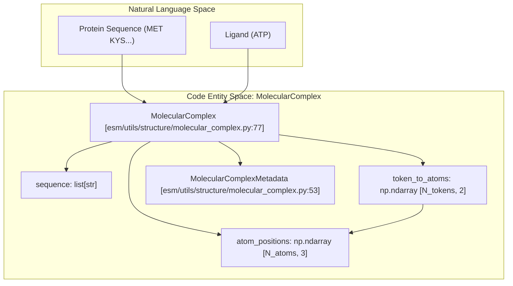
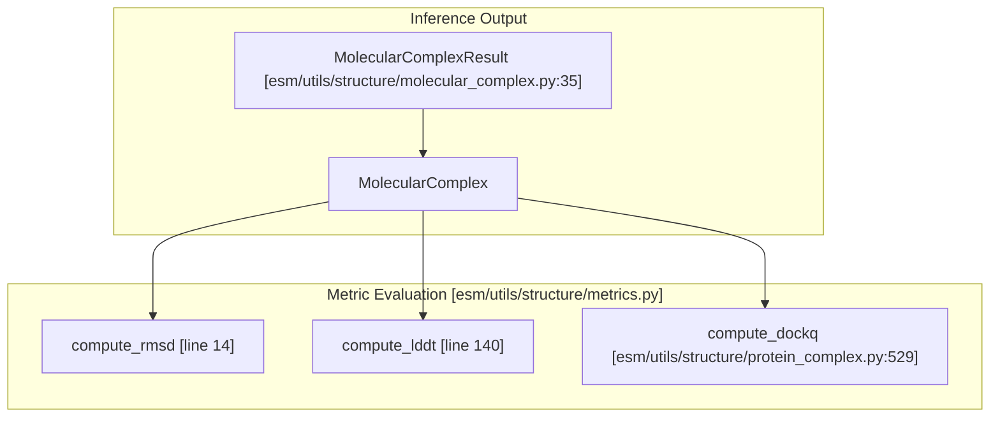

# ProteinComplex & MolecularComplex

> **Relevant source files**
> * [esm/utils/structure/metrics.py](https://github.com/Biohub/esm/blob/82ee3555/esm/utils/structure/metrics.py)
> * [esm/utils/structure/molecular_complex.py](https://github.com/Biohub/esm/blob/82ee3555/esm/utils/structure/molecular_complex.py)
> * [esm/utils/structure/normalize_coordinates.py](https://github.com/Biohub/esm/blob/82ee3555/esm/utils/structure/normalize_coordinates.py)
> * [esm/utils/structure/predicted_aligned_error.py](https://github.com/Biohub/esm/blob/82ee3555/esm/utils/structure/predicted_aligned_error.py)
> * [esm/utils/structure/protein_complex.py](https://github.com/Biohub/esm/blob/82ee3555/esm/utils/structure/protein_complex.py)

This page details the high-level data structures used for representing multi-chain assemblies and heterogeneous molecular systems. While `ProteinChain` handles individual protein units, `ProteinComplex` manages multi-chain protein assemblies, and `MolecularComplex` provides a unified, flat atom representation for systems containing proteins, nucleic acids, and ligands.

## ProteinComplex

The `ProteinComplex` class is a frozen dataclass designed to represent an entire protein assembly using the Atom37 format [esm/utils/structure/protein_complex.py L150-L167](https://github.com/Biohub/esm/blob/82ee3555/esm/utils/structure/protein_complex.py#L150-L167)

 It aggregates multiple chains and maintains metadata regarding entity and symmetry relationships.

### Data Structure and Validation

The class stores coordinate data, sequence information, and identifiers as NumPy arrays. Upon initialization, it validates that all arrays (positions, masks, indices, etc.) match the length of the sequence [esm/utils/structure/protein_complex.py L170-L183](https://github.com/Biohub/esm/blob/82ee3555/esm/utils/structure/protein_complex.py#L170-L183)

| Field | Type | Description |
| --- | --- | --- |
| `id` | `str` | Unique identifier for the complex. |
| `sequence` | `str` | Full sequence, using ` |
| `entity_id` | `np.ndarray` | Maps residues to unique sequences (entities). |
| `chain_id` | `np.ndarray` | Maps residues to specific chain instances. |
| `atom37_positions` | `np.ndarray` | [L, 37, 3] coordinates in Atom37 format. |
| `metadata` | `ProteinComplexMetadata` | Entity/chain lookups and assembly composition. |

### Assembly and Transformation

`ProteinComplex` supports biological assembly generation from mmCIF files. It uses `_parse_operation_expression` to interpret symmetry operations [esm/utils/structure/protein_complex.py L57-L86](https://github.com/Biohub/esm/blob/82ee3555/esm/utils/structure/protein_complex.py#L57-L86)

 and `_apply_transformations_fast` to generate copies of chains based on rotation and translation matrices [esm/utils/structure/protein_complex.py L89-L114](https://github.com/Biohub/esm/blob/82ee3555/esm/utils/structure/protein_complex.py#L89-L114)

### Key Methods

* **`from_mmcif`**: Parses an mmCIF file or `MmcifWrapper` into a `ProteinComplex`, supporting specific assembly IDs [esm/utils/structure/protein_complex.py L231-L309](https://github.com/Biohub/esm/blob/82ee3555/esm/utils/structure/protein_complex.py#L231-L309)
* **`to_mmcif`**: Exports the complex to an mmCIF file format [esm/utils/structure/protein_complex.py L466-L527](https://github.com/Biohub/esm/blob/82ee3555/esm/utils/structure/protein_complex.py#L466-L527)
* **`to_pdb`**: Exports the complex to a PDB file format [esm/utils/structure/protein_complex.py L436-L464](https://github.com/Biohub/esm/blob/82ee3555/esm/utils/structure/protein_complex.py#L436-L464)
* **`chain_iter`**: Returns an iterator of `ProteinChain` objects for each individual chain in the complex [esm/utils/structure/protein_complex.py L381-L403](https://github.com/Biohub/esm/blob/82ee3555/esm/utils/structure/protein_complex.py#L381-L403)

**Sources:** [esm/utils/structure/protein_complex.py L57-L114](https://github.com/Biohub/esm/blob/82ee3555/esm/utils/structure/protein_complex.py#L57-L114)

 [esm/utils/structure/protein_complex.py L150-L527](https://github.com/Biohub/esm/blob/82ee3555/esm/utils/structure/protein_complex.py#L150-L527)

---

## MolecularComplex

`MolecularComplex` is a more general representation designed to support heterogeneous systems, including RNA, DNA, and ligands, which do not fit the standard protein-only Atom37 model [esm/utils/structure/molecular_complex.py L77-L83](https://github.com/Biohub/esm/blob/82ee3555/esm/utils/structure/molecular_complex.py#L77-L83)

 It uses a flat atom representation where atoms are indexed globally and mapped back to "tokens" (residues or molecules) [esm/utils/structure/molecular_complex.py L89-L93](https://github.com/Biohub/esm/blob/82ee3555/esm/utils/structure/molecular_complex.py#L89-L93)

### Flat Atom Representation

Unlike `ProteinComplex`, which assumes a fixed 37-atom slot per residue, `MolecularComplex` stores:

* **`atom_positions`**: A flat `[N_atoms, 3]` array [esm/utils/structure/molecular_complex.py L89](https://github.com/Biohub/esm/blob/82ee3555/esm/utils/structure/molecular_complex.py#L89-L89)
* **`token_to_atoms`**: A `[N_tokens, 2]` array storing the start and end indices for each token's atoms in the flat array [esm/utils/structure/molecular_complex.py L93](https://github.com/Biohub/esm/blob/82ee3555/esm/utils/structure/molecular_complex.py#L93-L93)

### Code Entity Space: Molecular Mapping

This diagram shows how `MolecularComplex` bridges high-level biological sequences to flat coordinate arrays.

**Sources:** [esm/utils/structure/molecular_complex.py L53-L109](https://github.com/Biohub/esm/blob/82ee3555/esm/utils/structure/molecular_complex.py#L53-L109)

### Conversions

* **`from_protein_complex`**: Converts an Atom37 `ProteinComplex` into the flat `MolecularComplex` format by filtering masked atoms [esm/utils/structure/molecular_complex.py L176-L242](https://github.com/Biohub/esm/blob/82ee3555/esm/utils/structure/molecular_complex.py#L176-L242)
* **`to_protein_complex`**: Attempts to reconstruct a `ProteinComplex` from a `MolecularComplex`, provided the tokens are valid amino acids [esm/utils/structure/molecular_complex.py L244-L328](https://github.com/Biohub/esm/blob/82ee3555/esm/utils/structure/molecular_complex.py#L244-L328)

**Sources:** [esm/utils/structure/molecular_complex.py L176-L328](https://github.com/Biohub/esm/blob/82ee3555/esm/utils/structure/molecular_complex.py#L176-L328)

---

## Metric Methods

The repository provides several utilities for evaluating the quality of complexes, primarily located in `esm.utils.structure.metrics`.

### Structural Metrics

* **RMSD**: Computed via `compute_rmsd` [esm/utils/structure/metrics.py L14](https://github.com/Biohub/esm/blob/82ee3555/esm/utils/structure/metrics.py#L14-L14)  which uses Procrustes alignment.
* **LDDT**: `compute_lddt` calculates the Local Distance Difference Test, measuring local environment preservation without requiring global alignment [esm/utils/structure/metrics.py L140-L238](https://github.com/Biohub/esm/blob/82ee3555/esm/utils/structure/metrics.py#L140-L238)
* **DockQ**: For protein complexes, the `compute_dockq` method (via external tool or internal logic) evaluates interface quality [esm/utils/structure/protein_complex.py L529-L616](https://github.com/Biohub/esm/blob/82ee3555/esm/utils/structure/protein_complex.py#L529-L616)

### Complex Evaluation Flow

This diagram illustrates the data flow from structural prediction to metric calculation.

**Sources:** [esm/utils/structure/metrics.py L14](https://github.com/Biohub/esm/blob/82ee3555/esm/utils/structure/metrics.py#L14-L14)

 [esm/utils/structure/metrics.py L140-L238](https://github.com/Biohub/esm/blob/82ee3555/esm/utils/structure/metrics.py#L140-L238)

 [esm/utils/structure/molecular_complex.py L35-L44](https://github.com/Biohub/esm/blob/82ee3555/esm/utils/structure/molecular_complex.py#L35-L44)

 [esm/utils/structure/protein_complex.py L529-L616](https://github.com/Biohub/esm/blob/82ee3555/esm/utils/structure/protein_complex.py#L529-L616)

---

## Serialization and Blobs

To facilitate efficient storage and network transfer, complexes can be serialized into compressed "blobs".

1. **Serialization**: The `to_blob` method uses `msgpack` and `brotli` compression to convert the dataclass into a byte string [esm/utils/structure/protein_complex.py L405-L419](https://github.com/Biohub/esm/blob/82ee3555/esm/utils/structure/protein_complex.py#L405-L419)
2. **Deserialization**: `from_blob` reverses this process, reconstructing the full `ProteinComplex` or `MolecularComplex` object [esm/utils/structure/protein_complex.py L421-L434](https://github.com/Biohub/esm/blob/82ee3555/esm/utils/structure/protein_complex.py#L421-L434)

This mechanism is used by the `_BaseForgeInferenceClient` when `return_bytes` is requested [esm/sdk/base_forge_client.py L81-L83](https://github.com/Biohub/esm/blob/82ee3555/esm/sdk/base_forge_client.py#L81-L83)

**Sources:** [esm/utils/structure/protein_complex.py L405-L434](https://github.com/Biohub/esm/blob/82ee3555/esm/utils/structure/protein_complex.py#L405-L434)

 [esm/sdk/base_forge_client.py L70-L84](https://github.com/Biohub/esm/blob/82ee3555/esm/sdk/base_forge_client.py#L70-L84)

---

## Input Construction for Prediction

The `StructurePredictionInput` class acts as the bridge between raw sequences/ligands and the ESMFold2 model [esm/utils/structure/input_builder.py L75-L80](https://github.com/Biohub/esm/blob/82ee3555/esm/utils/structure/input_builder.py#L75-L80)

* **`ProteinInput` / `RNAInput` / `DNAInput`**: Represent individual polymer chains [esm/utils/structure/input_builder.py L24-L43](https://github.com/Biohub/esm/blob/82ee3555/esm/utils/structure/input_builder.py#L24-L43)
* **`LigandInput`**: Represents non-polymer molecules via SMILES or CCD codes [esm/utils/structure/input_builder.py L46-L50](https://github.com/Biohub/esm/blob/82ee3555/esm/utils/structure/input_builder.py#L46-L50)
* **Conditioning**: Supports `PocketConditioning`, `DistogramConditioning`, and `CovalentBond` constraints to guide the folding process [esm/utils/structure/input_builder.py L53-L73](https://github.com/Biohub/esm/blob/82ee3555/esm/utils/structure/input_builder.py#L53-L73)

The `serialize_structure_prediction_input` function converts these complex objects into a JSON-serializable dictionary for API requests [esm/utils/structure/input_builder.py L82-L153](https://github.com/Biohub/esm/blob/82ee3555/esm/utils/structure/input_builder.py#L82-L153)

**Sources:** [esm/utils/structure/input_builder.py L24-L153](https://github.com/Biohub/esm/blob/82ee3555/esm/utils/structure/input_builder.py#L24-L153)