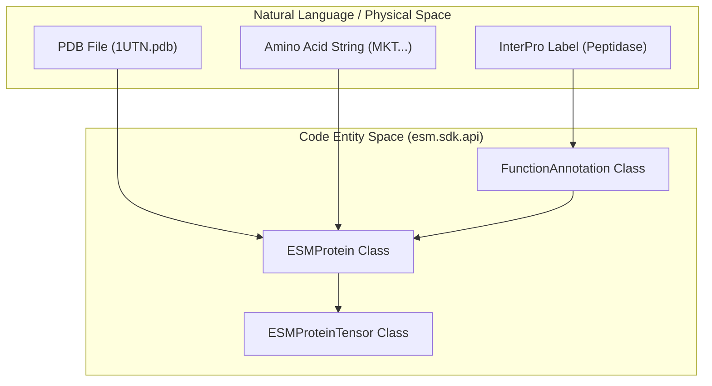
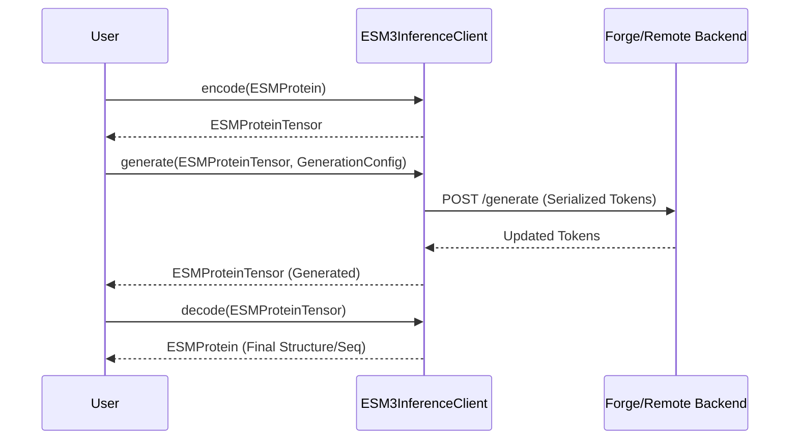

# SDK API Contracts – ESMProtein & Inference Clients

> **Relevant source files**
> * [esm/sdk/api.py](https://github.com/Biohub/esm/blob/82ee3555/esm/sdk/api.py)

This page documents the core data models and abstract client interfaces that form the foundation of the ESM SDK. These contracts ensure consistency across different execution backends, such as local PyTorch models, Biohub Forge (remote API), and AWS SageMaker.

## Core Data Models

The SDK uses two primary representations for protein data: `ESMProtein` (high-level, human-readable) and `ESMProteinTensor` (low-level, tokenized).

### ESMProtein

`ESMProtein` is the primary interface for users to interact with protein data. it stores raw sequences, structure coordinates, and metadata such as function annotations [esm/sdk/api.py L26-L54](https://github.com/Biohub/esm/blob/82ee3555/esm/sdk/api.py#L26-L54)

| Field | Type | Description |
| --- | --- | --- |
| `sequence` | `str \| None` | Amino acid sequence (1-letter codes). |
| `secondary_structure` | `str \| None` | SS8 or SS3 labels. |
| `sasa` | `list[float] \| None` | Solvent Accessible Surface Area values. |
| `function_annotations` | `list[FunctionAnnotation]` | InterPro labels with start/end positions. |
| `coordinates` | `torch.Tensor \| None` | Atom37 format coordinates [L, 37, 3]. |
| `plddt` | `torch.Tensor \| None` | Per-residue confidence scores. |
| `ptm` | `torch.Tensor \| None` | Predicted TM-score. |
| `pae` | `torch.Tensor \| None` | Predicted Alignment Error. |
| `crmsd` | `torch.Tensor \| None` | C-alpha RMSD. |
| `globularity` | `torch.Tensor \| None` | Globularity score. |
| `interface_annotations` | `list[str] \| None` | Annotations related to protein interfaces. |
| `interface_ptm` | `torch.Tensor \| None` | Interface PTM score. |
| `pair_chains_iptm` | `torch.Tensor \| None` | Pairwise chain iPTM scores. |
| `output_embedding_sequence` | `torch.Tensor \| None` | Sequence-level output embedding. |
| `output_embedding_pair_pooled` | `torch.Tensor \| None` | Pair-pooled output embedding. |
| `residue_index` | `torch.Tensor \| None` | Original residue indices. |
| `entity_id` | `torch.Tensor \| None` | Entity IDs for multi-chain complexes. |
| `potential_sequence_of_concern` | `bool` | Flag for sequences that may have concerns. |

**Key Methods:**

* `from_pdb()`: Loads protein data from a PDB file [esm/sdk/api.py L69-L94](https://github.com/Biohub/esm/blob/82ee3555/esm/sdk/api.py#L69-L94)
* `to_pdb()`: Exports the current state (sequence + coordinates) to a PDB file [esm/sdk/api.py L138-L142](https://github.com/Biohub/esm/blob/82ee3555/esm/sdk/api.py#L138-L142)
* `from_protein_chain()`: Converts a `ProteinChain` object to `ESMProtein` [esm/sdk/api.py L97-L117](https://github.com/Biohub/esm/blob/82ee3555/esm/sdk/api.py#L97-L117)
* `from_protein_complex()`: Converts a `ProteinComplex` object to `ESMProtein` [esm/sdk/api.py L119-L137](https://github.com/Biohub/esm/blob/82ee3555/esm/sdk/api.py#L119-L137)
* `to_protein_chain()`: Converts `ESMProtein` to a `ProteinChain` object [esm/sdk/api.py L148-L163](https://github.com/Biohub/esm/blob/82ee3555/esm/sdk/api.py#L148-L163)
* `to_protein_complex()`: Converts `ESMProtein` to a `ProteinComplex` object [esm/sdk/api.py L165-L201](https://github.com/Biohub/esm/blob/82ee3555/esm/sdk/api.py#L165-L201)

### ESMProteinTensor

`ESMProteinTensor` represents a protein after it has been processed by a tokenizer. It holds discrete integer tokens for each track, making it ready for model consumption [esm/sdk/api.py L204-L230](https://github.com/Biohub/esm/blob/82ee3555/esm/sdk/api.py#L204-L230)

| Field | Type | Description |
| --- | --- | --- |
| `sequence_tokens` | `torch.Tensor \| None` | Tokenized amino acid sequence. |
| `secondary_structure_tokens` | `torch.Tensor \| None` | Tokenized secondary structure. |
| `sasa_tokens` | `torch.Tensor \| None` | Tokenized SASA values. |
| `function_annotation_tokens` | `torch.Tensor \| None` | Tokenized function annotations. |
| `coordinates` | `torch.Tensor \| None` | Atom37 format coordinates [L, 37, 3]. |
| `plddt` | `torch.Tensor \| None` | Per-residue confidence scores. |
| `ptm` | `torch.Tensor \| None` | Predicted TM-score. |
| `pae` | `torch.Tensor \| None` | Predicted Alignment Error. |
| `crmsd` | `torch.Tensor \| None` | C-alpha RMSD. |
| `globularity` | `torch.Tensor \| None` | Globularity score. |
| `interface_annotations` | `list[str] \| None` | Annotations related to protein interfaces. |
| `interface_ptm` | `torch.Tensor \| None` | Interface PTM score. |
| `pair_chains_iptm` | `torch.Tensor \| None` | Pairwise chain iPTM scores. |
| `output_embedding_sequence` | `torch.Tensor \| None` | Sequence-level output embedding. |
| `output_embedding_pair_pooled` | `torch.Tensor \| None` | Pair-pooled output embedding. |
| `residue_index` | `torch.Tensor \| None` | Original residue indices. |
| `entity_id` | `torch.Tensor \| None` | Entity IDs for multi-chain complexes. |
| `potential_sequence_of_concern` | `bool` | Flag for sequences that may have concerns. |

### Data Flow: Natural Language to Code Entity Space

The following diagram illustrates how raw protein data (Natural Language/Physical Space) is mapped to the SDK's internal code entities.

**Protein Representation Mapping**



Sources: [esm/sdk/api.py L26-L54](https://github.com/Biohub/esm/blob/82ee3555/esm/sdk/api.py#L26-L54)

 [esm/sdk/api.py L69-L94](https://github.com/Biohub/esm/blob/82ee3555/esm/sdk/api.py#L69-L94)

 [esm/sdk/api.py L204-L230](https://github.com/Biohub/esm/blob/82ee3555/esm/sdk/api.py#L204-L230)

 [esm/sdk/api.py L97-L117](https://github.com/Biohub/esm/blob/82ee3555/esm/sdk/api.py#L97-L117)

 [esm/sdk/api.py L119-L137](https://github.com/Biohub/esm/blob/82ee3555/esm/sdk/api.py#L119-L137)

 [esm/sdk/api.py L148-L163](https://github.com/Biohub/esm/blob/82ee3555/esm/sdk/api.py#L148-L163)

 [esm/sdk/api.py L165-L201](https://github.com/Biohub/esm/blob/82ee3555/esm/sdk/api.py#L165-L201)

---

## Inference Client Interfaces

The SDK defines abstract base classes (ABCs) that specify the methods any ESM inference backend must implement.

### ESM3InferenceClient

The ESM3 client supports multimodal generation, encoding, and decoding across multiple tracks (sequence, structure, function, etc.) [esm/sdk/api.py L461-L558](https://github.com/Biohub/esm/blob/82ee3555/esm/sdk/api.py#L461-L558)

| Method | Description |
| --- | --- |
| `encode(protein)` | Converts `ESMProtein` to `ESMProteinTensor` using internal tokenizers [esm/sdk/api.py L476](https://github.com/Biohub/esm/blob/82ee3555/esm/sdk/api.py#L476-L476) |
| `decode(tensor)` | Converts `ESMProteinTensor` back to `ESMProtein` (reconstructs coordinates/sequences) [esm/sdk/api.py L483](https://github.com/Biohub/esm/blob/82ee3555/esm/sdk/api.py#L483-L483) |
| `generate(input, config)` | Performs iterative masked generation for a specific track [esm/sdk/api.py L490](https://github.com/Biohub/esm/blob/82ee3555/esm/sdk/api.py#L490-L490) |
| `logits(input, config)` | Returns raw log-probabilities and optionally hidden embeddings [esm/sdk/api.py L516](https://github.com/Biohub/esm/blob/82ee3555/esm/sdk/api.py#L516-L516) |
| `forward_and_sample(input, config)` | Single-step forward pass followed by sampling [esm/sdk/api.py L530](https://github.com/Biohub/esm/blob/82ee3555/esm/sdk/api.py#L530-L530) |

### ESMCInferenceClient

The ESMC client is specialized for sequence-only embeddings and masked language modeling tasks [esm/sdk/api.py L612-L638](https://github.com/Biohub/esm/blob/82ee3555/esm/sdk/api.py#L612-L638)

| Method | Description |
| --- | --- |
| `encode(sequence)` | Tokenizes a raw string sequence [esm/sdk/api.py L617](https://github.com/Biohub/esm/blob/82ee3555/esm/sdk/api.py#L617-L617) |
| `logits(input, config)` | Returns sequence logits and embeddings [esm/sdk/api.py L623](https://github.com/Biohub/esm/blob/82ee3555/esm/sdk/api.py#L623-L623) |

### Client Interaction Lifecycle

This diagram bridges the functional requirements of protein generation to the specific methods in the `ESM3InferenceClient`.

**ESM3 Generation Lifecycle**



Sources: [esm/sdk/api.py L461-L558](https://github.com/Biohub/esm/blob/82ee3555/esm/sdk/api.py#L461-L558)

---

## Configuration Objects

The behavior of the inference clients is controlled via standardized configuration dataclasses.

### GenerationConfig

Controls the iterative sampling process [esm/sdk/api.py L335-L349](https://github.com/Biohub/esm/blob/82ee3555/esm/sdk/api.py#L335-L349)

* `track`: Which track to generate (`"sequence"`, `"structure"`, `"function"`, etc.) [esm/sdk/api.py L336](https://github.com/Biohub/esm/blob/82ee3555/esm/sdk/api.py#L336-L336)
* `num_steps`: Number of iterative refinement steps [esm/sdk/api.py L337](https://github.com/Biohub/esm/blob/82ee3555/esm/sdk/api.py#L337-L337)
* `temperature`: Sampling temperature (0.0 for greedy) [esm/sdk/api.py L338](https://github.com/Biohub/esm/blob/82ee3555/esm/sdk/api.py#L338-L338)
* `schedule`: Noise schedule (e.g., `"cosine"`, `"linear"`) [esm/sdk/api.py L339](https://github.com/Biohub/esm/blob/82ee3555/esm/sdk/api.py#L339-L339)
* `unmask_strategy`: Strategy for unmasking tokens (e.g., `"random"`, `"entropy"`) [esm/sdk/api.py L340](https://github.com/Biohub/esm/blob/82ee3555/esm/sdk/api.py#L340-L340)
* `top_k`: Top-k sampling [esm/sdk/api.py L341](https://github.com/Biohub/esm/blob/82ee3555/esm/sdk/api.py#L341-L341)
* `top_p`: Top-p (nucleus) sampling [esm/sdk/api.py L342](https://github.com/Biohub/esm/blob/82ee3555/esm/sdk/api.py#L342-L342)
* `guided_decoding_config`: Configuration for guided decoding [esm/sdk/api.py L343](https://github.com/Biohub/esm/blob/82ee3555/esm/sdk/api.py#L343-L343)
* `constraint_config`: Configuration for constrained generation [esm/sdk/api.py L344](https://github.com/Biohub/esm/blob/82ee3555/esm/sdk/api.py#L344-L344)
* `return_intermediate_steps`: Whether to return intermediate steps of generation [esm/sdk/api.py L345](https://github.com/Biohub/esm/blob/82ee3555/esm/sdk/api.py#L345-L345)
* `return_logits`: Whether to return logits for generated tokens [esm/sdk/api.py L346](https://github.com/Biohub/esm/blob/82ee3555/esm/sdk/api.py#L346-L346)
* `return_embeddings`: Whether to return embeddings for generated tokens [esm/sdk/api.py L347](https://github.com/Biohub/esm/blob/82ee3555/esm/sdk/api.py#L347-L347)
* `return_attention`: Whether to return attention weights [esm/sdk/api.py L348](https://github.com/Biohub/esm/blob/82ee3555/esm/sdk/api.py#L348-L348)
* `return_sae_features`: Whether to return SAE features [esm/sdk/api.py L349](https://github.com/Biohub/esm/blob/82ee3555/esm/sdk/api.py#L349-L349)

### SamplingConfig & LogitsConfig

* `SamplingConfig`: Nested configuration per track (sequence, structure, etc.) for `forward_and_sample` [esm/sdk/api.py L312-L326](https://github.com/Biohub/esm/blob/82ee3555/esm/sdk/api.py#L312-L326) * `sequence_sampling_config`: Configuration for sequence sampling [esm/sdk/api.py L313](https://github.com/Biohub/esm/blob/82ee3555/esm/sdk/api.py#L313-L313) * `structure_sampling_config`: Configuration for structure sampling [esm/sdk/api.py L314](https://github.com/Biohub/esm/blob/82ee3555/esm/sdk/api.py#L314-L314) * `sasa_sampling_config`: Configuration for SASA sampling [esm/sdk/api.py L315](https://github.com/Biohub/esm/blob/82ee3555/esm/sdk/api.py#L315-L315) * `secondary_structure_sampling_config`: Configuration for secondary structure sampling [esm/sdk/api.py L316](https://github.com/Biohub/esm/blob/82ee3555/esm/sdk/api.py#L316-L316) * `function_annotation_sampling_config`: Configuration for function annotation sampling [esm/sdk/api.py L317](https://github.com/Biohub/esm/blob/82ee3555/esm/sdk/api.py#L317-L317) * `temperature`: Sampling temperature [esm/sdk/api.py L318](https://github.com/Biohub/esm/blob/82ee3555/esm/sdk/api.py#L318-L318) * `top_k`: Top-k sampling [esm/sdk/api.py L319](https://github.com/Biohub/esm/blob/82ee3555/esm/sdk/api.py#L319-L319) * `top_p`: Top-p (nucleus) sampling [esm/sdk/api.py L320](https://github.com/Biohub/esm/blob/82ee3555/esm/sdk/api.py#L320-L320) * `return_logits`: Whether to return logits [esm/sdk/api.py L321](https://github.com/Biohub/esm/blob/82ee3555/esm/sdk/api.py#L321-L321) * `return_embeddings`: Whether to return embeddings [esm/sdk/api.py L322](https://github.com/Biohub/esm/blob/82ee3555/esm/sdk/api.py#L322-L322) * `return_attention`: Whether to return attention weights [esm/sdk/api.py L323](https://github.com/Biohub/esm/blob/82ee3555/esm/sdk/api.py#L323-L323) * `return_sae_features`: Whether to return SAE features [esm/sdk/api.py L324](https://github.com/Biohub/esm/blob/82ee3555/esm/sdk/api.py#L324-L324) * `sae_config`: SAE configuration [esm/sdk/api.py L325](https://github.com/Biohub/esm/blob/82ee3555/esm/sdk/api.py#L325-L325)
* `LogitsConfig`: Boolean flags to toggle logit/embedding returns for specific tracks [esm/sdk/api.py L361-L375](https://github.com/Biohub/esm/blob/82ee3555/esm/sdk/api.py#L361-L375) * `return_sequence_logits`: Whether to return sequence logits [esm/sdk/api.py L362](https://github.com/Biohub/esm/blob/82ee3555/esm/sdk/api.py#L362-L362) * `return_structure_logits`: Whether to return structure logits [esm/sdk/api.py L363](https://github.com/Biohub/esm/blob/82ee3555/esm/sdk/api.py#L363-L363) * `return_sasa_logits`: Whether to return SASA logits [esm/sdk/api.py L364](https://github.com/Biohub/esm/blob/82ee3555/esm/sdk/api.py#L364-L364) * `return_secondary_structure_logits`: Whether to return secondary structure logits [esm/sdk/api.py L365](https://github.com/Biohub/esm/blob/82ee3555/esm/sdk/api.py#L365-L365) * `return_function_annotation_logits`: Whether to return function annotation logits [esm/sdk/api.py L366](https://github.com/Biohub/esm/blob/82ee3555/esm/sdk/api.py#L366-L366) * `return_sequence_embeddings`: Whether to return sequence embeddings [esm/sdk/api.py L367](https://github.com/Biohub/esm/blob/82ee3555/esm/sdk/api.py#L367-L367) * `return_pair_pooled_embeddings`: Whether to return pair-pooled embeddings [esm/sdk/api.py L368](https://github.com/Biohub/esm/blob/82ee3555/esm/sdk/api.py#L368-L368) * `return_attention`: Whether to return attention weights [esm/sdk/api.py L369](https://github.com/Biohub/esm/blob/82ee3555/esm/sdk/api.py#L369-L369) * `return_sae_features`: Whether to return SAE features [esm/sdk/api.py L370](https://github.com/Biohub/esm/blob/82ee3555/esm/sdk/api.py#L370-L370) * `sae_config`: SAE configuration [esm/sdk/api.py L371](https://github.com/Biohub/esm/blob/82ee3555/esm/sdk/api.py#L371-L371) * `return_plddt`: Whether to return pLDDT scores [esm/sdk/api.py L372](https://github.com/Biohub/esm/blob/82ee3555/esm/sdk/api.py#L372-L372) * `return_ptm`: Whether to return PTM scores [esm/sdk/api.py L373](https://github.com/Biohub/esm/blob/82ee3555/esm/sdk/api.py#L373-L373) * `return_pae`: Whether to return PAE scores [esm/sdk/api.py L374](https://github.com/Biohub/esm/blob/82ee3555/esm/sdk/api.py#L374-L374) * `return_crmsd`: Whether to return cRMSD scores [esm/sdk/api.py L375](https://github.com/Biohub/esm/blob/82ee3555/esm/sdk/api.py#L375-L375)

### SAEConfig

Used for Sparse Autoencoder (SAE) feature extraction in ESMC models [esm/sdk/api.py L440-L447](https://github.com/Biohub/esm/blob/82ee3555/esm/sdk/api.py#L440-L447)

* `sae_id`: Identifier for the specific SAE version (e.g., `"esmc-600m-v1-residue-sae"`) [esm/sdk/api.py L441](https://github.com/Biohub/esm/blob/82ee3555/esm/sdk/api.py#L441-L441)
* `hook_layer`: The model layer to hook for feature extraction [esm/sdk/api.py L442](https://github.com/Biohub/esm/blob/82ee3555/esm/sdk/api.py#L442-L442)
* `return_activations`: Whether to return raw SAE activations [esm/sdk/api.py L443](https://github.com/Biohub/esm/blob/82ee3555/esm/sdk/api.py#L443-L443)
* `return_decoded_activations`: Whether to return decoded SAE activations [esm/sdk/api.py L444](https://github.com/Biohub/esm/blob/82ee3555/esm/sdk/api.py#L444-L444)
* `return_feature_densities`: Whether to return feature densities [esm/sdk/api.py L445](https://github.com/Biohub/esm/blob/82ee3555/esm/sdk/api.py#L445-L445)
* `return_feature_sparsity`: Whether to return feature sparsity [esm/sdk/api.py L446](https://github.com/Biohub/esm/blob/82ee3555/esm/sdk/api.py#L446-L446)
* `return_feature_indices`: Whether to return indices of active features [esm/sdk/api.py L447](https://github.com/Biohub/esm/blob/82ee3555/esm/sdk/api.py#L447-L447)

Sources: [esm/sdk/api.py L312-L349](https://github.com/Biohub/esm/blob/82ee3555/esm/sdk/api.py#L312-L349)

 [esm/sdk/api.py L361-L375](https://github.com/Biohub/esm/blob/82ee3555/esm/sdk/api.py#L361-L375)

 [esm/sdk/api.py L440-L447](https://github.com/Biohub/esm/blob/82ee3555/esm/sdk/api.py#L440-L447)

---

## Batch Execution & Rate Limiting

The SDK provides a `ForgeBatchExecutor` to handle high-throughput requests to the Biohub Platform. It implements an **AIMD (Additive Increase/Multiplicative Decrease)** rate limiter to dynamically adjust concurrency based on server response codes (e.g., HTTP 429) [esm/utils/forge_context_manager.py L18-L45](https://github.com/Biohub/esm/blob/82ee3555/esm/utils/forge_context_manager.py#L18-L45)

**Usage Example:**

```
with batch_executor(max_workers=32) as executor:    results = executor.execute_batch(client.generate, prompts, configs)
```

Sources: [esm/sdk/__init__.py L73-L83](https://github.com/Biohub/esm/blob/82ee3555/esm/sdk/__init__.py#L73-L83)

 [esm/utils/forge_context_manager.py L46-L86](https://github.com/Biohub/esm/blob/82ee3555/esm/utils/forge_context_manager.py#L46-L86)