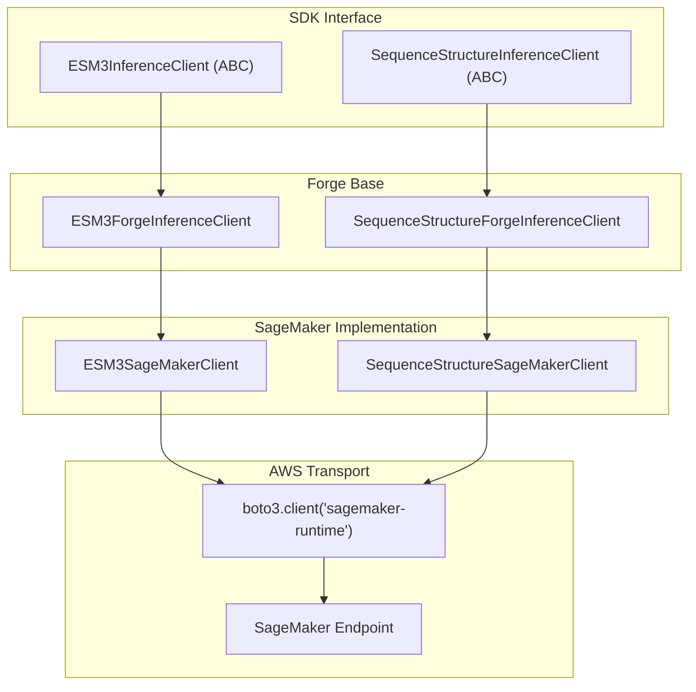
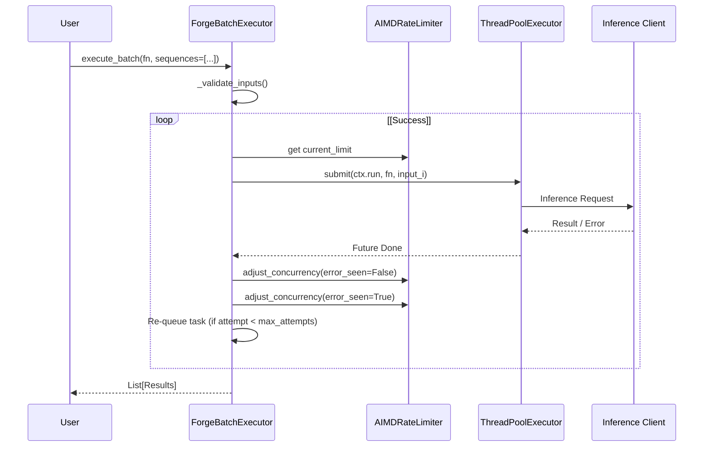

# SageMaker & Alternative Backends

> **Relevant source files**
> * [esm/sdk/forge.py](https://github.com/Biohub/esm/blob/82ee3555/esm/sdk/forge.py)
> * [esm/sdk/sagemaker.py](https://github.com/Biohub/esm/blob/82ee3555/esm/sdk/sagemaker.py)

This page documents the SageMaker-specific client implementations and the batch execution utilities designed to handle remote inference outside of the standard Biohub Forge platform. It covers the `ESM3SageMakerClient` and `SequenceStructureSageMakerClient`, their integration with AWS `boto3`, and the `ForgeBatchExecutor` for managed concurrency and rate limiting.

## Overview of SageMaker Clients

The SageMaker clients are specialized subclasses of the Forge clients that redirect inference requests to AWS SageMaker endpoints. Instead of using HTTP requests via `httpx`, these clients use the `boto3` SDK to invoke model endpoints hosted on AWS infrastructure [esm/sdk/sagemaker.py L11-L23](https://github.com/Biohub/esm/blob/82ee3555/esm/sdk/sagemaker.py#L11-L23)

### Client Inheritance and Data Flow

The following diagram illustrates how the SageMaker clients wrap the existing Forge client logic while overriding the transport layer (`_post` method).

**SageMaker Client Architecture**



Sources: [esm/sdk/sagemaker.py L11-L120](https://github.com/Biohub/esm/blob/82ee3555/esm/sdk/sagemaker.py#L11-L120)

 [esm/sdk/forge.py L1-L15](https://github.com/Biohub/esm/blob/82ee3555/esm/sdk/forge.py#L1-L15)

## SageMaker Implementation Details

### Request Wrapping and Compatibility

To ensure compatibility with model servers designed for the Biohub Platform, the SageMaker clients wrap the standard request payload into an `invocations_request` dictionary [esm/sdk/sagemaker.py L28-L38](https://github.com/Biohub/esm/blob/82ee3555/esm/sdk/sagemaker.py#L28-L38)

 This wrapper includes metadata fields that the Forge platform usually provides:

| Field | Description | Source |
| --- | --- | --- |
| `model` | The name of the model being targeted. | [esm/sdk/sagemaker.py L30](https://github.com/Biohub/esm/blob/82ee3555/esm/sdk/sagemaker.py#L30-L30) |
| `api_ver` | Hardcoded to "v1". | [esm/sdk/sagemaker.py L34](https://github.com/Biohub/esm/blob/82ee3555/esm/sdk/sagemaker.py#L34-L34) |
| `endpoint` | The specific API function (e.g., `generate`, `fold`). | [esm/sdk/sagemaker.py L35](https://github.com/Biohub/esm/blob/82ee3555/esm/sdk/sagemaker.py#L35-L35) |
| `request_id` | Empty string (Forge-specific field). | [esm/sdk/sagemaker.py L31](https://github.com/Biohub/esm/blob/82ee3555/esm/sdk/sagemaker.py#L31-L31) |
| `user_id` | Empty string (Forge-specific field). | [esm/sdk/sagemaker.py L32](https://github.com/Biohub/esm/blob/82ee3555/esm/sdk/sagemaker.py#L32-L32) |

### The _post Method

The `_post` method in `ESM3SageMakerClient` and `SequenceStructureSageMakerClient` performs the following sequence:

1. Sets the `potential_sequence_of_concern` flag [esm/sdk/sagemaker.py L26](https://github.com/Biohub/esm/blob/82ee3555/esm/sdk/sagemaker.py#L26-L26)
2. Wraps the request into the `invocations_request` format [esm/sdk/sagemaker.py L28-L38](https://github.com/Biohub/esm/blob/82ee3555/esm/sdk/sagemaker.py#L28-L38)
3. Calls `self._boto3_client.invoke_endpoint` with `ContentType="application/json"` [esm/sdk/sagemaker.py L41-L45](https://github.com/Biohub/esm/blob/82ee3555/esm/sdk/sagemaker.py#L41-L45)
4. Parses the JSON response and extracts the data nested under the endpoint key [esm/sdk/sagemaker.py L49-L57](https://github.com/Biohub/esm/blob/82ee3555/esm/sdk/sagemaker.py#L49-L57)

In `ESM3SageMakerClient`, an additional `CustomAttributes` string is passed to handle `return_bytes` flags for optimized data transfer [esm/sdk/sagemaker.py L86-L107](https://github.com/Biohub/esm/blob/82ee3555/esm/sdk/sagemaker.py#L86-L107)

Sources: [esm/sdk/sagemaker.py L25-L60](https://github.com/Biohub/esm/blob/82ee3555/esm/sdk/sagemaker.py#L25-L60)

 [esm/sdk/sagemaker.py L78-L119](https://github.com/Biohub/esm/blob/82ee3555/esm/sdk/sagemaker.py#L78-L119)

## Batch Execution & Rate Limiting

The `ForgeBatchExecutor` is a utility designed to handle large-scale inference tasks across any client implementing the inference interface. It manages a `ThreadPoolExecutor` and implements an Additive Increase/Multiplicative Decrease (AIMD) rate limiting strategy to handle remote endpoint pressure.

### AIMD Rate Limiter

The `AIMDRateLimiter` adjusts the number of concurrent requests based on the success or failure of previous calls [esm/sdk/base_forge_client.py L100-L127](https://github.com/Biohub/esm/blob/82ee3555/esm/sdk/base_forge_client.py#L100-L127)

* **Success**: Concurrency increases by `step_up` (default 1) until `max_concurrency` is reached [esm/sdk/base_forge_client.py L123-L125](https://github.com/Biohub/esm/blob/82ee3555/esm/sdk/base_forge_client.py#L123-L125)
* **Failure (Rate Limit)**: If a 429 error (Too Many Requests) is detected, concurrency is halved [esm/sdk/base_forge_client.py L121](https://github.com/Biohub/esm/blob/82ee3555/esm/sdk/base_forge_client.py#L121-L121)

### Batch Execution Workflow

The `execute_batch` method allows users to pass lists of inputs to a function. The executor automatically handles task queuing and retries [esm/sdk/base_forge_client.py L130-L200](https://github.com/Biohub/esm/blob/82ee3555/esm/sdk/base_forge_client.py#L130-L200)

**Batch Execution Data Flow**



Sources: [esm/sdk/base_forge_client.py L130-L200](https://github.com/Biohub/esm/blob/82ee3555/esm/sdk/base_forge_client.py#L130-L200)

 [esm/sdk/base_forge_client.py L100-L127](https://github.com/Biohub/esm/blob/82ee3555/esm/sdk/base_forge_client.py#L100-L127)

## Usage Example

The `batch_executor` is typically used in conjunction with a client to perform tasks like computing pseudoperplexity for a library of sequences.

```javascript
from esm.sdk import esmc_client, batch_executorfrom esm.sdk.api import ESMProtein client = esmc_client(token="your_key") def get_logits(client, sequence):    protein = ESMProtein(sequence=sequence)    tensor = client.encode(protein)    return client.logits(tensor) sequences = ["MKTLL...", "ASDFG...", ...] with batch_executor(max_attempts=5) as executor:    results = executor.execute_batch(get_logits, client=client, sequence=sequences)
```

Sources: [cookbook/snippets/esmc.py L78-L127](https://github.com/Biohub/esm/blob/82ee3555/cookbook/snippets/esmc.py#L78-L127)

## Key Classes and Functions

| Entity | Role | File |
| --- | --- | --- |
| `ESM3SageMakerClient` | ESM3 client using boto3 transport. | [esm/sdk/sagemaker.py L62](https://github.com/Biohub/esm/blob/82ee3555/esm/sdk/sagemaker.py#L62-L62) |
| `SequenceStructureSageMakerClient` | Folding/Inverse Folding client using boto3 transport. | [esm/sdk/sagemaker.py L11](https://github.com/Biohub/esm/blob/82ee3555/esm/sdk/sagemaker.py#L11-L11) |
| `ForgeBatchExecutor` | Context manager for concurrent, rate-limited batch calls. | [esm/sdk/base_forge_client.py L130](https://github.com/Biohub/esm/blob/82ee3555/esm/sdk/base_forge_client.py#L130-L130) |
| `AIMDRateLimiter` | Logic for dynamic concurrency adjustment. | [esm/sdk/base_forge_client.py L100](https://github.com/Biohub/esm/blob/82ee3555/esm/sdk/base_forge_client.py#L100-L100) |
| `batch_executor` | Factory function for `ForgeBatchExecutor`. | [esm/sdk/base_forge_client.py L203](https://github.com/Biohub/esm/blob/82ee3555/esm/sdk/base_forge_client.py#L203-L203) |

Sources: [esm/sdk/sagemaker.py L1-L120](https://github.com/Biohub/esm/blob/82ee3555/esm/sdk/sagemaker.py#L1-L120)

 [esm/sdk/base_forge_client.py L1-L205](https://github.com/Biohub/esm/blob/82ee3555/esm/sdk/base_forge_client.py#L1-L205)