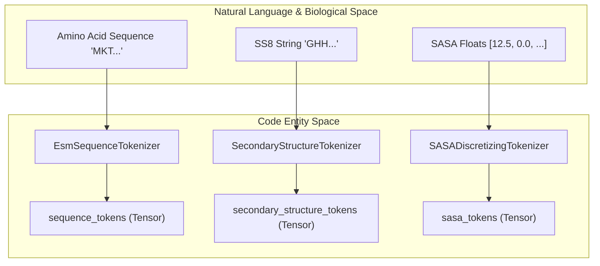
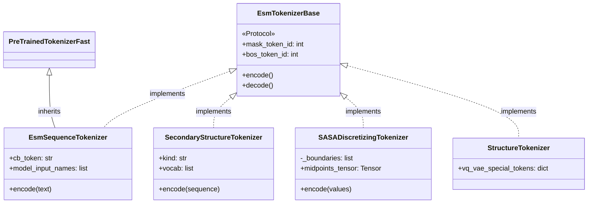

# Sequence & Secondary Structure Tokenizers

> **Relevant source files**
> * [esm/tokenization/residue_tokenizer.py](https://github.com/Biohub/esm/blob/82ee3555/esm/tokenization/residue_tokenizer.py)
> * [esm/tokenization/sasa_tokenizer.py](https://github.com/Biohub/esm/blob/82ee3555/esm/tokenization/sasa_tokenizer.py)
> * [esm/tokenization/sequence_tokenizer.py](https://github.com/Biohub/esm/blob/82ee3555/esm/tokenization/sequence_tokenizer.py)
> * [esm/tokenization/ss_tokenizer.py](https://github.com/Biohub/esm/blob/82ee3555/esm/tokenization/ss_tokenizer.py)
> * [esm/tokenization/structure_tokenizer.py](https://github.com/Biohub/esm/blob/82ee3555/esm/tokenization/structure_tokenizer.py)

This page documents the tokenization system for sequence and structural tracks in ESM. The system is built around a common protocol, `EsmTokenizerBase`, which ensures consistency across different data modalities including amino acid sequences, secondary structure classifications, and discretized surface accessibility values.

## Tokenization Architecture

The ESM tokenization system uses a multimodal approach where different tracks (sequence, structure, SASA, etc.) are tokenized independently before being processed by the transformer.

### EsmTokenizerBase Protocol

All tokenizers in the ESM ecosystem implement the `EsmTokenizerBase` protocol. This ensures that every tokenizer provides a consistent interface for special tokens and basic operations like encoding and decoding.

**Interface Overview:**

* **Special Tokens**: Every tokenizer must provide `mask`, `bos`, `eos`, `pad`, and `chain_break` tokens and their corresponding integer IDs [esm/tokenization/tokenizer_base.py L5-L15](https://github.com/Biohub/esm/blob/82ee3555/esm/tokenization/tokenizer_base.py#L5-L15)
* **Methods**: Implementations must provide `encode()` and `decode()` methods [esm/tokenization/tokenizer_base.py L17-L19](https://github.com/Biohub/esm/blob/82ee3555/esm/tokenization/tokenizer_base.py#L17-L19)
* **Properties**: `all_token_ids` and `special_token_ids` are required for sampling and masking logic [esm/tokenization/tokenizer_base.py L21-L25](https://github.com/Biohub/esm/blob/82ee3555/esm/tokenization/tokenizer_base.py#L21-L25)

### Sequence & Structure Tokenization Flow

The following diagram illustrates how raw protein data is transformed into tokens by the various tokenizer classes.

**Data to Token Entity Mapping**

Sources: [esm/tokenization/sequence_tokenizer.py L10-L15](https://github.com/Biohub/esm/blob/82ee3555/esm/tokenization/sequence_tokenizer.py#L10-L15)

 [esm/tokenization/ss_tokenizer.py L10-L13](https://github.com/Biohub/esm/blob/82ee3555/esm/tokenization/ss_tokenizer.py#L10-L13)

 [esm/tokenization/sasa_tokenizer.py L9-L12](https://github.com/Biohub/esm/blob/82ee3555/esm/tokenization/sasa_tokenizer.py#L9-L12)

---

## EsmSequenceTokenizer

The `EsmSequenceTokenizer` is the primary tokenizer for amino acid sequences. It inherits from `PreTrainedTokenizerFast` (HuggingFace) and uses a character-level Byte Pair Encoding (BPE) model with no merges [esm/tokenization/sequence_tokenizer.py L10-L31](https://github.com/Biohub/esm/blob/82ee3555/esm/tokenization/sequence_tokenizer.py#L10-L31)

### Configuration and Vocab

* **Vocabulary**: Based on `C.SEQUENCE_VOCAB` [esm/tokenization/sequence_tokenizer.py L27-L28](https://github.com/Biohub/esm/blob/82ee3555/esm/tokenization/sequence_tokenizer.py#L27-L28)
* **Special Tokens**: Includes `<unk>`, `<cls>`, `<pad>`, `<mask>`, `<eos>`, and the chain break token `|` [esm/tokenization/sequence_tokenizer.py L18-L24](https://github.com/Biohub/esm/blob/82ee3555/esm/tokenization/sequence_tokenizer.py#L18-L24)
* **Post-Processing**: Automatically wraps single sequences in `<cls>` and `<eos>` tokens using `TemplateProcessing` [esm/tokenization/sequence_tokenizer.py L48-L54](https://github.com/Biohub/esm/blob/82ee3555/esm/tokenization/sequence_tokenizer.py#L48-L54)

### Chain Breaks

The tokenizer handles multi-chain proteins using the `|` character. This is mapped to a specific `chain_break_token_id` to inform the model of discontinuities in the polypeptide backbone [esm/tokenization/sequence_tokenizer.py L24-L41](https://github.com/Biohub/esm/blob/82ee3555/esm/tokenization/sequence_tokenizer.py#L24-L41)

Sources: [esm/tokenization/sequence_tokenizer.py L10-L64](https://github.com/Biohub/esm/blob/82ee3555/esm/tokenization/sequence_tokenizer.py#L10-L64)

---

## SecondaryStructureTokenizer

The `SecondaryStructureTokenizer` handles the discretization of protein secondary structure into either 8-class (SS8) or 3-class (SS3) representations [esm/tokenization/ss_tokenizer.py L13-L15](https://github.com/Biohub/esm/blob/82ee3555/esm/tokenization/ss_tokenizer.py#L13-L15)

### Supported Vocabularies

| Kind | Vocabulary Source | Tokens |
| --- | --- | --- |
| **SS8** | `C.SSE_8CLASS_VOCAB` | G, H, I, T, E, B, S, C [esm/tokenization/ss_tokenizer.py L26](https://github.com/Biohub/esm/blob/82ee3555/esm/tokenization/ss_tokenizer.py#L26-L26) |
| **SS3** | `C.SSE_3CLASS_VOCAB` | H, E, C [esm/tokenization/ss_tokenizer.py L28](https://github.com/Biohub/esm/blob/82ee3555/esm/tokenization/ss_tokenizer.py#L28-L28) |

### Implementation Details

* **Special Tokens**: Uses `<pad>`, `<motif>`, and `<unk>`. Notably, for secondary structure, `<pad>` is used for BOS, EOS, and Chainbreak roles [esm/tokenization/ss_tokenizer.py L80-L117](https://github.com/Biohub/esm/blob/82ee3555/esm/tokenization/ss_tokenizer.py#L80-L117)
* **Encoding**: Maps characters directly to indices in the concatenated list of special and non-special tokens [esm/tokenization/ss_tokenizer.py L33-L67](https://github.com/Biohub/esm/blob/82ee3555/esm/tokenization/ss_tokenizer.py#L33-L67)

Sources: [esm/tokenization/ss_tokenizer.py L10-L126](https://github.com/Biohub/esm/blob/82ee3555/esm/tokenization/ss_tokenizer.py#L10-L126)

---

## SASADiscretizingTokenizer

The `SASADiscretizingTokenizer` converts continuous Solvent Accessible Surface Area (SASA) values into discrete bins.

### Discretization Logic

* **Bins**: Uses 15 discretization boundaries defined in `C.SASA_DISCRETIZATION_BOUNDARIES` [esm/tokenization/sasa_tokenizer.py L12](https://github.com/Biohub/esm/blob/82ee3555/esm/tokenization/sasa_tokenizer.py#L12-L12)
* **Bucketing**: Uses `torch.bucketize` to map float values into discrete ranges [esm/tokenization/sasa_tokenizer.py L79-L80](https://github.com/Biohub/esm/blob/82ee3555/esm/tokenization/sasa_tokenizer.py#L79-L80)
* **Midpoints**: For decoding, the tokenizer maintains a `midpoints_tensor` to map discrete tokens back to a representative float value (the center of the bin) [esm/tokenization/sasa_tokenizer.py L34-L42](https://github.com/Biohub/esm/blob/82ee3555/esm/tokenization/sasa_tokenizer.py#L34-L42)

### Vocabulary Structure

The vocabulary consists of special tokens followed by range tokens formatted as `<low-high>` (e.g., `<0-2.5>`) [esm/tokenization/sasa_tokenizer.py L26-L31](https://github.com/Biohub/esm/blob/82ee3555/esm/tokenization/sasa_tokenizer.py#L26-L31)

Sources: [esm/tokenization/sasa_tokenizer.py L9-L106](https://github.com/Biohub/esm/blob/82ee3555/esm/tokenization/sasa_tokenizer.py#L9-L106)

---

## StructureTokenizer (VQ-VAE Wrapper)

The `StructureTokenizer` is a convenience class designed to provide access to special token IDs used by the `StructureTokenEncoder` and `StructureTokenDecoder` (the VQ-VAE system) [esm/tokenization/structure_tokenizer.py L5-L7](https://github.com/Biohub/esm/blob/82ee3555/esm/tokenization/structure_tokenizer.py#L5-L7)

### VQ-VAE Special Tokens

Because structure tokens represent latent codes from a VQ-VAE codebook, they do not have string representations. The tokenizer defines special IDs starting after the codebook size [esm/tokenization/structure_tokenizer.py L9-L16](https://github.com/Biohub/esm/blob/82ee3555/esm/tokenization/structure_tokenizer.py#L9-L16)

| Token Name | ID Calculation |
| --- | --- |
| **MASK** | `codebook_size` |
| **EOS** | `codebook_size + 1` |
| **BOS** | `codebook_size + 2` |
| **PAD** | `codebook_size + 3` |
| **CHAINBREAK** | `codebook_size + 4` |

**Note**: Calling `encode()` or `decode()` on this class will raise a `NotImplementedError`, as structure encoding requires 3D coordinates and the VQ-VAE model [esm/tokenization/structure_tokenizer.py L71-L83](https://github.com/Biohub/esm/blob/82ee3555/esm/tokenization/structure_tokenizer.py#L71-L83)

Sources: [esm/tokenization/structure_tokenizer.py L5-L83](https://github.com/Biohub/esm/blob/82ee3555/esm/tokenization/structure_tokenizer.py#L5-L83)

---

## Class Relationship Diagram

The following diagram shows how the tokenizer classes relate to the base protocol and the underlying utilities.

**Tokenizer Class Hierarchy**

Sources: [esm/tokenization/tokenizer_base.py L4-L26](https://github.com/Biohub/esm/blob/82ee3555/esm/tokenization/tokenizer_base.py#L4-L26)

 [esm/tokenization/sequence_tokenizer.py L10](https://github.com/Biohub/esm/blob/82ee3555/esm/tokenization/sequence_tokenizer.py#L10-L10)

 [esm/tokenization/ss_tokenizer.py L10](https://github.com/Biohub/esm/blob/82ee3555/esm/tokenization/ss_tokenizer.py#L10-L10)

 [esm/tokenization/sasa_tokenizer.py L9](https://github.com/Biohub/esm/blob/82ee3555/esm/tokenization/sasa_tokenizer.py#L9-L9)

 [esm/tokenization/structure_tokenizer.py L5](https://github.com/Biohub/esm/blob/82ee3555/esm/tokenization/structure_tokenizer.py#L5-L5)