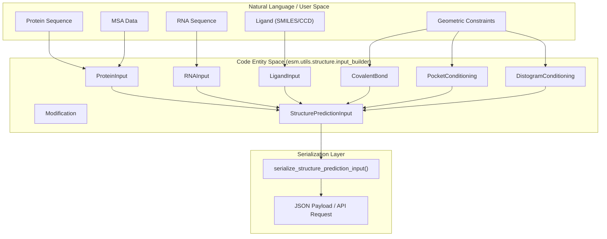
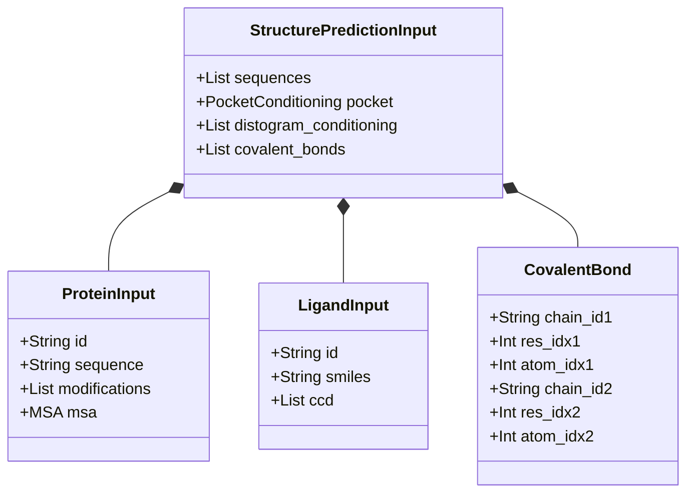

# Structure Prediction Input Builder

> **Relevant source files**
> * [cookbook/tutorials/binder_design.ipynb](https://github.com/Biohub/esm/blob/82ee3555/cookbook/tutorials/binder_design.ipynb)
> * [esm/models/esmc.py](https://github.com/Biohub/esm/blob/82ee3555/esm/models/esmc.py)
> * [esm/models/esmfold2/processor.py](https://github.com/Biohub/esm/blob/82ee3555/esm/models/esmfold2/processor.py)
> * [esm/utils/constants/models.py](https://github.com/Biohub/esm/blob/82ee3555/esm/utils/constants/models.py)
> * [esm/utils/structure/input_builder.py](https://github.com/Biohub/esm/blob/82ee3555/esm/utils/structure/input_builder.py)

The **Structure Prediction Input Builder** provides a unified interface for constructing complex molecular inputs for structure prediction models, specifically ESMFold2. It facilitates the assembly of multi-chain complexes involving proteins, nucleic acids (RNA/DNA), and ligands, along with advanced geometric constraints like covalent bonds and pocket conditioning.

## Overview and Data Flow

The system centers around the `StructurePredictionInput` dataclass [esm/utils/structure/input_builder.py L76-L79](https://github.com/Biohub/esm/blob/82ee3555/esm/utils/structure/input_builder.py#L76-L79)

 which aggregates various molecular entities and their associated constraints. This object is then transformed into a JSON-serializable dictionary for transmission to inference APIs (such as the Biohub Platform/Forge) using serialization utilities.

### Data Flow Diagram: Input Assembly to API Payload

This diagram illustrates how high-level molecular objects are converted into the `StructurePredictionInput` and subsequently serialized for the API.

**Sources:** [esm/utils/structure/input_builder.py L16-L82](https://github.com/Biohub/esm/blob/82ee3555/esm/utils/structure/input_builder.py#L16-L82)

 [esm/utils/structure/input_builder.py L106-L153](https://github.com/Biohub/esm/blob/82ee3555/esm/utils/structure/input_builder.py#L106-L153)

---

## Input Entities

The builder defines specific classes for different molecular types. Each type supports optional modifications and identification.

| Class | Purpose | Key Attributes |
| --- | --- | --- |
| `ProteinInput` | Standard protein chains. | `sequence`, `modifications`, `msa` |
| `RNAInput` | Ribonucleic acid chains. | `sequence`, `modifications` |
| `DNAInput` | Deoxyribonucleic acid chains. | `sequence`, `modifications` |
| `LigandInput` | Small molecules/ligands. | `smiles`, `ccd` (Chemical Component Dictionary) |
| `Modification` | Post-translational/chemical mods. | `position`, `ccd` |

### MSA Integration

`ProteinInput` objects can optionally include an `MSA` (Multiple Sequence Alignment) object [esm/utils/structure/input_builder.py L28](https://github.com/Biohub/esm/blob/82ee3555/esm/utils/structure/input_builder.py#L28-L28)

 During serialization, the MSA is reduced to its component sequences to ensure compatibility with JSON payloads [esm/utils/structure/input_builder.py L99-L100](https://github.com/Biohub/esm/blob/82ee3555/esm/utils/structure/input_builder.py#L99-L100)

**Sources:** [esm/utils/structure/input_builder.py L16-L51](https://github.com/Biohub/esm/blob/82ee3555/esm/utils/structure/input_builder.py#L16-L51)

 [esm/utils/structure/input_builder.py L95-L104](https://github.com/Biohub/esm/blob/82ee3555/esm/utils/structure/input_builder.py#L95-L104)

---

## Conditioning and Constraints

To guide the folding process, `StructurePredictionInput` supports three primary conditioning types:

### 1. Pocket Conditioning

Used to specify binder-target interactions.

* **Class:** `PocketConditioning` [esm/utils/structure/input_builder.py L59](https://github.com/Biohub/esm/blob/82ee3555/esm/utils/structure/input_builder.py#L59-L59)
* **Fields:** `binder_chain_id` (string) and `contacts` (a list of tuples mapping target chain IDs to residue indices) [esm/utils/structure/input_builder.py L60-L61](https://github.com/Biohub/esm/blob/82ee3555/esm/utils/structure/input_builder.py#L60-L61)

### 2. Distogram Conditioning

Allows providing a predicted or experimental distance distribution for a specific chain.

* **Class:** `DistogramConditioning` [esm/utils/structure/input_builder.py L53](https://github.com/Biohub/esm/blob/82ee3555/esm/utils/structure/input_builder.py#L53-L53)
* **Fields:** `chain_id` and a `distogram` (numpy array) [esm/utils/structure/input_builder.py L54-L55](https://github.com/Biohub/esm/blob/82ee3555/esm/utils/structure/input_builder.py#L54-L55)

### 3. Covalent Bonds

Explicitly defines chemical bonds between atoms in the complex.

* **Class:** `CovalentBond` [esm/utils/structure/input_builder.py L65](https://github.com/Biohub/esm/blob/82ee3555/esm/utils/structure/input_builder.py#L65-L65)
* **Fields:** Two sets of `(chain_id, res_idx, atom_idx)` to define the bond endpoints [esm/utils/structure/input_builder.py L66-L71](https://github.com/Biohub/esm/blob/82ee3555/esm/utils/structure/input_builder.py#L66-L71)

**Sources:** [esm/utils/structure/input_builder.py L53-L73](https://github.com/Biohub/esm/blob/82ee3555/esm/utils/structure/input_builder.py#L53-L73)

---

## ESMFold2InputBuilder

The `ESMFold2InputBuilder` class [esm/models/esmfold2/processor.py L184](https://github.com/Biohub/esm/blob/82ee3555/esm/models/esmfold2/processor.py#L184-L184)

 is responsible for preparing the input features required by the ESMFold2 model from a `StructurePredictionInput` object. It handles complex logic such as processing MSAs, modifications, and conditioning information.

### Key Methods and Functionality

* `__init__(self, ccd_cache: Path | None = None)`: Initializes the builder, optionally with a cache for Chemical Component Dictionary (CCD) data [esm/models/esmfold2/processor.py L185](https://github.com/Biohub/esm/blob/82ee3555/esm/models/esmfold2/processor.py#L185-L185)
* `build_features(self, input: StructurePredictionInput, num_recycles: int | None = None, seed: int | None = None, lm_dropout: float | None = None) -> dict[str, Any]`: This is the core method that takes a `StructurePredictionInput` and converts it into a dictionary of features suitable for the ESMFold2 model. * It first calls `clean_esmfold2_input` to preprocess the input, handling chain breaks and grouping identical protein sequences [esm/models/esmfold2/processor.py L200](https://github.com/Biohub/esm/blob/82ee3555/esm/models/esmfold2/processor.py#L200-L200) * It then prepares `ChainInfo` objects for each sequence, loading CCD data for modifications and ligands [esm/models/esmfold2/processor.py L203-L204](https://github.com/Biohub/esm/blob/82ee3555/esm/models/esmfold2/processor.py#L203-L204) * The `prepare_esmfold2_input` function is called to generate the final model features [esm/models/esmfold2/processor.py L206](https://github.com/Biohub/esm/blob/82ee3555/esm/models/esmfold2/processor.py#L206-L206) * It supports optional `seed` for reproducibility and `lm_dropout` for ensembling [esm/models/esmfold2/processor.py L200](https://github.com/Biohub/esm/blob/82ee3555/esm/models/esmfold2/processor.py#L200-L200)
* `clean_esmfold2_input(input: StructurePredictionInput) -> StructurePredictionInput`: A static method that preprocesses `StructurePredictionInput`. It groups identical protein sequences and converts chain break tokens (`|`) to (`:`) in the sequence string. It also adjusts modification positions if chain breaks are present [esm/models/esmfold2/processor.py L86-L181](https://github.com/Biohub/esm/blob/82ee3555/esm/models/esmfold2/processor.py#L86-L181)  This function raises a `ValueError` if covalent bonds are specified alongside chain breaks within a single `ProteinInput` [esm/models/esmfold2/processor.py L108-L112](https://github.com/Biohub/esm/blob/82ee3555/esm/models/esmfold2/processor.py#L108-L112)

### ESMFold2InputBuilder Data Flow

**Sources:**

* `ESMFold2InputBuilder` class: [esm/models/esmfold2/processor.py L184-L210](https://github.com/Biohub/esm/blob/82ee3555/esm/models/esmfold2/processor.py#L184-L210)
* `clean_esmfold2_input` function: [esm/models/esmfold2/processor.py L86-L181](https://github.com/Biohub/esm/blob/82ee3555/esm/models/esmfold2/processor.py#L86-L181)
* `build_features` method: [esm/models/esmfold2/processor.py L199-L210](https://github.com/Biohub/esm/blob/82ee3555/esm/models/esmfold2/processor.py#L199-L210)
* `prepare_esmfold2_input` function: [esm/models/esmfold2/prepare_input.py L11-L12](https://github.com/Biohub/esm/blob/82ee3555/esm/models/esmfold2/prepare_input.py#L11-L12)

---

## Serialization and Deserialization

The transition between rich Python objects and API-ready formats is handled by two primary functions.

### serialize_structure_prediction_input

This function converts the `StructurePredictionInput` hierarchy into a nested dictionary [esm/utils/structure/input_builder.py L82](https://github.com/Biohub/esm/blob/82ee3555/esm/utils/structure/input_builder.py#L82-L82)

 It handles:

* Converting `numpy` distograms into lists for JSON compatibility [esm/utils/structure/input_builder.py L149-L150](https://github.com/Biohub/esm/blob/82ee3555/esm/utils/structure/input_builder.py#L149-L150)
* Extracting sequences from `MSA` objects [esm/utils/structure/input_builder.py L100](https://github.com/Biohub/esm/blob/82ee3555/esm/utils/structure/input_builder.py#L100-L100)
* Mapping internal dataclasses to specific "type" strings (e.g., "protein", "rna", "ligand") [esm/utils/structure/input_builder.py L108-L122](https://github.com/Biohub/esm/blob/82ee3555/esm/utils/structure/input_builder.py#L108-L122)

### deserialize_structure_prediction_input

The inverse operation, reconstructing the original dataclasses from a dictionary [esm/utils/structure/input_builder.py L156](https://github.com/Biohub/esm/blob/82ee3555/esm/utils/structure/input_builder.py#L156-L156)

 It is designed to round-trip data accurately, including restoring `MSA` objects via `MSA.from_sequences` [esm/utils/structure/input_builder.py L180](https://github.com/Biohub/esm/blob/82ee3555/esm/utils/structure/input_builder.py#L180-L180)

### Serialization Schema Diagram

**Sources:** [esm/utils/structure/input_builder.py L82-L153](https://github.com/Biohub/esm/blob/82ee3555/esm/utils/structure/input_builder.py#L82-L153)

 [esm/utils/structure/input_builder.py L156-L231](https://github.com/Biohub/esm/blob/82ee3555/esm/utils/structure/input_builder.py#L156-L231)

---

## Integration with MolecularComplex

While `StructurePredictionInput` is the *input* format, the resulting structures are often returned as `MolecularComplexResult` objects [esm/utils/structure/molecular_complex.py L32](https://github.com/Biohub/esm/blob/82ee3555/esm/utils/structure/molecular_complex.py#L32-L32)

 These results contain a `MolecularComplex` which uses a flat atom representation to support the diverse chemistry (proteins, nucleic acids, and ligands) defined in the input builder [esm/utils/structure/molecular_complex.py L74-L80](https://github.com/Biohub/esm/blob/82ee3555/esm/utils/structure/molecular_complex.py#L74-L80)

**Sources:** [esm/utils/structure/molecular_complex.py L32-L47](https://github.com/Biohub/esm/blob/82ee3555/esm/utils/structure/molecular_complex.py#L32-L47)

 [esm/utils/structure/molecular_complex.py L74-L104](https://github.com/Biohub/esm/blob/82ee3555/esm/utils/structure/molecular_complex.py#L74-L104)