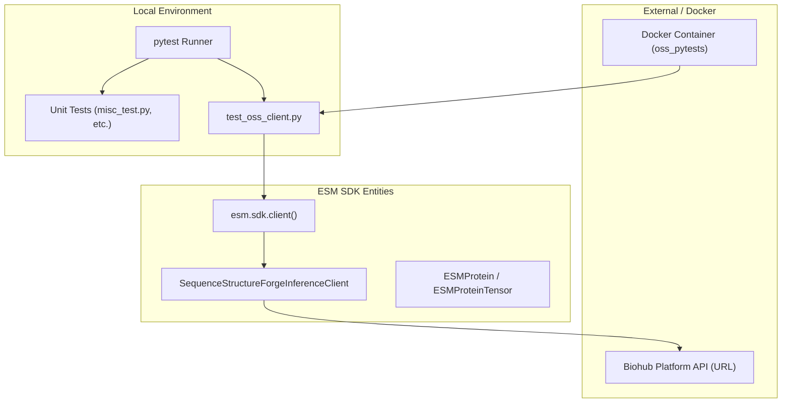
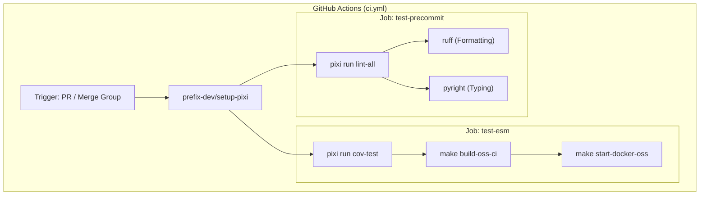

# Testing & CI/CD

> **Relevant source files**
> * [.github/workflows/ci.yml](https://github.com/Biohub/esm/blob/82ee3555/.github/workflows/ci.yml)
> * [tests/Makefile](https://github.com/Biohub/esm/blob/82ee3555/tests/Makefile)
> * [tests/oss_pytests/test_oss_client.py](https://github.com/Biohub/esm/blob/82ee3555/tests/oss_pytests/test_oss_client.py)

The ESM repository employs a multi-layered testing strategy to ensure the integrity of protein language models, SDK clients, and data processing utilities. The infrastructure combines local unit testing, containerized integration tests, and a GitHub Actions-based CI pipeline that enforces strict code quality standards.

## Test Infrastructure Overview

The testing framework is bifurcated into lightweight unit tests that run in the local environment and integration tests that validate client-server interactions against the Biohub Platform.

### Unit & Inline Testing

The codebase utilizes `pytest` as its primary test runner. Unit tests are distributed throughout the repository, often residing alongside the modules they verify (e.g., `misc_test.py`, `sampling_test.py`). These tests cover core logic such as:

* **Tokenization & Data Handling:** Validating `ProteinComplex` and `MolecularComplex` transformations.
* **Model Components:** Testing individual transformer blocks and geometric encoders.
* **Generation Logic:** Verifying iterative sampling schedules and track-specific unmasking.

### Integration & SDK Testing

Integration tests for the Open Source Software (OSS) clients are located in `tests/oss_pytests/` [tests/oss_pytests/test_oss_client.py L1-L91](https://github.com/Biohub/esm/blob/82ee3555/tests/oss_pytests/test_oss_client.py#L1-L91)

 These tests verify the `ESM3InferenceClient` and `ESMCInferenceClient` implementations by performing real network requests to the Biohub API.

Key integration test areas include:

* **Client Factory:** Ensuring `esm.sdk.client()` correctly initializes the appropriate backend [tests/oss_pytests/test_oss_client.py L29](https://github.com/Biohub/esm/blob/82ee3555/tests/oss_pytests/test_oss_client.py#L29-L29)
* **End-to-End Workflows:** Verifying the `encode` -> `logits` -> `forward_and_sample` -> `decode` lifecycle [tests/oss_pytests/test_oss_client.py L32-L48](https://github.com/Biohub/esm/blob/82ee3555/tests/oss_pytests/test_oss_client.py#L32-L48)
* **Folding:** Validating structure prediction via `SequenceStructureForgeInferenceClient.fold()` [tests/oss_pytests/test_oss_client.py L85-L90](https://github.com/Biohub/esm/blob/82ee3555/tests/oss_pytests/test_oss_client.py#L85-L90)

For details, see [Test Suite](/Biohub/esm/10.1-test-suite).

### Code-to-System Mapping: Test Execution

The following diagram illustrates how the test infrastructure interacts with the core SDK and external endpoints.

**Test System Architecture**

Sources: [tests/oss_pytests/test_oss_client.py L6-L17](https://github.com/Biohub/esm/blob/82ee3555/tests/oss_pytests/test_oss_client.py#L6-L17)

 [tests/oss_pytests/test_oss_client.py L29](https://github.com/Biohub/esm/blob/82ee3555/tests/oss_pytests/test_oss_client.py#L29-L29)

 [tests/oss_pytests/test_oss_client.py L85-L87](https://github.com/Biohub/esm/blob/82ee3555/tests/oss_pytests/test_oss_client.py#L85-L87)

 [tests/Makefile L13-L21](https://github.com/Biohub/esm/blob/82ee3555/tests/Makefile#L13-L21)

## CI Pipeline & Code Quality

The Continuous Integration (CI) pipeline is defined in `.github/workflows/ci.yml` [.github/workflows/ci.yml L1-L87](https://github.com/Biohub/esm/blob/82ee3555/.github/workflows/ci.yml#L1-L87)

 and is triggered on every pull request to ensure that no regressions are introduced.

### Workflow Jobs

The pipeline is divided into two primary jobs:

1. **test-precommit:** Focuses on static analysis and formatting. It uses `pixi run lint-all` to execute `ruff` for linting and `pyright` for type checking [.github/workflows/ci.yml L20-L36](https://github.com/Biohub/esm/blob/82ee3555/.github/workflows/ci.yml#L20-L36)
2. **test-esm:** Handles dynamic execution. It runs the standard test suite with coverage reporting (`pixi run cov-test`) and executes the Docker-based integration tests [.github/workflows/ci.yml L38-L65](https://github.com/Biohub/esm/blob/82ee3555/.github/workflows/ci.yml#L38-L65)

### Dockerized Integration

To ensure environment parity, the CI pipeline builds a Docker image for the OSS tests using `tests/oss_pytests/Dockerfile` [tests/Makefile L9](https://github.com/Biohub/esm/blob/82ee3555/tests/Makefile#L9-L9)

 The `Makefile` in the `tests/` directory orchestrates the build and run process, passing sensitive credentials like `ESM_API_KEY` as environment variables [tests/Makefile L13-L21](https://github.com/Biohub/esm/blob/82ee3555/tests/Makefile#L13-L21)

### Pipeline Logic Flow

The diagram below maps the GitHub Actions workflow steps to the specific tools and environment configurations used.

**CI Workflow & Tooling**

Sources: [.github/workflows/ci.yml L20-L21](https://github.com/Biohub/esm/blob/82ee3555/.github/workflows/ci.yml#L20-L21)

 [.github/workflows/ci.yml L35](https://github.com/Biohub/esm/blob/82ee3555/.github/workflows/ci.yml#L35-L35)

 [.github/workflows/ci.yml L53](https://github.com/Biohub/esm/blob/82ee3555/.github/workflows/ci.yml#L53-L53)

 [.github/workflows/ci.yml L63-L64](https://github.com/Biohub/esm/blob/82ee3555/.github/workflows/ci.yml#L63-L64)

 [tests/Makefile L6-L11](https://github.com/Biohub/esm/blob/82ee3555/tests/Makefile#L6-L11)

### Quality Enforcement

* **Coverage Reporting:** The pipeline generates a coverage report (`pytest-coverage.txt`) and automatically posts it as a comment on the Pull Request using `MishaKav/pytest-coverage-comment` [.github/workflows/ci.yml L73-L81](https://github.com/Biohub/esm/blob/82ee3555/.github/workflows/ci.yml#L73-L81)
* **Concurrency:** To save resources, the workflow cancels in-progress runs on the same branch if a new commit is pushed [.github/workflows/ci.yml L15-L17](https://github.com/Biohub/esm/blob/82ee3555/.github/workflows/ci.yml#L15-L17)

For details, see [CI Pipeline & Code Quality](/Biohub/esm/10.2-ci-pipeline-and-code-quality).

## Related Pages

* [Test Suite](/Biohub/esm/10.1-test-suite) — Detailed documentation of `pytest` marks, test file organization, and Docker configuration.
* [CI Pipeline & Code Quality](/Biohub/esm/10.2-ci-pipeline-and-code-quality) — Deep dive into `pixi` task definitions, linting rules, and GHA secret management.