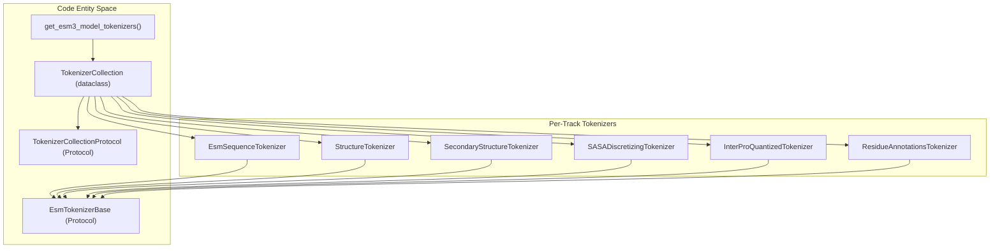
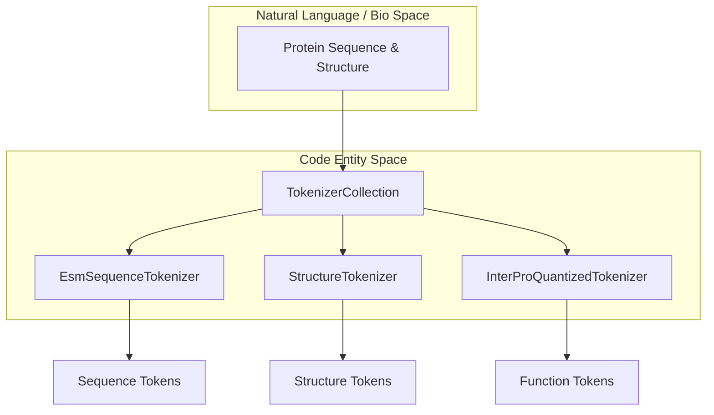

# Tokenization System

> **Relevant source files**
> * [esm/models/vqvae.py](https://github.com/Biohub/esm/blob/82ee3555/esm/models/vqvae.py)
> * [esm/tokenization/__init__.py](https://github.com/Biohub/esm/blob/82ee3555/esm/tokenization/__init__.py)
> * [esm/tokenization/tokenizer_base.py](https://github.com/Biohub/esm/blob/82ee3555/esm/tokenization/tokenizer_base.py)

The ESM repository utilizes a multi-track tokenization architecture to represent proteins across different modalities. Instead of a single sequence-based tokenizer, the system employs a collection of specialized tokenizers that handle sequence, structure, secondary structure, solvent accessibility (SASA), and functional annotations. This modularity allows ESM3 to process and generate multimodal protein data in a unified latent space.

The core of this system is defined in `esm/tokenization/__init__.py`, which provides the `TokenizerCollection` and the `TokenizerCollectionProtocol` to manage these tracks.

### Multi-Track Architecture

The `TokenizerCollection` aggregates the specific tokenizers required for the model's various input tracks. For ESM3 models, the `get_esm3_model_tokenizers` function initializes a complete set of these tokenizers [esm/tokenization/__init__.py L34-L43](https://github.com/Biohub/esm/blob/82ee3555/esm/tokenization/__init__.py#L34-L43)

| Track | Tokenizer Class | Responsibility |
| --- | --- | --- |
| **Sequence** | `EsmSequenceTokenizer` | Amino acid sequences and special tokens like chain breaks [esm/tokenization/sequence_tokenizer.py L10](https://github.com/Biohub/esm/blob/82ee3555/esm/tokenization/sequence_tokenizer.py#L10-L10) |
| **Structure** | `StructureTokenizer` | VQ-VAE based structural tokens [esm/tokenization/__init__.py L17](https://github.com/Biohub/esm/blob/82ee3555/esm/tokenization/__init__.py#L17-L17) |
| **Secondary Structure** | `SecondaryStructureTokenizer` | SS8 or SS3 classification [esm/tokenization/__init__.py L18](https://github.com/Biohub/esm/blob/82ee3555/esm/tokenization/__init__.py#L18-L18) |
| **SASA** | `SASADiscretizingTokenizer` | Discretized solvent accessibility bins [esm/tokenization/__init__.py L19](https://github.com/Biohub/esm/blob/82ee3555/esm/tokenization/__init__.py#L19-L19) |
| **Function** | `InterProQuantizedTokenizer` | LSH-quantized functional annotations [esm/tokenization/__init__.py L20](https://github.com/Biohub/esm/blob/82ee3555/esm/tokenization/__init__.py#L20-L20) |
| **Residue** | `ResidueAnnotationsTokenizer` | Per-residue specific annotations [esm/tokenization/__init__.py L21](https://github.com/Biohub/esm/blob/82ee3555/esm/tokenization/__init__.py#L21-L21) |

### Code Entity Relationship: Tokenizer Protocols

The system relies on structural typing via Python `Protocols` to ensure consistency across different tokenizer implementations. The `EsmTokenizerBase` defines the standard interface for special tokens (mask, bos, eos, pad) and the fundamental `encode`/`decode` methods [esm/tokenization/tokenizer_base.py L5-L26](https://github.com/Biohub/esm/blob/82ee3555/esm/tokenization/tokenizer_base.py#L5-L26)

**Tokenizer Collection Registry**

**Sources:** [esm/tokenization/__init__.py L15-L32](https://github.com/Biohub/esm/blob/82ee3555/esm/tokenization/__init__.py#L15-L32)

 [esm/tokenization/tokenizer_base.py L5-L26](https://github.com/Biohub/esm/blob/82ee3555/esm/tokenization/tokenizer_base.py#L5-L26)

### Sequence Tokenization

The `EsmSequenceTokenizer` is a character-level tokenizer built on the HuggingFace `tokenizers` library using a Byte-Pair Encoding (BPE) model with no merges [esm/tokenization/sequence_tokenizer.py L10-L32](https://github.com/Biohub/esm/blob/82ee3555/esm/tokenization/sequence_tokenizer.py#L10-L32)

 It handles the standard 20 amino acids plus special tokens:

* `<cls>`: Start of sequence [esm/tokenization/sequence_tokenizer.py L49](https://github.com/Biohub/esm/blob/82ee3555/esm/tokenization/sequence_tokenizer.py#L49-L49)
* `<eos>`: End of sequence [esm/tokenization/sequence_tokenizer.py L49](https://github.com/Biohub/esm/blob/82ee3555/esm/tokenization/sequence_tokenizer.py#L49-L49)
* `|`: Chain break token for multi-chain proteins [esm/tokenization/sequence_tokenizer.py L24](https://github.com/Biohub/esm/blob/82ee3555/esm/tokenization/sequence_tokenizer.py#L24-L24)
* `<mask|pad|unk>`: Standard MLM tokens.

For details, see [Sequence & Secondary Structure Tokenizers](/Biohub/esm/5.1-sequence-and-secondary-structure-tokenizers).

### Structural & Functional Tracks

While the sequence track uses standard NLP-style tokenization, other tracks use specialized discretization:

* **Structure:** Uses a VQ-VAE to map 3D coordinates into discrete tokens. The `StructureTokenEncoder` [esm/models/vqvae.py L179](https://github.com/Biohub/esm/blob/82ee3555/esm/models/vqvae.py#L179-L179)  is responsible for encoding local structure into these tokens.
* **Function:** Uses Locality-Sensitive Hashing (LSH) to quantize InterPro functional annotations into a depth-8 hierarchical encoding.

For details, see [Function & Residue Annotation Tokenizers](/Biohub/esm/5.2-function-and-residue-annotation-tokenizers).

### Token Management Utilities

The system includes utility functions to handle special token IDs across different tracks. For instance, `get_invalid_tokenizer_ids` retrieves tokens that should typically be excluded from sampling or loss calculations (mask, pad, cls, eos) [esm/tokenization/__init__.py L52-L66](https://github.com/Biohub/esm/blob/82ee3555/esm/tokenization/__init__.py#L52-L66)

**Data Flow: From Protein to Multi-Track Tokens**

**Sources:** [esm/tokenization/__init__.py L34-L43](https://github.com/Biohub/esm/blob/82ee3555/esm/tokenization/__init__.py#L34-L43)

 [esm/tokenization/sequence_tokenizer.py L17-L43](https://github.com/Biohub/esm/blob/82ee3555/esm/tokenization/sequence_tokenizer.py#L17-L43)

---

**Child Pages:**

* [Sequence & Secondary Structure Tokenizers](/Biohub/esm/5.1-sequence-and-secondary-structure-tokenizers)
* [Function & Residue Annotation Tokenizers](/Biohub/esm/5.2-function-and-residue-annotation-tokenizers)