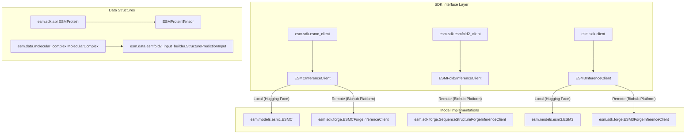
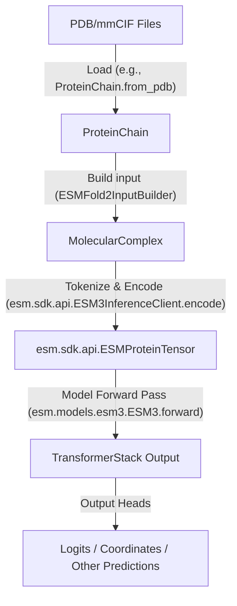

# Overview

# Overview

> **Relevant source files**
> - [README\.md](https://github.com/Biohub/esm/blob/82ee3555/README.md?plain=1)
> - [\_assets/ESM3\_README\.md](https://github.com/Biohub/esm/blob/82ee3555/_assets/ESM3_README.md?plain=1)
> - [\_assets/esmc\_graphic\.png](https://github.com/Biohub/esm/blob/82ee3555/_assets/esmc_graphic.png)
> - [\_assets/esmfold2\_binder\.png](https://github.com/Biohub/esm/blob/82ee3555/_assets/esmfold2_binder.png)
> - [\_assets/esmfold2\_folding\.png](https://github.com/Biohub/esm/blob/82ee3555/_assets/esmfold2_folding.png)
> - [\_assets/header\.png](https://github.com/Biohub/esm/blob/82ee3555/_assets/header.png)
> - [esm/\_\_init\_\_\.py](https://github.com/Biohub/esm/blob/82ee3555/esm/__init__.py)

 The ESM repository is a comprehensive suite for protein biology, providing state\-of\-the\-art models for representation learning, structure prediction, and de novo design\. It serves as a scientific engine that leverages evolutionary data to map biological relationships across scales—from atomic interactions to billion\-year evolutionary spans [README\.md?plain=1 L10-L12](https://github.com/Biohub/esm/blob/82ee3555/README.md?plain=1#L10-L12)

 The codebase supports three primary model families:

 1. **ESMC**: A state\-of\-the\-art protein language model that has learned representations of protein biology from training on billions of protein sequences [README\.md?plain=1 L12-L13](https://github.com/Biohub/esm/blob/82ee3555/README.md?plain=1#L12-L13)
2. **ESM3**: A frontier generative model for biology, able to jointly reason across three fundamental biological properties of proteins: sequence, structure, and function [ESM3\_README\.md?plain=1 L3-L4](https://github.com/Biohub/esm/blob/82ee3555/_assets/ESM3_README.md?plain=1#L3-L4)
3. **ESMFold2**: A state\-of\-the\-art structure prediction model built on the ESMC 6B model, validated for the design of protein\-protein interactions [README\.md?plain=1 L21-L22](https://github.com/Biohub/esm/blob/82ee3555/README.md?plain=1#L21-L22)

## Execution Modes

 The system is designed for flexibility, offering two primary execution paths:

 - **Local Inference**: Users can run models locally using the `transformers` library or native ESM implementations\. This is ideal for fine\-tuning or high\-throughput tasks where local GPU resources are available [README\.md?plain=1 L57-L89](https://github.com/Biohub/esm/blob/82ee3555/README.md?plain=1#L57-L89) [ESM3\_README\.md?plain=1 L50-L87](https://github.com/Biohub/esm/blob/82ee3555/_assets/ESM3_README.md?plain=1#L50-L87)
- **Remote \(Biohub Platform\)**: High\-level SDK clients connect to the Biohub Platform \(formerly "Forge"\) via an API key\. This mode abstracts away infrastructure requirements and provides access to hosted model variants [README\.md?plain=1 L96-L126](https://github.com/Biohub/esm/blob/82ee3555/README.md?plain=1#L96-L126) [ESM3\_README\.md?plain=1 L32-L48](https://github.com/Biohub/esm/blob/82ee3555/_assets/ESM3_README.md?plain=1#L32-L48)

 For detailed setup instructions, see [Getting Started & Installation](https://deepwiki.com/Biohub/esm/1.1-getting-started-and-installation)\.

## System Architecture

 The repository is structured to bridge high\-level biological concepts \(proteins, complexes\) with low\-level tensor operations\. The following diagram illustrates how core SDK entities relate to the underlying model implementations\.

### SDK to Model Mapping

 "This diagram shows how SDK clients map to specific model architectures and their corresponding entry points\."

 **Sources:** [README\.md?plain=1 L112-L126](https://github.com/Biohub/esm/blob/82ee3555/README.md?plain=1#L112-L126) [ESM3\_README\.md?plain=1 L43-L48](https://github.com/Biohub/esm/blob/82ee3555/_assets/ESM3_README.md?plain=1#L43-L48) [ESM3\_README\.md?plain=1 L62-L65](https://github.com/Biohub/esm/blob/82ee3555/_assets/ESM3_README.md?plain=1#L62-L65)

## Model Families

 The repository provides specialized architectures for different biological tasks\.

| Model Family | Primary Purpose | Key Components |
| --- | --- | --- |
| ESMC | Sequence Embeddings | ESMC, EsmSequenceTokenizer, Sparse Autoencoders \(SAEs\) README\.md12\-13 README\.md139\-141 |
| ESM3 | Multimodal Generation | ESM3, TransformerStack, TokenizerCollection \_assets/ESM3\_README\.md3\-4 \_assets/ESM3\_README\.md10 |
| ESMFold2 | Structure Prediction | ESMFold2InputBuilder, Diffusion\-based folding README\.md21\-22 |

 For a comparison of capabilities and parameter scales, see [Model Families & Capabilities](https://deepwiki.com/Biohub/esm/1.2-model-families-and-capabilities)\.

## Core Subsystems

 The codebase is organized into several functional domains that handle the lifecycle of protein data:

 1. **Protein Representations**: Classes like `ESMProtein` and `MolecularComplex` handle raw data parsing \(PDB/mmCIF\) and geometric utilities\.
2. **Tokenization**: A multi\-track system that discretizes sequences, 3D structures \(via VQ\-VAE\), and functional annotations into discrete tokens for transformer processing\.
3. **Inference SDK**: A unified interface \(`esm.sdk`\) for interacting with models regardless of the backend \(Local, Biohub Platform, or SageMaker\) [README\.md?plain=1 L112-L124](https://github.com/Biohub/esm/blob/82ee3555/README.md?plain=1#L112-L124) [ESM3\_README\.md?plain=1 L32-L48](https://github.com/Biohub/esm/blob/82ee3555/_assets/ESM3_README.md?plain=1#L32-L48)
4. **Generation Engine**: Logic for iterative masked language modeling \(MLM\) and diffusion\-based sampling used in de novo design [ESM3\_README\.md?plain=1 L5-L6](https://github.com/Biohub/esm/blob/82ee3555/_assets/ESM3_README.md?plain=1#L5-L6)

### Data Flow Overview

 "The transformation from raw protein data to model\-ready tensors\."

 **Sources:** [README\.md?plain=1 L128-L131](https://github.com/Biohub/esm/blob/82ee3555/README.md?plain=1#L128-L131) [ESM3\_README\.md?plain=1 L5-L6](https://github.com/Biohub/esm/blob/82ee3555/_assets/ESM3_README.md?plain=1#L5-L6) [ESM3\_README\.md?plain=1 L77-L79](https://github.com/Biohub/esm/blob/82ee3555/_assets/ESM3_README.md?plain=1#L77-L79)

## Child Sections

 - **[Getting Started & Installation](https://deepwiki.com/Biohub/esm/1.1-getting-started-and-installation)**: Environment setup using `pixi` or `pip`, and configuring the `Biohub Platform` access\.
- **[Model Families & Capabilities](https://deepwiki.com/Biohub/esm/1.2-model-families-and-capabilities)**: Detailed breakdown of ESMC, ESM3, and ESMFold2 versions and supported biological tasks\.

 **Sources:** [README\.md?plain=1 L1-L136](https://github.com/Biohub/esm/blob/82ee3555/README.md?plain=1#L1-L136) [ESM3\_README\.md?plain=1 L1-L124](https://github.com/Biohub/esm/blob/82ee3555/_assets/ESM3_README.md?plain=1#L1-L124) [\_\_init\_\_\.py L1-L2](https://github.com/Biohub/esm/blob/82ee3555/esm/__init__.py#L1-L2)

---
*Source: [https://deepwiki.com/Biohub/esm/1-overview](https://deepwiki.com/Biohub/esm/1-overview) on DeepWiki*