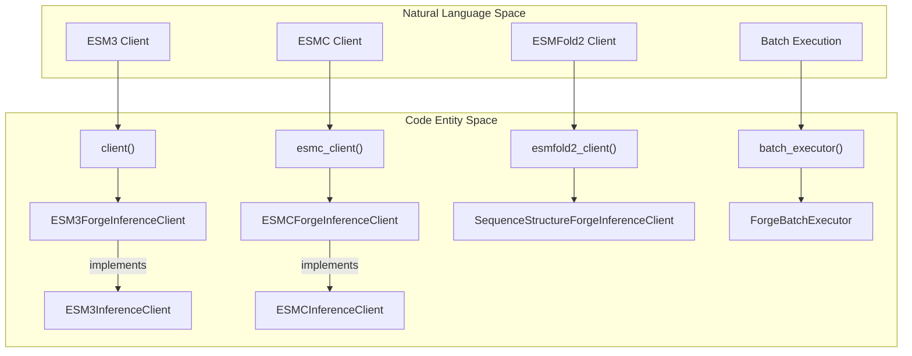
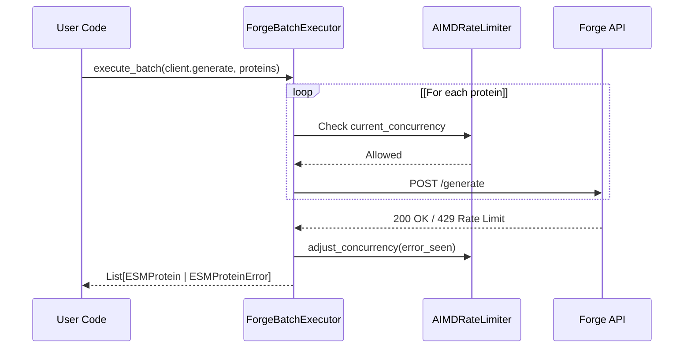

# SDK & Client Interfaces

# SDK & Client Interfaces

> **Relevant source files**
> - [esm/sdk/\_\_init\_\_\.py](https://github.com/Biohub/esm/blob/82ee3555/esm/sdk/__init__.py)
> - [esm/sdk/api\.py](https://github.com/Biohub/esm/blob/82ee3555/esm/sdk/api.py)
> - [esm/sdk/forge\.py](https://github.com/Biohub/esm/blob/82ee3555/esm/sdk/forge.py)

 The `esm.sdk` package provides a high\-level, unified interface for interacting with ESM models, whether they are running locally or hosted on remote platforms like Biohub Forge or AWS SageMaker\. It abstracts away the complexities of serialization, transport protocols, and model\-specific configurations into a set of consistent Python interfaces\.

### Client Factory Functions

 The SDK provides three primary entry points for creating inference clients\. These functions automatically handle authentication via the `ESM_API_KEY` environment variable and default to the Biohub Platform \(`https://biohub.ai`\)\.

| Function | Return Type | Primary Use Case |
| --- | --- | --- |
| client\(\) | ESM3InferenceClient | Multimodal generation, folding, and inverse folding with ESM3\. |
| esmc\_client\(\) | ESMCInferenceClient | Sequence embeddings and zero\-shot mutation scoring with ESMC\. |
| esmfold2\_client\(\) | SequenceStructureForgeInferenceClient | High\-speed structure prediction and inverse folding\. |

 **Sources:** [\_\_init\_\_\.py L14-L70](https://github.com/Biohub/esm/blob/82ee3555/esm/sdk/__init__.py#L14-L70)

### Core Architecture Overview

 The SDK is built on a hierarchy of abstract base classes that define the "API Contract" for each model family\. These contracts ensure that switching between a remote Forge client and a local model instance requires minimal code changes\.

#### System Entity Mapping

 The following diagram maps high\-level SDK concepts to their concrete implementation classes and factory functions\.

 **SDK Interface Mapping**

 **Sources:** [\_\_init\_\_\.py L1-L83](https://github.com/Biohub/esm/blob/82ee3555/esm/sdk/__init__.py#L1-L83) [api\.py L350-L1000](https://github.com/Biohub/esm/blob/82ee3555/esm/sdk/api.py#L350-L1000)

### Data Models & API Contracts

 The SDK centers around the `ESMProtein` class, which acts as a multimodal container for sequence, structure \(coordinates\), secondary structure, SASA, and function annotations\. The inference clients operate on these objects \(or their tensorized counterparts, `ESMProteinTensor`\)\.

 - **`ESMProtein`**: High\-level object with PDB/mmCIF I/O capabilities\.
- **`InferenceClient`**: Abstract interfaces defining methods like `encode()`, `decode()`, `generate()`, and `logits()`\.

 For details on data models and abstract interfaces, see [SDK API Contracts – ESMProtein & Inference Clients](https://deepwiki.com/Biohub/esm/3.1-sdk-api-contracts-esmprotein-and-inference-clients)\.

 **Sources:** [api\.py L27-L163](https://github.com/Biohub/esm/blob/82ee3555/esm/sdk/api.py#L27-L163) [api\.py L350-L450](https://github.com/Biohub/esm/blob/82ee3555/esm/sdk/api.py#L350-L450)

### Execution Backends

 The SDK supports multiple backends for executing model inference:

 1. **Forge / Biohub Platform**: The default remote backend\. It uses a specialized transport layer \(`_BaseForgeInferenceClient`\) that handles JSON/Pickle serialization and provides robust retry logic for network stability\. - For details, see [Forge / Biohub Platform Client](https://deepwiki.com/Biohub/esm/3.2-forge-biohub-platform-client)\.
2. **SageMaker**: A backend for AWS SageMaker endpoints\. It wraps the Forge client logic but adapts the request format for SageMaker's `boto3` requirements\. - For details, see [SageMaker & Alternative Backends](https://deepwiki.com/Biohub/esm/3.3-sagemaker-and-alternative-backends)\.
3. **Local Execution**: While the SDK provides the interfaces, local execution is typically handled by passing a local model instance \(e\.g\., `esm.models.esm3.ESM3`\) into the same generation logic used by the SDK\.

### Batch Processing & Rate Limiting

 For high\-throughput tasks, the SDK provides the `ForgeBatchExecutor`\. This utility manages a pool of concurrent requests and implements an **AIMD \(Additive Increase/Multiplicative Decrease\)** rate limiter to maximize throughput while respecting server constraints \(e\.g\., handling `429 Too Many Requests` errors\)\.

 **Batch Execution Flow**

 **Sources:** [forge\_context\_manager\.py L46-L156](https://github.com/Biohub/esm/blob/82ee3555/esm/utils/forge_context_manager.py#L46-L156) [\_\_init\_\_\.py L73-L83](https://github.com/Biohub/esm/blob/82ee3555/esm/sdk/__init__.py#L73-L83)

### Experimental Features

 The SDK includes experimental support for **Guided & Constrained Generation**\. This allows users to steer the model's output using soft scoring functions \(e\.g\., maximizing a specific property\) or hard constraints \(e\.g\., fixing specific residues or motifs\)\.

 For details, see [Experimental: Guided & Constrained Generation](https://deepwiki.com/Biohub/esm/3.4-experimental:-guided-and-constrained-generation)\.

 **Sources:** [api\.py L1020-L1150](https://github.com/Biohub/esm/blob/82ee3555/esm/sdk/api.py#L1020-L1150) \(referencing internal constraint types\)

---
*Source: [https://deepwiki.com/Biohub/esm/3-sdk-and-client-interfaces](https://deepwiki.com/Biohub/esm/3-sdk-and-client-interfaces) on DeepWiki*