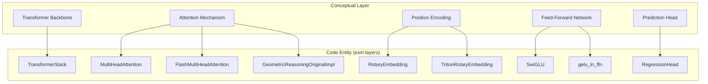
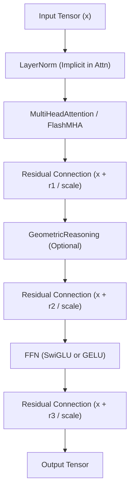
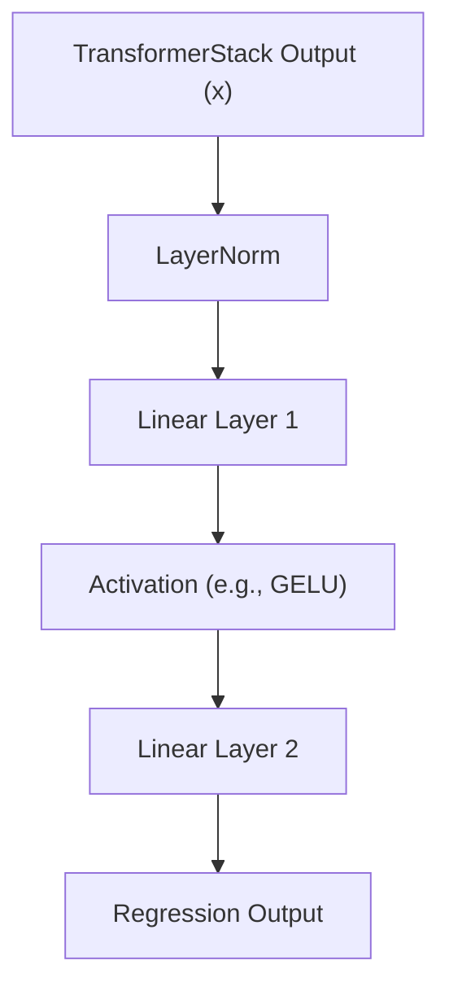

# Transformer Building Blocks

# Transformer Building Blocks

> **Relevant source files**
> - [esm/layers/attention\.py](https://github.com/Biohub/esm/blob/82ee3555/esm/layers/attention.py)
> - [esm/layers/blocks\.py](https://github.com/Biohub/esm/blob/82ee3555/esm/layers/blocks.py)
> - [esm/layers/codebook\.py](https://github.com/Biohub/esm/blob/82ee3555/esm/layers/codebook.py)
> - [esm/layers/rotary\.py](https://github.com/Biohub/esm/blob/82ee3555/esm/layers/rotary.py)
> - [esm/layers/transformer\_stack\.py](https://github.com/Biohub/esm/blob/82ee3555/esm/layers/transformer_stack.py)
> - [esm/utils/misc\.py](https://github.com/Biohub/esm/blob/82ee3555/esm/utils/misc.py)

 This page provides a technical reference for the reusable neural network layers and architectural components used across the ESM model families \(ESM3 and ESMC\)\. These blocks form the backbone of the protein language models, handling sequence processing, geometric reasoning, and structural prediction\.

## Overview of Components

 The ESM architecture relies on a hierarchical stack of transformer layers\. The `TransformerStack` manages a sequence of `UnifiedTransformerBlock` instances, which can dynamically switch between standard multi\-head attention and geometric attention\.

### Natural Language to Code Entity Mapping

 The following diagram maps high\-level transformer concepts to their specific implementations in the `esm` codebase\.

 **Transformer Architecture Mapping**

 Sources: [transformer\_stack\.py L10-L40](https://github.com/Biohub/esm/blob/82ee3555/esm/layers/transformer_stack.py#L10-L40) [attention\.py L16-L144](https://github.com/Biohub/esm/blob/82ee3555/esm/layers/attention.py#L16-L144) [blocks\.py L15-L115](https://github.com/Biohub/esm/blob/82ee3555/esm/layers/blocks.py#L15-L115) [rotary\.py L68-L108](https://github.com/Biohub/esm/blob/82ee3555/esm/layers/rotary.py#L68-L108)

---

## TransformerStack

 The `TransformerStack` is the primary container for the model's depth\. It initializes a series of transformer blocks and handles the distribution of inputs \(sequence, structure frames, and masks\) through the layers\.

 - **Residue Scaling**: To stabilize deep networks, it implements a `residue_scaling_factor` calculated as `sqrt(n_layers / 36)` [transformer\_stack\.py L50-L52](https://github.com/Biohub/esm/blob/82ee3555/esm/layers/transformer_stack.py#L50-L52)
- **Geometric Integration**: It allows a configurable number of initial layers \(`n_layers_geom`\) to include geometric attention [transformer\_stack\.py L32-L48](https://github.com/Biohub/esm/blob/82ee3555/esm/layers/transformer_stack.py#L32-L48)
- **Normalization**: Applies a final `nn.LayerNorm` after the last block [transformer\_stack\.py L62](https://github.com/Biohub/esm/blob/82ee3555/esm/layers/transformer_stack.py#L62-L62)

 Sources: [transformer\_stack\.py L10-L116](https://github.com/Biohub/esm/blob/82ee3555/esm/layers/transformer_stack.py#L10-L116)

---

## UnifiedTransformerBlock

 The `UnifiedTransformerBlock` is a flexible layer that encapsulates the standard Transformer operations with optional geometric reasoning\.

 **Data Flow within UnifiedTransformerBlock**

### Key Parameters

 - `use_geom_attn`: If enabled, the block incorporates `GeometricReasoningOriginalImpl` for structure\-aware processing [blocks\.py L100-L108](https://github.com/Biohub/esm/blob/82ee3555/esm/layers/blocks.py#L100-L108)
- `use_flash_attn`: Switches the attention implementation to `FlashMultiHeadAttention` for improved performance [blocks\.py L91-L98](https://github.com/Biohub/esm/blob/82ee3555/esm/layers/blocks.py#L91-L98)
- `ffn_type`: Supports "swiglu" \(default for ESM3\) or "gelu" [blocks\.py L109-L114](https://github.com/Biohub/esm/blob/82ee3555/esm/layers/blocks.py#L109-L114)

 Sources: [blocks\.py L51-L165](https://github.com/Biohub/esm/blob/82ee3555/esm/layers/blocks.py#L51-L165)

---

## Attention Mechanisms

### MultiHeadAttention

 The standard implementation uses `F.scaled_dot_product_attention` for efficiency while supporting manual attention weight extraction via `output_attentions=True` [attention\.py L74-L92](https://github.com/Biohub/esm/blob/82ee3555/esm/layers/attention.py#L74-L92) It integrates `RotaryEmbedding` to handle relative positioning [attention\.py L38-L46](https://github.com/Biohub/esm/blob/82ee3555/esm/layers/attention.py#L38-L46)

### FlashMultiHeadAttention

 A specialized subclass optimized for speed and memory\. It utilizes `flash_attn_varlen_qkvpacked_func` to handle variable\-length sequences without padding overhead [attention\.py L138-L140](https://github.com/Biohub/esm/blob/82ee3555/esm/layers/attention.py#L138-L140) It requires inputs to be pre\-processed into unpadded tensors with cumulative sequence length indices \(`cu_seqlens`\) [attention\.py L120-L122](https://github.com/Biohub/esm/blob/82ee3555/esm/layers/attention.py#L120-L122)

 Sources: [attention\.py L16-L144](https://github.com/Biohub/esm/blob/82ee3555/esm/layers/attention.py#L16-L144)

---

## Position Embeddings: RotaryEmbedding

 ESM models use Rotary Positional Embeddings \(RoPE\) to inject relative position information\.

 - **RotaryEmbedding**: Implements the standard RoPE logic using PyTorch tensors\. It caches `cos` and `sin` frequencies to accelerate the forward pass [rotary\.py L118-L122](https://github.com/Biohub/esm/blob/82ee3555/esm/layers/rotary.py#L118-L122)
- **TritonRotaryEmbedding**: A high\-performance variant used in conjunction with Flash Attention, leveraging Triton kernels for the rotation operation [attention\.py L108-L109](https://github.com/Biohub/esm/blob/82ee3555/esm/layers/attention.py#L108-L109)

 Sources: [rotary\.py L68-L160](https://github.com/Biohub/esm/blob/82ee3555/esm/layers/rotary.py#L68-L160) [attention\.py L108-L109](https://github.com/Biohub/esm/blob/82ee3555/esm/layers/attention.py#L108-L109)

---

## Feed\-Forward Networks \(FFN\)

### SwiGLU FFN

 The preferred FFN for modern ESM models\. It uses the `SwiGLU` activation function, which splits the input and applies SiLU to one half before multiplication [blocks\.py L25-L28](https://github.com/Biohub/esm/blob/82ee3555/esm/layers/blocks.py#L25-L28)

 - **Correction Function**: The `swiglu_correction_fn` ensures the hidden dimension is a multiple of 256 for hardware alignment [blocks\.py L10-L12](https://github.com/Biohub/esm/blob/82ee3555/esm/layers/blocks.py#L10-L12)
- **Structure**: Composed of a `LayerNorm`, a `Linear` layer expanding to `2 * hidden_dim`, the `SwiGLU` activation, and a final `Linear` projection back to `d_model` [blocks\.py L30-L38](https://github.com/Biohub/esm/blob/82ee3555/esm/layers/blocks.py#L30-L38)

### GELU FFN

 A standard alternative using the Gaussian Error Linear Unit activation [blocks\.py L41-L49](https://github.com/Biohub/esm/blob/82ee3555/esm/layers/blocks.py#L41-L49)

 Sources: [blocks\.py L10-L50](https://github.com/Biohub/esm/blob/82ee3555/esm/layers/blocks.py#L10-L50)

---

## RegressionHead

 The `RegressionHead` is a conceptual component representing a module that takes the output of the `TransformerStack` and produces continuous predictions\. While not explicitly defined as a single class named `RegressionHead` in the provided files, its functionality is typically implemented as an `nn.Module` that processes the transformer's hidden states for tasks like pLDDT prediction or other continuous value estimations\. It usually consists of an MLP with `LayerNorm` and non\-linearities\.

 **Conceptual Data Flow for RegressionHead**

| Component | Description |
| --- | --- |
| Input | Hidden states from the Transformer \(post\-norm output of TransformerStack\)\. |
| Structure | Typically a multi\-layer perceptron \(MLP\) with LayerNorm and non\-linearities\. |
| Output | Scalar values per residue or per protein, depending on the task\. |

 Sources: [transformer\_stack\.py L115-L116](https://github.com/Biohub/esm/blob/82ee3555/esm/layers/transformer_stack.py#L115-L116) \(Context of `TransformerStack` output usage, which would feed into such a head\)\.

---
*Source: [https://deepwiki.com/Biohub/esm/2.5-transformer-building-blocks](https://deepwiki.com/Biohub/esm/2.5-transformer-building-blocks) on DeepWiki*