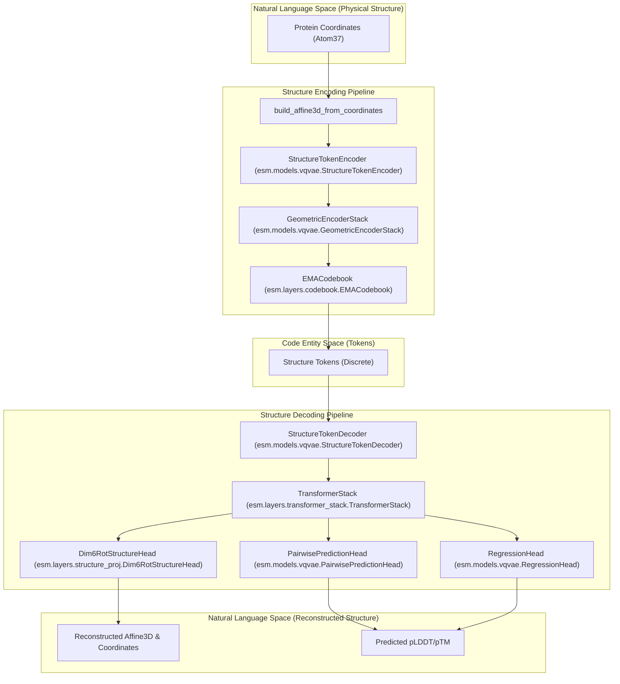
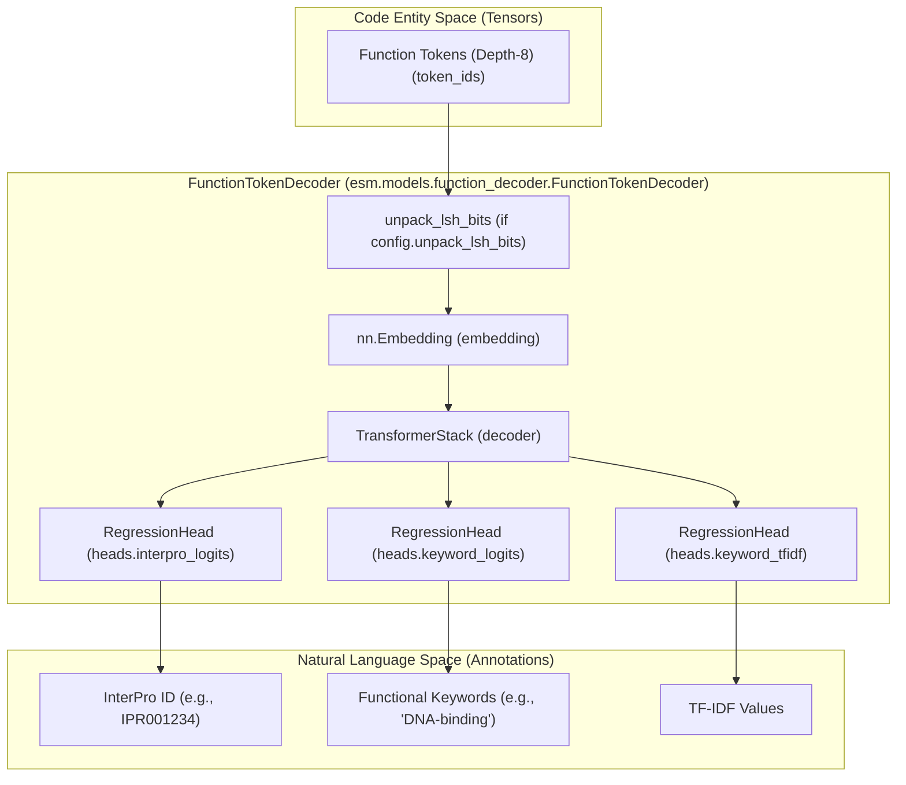

# VQ\-VAE Structure Tokenizer & Function Decoder

# VQ\-VAE Structure Tokenizer & Function Decoder

> **Relevant source files**
> - [esm/layers/codebook\.py](https://github.com/Biohub/esm/blob/82ee3555/esm/layers/codebook.py)
> - [esm/layers/geom\_attention\.py](https://github.com/Biohub/esm/blob/82ee3555/esm/layers/geom_attention.py)
> - [esm/layers/rotary\.py](https://github.com/Biohub/esm/blob/82ee3555/esm/layers/rotary.py)
> - [esm/layers/structure\_proj\.py](https://github.com/Biohub/esm/blob/82ee3555/esm/layers/structure_proj.py)
> - [esm/models/function\_decoder\.py](https://github.com/Biohub/esm/blob/82ee3555/esm/models/function_decoder.py)
> - [esm/models/vqvae\.py](https://github.com/Biohub/esm/blob/82ee3555/esm/models/vqvae.py)
> - [esm/pretrained\.py](https://github.com/Biohub/esm/blob/82ee3555/esm/pretrained.py)
> - [esm/tokenization/\_\_init\_\_\.py](https://github.com/Biohub/esm/blob/82ee3555/esm/tokenization/__init__.py)

 The ESM3 ecosystem utilizes specialized discrete latent spaces for protein structure and functional annotations\. These are implemented via a Vector Quantized Variational Autoencoder \(VQ\-VAE\) for structural coordinates and a Multi\-Head Decoder for functional keywords and InterPro entries\. These components allow ESM3 to treat structure and function as discrete token tracks alongside the primary amino acid sequence\.

## Structural Tokenization \(VQ\-VAE\)

 The structural tokenization system converts 3D atomic coordinates into a sequence of discrete tokens and back again\. This is achieved through the `StructureTokenEncoder` and `StructureTokenDecoder` classes defined in `esm/models/vqvae.py`\.

### StructureTokenEncoder

 The encoder maps 3D coordinates \(represented as `Affine3D` objects and `Atom37` tensors\) into a discrete latent space\. It utilizes a `GeometricEncoderStack` which is a transformer variant where every layer is a `UnifiedTransformerBlock` configured for geometric attention [vqvae\.py L142-L160](https://github.com/Biohub/esm/blob/82ee3555/esm/models/vqvae.py#L142-L160) The `GeometricEncoderStack` inherits from `TransformerStack` but overrides the `blocks` attribute to use `UnifiedTransformerBlock` with `use_geom_attn=True` and `use_plain_attn=False` [vqvae\.py L142-L157](https://github.com/Biohub/esm/blob/82ee3555/esm/models/vqvae.py#L142-L157)

 **Key Components:**

 - **Geometric Attention**: Uses `GeometricReasoningOriginalImpl` to compute attention weights based on both rotation and distance between residues [geom\_attention\.py L9-L31](https://github.com/Biohub/esm/blob/82ee3555/esm/layers/geom_attention.py#L9-L31)
- **K\-Nearest Neighbors \(KNN\)**: The encoder operates on a graph constructed from the 16 nearest neighbors for each residue [vqvae\.py L191](https://github.com/Biohub/esm/blob/82ee3555/esm/models/vqvae.py#L191-L191)
- **EMA Codebook**: A `EMACodebook` containing 4096 codes \(`n_codes`\) of dimension 128 \(`d_out`\) performs the vector quantization [vqvae\.py L187](https://github.com/Biohub/esm/blob/82ee3555/esm/models/vqvae.py#L187-L187) The `EMACodebook` manages a set of learnable embeddings and uses Exponential Moving Average \(EMA\) for updating them [codebook\.py L8-L33](https://github.com/Biohub/esm/blob/82ee3555/esm/layers/codebook.py#L8-L33)
- **RelativePositionEmbedding**: Used to embed relative positional information between residues [vqvae\.py L188](https://github.com/Biohub/esm/blob/82ee3555/esm/models/vqvae.py#L188-L188)

### StructureTokenDecoder

 The decoder performs the inverse operation: reconstructing 3D backbone coordinates from discrete structural tokens\. It is a significantly larger model than the encoder \(30 layers vs 2 layers in the standard configuration\) [pretrained\.py L44](https://github.com/Biohub/esm/blob/82ee3555/esm/pretrained.py#L44-L44) The decoder also uses a `TransformerStack` for processing the token embeddings [vqvae\.py L240-L248](https://github.com/Biohub/esm/blob/82ee3555/esm/models/vqvae.py#L240-L248)

 **Output Heads:**

 - **Dim6RotStructureHead**: Predicts the 6D representation \(Graham\-Schmidt\) of rotations and 3D translations to reconstruct the protein backbone [structure\_proj\.py L8-L25](https://github.com/Biohub/esm/blob/82ee3555/esm/layers/structure_proj.py#L8-L25)
- **PairwisePredictionHead**: Predicts distograms and pLDDT/pTM metrics [vqvae\.py L52-L70](https://github.com/Biohub/esm/blob/82ee3555/esm/models/vqvae.py#L52-L70) This head takes the output of the transformer and projects it to predict pairwise distances and other structural metrics\.
- **RegressionHead**: Used for predicting pLDDT and pTM values [vqvae\.py L98-L111](https://github.com/Biohub/esm/blob/82ee3555/esm/models/vqvae.py#L98-L111)

### Structure Data Flow Diagram

 The following diagram illustrates the flow from physical coordinates to the discrete "Code Entity Space" \(tokens\) and back to reconstructed structure\.

 Sources: [vqvae\.py L142-L220](https://github.com/Biohub/esm/blob/82ee3555/esm/models/vqvae.py#L142-L220) [structure\_proj\.py L8-L63](https://github.com/Biohub/esm/blob/82ee3555/esm/layers/structure_proj.py#L8-L63) [affine3d\.py L10-L20](https://github.com/Biohub/esm/blob/82ee3555/esm/utils/structure/affine3d.py#L10-L20) [codebook\.py L8-L33](https://github.com/Biohub/esm/blob/82ee3555/esm/layers/codebook.py#L8-L33) [vqvae\.py L230-L300](https://github.com/Biohub/esm/blob/82ee3555/esm/models/vqvae.py#L230-L300)

---

## Function Token Decoder

 The `FunctionTokenDecoder` is responsible for translating the discrete function tokens generated by ESM3 into human\-readable InterPro annotations and keyword descriptions\. Function tokens are depth\-8 LSH \(Locality Sensitive Hashing\) encoded representations [function\_decoder\.py L54-L125](https://github.com/Biohub/esm/blob/82ee3555/esm/models/function_decoder.py#L54-L125) The `FunctionTokenDecoderConfig` [function\_decoder\.py L22-L52](https://github.com/Biohub/esm/blob/82ee3555/esm/models/function_decoder.py#L22-L52) defines parameters such as `d_model`, `n_heads`, `n_layers`, `function_token_vocab_size`, `function_token_depth`, `num_interpro_classes`, and `keyword_vocabulary_size`\.

### Architecture

 The decoder consists of a `TransformerStack` that processes the function tokens and three specialized regression heads [function\_decoder\.py L92-L125](https://github.com/Biohub/esm/blob/82ee3555/esm/models/function_decoder.py#L92-L125):

 1. **interpro\_logits**: A `RegressionHead` predicting the presence of 29,026 InterPro classes [function\_decoder\.py L119-L123](https://github.com/Biohub/esm/blob/82ee3555/esm/models/function_decoder.py#L119-L123) The InterPro IDs are loaded from a CSV file specified in `interpro_entry_list` [function\_decoder\.py L63-L69](https://github.com/Biohub/esm/blob/82ee3555/esm/models/function_decoder.py#L63-L69)
2. **keyword\_logits**: A binary classification head for 58,641 keywords [function\_decoder\.py L107-L111](https://github.com/Biohub/esm/blob/82ee3555/esm/models/function_decoder.py#L107-L111) The keyword vocabulary is loaded from a file specified by `keyword_vocabulary_path` [function\_decoder\.py L71-L73](https://github.com/Biohub/esm/blob/82ee3555/esm/models/function_decoder.py#L71-L73)
3. **keyword\_tfidf**: A head that regresses the TF\-IDF value of present keywords to determine their relative importance [function\_decoder\.py L112-L116](https://github.com/Biohub/esm/blob/82ee3555/esm/models/function_decoder.py#L112-L116)

 The `TransformerStack` [function\_decoder\.py L92-L103](https://github.com/Biohub/esm/blob/82ee3555/esm/models/function_decoder.py#L92-L103) uses `d_model`, `n_heads`, and `n_layers` from the configuration\. An `nn.Embedding` layer maps the input `token_ids` to embeddings before being passed to the transformer [function\_decoder\.py L85-L91](https://github.com/Biohub/esm/blob/82ee3555/esm/models/function_decoder.py#L85-L91)

### LSH Bit Unpacking

 Function tokens are typically stored as integers\. The decoder can "unpack" these into single\-bit tokens to provide distinct embeddings for each bit in the LSH signature [function\_decoder\.py L141-L163](https://github.com/Biohub/esm/blob/82ee3555/esm/models/function_decoder.py#L141-L163) This is controlled by the `unpack_lsh_bits` configuration parameter [function\_decoder\.py L44](https://github.com/Biohub/esm/blob/82ee3555/esm/models/function_decoder.py#L44-L44) If `unpack_lsh_bits` is `True`, the input `token_ids` are treated as LSH values, and individual bits are extracted and shifted into distinct vocabulary ranges for embedding\. Otherwise, a depth\-position offset is applied to the `token_ids` to ensure distinct embeddings for tokens at different depths [function\_decoder\.py L164-L171](https://github.com/Biohub/esm/blob/82ee3555/esm/models/function_decoder.py#L164-L171)

### Function Mapping Diagram

 This diagram shows how the model bridges the gap between high\-dimensional functional keywords and the discrete token space used by the ESM3 transformer\.

 Sources: [function\_decoder\.py L104-L125](https://github.com/Biohub/esm/blob/82ee3555/esm/models/function_decoder.py#L104-L125) [function\_decoder\.py L141-L171](https://github.com/Biohub/esm/blob/82ee3555/esm/models/function_decoder.py#L141-L171) [function\_tokenizer\.py L15-L20](https://github.com/Biohub/esm/blob/82ee3555/esm/tokenization/function_tokenizer.py#L15-L20)

---

## Pretrained Factory Functions

 The VQ\-VAE and Function Decoder are instantiated and loaded via factory functions in `esm/pretrained.py`\. These functions handle the initialization of empty weights, loading of local `.pth` files, and mapping to the correct device [pretrained\.py L28-L63](https://github.com/Biohub/esm/blob/82ee3555/esm/pretrained.py#L28-L63)

| Factory Function | Class | d\_model | n\_layers | n\_heads | v\_heads | d\_out | n\_codes |
| --- | --- | --- | --- | --- | --- | --- | --- |
| ESM3\_structure\_encoder\_v0 | StructureTokenEncoder | 1024 | 2 | 1 | 128 | 128 | 4096 |
| ESM3\_structure\_decoder\_v0 | StructureTokenDecoder | 1280 | 30 | 20 | N/A | N/A | N/A |
| ESM3\_function\_decoder\_v0 | FunctionTokenDecoder | 1024 | 3 | 8 | N/A | N/A | N/A |

 These components are integrated into the full ESM3 model during its construction in `ESM3_sm_open_v0`, where they are passed as function pointers \(`structure_encoder_fn`, `structure_decoder_fn`, `function_decoder_fn`\) [pretrained\.py L108-L119](https://github.com/Biohub/esm/blob/82ee3555/esm/pretrained.py#L108-L119) The `LOCAL_MODEL_REGISTRY` [pretrained\.py L128-L136](https://github.com/Biohub/esm/blob/82ee3555/esm/pretrained.py#L128-L136) maps string identifiers to these factory functions, allowing for dynamic loading via `load_local_model` [pretrained\.py L139-L150](https://github.com/Biohub/esm/blob/82ee3555/esm/pretrained.py#L139-L150)

### Implementation Details Table

| Feature | Structure Tokenizer | Function Decoder |
| --- | --- | --- |
| Quantization | EMA Codebook \(4096 codes\) esm/models/vqvae\.py187 | LSH \(Depth 8, 8 bits/token\) esm/models/function\_decoder\.py44\-52 |
| Attention Type | Geometric \(Rotation/Distance\) esm/models/vqvae\.py142\-157 | Plain Transformer \(GELU\) esm/models/function\_decoder\.py101 |
| Primary Class | StructureTokenEncoder/StructureTokenDecoder esm/models/vqvae\.py179\-230 | FunctionTokenDecoder esm/models/function\_decoder\.py54 |
| Vocab Size | 4096 \(codebook size\) esm/models/vqvae\.py187 | ~260 \(per depth\) esm/models/function\_decoder\.py31 |
| Source File | esm/models/vqvae\.py | esm/models/function\_decoder\.py |

 Sources: [pretrained\.py L28-L150](https://github.com/Biohub/esm/blob/82ee3555/esm/pretrained.py#L28-L150) [vqvae\.py L1-L192](https://github.com/Biohub/esm/blob/82ee3555/esm/models/vqvae.py#L1-L192) [function\_decoder\.py L21-L125](https://github.com/Biohub/esm/blob/82ee3555/esm/models/function_decoder.py#L21-L125)

---
*Source: [https://deepwiki.com/Biohub/esm/2.4-vq-vae-structure-tokenizer-and-function-decoder](https://deepwiki.com/Biohub/esm/2.4-vq-vae-structure-tokenizer-and-function-decoder) on DeepWiki*