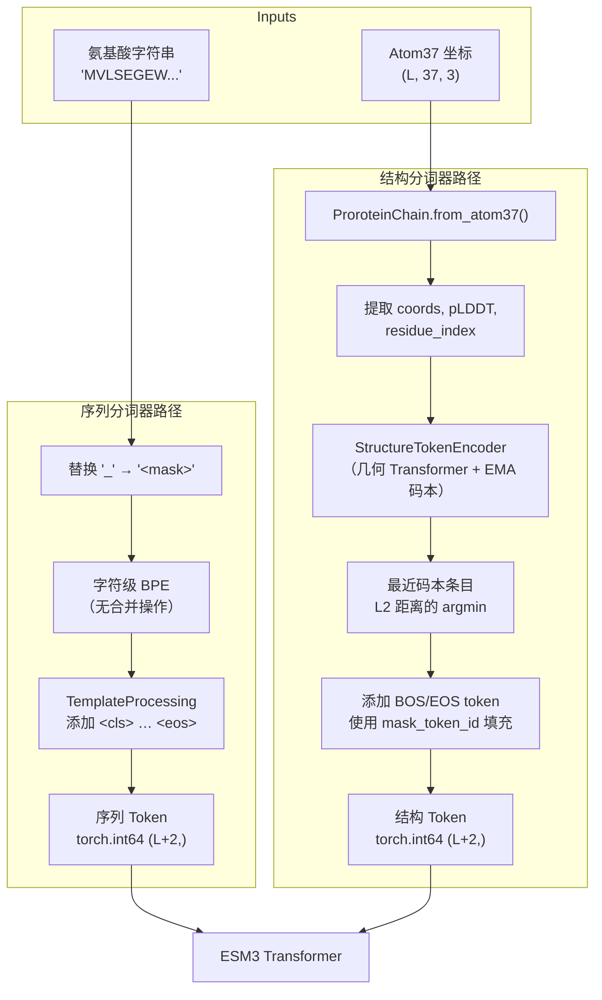

---
slug:10-sequence-and-structure-tokenizers
blog_type:normal
---


ESM3 是一个多模态蛋白质模型，在六个并行轨道上处理离散 token。其中两个轨道——**序列**（sequence）和**结构**（structure）——是基础模态：序列捕捉线性氨基酸链，而结构编码三维骨架几何信息。本文档将探讨原始生物输入如何转换为 Transformer 能够处理的整型 token ID，以及这两种分词器如何体现截然不同的设计哲学——一个是简单的字符级词表，另一个是在三维坐标上运行的学习型 VQ-VAE 码本。

## 分词器协议：统一的契约

在深入探讨各个分词器之前，首先必须理解它们共同满足的契约。ESM3 中的每个分词器都实现了 `EsmTokenizerBase` 协议，该协议定义了特殊 token 与编解码方法的最小接口：

| 协议成员 | 用途 |
|---|---|
| `mask_token` / `mask_token_id` | 未知或待预测位置的占位符 |
| `bos_token` / `bos_token_id` | 序列起始标记 |
| `eos_token` / `eos_token_id` | 序列结束标记 |
| `pad_token` / `pad_token_id` | 批次对齐的填充符 |
| `chain_break_token` / `chain_break_token_id` | 复合物中蛋白质链之间的分隔符 |
| `encode()` | 将原始输入转换为 token ID |
| `decode()` | 将 token ID 转换为原始输入 |
| `all_token_ids` | 有效 token ID 的完整集合 |
| `special_token_ids` | 保留用于控制而非数据的 ID |

由于 `EsmTokenizerBase` 是一个 `@runtime_checkable` 协议（而非抽象基类），各个分词器可以自由继承任何合理的父类——序列分词器继承 `PreTrainedTokenizerFast`，结构分词器继承普通类——同时依然可以在任何需要该协议的地方进行替换。这种鸭子类型设计允许 `TokenizerCollection` 数据类将所有六个分词器聚合在单一的 `TokenizerCollectionProtocol` 之后，使下游代码能够统一地处理它们。

来源: [tokenizer_base.py](/esm/tokenization/tokenizer_base.py#L1-L26), [__init__.py](/esm/tokenization/__init__.py#L1-L67)

## EsmSequenceTokenizer：字符级氨基酸编码

`EsmSequenceTokenizer` 将蛋白质序列字符串（例如 `"MVLSEGEW..."`）转换为整型 token ID 序列。尽管它继承了 HuggingFace 的 `PreTrainedTokenizerFast` 并在底层技术上使用了 BPE（字节对编码）后端，但它**绝不执行任何子词合并**——其 BPE 合并列表被有意置空。这使其成为一个纯粹的字符级分词器，每个氨基酸符号都精确映射到一个 token ID。

### 词表布局

词表在 `esm/utils/constants/esm3.py` 中被定义为一个包含 33 个 token 的固定列表：

| 索引范围 | Token | 数量 | 描述 |
|---|---|---|---|
| 0 | `<cls>` | 1 | BOS/CLS 标记 |
| 1 | `<pad>` | 1 | 填充符 |
| 2 | `<eos>` | 1 | 序列结束 |
| 3 | `<unk>` | 1 | 未知字符 |
| 4–25 | `L A G V S E R T I D P K Q N F Y M H W C X B U Z` | 22 | 标准 + 罕见氨基酸 |
| 26 | `O` | 1 | 吡咯赖氨酸 |
| 27 | `.` | 1 | 间隔（比对占位符） |
| 28 | `-` | 1 | 间隔变体 |
| 29 | `\|` | 1 | 链断裂分隔符 |
| 30–32 | （标准词表中保留/未使用） | — | — |
| 31 | `\|` (chain_break_token) | — | 与索引 29 相同 |
| 32 | `<mask>` | 1 | 用于生成的掩码 token |

20 种标准氨基酸按频率排序占据位置 4–23（亮氨酸最常见，位于索引 4），其后是非标准残基 `X`、`B`、`U`、`Z` 和 `O`。链断裂 token `|` 使得多链蛋白质能够表示为具有明确链边界的单一 token 序列。

### 模板处理

当 `add_special_tokens=True`（默认值）时，分词器应用 `TemplateProcessing` 来封装编码后的序列：

```
<cls> [amino_acid_tokens] <eos>
```

这意味着长度为 *L* 的序列会产生长度为 *L + 2* 的 token 张量。BOS token 是 `<cls>` 的别名——`bos_token` 属性显式返回 `self.cls_token`，`bos_token_id` 返回 `self.cls_token_id`，这反映了 ESM3 从不使用独立于 CLS 的 BOS 符号的惯例。

### 编码流程

`encoding.py` 中的 `tokenize_sequence` 函数提供了从原始字符串到张量的规范路径：

1. 将所有下划线掩码占位符（`_`）替换为 `<mask>` token 字符串
2. 调用 `sequence_tokenizer.encode()`，应用字符级 BPE 映射及模板处理
3. 将结果列表封装为 `torch.int64` 张量

<CgxTip>在构建默认（全掩码）序列 token 时，模式为：用 `mask_token_id` 填充长度为 *L+2* 的张量，然后将索引 0 设为 `bos_token_id`，索引 -1 设为 `eos_token_id`。这就是 ESM3 表示“从头生成该序列”的方式。</CgxTip>

来源: [sequence_tokenizer.py](/esm/tokenization/sequence_tokenizer.py#L1-L135), [esm3.py](/esm/utils/constants/esm3.py#L1-L131), [encoding.py](/esm/utils/encoding.py#L46-L60)

## StructureTokenizer：源自坐标的离散编码

`StructureTokenizer` 在架构上与序列分词器截然不同。它**不**执行字符串到 ID 的映射——实际上，它的 `encode()` 和 `decode()` 方法会显式抛出 `NotImplementedError`。相反，它作为结构轨道的**特殊 token ID 注册表**，而三维坐标的实际编解码工作则委托给 `StructureTokenEncoder` 和 `StructureTokenDecoder` 神经网络（详见 [VQ-VAE 结构编码](11-vq-vae-structure-encoding)）。

### 词表布局

结构词表由一个大小为 4096 的 VQ-VAE 码本加上附加在码本条目之后的 5 个特殊 token 组成：

| Token | ID | 用途 |
|---|---|---|
| 数据 token | 0 – 4095 | VQ-VAE 码本条目（学习到的 3D 结构原型） |
| `MASK` | 4096 | 未知 / 待预测结构 |
| `EOS` | 4097 | 序列结束 |
| `BOS` | 4098 | 序列起始 |
| `PAD` | 4099 | 填充符 |
| `CHAINBREAK` | 4100 | 链边界分隔符 |
| `UNDEFINED` | 955 | 码本范围内的特殊标记 |

总词表大小为 **4101**（4096 + 5）。请注意，特殊 token ID 是通过码本大小的偏移量计算的，确保它们绝不会与学习到的码本条目发生冲突。`STRUCTURE_UNDEFINED_TOKEN`（955）值得注意——它位于码本范围内，代表无法确定骨架坐标的残基。

### 为何没有字符串表示

字符串访问属性（`mask_token`、`bos_token` 等）都会抛出 `NotImplementedError`，并附带消息“Structure tokens are defined on 3D coordinates, not strings.”。这是一个深思熟虑的设计决策：结构 token 由神经编码器生成，该编码器将连续的三维坐标张量映射为离散索引，码本条目不存在有意义的人类可读字符串。只有整数 ID 接口是有效的。

来源: [structure_tokenizer.py](/esm/tokenization/structure_tokenizer.py#L1-L84), [esm3.py](/esm/utils/constants/esm3.py#L14-L38)

## 编码流水线：从原始输入到 Token 张量

下图展示了原始蛋白质数据如何流经两个分词器，最终转换为 ESM3 Transformer 消费的统一 token 表示：



### 结构编码详解

`tokenize_structure` 函数负责编排结构编码流水线。给定形状为 `(L, 37, 3)` 的 atom37 坐标张量以及可选的参考序列：

1. **ProteinChain 构建**：坐标通过 `from_atom37()` 方法封装进 `ProteinChain` 对象，该方法提取 N、CA、C 骨架原子并构建 SE(3) 坐标帧表示。
2. **编码器输入提取**：该链产生 `(1, L, 37, 3)` 坐标、`(1, L)` pLDDT 分数和 `(1, L)` 残基索引——所有这些都被移至编码器所在的设备。
3. **VQ-VAE 编码**：`StructureTokenEncoder.encode()` 方法在骨架帧的局部 KNN 邻域（k=16）上运行几何 Transformer，投影到 128 维的潜在空间，然后在 EMA 码本中执行最近邻查找，获得 `(1, L)` 整型索引。
4. **特殊 token 插入**：在前面添加 BOS（4098），在末尾追加 EOS（4097），内部位置在被编码器输出覆盖之前初始化为 `mask_token_id`（4096）。

<CgxTip>结构编码器需要 atom37 维度中的前 3 个骨架原子（N, CA, C）——它会在构建仿射帧之前显式切片 `coords[..., :3, :]`。如果你的输入坐标缺少这些原子，编码器将产生未定义的结果。</CgxTip>

来源: [encoding.py](/esm/utils/encoding.py#L62-L108), [vqvae.py](/esm/models/vqvae.py#L252-L328)

## 解码流水线：从 Token 张量回归生物学

解码是编码的逆过程，但两条轨道在复杂性上存在显著差异：

### 序列解码

序列解码是直接的表查找——`sequence_tokenizer.decode()` 将每个整数 ID 映射回其对应的字符，然后后处理过程会剥离 `<cls>`/`<eos>` 并将 `<mask>` 替换为下划线占位符 `_`。这是无损的：编码后再解码能精确复现原始字符串（除了掩码占位符）。

### 结构解码

结构解码是**生成式**的，而非基于查找。`StructureTokenDecoder` 是一个 30 层的 Transformer，它将结构 token ID 作为输入并产生：

| 输出 | 描述 |
|---|---|
| `bb_pred` | 预测的骨架原子坐标 (N, CA, C) |
| `plddt` | 每残基置信度分数 |
| `ptm` | 预测的 TM 分数（全局质量） |
| `predicted_aligned_error` | 成对预测对齐误差矩阵 |

解码器在处理之前会验证 BOS 和 EOS token 的位置是否正确，并将其从输出坐标中剥离。解码后，`ProteinChain.from_backbone_atom_coordinates()` 重建完整的 atom37 表示并推断氧原子位置。这意味着结构解码本质上是**有损的**——从连续 3D 到离散编码的 VQ-VAE 压缩引入了量化误差，而解码器的重建进一步增加了近似误差。

来源: [decoding.py](/esm/utils/decoding.py#L1-L150), [vqvae.py](/esm/models/vqvae.py#L330-L438)

## 设计对比分析

下表突出了两种分词器在架构上的根本差异：

| 维度 | 序列分词器 | 结构分词器 |
|---|---|---|
| **输入模态** | 字符串（字符） | 三维坐标（张量） |
| **词表大小** | 33 | 4101 (4096 码本 + 5 特殊) |
| **映射机制** | 确定性的字符 → ID 表 | 学习型 VQ-VAE 编码器（神经网络） |
| **编解码** | 无损，表查找 | 有损，神经编码 + 神经解码 |
| **特殊 token ID** | 词表中固定位置 0–32 | 从码本大小偏移 (4096–4100) |
| **字符串表示** | 完整（每个 token 都是字符） | 无（抛出 `NotImplementedError`） |
| **父类** | `PreTrainedTokenizerFast` | 普通类（仅协议） |
| **可逆性** | 精确的往返转换 | 近似的往返转换 |
| **词表来源** | 手工定义的常量 | 通过 EMA 码本更新学习得到 |

这种二分法反映了一个更深层的原则：序列本质上是离散的（自然界已经将蛋白质表示为氨基酸），而结构本质上是连续的，必须通过学习量化来进行离散化。VQ-VAE 充当了三维几何的“感知编解码器”，类似于图像编解码器将像素网格压缩为紧凑编码的方式。

来源: [sequence_tokenizer.py](/esm/tokenization/sequence_tokenizer.py#L1-L135), [structure_tokenizer.py](/esm/tokenization/structure_tokenizer.py#L1-L84), [esm3.py](/esm/utils/constants/esm3.py#L1-L131)

## 分词器装配与模型集成

在生产使用中，分词器并非独立实例化——它们通过 `esm/tokenization/__init__.py` 中的工厂函数进行装配：

- **`get_esm3_model_tokenizers(model)`** 返回一个 `TokenizerCollection`，其中包含指定 ESM3 模型变体的所有六个分词器（序列、结构、二级结构、SASA、功能、残基注释）。
- **`get_esmc_model_tokenizers()`** 仅返回一个 `EsmSequenceTokenizer`，这反映了 ESM-C 仅包含表征而缺少结构轨道的架构特点。

`TokenizerCollection` 被传入 `ESM3` 模型构造函数并存储为 `self.tokenizers`。在编码期间，`esm/utils/encoding.py` 使用集合中相应的分词器；在解码期间，`esm/utils/decoding.py` 同时使用分词器（用于特殊 token ID 查找）和神经解码器（`StructureTokenDecoder`、`FunctionTokenDecoder`）。

辅助函数 `get_invalid_tokenizer_ids()` 提取在采样时应被排除的 token ID 集合——对于序列分词器，这包括 mask、pad、CLS 和 EOS；对于所有其他分词器，则包括 mask、pad、BOS 和 EOS。这些无效 ID 在生成期间用于防止模型将特殊 token 作为预测结果输出。

来源: [__init__.py](/esm/tokenization/__init__.py#L1-L67), [pretrained.py](/esm/pretrained.py#L1-L135)

## 下一步

既然你已经了解了序列和结构是如何被分词的，自然的进阶方向是：

- **[VQ-VAE 结构编码](11-vq-vae-structure-encoding)** —— 深入探讨几何 Transformer、KNN 邻域构建以及使结构分词得以实现的 EMA 码本。
- **[功能与残基注释 Token](12-function-and-residue-annotation-tokens)** —— 其余四个分词器轨道如何离散化功能注释。
- **[编解码流水线](22-encode-decode-pipeline)** —— 协调所有六个分词器进行蛋白质编码和重建的端到端流水线。