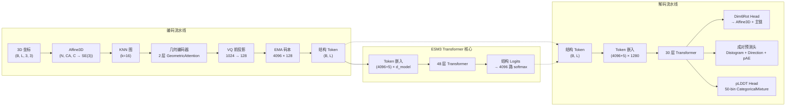

---
slug:11-vq-vae-structure-encoding
blog_type:normal
---


VQ-VAE（向量量化变分自编码器）结构编码流水线是 ESM3 将连续的 3D 蛋白质主链坐标转换为离散整数 token（以及反向转换）的机制。这种离散化是 ESM3 的 Transformer 核心能够将结构与序列、二级结构和功能并列，作为原生 token 轨道处理的基础，从而实现联合多模态生成。编码器将局部主链几何结构压缩为一个包含 128 维向量的 **4096 条目的码本**，而解码器则根据这些 token 以及置信度指标（pLDDT、pAE、pTM）重建完整的主链原子坐标。

来源：[vqvae.py](esm/models/vqvae.py#L1-L438), [esm3.py](esm/utils/constants/esm3.py#L13-L24)

## 架构概述

VQ-VAE 在架构上分为两个独立的网络——**StructureTokenEncoder** 和 **StructureTokenDecoder**——它们仅共享码本词表大小常量。这种分离是有意为之的：编码器在输入时运行一次，将坐标 token 化；而解码器在输出时运行一次，将生成的 token 转换回 3D 结构。这两个网络都不参与 ESM3 的主前向传播；相反，ESM3 纯粹通过嵌入表对生成的整数 token 进行操作。



来源：[vqvae.py](esm/models/vqvae.py#L179-L322), [vqvae.py](esm/models/vqvae.py#L325-L438), [esm3.py](esm/models/esm3.py#L61-L148)

## 编码器架构

**StructureTokenEncoder** 通过一个优先考虑**局部几何推理**而非全局序列上下文的多阶段流水线，将原始主链坐标转换为离散的结构 token。编码器的设计理念是：每个结构 token 应该捕获残基周围的局部邻域几何结构，而不是整个蛋白质的折叠拓扑结构。

### 预训练配置

| 参数 | 值 | 描述 |
|-----------|-------|-------------|
| `d_model` | 1024 | 内部嵌入维度 |
| `n_heads` | 1 | 标量注意力头（几何注意力占主导） |
| `v_heads` | 128 | 用于几何推理的向量注意力头 |
| `n_layers` | 2 | 几何编码器层数 |
| `d_out` | 128 | 码本向量维度 |
| `n_codes` | 4096 | 码本词表大小 |
| `knn` | 16 | K 近邻数量 |

来源：[pretrained.py](esm/pretrained.py#L24-L34)

### 坐标到仿射变换的转换

编码器首先将每个残基的三个主链原子（N、CA、C）转换为一个 **Affine3D** 刚体框架。该框架通过 Gram-Schmidt 正交化构建：CA 原子定义平移，CA→N 向量定义一个轴，CA→C 向量定义平面。具有无效或缺失坐标的残基会获得一个单位旋转，以及一个由蛋白质中所有有效残基的平均值计算得出的“黑洞”平移，从而防止几何注意力机制中出现数值崩溃。

来源：[affine3d.py](esm/utils/structure/affine3d.py#L512-L561), [affine3d.py](esm/utils/structure/affine3d.py#L417-L429)

### KNN 图构建与局部邻域编码

编码器没有在整个序列上应用全局注意力，而是使用 Cα 坐标在 3D 空间中构建了一个 **k 近邻图**（k=16）。这个设计选择至关重要：它意味着每个残基的 token 反映了其在空间上最近的 16 个邻居的几何排列，从而创建了一个**结构上局部但与序列无关**的感受野。在序列上相距甚远但在 3D 空间中相邻的两个残基将共享彼此的上下文。

编码过程在五个精确定义的步骤中进行：

1. **KNN 边发现**：对于 (B, L) 中的每个残基，在结构空间中找到 16 个最近邻 → (B, L, 16) 条边
2. **邻域重塑**：重塑为 (B×L, 16)，将每个局部邻域视为独立的微序列
3. **几何推理**：将每个邻域通过一个 2 层的 `GeometricEncoderStack`（一个仅使用 `GeometricReasoningOriginalImpl` 块且设置 `use_geom_attn=True, use_plain_attn=False` 的 `TransformerStack`），从而实现 16 帧邻域内的全对全通信
4. **查询提取**：提取每个邻域中索引为 0 的嵌入（查询节点本身，因为自距离为 0 且 KNN 结果已排序，因此保证其排在首位） → (B×L, d_model)
5. **重塑**：恢复为 (B, L, d_model)

几何 Transformer 的输入是根据残基索引计算的**相对位置嵌入**，bin 大小为 32（覆盖从 -32 到 +32 的相对位置）。尽管注意力拓扑是空间上的，但这为编码器提供了序列上下文。

来源：[vqvae.py](esm/models/vqvae.py#L193-L263), [vqvae.py](esm/models/vqvae.py#L265-L289)

### 基于 EMA 码本的向量量化

在几何编码器生成 (B, L, 1024) 维的嵌入后，线性投影会将其映射到码本维度（128）。然后，**EMACodebook** 使用欧几里得距离的平方在其 4096 个条目中执行最近邻查找：

```
distances = ||z||² - 2·z·E^T + ||E||²
encoding_indices = argmin(distances)
```

码本采用**直通估计器**进行梯度流动：前向传播使用码本中的量化向量，但梯度通过 `(embeddings - z).detach() + z` 绕过量化过程。大小为 `0.25 * MSE(z, embeddings.detach())` 的**承诺损失**鼓励编码器输出保持接近其分配的码本向量。

<CgxTip>当前代码库中的 EMA 码本更新被标记为 `assert False, "Not implemented"`——码本在推理期间是冻结的，完全依赖于其预训练状态。`_init_embeddings` 方法通过对第一批输入进行平铺和洗牌来执行一次性初始化，但此路径仅在 `self._need_init=True` 的初始训练期间处于活动状态。</CgxTip>

来源：[codebook.py](esm/layers/codebook.py#L8-L91), [vqvae.py](esm/models/vqvae.py#L291-L322)

## Token 词表与特殊 Token

结构 token 占据整数范围 `[0, 4099]`——即 4096 个码本条目加上 5 个特殊 token。`StructureTokenizer` 类提供了访问特殊 token ID 的便捷接口，但在字符串级别的 `encode`/`decode` 方法上会刻意引发 `NotImplementedError`，因为结构 token 是基于 3D 坐标而非字符序列定义的。

| Token | ID | 用途 |
|-------|----|---------|
| 码本条目 | 0–4095 | 量化的局部结构编码 |
| `MASK` | 4096 | 未知/隐藏结构（在生成期间使用） |
| `EOS` | 4097 | 序列边界结束 |
| `BOS` | 4098 | 序列边界开始 |
| `PAD` | 4099 | 可变长度批次的填充 |
| `CHAINBREAK` | 4100 | 多链蛋白质中链之间的分隔符 |
| `UNDEFINED` | 955 | 硬编码的未定义结构 token |

当 ESM3 为主 Transformer 嵌入结构 token 时，它使用一个 `nn.Embedding(4096 + 5, d_model)` 表，该表涵盖了包括特殊 token 在内的完整词表。

来源：[structure_tokenizer.py](esm/tokenization/structure_tokenizer.py#L1-L84), [esm3.py](esm/utils/constants/esm3.py#L13-L31), [esm3.py](esm/models/esm3.py#L79)

## 解码器架构

**StructureTokenDecoder** 是一个比编码器大得多的网络——一个 30 层、1280 维的 Transformer 堆栈，用于从离散 token 重建完整的主链几何结构。其规模反映了问题固有的不对称性：编码只需区分 4096 种结构类型，而解码必须高保真地恢复连续的 3D 坐标。

### 预训练配置

| 参数 | 值 | 描述 |
|-----------|-------|-------------|
| `d_model` | 1280 | 解码器隐藏维度 |
| `n_heads` | 20 | 标准注意力头 |
| `n_layers` | 30 | Transformer 层数（无几何注意力） |
| `scale_residue` | False | 解码器中无残基缩放 |

来源：[pretrained.py](esm/pretrained.py#L37-L45)

### 三个输出头

解码器从其最终隐藏状态产生三类输出：

**1. 主链结构头（Dim6RotStructureHead）**：该头使用 **6D 旋转表示**（两个通过 Gram-Schmidt 归一化和正交化的 3D 向量）预测每个残基的刚体变换，这已被证明是神经网络中最连续的旋转表示。该头通过一个 FFN → LayerNorm → 线性投影将隐藏状态投影到 9 + 14 维（3 个平移 + 6 个旋转 + 14 个扭转角）。平移按 10 倍因子缩放。然后，通过将预测的仿射变换应用于局部坐标系中的规范主链原子位置：N=(0.5256, 1.3612, 0.0000)，CA=(0, 0, 0)，C=(-1.5251, 0, 0)，来恢复主链原子坐标（N, CA, C）。

**2. 成对预测头**：生成一个 (B, L, L, K) 张量，其中 K=288 = 64（距离分布直方图 bin）+ 96（方向 bin：16×6）+ 64（预测对齐误差 bin）。该头首先对每个残基的嵌入进行降维投影，然后通过 `cat([q_i * k_j, q_i - k_j])` 构建成对特征，并通过一个 2 层 MLP 对其进行处理。

**3. pLDDT 头**：一个生成 50-bin logits 的 `RegressionHead`，被解释为 `CategoricalMixture` 分布，其均值提供每个残基的置信度分数。

来源：[vqvae.py](esm/models/vqvae.py#L325-L438), [structure_proj.py](esm/layers/structure_proj.py#L8-L63), [physics.py](esm/utils/constants/physics.py#L1-L5)

### 解码约束

解码器强制执行严格的 token 格式要求：结构 token 必须以 BOS token 开头并以 EOS token 结尾（在解码期间通过断言验证）。任何负值的 token 都将被拒绝。特殊 token（≥4096）通过 `aa_mask=~special_tokens_mask` 被排除在 pAE 计算之外。

来源：[vqvae.py](esm/models/vqvae.py#L380-L424)

## 编码与解码流水线

### 编码：坐标 → Token

`tokenize_structure` 函数编排了完整的编码流水线：

1. 将坐标转换为 `ProteinChain` 对象（使用 atom37 表示）
2. 调用 `chain.to_structure_encoder_inputs()` 准备（coordinates, plddt, residue_index）
3. 运行 `structure_encoder.encode(coordinates, residue_index=residue_index)` → 量化向量 + token 索引
4. 使用 BOS（索引 0）和 EOS（最后索引）特殊 token 填充 token 序列
5. 将坐标、pLDDT 和结构 token 作为元组返回

<CgxTip>具有掩码值的结构 token 永远不会被解码——`decode_protein_tensor` 函数会显式检查 `if torch.any(tokens == track_tokenizer.mask_token_id): setattr(input, track.name, None)`，从而短路整个结构解码路径。这意味着部分掩码的结构轨道会被视为完全缺失。</CgxTip>

来源：[encoding.py](esm/utils/encoding.py#L48-L97), [decoding.py](esm/utils/decoding.py#L31-L111)

### 解码：Token → 坐标

`decode_structure` 函数反转了该流水线：

1. 验证 BOS/EOS token 的位置
2. 运行 `structure_decoder.decode(structure_tokens)` → 包含 `bb_pred`、`plddt`、`ptm`、`predicted_aligned_error` 的字典
3. 提取主链坐标，去除 BOS/EOS 位置
4. 从主链原子坐标构建 `ProteinChain`，推断氧原子
5. 将 atom37 位置作为张量与 pLDDT、pTM 和 pAE 一起返回

来源：[decoding.py](esm/utils/decoding.py#L138-L169)

## 编码器中的几何注意力

编码器的 `GeometricEncoderStack` 是一个专用的 `TransformerStack`，其中每个块都**仅使用几何注意力**（`use_geom_attn=True, use_plain_attn=False`）。这是与 ESM3 主 Transformer 不同的模式，后者结合了标准和几何注意力。

几何注意力从两个 SE(3) 不变项计算注意力权重：**旋转项**（旋转变换后的查询和键的点积）和**距离项**（仿射变换后的查询和关键位置之间的欧几里得距离）。组合后的注意力权重为：

```
A_ij = rotation_term_weight · (q_rot_i · k_rot_j) / √3 
     - distance_term_weight · ||q_dist_i - k_dist_j|| / √3
```

两个权重因子都是通过 `softplus` 参数化标量在每个头中学习到的，允许不同的头专注于旋转或基于距离的几何推理。值被旋转（但不平移）到全局坐标系中，然后在注意力聚合后旋转回局部坐标系。

来源：[geom_attention.py](esm/layers/geom_attention.py#L9-L149), [vqvae.py](esm/models/vqvae.py#L142-L159)

## 与 ESM3 的集成

在 ESM3 模型中，结构 token 作为求和形成 Transformer 输入嵌入的八个输入轨道之一。`EncodeInputs` 模块通过 `nn.Embedding(4096 + 5, d_model)` 嵌入结构 token，并将它们直接添加到序列、pLDDT、二级结构、SASA、功能和残基注释嵌入中。在输出端，`OutputHeads` 模块通过 `RegressionHead(d_model, 4096)` 投影最终隐藏状态，以生成用于下一个 token 预测的结构 logits。

结构 token 会自动与序列级别的特殊 token 对齐：序列轨道中的 BOS、EOS、PAD 和 CHAINBREAK token 通过掩码填充操作，强制结构轨道中相应的特殊 token。任何未设置的结构 token（表示为 -1）都将替换为结构 MASK token。

来源：[esm3.py](esm/models/esm3.py#L61-L148), [esm3.py](esm/models/esm3.py#L343-L359)

## 模块参考

| 模块 | 文件 | 作用 |
|--------|------|------|
| `StructureTokenEncoder` | [vqvae.py](esm/models/vqvae.py#L179-L322) | 通过几何编码器 + VQ 将坐标 → 离散 token |
| `StructureTokenDecoder` | [vqvae.py](esm/models/vqvae.py#L325-L438) | 通过 30 层 Transformer 将 token → 坐标 + 置信度 |
| `EMACodebook` | [codebook.py](esm/layers/codebook.py#L8-L91) | 带有直通梯度的 4096 条目向量量化 |
| `Dim6RotStructureHead` | [structure_proj.py](esm/layers/structure_proj.py#L8-L63) | 隐藏状态 → SE(3) 仿射变换 + 主链原子 |
| `GeometricEncoderStack` | [vqvae.py](esm/models/vqvae.py#L142-L159) | 用于局部结构编码的 2 层纯几何 Transformer |
| `PairwisePredictionHead` | [vqvae.py](esm/models/vqvae.py#L52-L95) | 成对距离分布、方向和 pAE 预测 |
| `CategoricalMixture` | [vqvae.py](esm/models/vqvae.py#L114-L139) | 用于 pLDDT 解码的分箱混合分布 |
| `StructureTokenizer` | [structure_tokenizer.py](esm/tokenization/structure_tokenizer.py#L5-L84) | 特殊 token ID 访问器（无字符串编码/解码） |
| `RelativePositionEmbedding` | [vqvae.py](esm/models/vqvae.py#L17-L49) | 分箱相对位置编码（±32 个残基） |

## 后续步骤

VQ-VAE 是 ESM3 多轨道 token 化系统的一个组件。要了解结构 token 如何与其他模态交互以及 Transformer 如何处理它们：

- **[Geometric Attention and SE(3) Invariance](13-geometric-attention-and-se-3-invariance)** — 深入探讨 VQ-VAE 编码器和 ESM3 主 Transformer 中使用的几何注意力机制
- **[Function and Residue Annotation Tokens](12-function-and-residue-annotation-tokens)** — 功能注释如何与结构一起进行 token 化
- **[Encode-Decode Pipeline](22-encode-decode-pipeline)** — 编码原始蛋白质数据和解码模型输出的端到端演练