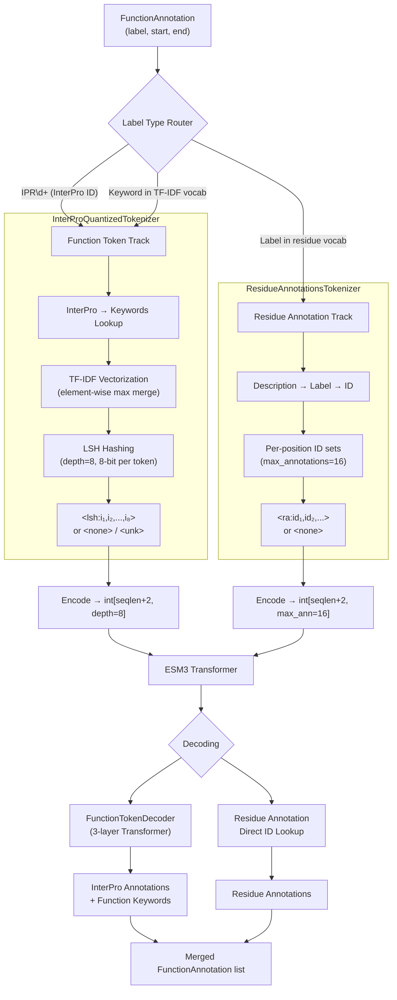
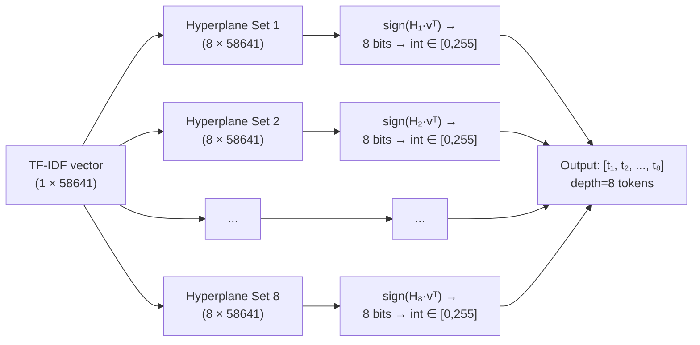
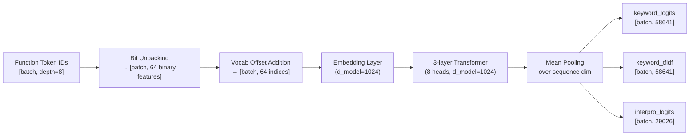

---
slug:12-function-and-residue-annotation-tokens
blog_type:normal
---


ESM3 并非将蛋白质功能表示为单一的整块标签，而是通过**两条并行的分词轨道**在不同粒度上捕捉功能：**InterProQuantizedTokenizer** 将 InterPro 结构域注释和自由文本功能关键词压缩为多 token 的 LSH 哈希值，而 **ResidueAnnotationsTokenizer** 则将特定位点的残基级描述符映射为固定词表的分类编码。这两条轨道共同构成了 ESM3 多模态输入的功能注释模态，使模型能够在统一的 token 框架内，同时对结构域级别的功能区域和逐残基的功能位点进行推理。

来源：[function_tokenizer.py](esm/tokenization/function_tokenizer.py#L29-L35), [residue_tokenizer.py](esm/tokenization/residue_tokenizer.py#L15-L16), [tokenizer_base.py](esm/tokenization/tokenizer_base.py#L1-L26)

## 架构概述

功能注释管道采用双轨设计：两个分词器均接受 `FunctionAnnotation` 对象（包含从 1 开始索引的闭区间起始/结束位置的标签），将范围注释展开为位置标签集，并输出逐位置的 token 字符串。随后，这些字符串被编码为不同秩的整数张量——功能 token 为 **depth × sequence_length**，残基注释为 **max_annotations × sequence_length**——然后作为独立的输入轨道被送入 ESM3 的 Transformer 堆栈。



按类型拆分注释的路由器位于 `encode_function_annotations` 中，它会根据三个注册表检查每个 `FunctionAnnotation.label`：InterPro 索引、TF-IDF 关键词词表以及残基注释标签集。不匹配其中任何一项的注释将引发 `ValueError`。

来源：[encode_decode.py](esm/utils/function/encode_decode.py#L13-L51), [__init__.py](esm/tokenization/__init__.py#L24-L31), [types.py](esm/utils/types.py#L14-L27)

## FunctionAnnotation 数据模型

两条分词轨道共享同一种输入类型——`FunctionAnnotation`，它是一个冻结的数据类，表示蛋白质序列上带有标签的范围。其字段采用**从 1 开始索引的闭区间**坐标，与生物学惯例保持一致。

| 字段 | 类型 | 描述 |
|-------|------|------|
| `label` | `str` | InterPro ID（如 `IPR000006`）、功能关键词或残基注释描述符 |
| `start` | `int` | 起始位置，从 1 开始索引的闭区间 |
| `end` | `int` | 结束位置，从 1 开始索引的闭区间 |

`__len__` 方法返回 `end - start + 1`，使得在解码时按最小长度过滤注释变得直观简便。

来源：[types.py](esm/utils/types.py#L14-L33)

## InterProQuantizedTokenizer：TF-IDF → LSH 管道

`InterProQuantizedTokenizer` 是两个分词器中架构更为复杂的一个。它解决了一个基本的表示问题：InterPro 注释和自由文本功能关键词构成了一个庞大且稀疏的标签空间（29,026 个 InterPro 条目，58,641 个关键词），无法直接分词为紧凑的词表。因此，它通过 **TF-IDF → 局部敏感哈希 (LSH)** 管道对该空间进行投影，在每个序列位置生成固定深度的多 token 表示。

### 第 1 步：范围展开为位置标签集

`tokenize` 方法首先将范围注释展开为逐位置的标签集。对于 `FunctionAnnotation(label="IPR000006", start=10, end=50)`，从 9 到 49 的每个位置（0 索引）都会在其标签集中接收到 `"IPR000006"`。没有注释的位置接收 `<none>` 哨兵词。哈希失败的位置（TF-IDF 向量为空）接收 `<unk>`。

<CgxTip>在蛋白质序列的长片段上，注释往往具有重复性。该分词器通过以 `frozenset(labels)` 为键的 `functools.cache` 缓存哈希计算，因此不同位置上的相同标签组合共享同一次 LSH 计算。这对于具有长保守结构域的蛋白质而言，是一项重大的性能优化。</CgxTip>

来源：[function_tokenizer.py](esm/tokenization/function_tokenizer.py#L147-L204)

### 第 2 步：标签解析与 TF-IDF 编码

每个位置的标签集由 `_function_text_hash` 处理，该函数将标签拆分为 InterPro ID 和关键词。InterPro ID 通过 `interpro2keywords` 映射进行解析——这是一个由 CSV 支持的字典，将每个 InterPro 条目展开为其关联的关键词列表。随后，来自所有来源的关键词被编码为一个单一的 TF-IDF 向量。

此处关键的设计选择是**逐元素最大值**合并策略：当多个 InterPro 标签贡献 TF-IDF 向量时，它们通过 `vec.maximum(vec_)` 而非加法进行组合。这防止了一簇相似的标签“冲淡”单个独特标签的信号，从而保留了 LSH 投影中的判别能力。

| 合并策略 | 行为 | 未采用原因 |
|----------------|----------|--------------|
| 逐元素最大值 | 获取每个关键词维度上较强的信号 | — **（已选）** |
| 加法 | 跨标签累积信号 | 相似标签会放大噪声 |
| 平均 | 均匀分布信号 | 稀释了独特特征 |

TF-IDF 模型本身使用由逆文档频率加权的次线性词频（`1 + log(tf)`），并进行 L2 归一化——与 `sklearn` 的 `TfidfVectorizer(sublinear_tf=True)` 惯例相匹配。

来源：[function_tokenizer.py](esm/tokenization/function_tokenizer.py#L206-L247), [tfidf.py](esm/utils/function/tfidf.py#L13-L54)

### 第 3 步：局部敏感哈希

归一化后的 TF-IDF 向量通过 `LSHTokenized` 模块进行投影，该模块应用 **8 个独立的哈希表**（由 `depth=8` 控制），每个哈希表生成一个 8 位的 token。每个 `LSHTable` 跨 `n_bits` 个随机超平面计算 `sign(hyperplane @ vec.T)`，然后通过 `bits.T @ (1 << arange(n_bits))` 将结果位打包成整数 token。最终结果是一个包含 `depth` 个整数的向量，每个整数在 `[0, 256)` 范围内。



这些超平面**并非在运行时随机初始化**——它们从预计算的 `.npz` 文件（`data/hyperplanes_8bit_58641.npz`）中加载，以确保跨运行以及训练和推理之间的确定性分词。如果缺少此文件且 `allow_create_hyperplanes` 为 `False`，`LSHTokenized` 构造函数将引发 `FileNotFoundError`。

<CgxTip>LSH 的设计意味着语义相似的功能注释（那些共享许多关键词的注释）会哈希到相似的 token 序列，而不相似的注释则会发散。这种局部保留特性对于模型在功能空间上的泛化能力至关重要——它可以在 LSH token 空间中学习平滑的决策边界，而不是记忆稀疏的独热标签。</CgxTip>

来源：[lsh.py](esm/utils/function/lsh.py#L7-L72), [function_tokenizer.py](esm/tokenization/function_tokenizer.py#L82-L90), [esm3.py](esm/utils/constants/esm3.py#L122-L122)

### 词表结构

功能 token 的词表被构建为包含三个区域的平铺列表：

| 区域 | Token | 数量 | 索引范围 |
|--------|--------|-------|-------------|
| 特殊 token | `<pad>`, `<motif>`, `<unk>` | 3 | 0–2 |
| None 哨兵词 | `<none>` | 1 | 3 |
| LSH token | `<lsh:0>` 至 `<lsh:255>` | 256 | 4–259 |

词表总大小为 **260**（3 个特殊 token + 1 个 none + 256 个 LSH）。`_lsh_token_vocab_offset` 为 4，意味着编码为 token ID 时，LSH 整数值会加上此偏移量。序列位置上的一个 `<lsh:5,12,200,1,88,45,3,99>` token 会被编码为长度为 8 的整数向量 `[9, 16, 204, 5, 92, 49, 7, 103]`（每个 LSH 值 +4 偏移量）。

来源：[function_tokenizer.py](esm/tokenization/function_tokenizer.py#L126-L139), [function_tokenizer.py](esm/tokenization/function_tokenizer.py#L281-L292)

### 关键词丢弃

在训练期间，分词器通过 `p_keyword_dropout` 参数支持**关键词丢弃**。当该值不为零时，会在哈希处理之前将一个随机二进制掩码应用于 TF-IDF 向量的关键词维度：`vec.data *= 1 - np.take(keyword_mask, vec.indices)`。这作为一种正则化策略，强制模型不过度依赖任何特定的关键词子集来进行功能预测。

来源：[function_tokenizer.py](esm/tokenization/function_tokenizer.py#L151-L188), [function_tokenizer.py](esm/tokenization/function_tokenizer.py#L241-L243)

### 从 InterPro 文本中提取关键词

`_keywords_from_text` 辅助函数将 InterPro/GO 自由文本描述转换为词袋 n-gram（一元组和二元组）。文本首先按 `", "` 分割，然后进行清理（小写化、移除标点符号、将连字符替换为空格），最后分解为单个单词和连续的单词对。经过精选的 `_EXCLUDED_TERMS` 集合会过滤掉普遍但缺乏信息量的术语，如 `"binding domain"`、`"molecular function"` 和 `"cellular component"`。

来源：[function_tokenizer.py](esm/tokenization/function_tokenizer.py#L368-L429)

## ResidueAnnotationsTokenizer：直接分类编码

`ResidueAnnotationsTokenizer` 采用了一种根本不同的方法。它不使用哈希，而是维护一个从 CSV 文件加载的残基级注释标签的**直接分类词表**。每个唯一的标签（通过 `label_clean` 去重后）成为词表中的一个 `<ra:id>` token，并按频率降序排列。

### 词表结构

| 区域 | Token | 描述 |
|--------|--------|------|
| 特殊 token | `<pad>`, `<motif>`, `<unk>` | 控制词元（索引 0–2） |
| None 哨兵词 | `<none>` | 此位置无注释（索引 3） |
| 注释 token | `<ra:id>` | 每个唯一的清理后标签对应一个（索引 4+） |

注释区域的偏移量为 `len(special_tokens) + 1 = 4`。`vocabulary` 属性返回人类可读的标签字符串而非 `<ra:id>` token 字符串，提供了从词表索引到描述性名称的查找。

来源：[residue_tokenizer.py](esm/tokenization/residue_tokenizer.py#L41-L68)

### 多注释编码

与功能 token 在哈希之前通过 TF-IDF 合并位置上的多个标签不同，残基注释保留了每个位置的**多个同时存在的标签**。分词器将所有注释 ID 收集到每个位置的集合中，然后将它们编码为形状为 `[seqlen, max_annotations]` 的固定宽度张量，其中 `max_annotations = 16`。ID 左对齐，如果某个位置的注释少于 16 个，则用 `<pad>` 填充。

`tokenize` 方法通过包含 `interpro_site_descriptions`、`interpro_site_starts`、`interpro_site_ends` 和 `interpro_site_residues` 的 `Sample` 字典接收输入。它会验证残基标识是否与参考序列匹配，一旦出现不匹配，就返回完整的 `<pad>` 序列——这实际上将该样本标记为未注释，而不是引入错误。

来源：[residue_tokenizer.py](esm/tokenization/residue_tokenizer.py#L73-L183), [esm3.py](esm/utils/constants/esm3.py#L92-L92)

## 编码：从 Token 到张量

两个分词器均遵循 `EsmTokenizerBase` 协议，该协议强制要求 `encode` 和 `decode` 方法以及特殊 token 属性。编码步骤将字符串 token 列表转换为适合模型输入的整数张量。

### 功能 Token 编码

`InterProQuantizedTokenizer.encode` 方法生成形状为 `[seqlen, depth]` 的张量，其中 `depth = 8`。当 `add_special_tokens=True` 时，会在前后添加填充了 `<pad>` ID 的 BOS 和 EOS 行，生成 `[seqlen+2, 8]`。`batch_encode` 方法通过右填充堆叠来处理可变长度的序列。

### 残基注释编码

`ResidueAnnotationsTokenizer.encode` 方法生成形状为 `[seqlen, max_annotations]` 的张量，其中 `max_annotations = 16`。像 `<ra:5,12,45>` 这样的多 ID token 会被拆分为单独的 ID 并放入注释槽中，截断至 16 个条目。添加特殊 token 后，输出形状变为 `[seqlen+2, 16]`。

| 属性 | 功能 Token | 残基注释 |
|----------|----------------|-------------------|
| 输出秩 | 2D | 2D |
| 形状（无特殊 token） | `[seqlen, 8]` | `[seqlen, 16]` |
| 形状（含特殊 token） | `[seqlen+2, 8]` | `[seqlen+2, 16]` |
| 多标签策略 | LSH 哈希（有损） | ID 列表（无损） |
| 词表大小 | 260 | 可变（特殊 + none + 标签） |
| 掩码 token | `<pad>` | `<pad>` |
| BOS/EOS token | `<pad>` | `<pad>` |

请注意，两个分词器都使用 `<pad>` 作为 BOS、EOS、掩码和链断裂 token——功能和残基注释轨道不使用专用的边界 token。

来源：[function_tokenizer.py](esm/tokenization/function_tokenizer.py#L249-L311), [residue_tokenizer.py](esm/tokenization/residue_tokenizer.py#L167-L183), [encoding.py](esm/utils/encoding.py#L206-L229)

## 解码：从模型输出到注释

两条轨道的解码在架构上是不对称的。功能 token 需要一个学习得的 **FunctionTokenDecoder**（一个带有分类头的 3 层 Transformer），而残基注释则通过直接的 ID 查找进行解码。

### FunctionTokenDecoder

`FunctionTokenDecoder` 是一个独立的 Transformer 模块，它接收编码后的功能 token ID 并产生三个输出头：

| 输出头 | 输出形状 | 目的 |
|------|-------------|------|
| `keyword_logits` | `[batch, 58641]` | 功能关键词的二分类 |
| `keyword_tfidf` | `[batch, 58641]` | 每个关键词的 TF-IDF 值回归 |
| `interpro_logits` | `[batch, 29026]` | InterPro 注释的二分类 |

解码器首先将 LSH token 解包为单独的位。每个 8 位 token 通过与 `1 << bit_position` 进行按位与操作分解为 8 个二进制值，产生 `depth × bits_per_token = 64` 个二进制特征。这些特征被偏移到不重叠的词表范围中（每个位获得一个 2 元素的词表：0 或 1 加上偏移量），以便每个位-位置对接收一个独特的嵌入。这种**位级解包**确保了解码器能够学习每个 LSH token 内位置感知的表示。



在解码过程中，经过 sigmoid 激活的预测会被阈值化（InterPro 默认 `annotation_threshold=0.1`，关键词默认 `keywords_threshold=0.5`），过滤为仅包含实际功能 token 的位置（而非 `<pad>`、`<none>` 或 `<unk>`），然后转换为 `FunctionAnnotation` 对象。具有相同标签的相邻位置通过 `merge_annotations` 合并，并具有可配置的间隔容忍度（`annotation_gap_merge_max=3`），短于 `annotation_min_length=5` 的注释将被丢弃。

来源：[function_decoder.py](esm/models/function_decoder.py#L54-L176), [function_decoder.py](esm/models/function_decoder.py#L182-L282)

### 残基注释解码

残基注释解码要简单得多：`decode_residue_annotation_tokens` 函数遍历 16 个注释深度槽中的每一个，找到非零 token ID，并从 `residue_annotations_tokenizer.vocabulary` 中查找相应的标签。相邻相同标签的位置被合并，使用与功能 token 相同的 `merge_annotations` 和长度阈值逻辑过滤短注释。

值得注意的是，`ResidueAnnotationsTokenizer.decode` 方法会引发 `NotImplementedError` 并重定向至该工具函数，强制要求解码必须通过专用管道而非分词器本身进行。

来源：[encode_decode.py](esm/utils/function/encode_decode.py#L136-L181), [residue_tokenizer.py](esm/tokenization/residue_tokenizer.py#L185-L188)

### SDK 中的统一解码

SDK 中的顶级 `decode_protein_tensor` 函数合并了两条轨道：它为功能 token 轨道调用 `decode_function_annotations`，为残基注释轨道调用 `decode_residue_annotations`，然后将生成的 `FunctionAnnotation` 列表拼接至输出 `ESMProtein` 的单个 `function_annotations` 字段中。

来源：[decoding.py](esm/utils/decoding.py#L31-L111), [decoding.py](esm/utils/decoding.py#L206-L233)

## InterPro 本体接口

两个分词器都依赖于 `InterPro` 工具类，该类提供了对 InterPro 数据库的结构化访问。它加载一个 TSV 格式的条目列表（包含 `ENTRY_AC`、`ENTRY_TYPE`、`ENTRY_NAME` 列），从父子树文件构建一个 `networkx.DiGraph` 层级结构，并可选地通过 InterPro2GO 文件将 InterPro ID 映射到 GO 术语。

| InterProEntryType | 描述 | 大致数量 |
|-------------------|-------------|-------------------|
| `ACTIVE_SITE` | 催化或结合活性位点 | 133 |
| `BINDING_SITE` | 配体结合位点 | 75 |
| `CONSERVED_SITE` | 进化保守位点 | 728 |
| `DOMAIN` | 结构/功能域 | 14,053 |
| `FAMILY` | 蛋白质家族 | 21,942 |
| `HOMOLOGOUS_SUPERFAMILY` | 同源超家族 | 3,446 |
| `PTM` | 翻译后修饰 | 17 |
| `REPEAT` | 重复序列模体 | 374 |

层级图解析自一种基于缩进的自定义格式，其中每一级的 `--` 前缀表示树的深度，从而实现对 InterPro 父子关系的遍历。

来源：[interpro.py](esm/utils/function/interpro.py#L57-L178), [esm3.py](esm/utils/constants/esm3.py#L115-L130)

## 数据资产与常量

功能和残基注释分词器依赖于随代码库发布的几个预计算数据文件：

| 文件 | 用途 | 大小指标 |
|------|---------|---------------|
| `entry_list_safety_29026.list` | InterPro 条目目录 (TSV) | 29,026 个条目 |
| `keyword_vocabulary_safety_filtered_58641.txt` | 功能关键词词表 (按行分隔) | 58,641 个术语 |
| `keyword_idf_safety_filtered_58641.npy` | 每个关键词的 IDF 权重 | 58,641 个值 |
| `interpro_29026_to_keywords_58641.csv` | InterPro → 关键词映射 | 29,026 行 |
| `ParentChildTreeFile.txt` | InterPro 层级树 | 完整分类法 |
| `hyperplanes_8bit_58641.npz` | 预计算的 LSH 超平面 | 8 个表 × (8 × 58641) |

`_safety_filtered` 后缀表示这些词表已经过精选，移除了潜在有问题的条目。当未在内部基础设施中运行时，`data_root` 函数通过从 HuggingFace (`EvolutionaryScale/esm3-sm-open-v1`) 下载来解析路径。

来源：[esm3.py](esm/utils/constants/esm3.py#L95-L131)

## 分词器集成：TokenizerCollection

两个分词器在 `TokenizerCollection` 数据类中一同实例化，该数据类聚合了所有六个 ESM3 分词器。`get_esm3_model_tokenizers` 工厂函数使用默认参数创建它们，确保整个管道的配置一致。

```python
TokenizerCollection(
    function=InterProQuantizedTokenizer(),         # depth=8, lsh_bits=8
    residue_annotations=ResidueAnnotationsTokenizer(),  # max_annotations=16
    # ... 加上序列、结构、ss、sasa 分词器
)
```

来源：[__init__.py](esm/tokenization/__init__.py#L24-L46)

## 对比：功能 Token vs. 残基注释

| 维度 | 功能 Token | 残基注释 |
|-----------|----------------|-------------------|
| **输入范围** | InterPro 域 + 自由文本关键词 | 位点级残基描述符 |
| **编码策略** | 有损：TF-IDF → LSH 压缩 | 无损：直接分类 ID |
| **多标签处理** | 合并为单一哈希 | 保留为 ID 列表（最多 16 个） |
| **词表类型** | 固定（256 个 LSH + 4 个特殊） | 可变（取决于 CSV 中的标签数量） |
| **输出张量形状** | `[L+2, 8]` | `[L+2, 16]` |
| **解码要求** | 学习得的 3 层 Transformer 解码器 | 直接表查找 |
| **解码输出** | InterPro 标签 + 关键词范围 | 残基描述符范围 |
| **局部性保留** | 是（LSH 保留相似性） | 否（任意 ID 分配） |
| **关键词丢弃** | 支持（训练正则化） | 不适用 |
| **典型注释尺度** | 域/家族级别（跨越多个残基） | 位点级别（1 至少数几个残基） |

这种双轨设计反映了一种深思熟虑的架构权衡：功能 token 牺牲了精确的标签恢复能力，以换取可压缩性和局部性保留，使模型能够在功能空间上学习平滑的表示。残基注释保留了精确的标签，但缺乏 LSH 提供的语义平滑，使其更适合精确的位点级预测。

来源：[function_tokenizer.py](esm/tokenization/function_tokenizer.py#L29-L366), [residue_tokenizer.py](esm/tokenization/residue_tokenizer.py#L15-L237)

## 后续步骤

- 要了解这些 token 张量如何流经 ESM3 的几何注意力层，请参阅 [Geometric Attention and SE(3) Invariance](13-geometric-attention-and-se-3-invariance)。
- 对于输入到同一 Transformer 的其他分词轨道，请参阅 [Sequence and Structure Tokenizers](10-sequence-and-structure-tokenizers) 和 [VQ-VAE Structure Encoding](11-vq-vae-structure-encoding)。
- 要了解协调所有分词器的完整编码/解码管道，请参阅 [Encode-Decode Pipeline](22-encode-decode-pipeline)。