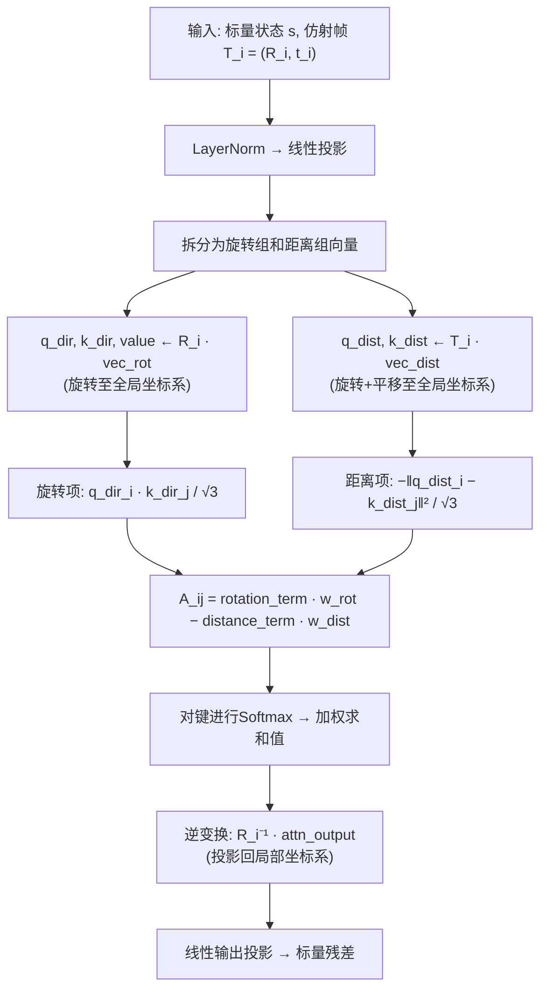
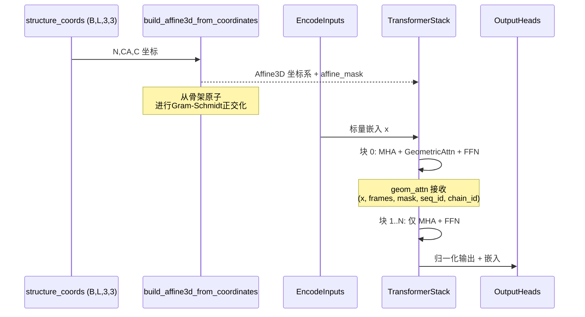

---
slug:13-geometric-attention-and-se-3-invariance
blog_type:normal
---


ESM3突出的架构创新是其**几何注意力**（geometric attention）机制——一种结构感知的注意力层，它直接在3D刚体帧（仿射变换）上运算，而不是将结构视为扁平的坐标序列。该机制是ESM3能够对序列和结构进行联合推理的关键：它从旋转不变的方向信号和SE(3)不变的距离信号中计算注意力得分，然后在注意力图上传播向量值消息，同时保持对每个残基局部坐标系等变的特性。其结果是一种注意力机制，其输出被证明在整个输入结构同时旋转和平移下是不变的——这正是SE(3)不变性的定义特征。

来源: [geom_attention.py](/esm/layers/geom_attention.py#L9-L31), [affine3d.py](/esm/utils/structure/affine3d.py#L270-L276)

## 从骨架原子到局部坐标系

每一次几何注意力计算都始于从残基的骨架原子（N, CA, C）构建**局部刚体坐标系**。函数 `build_affine3d_from_coordinates` 接收形状为 `(B, L, 3, 3)` 的坐标，并生成一个 `Affine3D` 对象——一个包含3D平移向量和旋转的配对——以及一个指示哪些残基具有有效坐标的布尔掩码。

坐标系的构建采用了与AlphaFold2约定一致的Gram-Schmidt正交化过程：CA原子定义原点，C→CA向量定义第一轴，N原子（投影到平面上）定义第二轴。缺失或无效坐标的残基会接收一个**“黑洞”仿射变换**——一个以所有有效原子平均位置为中心的单位旋转——而不是零旋转，后者会导致距离/方向注意力计算发生灾难性坍缩。这一设计选择至关重要：零旋转矩阵会将所有的查询/键向量映射到原点，从而产生退化的注意力模式。

来源: [affine3d.py](/esm/utils/structure/affine3d.py#L512-L560), [affine3d.py](/esm/utils/structure/affine3d.py#L417-L429)

## Affine3D代数

`Affine3D` 数据类是支撑几何注意力的基础代数对象。它封装了一个刚体变换 T = (R, t)，其中 R 是旋转，t 是平移，支持两种旋转表示——`RotationMatrix`（3×3矩阵，12元素扁平张量）和 `RotationQuat`（四元数，4元素张量）。几何注意力所依赖的核心运算如下：

| 运算 | 公式 | 几何含义 |
|---|---|---|
| `apply(p)` | R·p + t | 将点p从局部坐标系变换到全局坐标系 |
| `rot.apply(p)` | R·p | 旋转向量p（无平移） |
| `invert()` | (R^T, -R^T·t) | 逆变换（全局 → 局部） |
| `compose(other)` | R₁·R₂, R₁·t₂ + t₁ | 顺序组合变换 |

`apply`（旋转 + 平移）与 `rot.apply`（仅旋转）之间的区别，是几何注意力分离**方向**信息与**位置**信息的核心机制——这一区分直接映射到了注意力得分中的两项。

来源: [affine3d.py](/esm/utils/structure/affine3d.py#L348-L384), [affine3d.py](/esm/utils/structure/affine3d.py#L86-L178)

## 几何注意力机制

`GeometricReasoningOriginalImpl` 模块通过精确的数学公式实现了几何注意力。该模块文档字符串中的伪代码抓住了其本质：

```
ATTN(A, v) := (softmax_j A_ij) v_j
make_rot_vectors(x) := R(i→g) Linear(x).reshape(..., 3)    # 仅旋转
make_vectors(x)    := T(i→g) Linear(x).reshape(..., 3)    # 旋转 + 平移

v       ← make_rot_vectors(x)
q_dir, k_dir ← make_rot_vectors(x)
q_dist, k_dist ← make_vectors(x)

A_ij    ← dot(q_dir_i, k_dir_j) − ||q_dist_i − k_dist_j||²
x       ← x + Linear(T(g→i) ATTN(A, v))
```

该机制分为四个阶段进行：



**阶段1 — 投影**：输入的标量状态 `s` 经过层归一化，并通过单个线性层投影到高维空间，随后被分为两组。旋转组（`vec_rot`）包含用于方向项的查询、键和值——这些是每个注意力头对应的3D向量，将*仅被旋转*至全局坐标系。距离组（`vec_dist`）包含用于位置项的查询和键——这些将*被旋转和平移*至全局坐标系。

**阶段2 — 坐标系变换**：旋转组向量通过 `affine.rot.apply()`（仅旋转）进行变换，而距离组向量通过 `affine.apply()`（旋转 + 平移）进行变换。这种分离是实现SE(3)不变性的架构关键：旋转项仅取决于局部坐标系彼此之间的*朝向*，而距离项取决于残基在3D空间中的*位置*。

**阶段3 — 注意力评分**：残基 i 对残基 j 的注意力对数计算如下：

**A_ij = w_rot · (q_dir_i · k_dir_j) / √3 − w_dist · ‖q_dist_i − k_dist_j‖² / √3**

第一项是方向向量的点积（偏好一致的朝向），第二项是负平方距离（偏好空间邻近性）。每个头的可学习参数 `distance_scale_per_head` 和 `rotation_scale_per_head`——初始化为零并通过softplus函数处理——允许网络独立地校准每个注意力头中方向信息与位置信息的相对重要性。√3 归一化因子考虑了3D向量空间的维度。

**阶段4 — 逆变换与输出**：经注意力加权的值（属于全局坐标系中的向量）通过 `affine.rot.invert().apply()` 变换回每个残基的局部坐标系，然后展平并通过线性层投影，产生一个标量残差，添加到输入状态中。

<CgxTip>值被旋转但*未平移*至全局坐标系（`affine.rot.apply`），这意味着它们仅携带朝向信息。随后的逆旋转将它们投影回局部坐标系，确保输出仅取决于残基之间的*相对*朝向——而不依赖于空间中的绝对位置或朝向。</CgxTip>

来源: [geom_attention.py](/esm/layers/geom_attention.py#L9-L149), [affine3d.py](/esm/utils/structure/affine3d.py#L379-L384)

## 为什么这是SE(3)不变的

SE(3)是特殊欧几里得群——即3D空间中所有刚体变换（旋转 + 平移）的群。如果一种注意力机制的标量输出在整个输入结构同时旋转和平移时保持不变，则该机制是SE(3)不变的。几何注意力机制通过两个独立的不变性论证实现了这一点：

**旋转项不变性**：在对所有坐标系施加全局旋转 R_g 时，每个局部旋转 R_i 变为 R_g · R_i。查询和键的方向向量变换为 (R_g · R_i) · q_dir_i。其点积 (R_g · R_i · q_dir_i) · (R_g · R_j · k_dir_j) = q_dir_i^T · R_i^T · R_g^T · R_g · R_j · k_dir_j = q_dir_i^T · R_i^T · R_j · k_dir_j，该结果与 R_g 无关，因为 R_g^T · R_g = I。

**距离项不变性**：在全局变换 (R_g, t_g) 下，每个坐标系 T_i 变为 T_g ∘ T_i。距离组向量变换为 R_g · R_i · q_dist_i + (R_g · t_i + t_g)。其平方距离 ‖(R_g · R_i · q_dist_i + R_g · t_i + t_g) − (R_g · R_j · k_dist_j + R_g · t_j + t_g)‖² = ‖R_g · (R_i · q_dist_i + t_i − R_j · k_dist_j − t_j)‖² = ‖R_i · q_dist_i + t_i − R_j · k_dist_j − t_j‖²，该结果与 (R_g, t_g) 无关，因为旋转保持范数不变。

**输出不变性**：由于注意力权重 A_ij 是SE(3)不变的，全局坐标系中的注意力输出是SE(3)等变的（随结构一起旋转）。最终的逆旋转 R_i^T 将其投影回局部坐标系，产生仅依赖于相对几何的输出——使得整体残差具备SE(3)不变性。

<CgxTip>注意力*偏置*（源自 sequence_id 和 chain_id 掩码）在构造上也是SE(3)不变的，因为它仅依赖于离散的标记身份，而不依赖于坐标。这意味着完整的注意力计算——包括用于填充、装箱和链分离的掩码——端到端地维持了不变性保证。</CgxTip>

来源: [geom_attention.py](/esm/layers/geom_attention.py#L52-L63), [geom_attention.py](/esm/layers/geom_attention.py#L103-L128)

## 集成到Transformer堆栈中

几何注意力并没有取代标准的多头注意力——而是对其进行了*增强*。`UnifiedTransformerBlock` 包含按顺序应用的三个并行子层：(1) 带有旋转嵌入的标准多头注意力，(2) 几何注意力（如果启用），(3) SwiGLU前馈网络。每个子层产生一个残差，添加到输入中，并由与 √(n_layers / 36) 成正比的 `residue_scaling_factor` 进行缩放，以实现深度方向的归一化。

`TransformerStack` 通过 `n_layers_geom` 参数控制哪些层接收几何注意力。堆栈中只有**前** `n_layers_geom` 个块被配置为 `use_geom_attn=True`，而所有块始终包含标准注意力。这一设计反映了一个观察结果：几何归纳偏置在早期层中最有价值，在这些层中，局部结构模式必须在整个序列中快速传递，而更深的层则可以依赖标准注意力机制来细化学习到的表示。

| 参数 | 作用 | ESM3 Open Small 中的默认值 |
|---|---|---|
| `v_heads` | 几何注意力头数 | 根据模型变体配置 |
| `n_layers_geom` | 包含几何注意力的初始块数量 | 1（仅第一个块） |
| `mask_and_zero_frameless` | 将缺乏有效坐标系的残基输出置零 | `True` |
| `distance_scale_per_head` | 距离项的每头可学习权重 | 初始化为0（softplus → ~0.69） |
| `rotation_scale_per_head` | 旋转项的每头可学习权重 | 初始化为0（softplus → ~0.69） |

来源: [transformer_stack.py](/esm/layers/transformer_stack.py#L10-L62), [blocks.py](/esm/layers/blocks.py#L51-L157), [geom_attention.py](/esm/layers/geom_attention.py#L46-L50)

## 注意力掩码与链分离

几何注意力结合了三种不同的掩码机制，它们协同工作以防止信息泄漏，同时保持SE(3)不变性：

**序列ID掩码**确保同一批次中来自不同打包序列的标记无法相互关注——这是高效装箱的必要条件。**链ID掩码**阻止多链蛋白质复合物中的跨链注意力，强制几何消息仅在单条多肽链内传播。**仿射掩码**（通过 `affine_mask`）防止注意力关注缺乏有效结构坐标的残基，将其注意力对数替换为 `-inf` 以产生零注意力权重。

`mask_and_zero_frameless` 标志提供了一种额外的安全机制：在计算注意力输出并进行逆变换后，任何缺乏有效仿射坐标系的位置都会被显式置零。这防止了任何虚假信号从几何计算未定义的残基中传播出去。

来源: [geom_attention.py](/esm/layers/geom_attention.py#L52-L63), [geom_attention.py](/esm/layers/geom_attention.py#L145-L148)

## 对比：标准注意力 vs. 几何注意力

| 方面 | 标准多头注意力 | 几何注意力 |
|---|---|---|
| **输入模态** | 标量标记嵌入 | 标量嵌入 + 3D仿射坐标系 |
| **位置编码** | 旋转嵌入（序列相对） | 内在3D几何（旋转 + 距离） |
| **评分函数** | q·k / √d | w_rot·(q_dir·k_dir)/√3 − w_dist·‖q_dist−k_dist‖²/√3 |
| **值类型** | 标量向量（d_head维） | 每个头的3D向量消息 |
| **SE(3)不变性** | 不适用（无几何） | 由构造证明 |
| **链感知** | 通过 sequence_id 掩码 | 通过 chain_id + sequence_id + affine_mask |
| **坐标系要求** | 无 | 有效的骨架坐标 (N, CA, C) |
| **实现** | 兼容FlashAttention | 自定义PyTorch（无FlashAttention） |

来源: [attention.py](/esm/layers/attention.py#L16-L83), [geom_attention.py](/esm/layers/geom_attention.py#L9-L149)

## 结构头：预测坐标系更新

在Transformer堆栈的下游，`Dim6RotStructureHead` 模块使用**6D旋转表示**而非四元数来预测仿射坐标系的更新。这一选择是基于如下证据：对于神经网络的预测而言，两个3D向量的Gram-Schmidt正交化提供了比四元数更连续的旋转参数化。该结构头将隐藏状态投影到9个维度（6个用于旋转，通过两个未归一化的3D向量表示，3个用于平移）加上扭转角预测。旋转向量通过Gram-Schmidt进行归一化，并与现有的仿射坐标系组合，从而在3D空间中生成更新后的残基位置。

来源: [structure_proj.py](/esm/layers/structure_proj.py#L8-L63)

## 前向数据流：端到端

从原始坐标经过几何注意力再回到结构预测的完整数据路径，由 `ESM3.forward()` 方法统筹：



仿射坐标系由输入坐标构建一次，然后**在所有几何注意力层之间共享**而不进行更新——这些坐标系充当固定的几何支架，标量表示在Transformer层中以此为背景不断演化。

来源: [esm3.py](/esm/models/esm3.py#L260-L374), [transformer_stack.py](/esm/layers/transformer_stack.py#L64-L94)

---

**下一步**：要了解几何注意力如何融入更广泛的Transformer架构，请参阅 [Transformer堆栈设计](14-transformer-stack-design)。对于与几何注意力并行运行的标准注意力路径中使用的位置编码，请参阅 [旋转嵌入与SwiGLU](15-rotary-embeddings-and-swiglu)。对于生成输入到 `build_affine3d_from_coordinates` 的结构坐标的标记化流程，请参阅 [VQ-VAE结构编码](11-vq-vae-structure-encoding)。