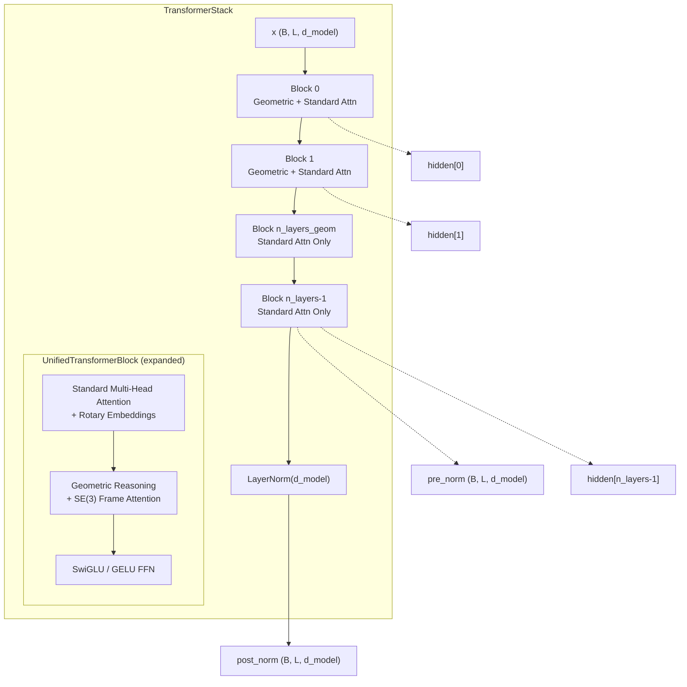
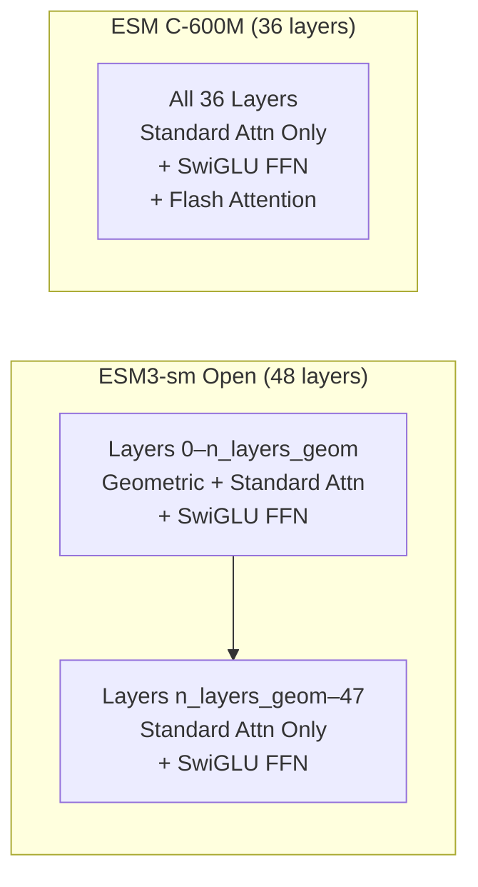

---
slug:14-transformer-stack-design
blog_type:normal
---


`TransformerStack` 是每个 ESM 模型的计算骨干——它是一个精心设计的 `UnifiedTransformerBlock` 层序列，在统一的架构中协调标准多头注意力和 SE(3) 不变几何推理。本页将详细探讨该堆栈的结构设计、其双注意力块内部机制、稳定深度训练的深度残差缩放，以及两个模型家族（ESM3 和 ESM C）如何通过配置相同的堆栈来实现截然不同的能力。

## 架构概览

Transformer 堆栈遵循 **后归一化残差架构**（post-norm residual architecture），其中每个 `UnifiedTransformerBlock` 会应用一个或两个注意力机制，随后是一个前馈网络，所有操作均包裹在缩放残差连接中。在最后一个块之后应用最终的 `LayerNorm`。该堆栈返回三个输出——后归一化表示、预归一化嵌入以及所有逐层隐藏状态的列表——使下游头部能够根据其任务需求选择合适的表示层级。



关键的架构洞察在于 **前 `n_layers_geom` 个块是几何感知的**——它们接收 `Affine3D` 帧和 `chain_id` 信息以执行结构感知注意力——而后续的块仅基于序列表示进行操作。这创造了一种自然的分工：早期层将 3D 结构上下文整合到表示中，后期层则通过标准注意力精炼融合后的表示。

来源: [transformer_stack.py](esm/layers/transformer_stack.py#L10-L94), [blocks.py](esm/layers/blocks.py#L51-L157)

## UnifiedTransformerBlock：双注意力构建块

堆栈中的每一层都是一个 `UnifiedTransformerBlock`，由一个布尔值 `use_geom_attn` 参数化，该参数决定是否实例化几何注意力子层。该块的前向传播按顺序最多应用三个操作，每个操作都带有一个 **缩放残差连接**：

```python
# 实际前向传播的伪代码
if self.use_plain_attn:
    r1 = self.attn(x, sequence_id)
    x = x + r1 / self.scaling_factor     # 缩放残差

if self.use_geom_attn:
    r2 = self.geom_attn(x, frames, frames_mask, sequence_id, chain_id)
    x = x + r2 / self.scaling_factor     # 缩放残差

r3 = self.ffn(x) / self.scaling_factor
x = x + r3                               # FFN 残差
```

执行顺序至关重要：**标准注意力首先运行**，生成序列上下文化的表示，随后由几何注意力（如果存在）进行精炼，最后由 FFN 进行变换。这种顺序确保了几何推理作用于已经携带上下文序列信息的 token，而非原始嵌入。

| 子层 | 激活条件 | 输入依赖 | SE(3) 不变性 |
|-----------|-------------|-----------------|------------------|
| 多头注意力 | 始终激活 (`use_plain_attn=True`) | `x`, `sequence_id` | 否（仅旋转位置） |
| 几何注意力 | 前 `n_layers_geom` 个块 | `x`, `Affine3D`, `affine_mask`, `sequence_id`, `chain_id` | 是 |
| SwiGLU / GELU FFN | 始终激活 | `x` | 不适用（逐点操作） |

<CgxTip>几何注意力和标准注意力是 **加性关系，而非基于门控**——两者各自独立地贡献于残差流。这意味着同时包含两种注意力的块每层会执行两次完整的注意力传递，这对于深层堆栈（如 ESM3-sm 的 48 层）具有显著的计算影响。</CgxTip>

来源: [blocks.py](esm/layers/blocks.py#L117-L157), [blocks.py](esm/layers/blocks.py#L73-L115)

## 深度残差缩放

深层 Transformer 堆栈面临信号爆炸问题：每次残差加法都会累积幅度，导致后续层出现不稳定。ESM 通过 **深度感知残差缩放** 解决了这一问题，即每个残差贡献值都会除以一个与网络深度平方根成正比的因子：

```python
residue_scaling_factor = math.sqrt(n_layers / 36) if scale_residue else 1.0
```

常量 36 是参考架构的深度（ESM3-sm 使用 48 层，ESM C-600M 使用 36 层）。这意味着：

| 模型 | n_layers | 缩放因子 | 效果 |
|-------|----------|---------------|--------|
| ESM3-sm Open | 48 | √(48/36) ≈ **1.155** | 残差衰减约 13% |
| ESM C-600M | 36 | √(36/36) = **1.0** | 无缩放（参考基准） |
| ESM C-300M | 30 | √(30/36) ≈ **0.913** | 残差放大约 9% |

缩放因子统一应用于块内的 **所有三个残差连接**——包括两个注意力输出和 FFN 输出。FFN 输出在相加前已预先除以缩放因子（`x = x + r3`），而注意力输出则在相加时除以缩放因子（`x = x + r1 / self.scaling_factor`）。这种微妙的差异意味着 FFN 的贡献得到了一致的缩放，而注意力的缩放则在相加点显式进行。

来源: [transformer_stack.py](esm/layers/transformer_stack.py#L50-L52), [blocks.py](esm/layers/blocks.py#L146-L156)

## 跨模型家族的堆栈配置

同一个 `TransformerStack` 类同时服务于 ESM3 和 ESM C，但采用了截然不同的配置，这反映了它们迥异的设计目标。ESM3 是一个需要结构推理的 **多模态生成模型**，而 ESM C 是一个专注于序列理解的 **表示模型**。



| 参数 | ESM3-sm Open | ESM C-600M | ESM C-300M |
|-----------|-------------|------------|------------|
| `d_model` | 1536 | 1152 | 960 |
| `n_heads` | 24 | 18 | 15 |
| `v_heads` | 256 | **None** | **None** |
| `n_layers` | 48 | 36 | 30 |
| `n_layers_geom` | default (1) | **0** | **0** |
| `scale_residue` | True | True | True |
| `mask_and_zero_frameless` | **True** | False | False |
| `qk_layernorm` | True | True | True |
| `ffn_type` | "swiglu" | "swiglu" | "swiglu" |
| `expansion_ratio` | 8/3 | 8/3 | 8/3 |
| `use_flash_attn` | False | True | True |

ESM3 中的 `mask_and_zero_frameless=True` 设置尤为重要：它确保没有有效结构帧的位置（即没有 3D 坐标的残基）将其几何注意力输出归零，防止无效的结构信号传播。ESM C 禁用此设置是因为它从不接收结构帧（`n_layers_geom=0`）。

<CgxTip>ESM C 的 `v_heads=None` 和 `n_layers_geom=0` 彻底消除了几何注意力的开销。这使得 ESM C 的堆栈成为一个带有 Flash Attention 的纯序列 Transformer，其每层速度显著快于 ESM3 的双注意力块。在选择模型时，请记住 ESM3 的几何层增加了与 `v_heads` 成正比的计算和内存成本。</CgxTip>

来源: [esm3.py](esm/models/esm3.py#L205-L207), [esmc.py](esm/models/esmc.py#L66-L73), [pretrained.py](esm/pretrained.py#L95-L111), [pretrained.py](esm/pretrained.py#L77-L92), [pretrained.py](esm/pretrained.py#L59-L74)

## 前馈网络设计

每个 `UnifiedTransformerBlock` 包含一个 FFN 子层，配置为 **SwiGLU**（默认）或 **GELU**。SwiGLU 变体遵循 PaLM/LLaMA 模式：LayerNorm → 线性上投影 → SwiGLU 激活 → 线性下投影。一个关键的细节是 **隐藏维度校正**：

```python
def swiglu_correction_fn(expansion_ratio: float, d_model: int) -> int:
    return int(((expansion_ratio * d_model) + 255) // 256 * 256)
```

由于 SwiGLU 将其中间表示一分为二（`x.chunk(2, dim=-1)`），上投影必须产生 `2 × corrected_hidden_dim` 个输出。该校正将隐藏维度向上取整到最接近的 256 的倍数，从而确保对 GPU 友好的张量形状，以实现高效的矩阵乘法。

| FFN 类型 | 上投影尺寸 | 激活函数 | 下投影尺寸 |
|----------|-------------------|------------|---------------------|
| SwiGLU | `2 × round256(expansion_ratio × d_model)` | `SiLU(x1) * x2` | `d_model` |
| GELU | `expansion_ratio × d_model` | `GELU` | `d_model` |

对于 `d_model=1536` 且 `expansion_ratio=8/3` 的 ESM3-sm：校正后的隐藏维度为 `round256(4096) = 4096`，因此上投影映射为 1536 → 8192，经过 SwiGLU 的分割与门控后，下投影映射为 4096 → 1536。

来源: [blocks.py](esm/layers/blocks.py#L10-L48)

## 堆栈中的数据流

`TransformerStack.forward` 的前向签名揭示了多模态编码器与 Transformer 核心之间的完整数据契约：

```python
def forward(
    self,
    x: torch.Tensor,                    # (B, L, d_model) - 融合的多模态嵌入
    sequence_id: torch.Tensor | None,    # (B, L) - 用于注意力掩码的打包边界
    affine: Affine3D | None,             # 用于几何注意力的 SE(3) 帧
    affine_mask: torch.Tensor | None,    # (B, L) - 有效的帧位置
    chain_id: torch.Tensor | None,       # (B, L) - 用于几何掩码的链边界
) -> tuple[torch.Tensor, torch.Tensor, list[torch.Tensor]]:
```

`sequence_id` 张量具有双重用途：在标准注意力中，它创建一个注意力掩码，使得 token 只能关注具有相同序列 ID 的其他 token（从而支持打包批次训练）；在 Flash Attention 模式下，它兼任布尔填充掩码。`chain_id` 张量则专供几何注意力使用，用于防止在多链蛋白质复合体中出现跨链注意力——这是一种结构约束，确保几何推理遵守链边界。

当未提供 `chain_id` 时，堆栈默认为同质链（`torch.ones(...)`），即所有位置属于同一条链。此默认值对于单链蛋白质和从不使用几何注意力的 ESM C 是安全的。

来源: [transformer_stack.py](esm/layers/transformer_stack.py#L64-L94)

## 输出表示与下游消费

堆栈返回一个三元组 `(post_norm, pre_norm, hiddens)`，服务于不同的下游消费者：

- **`post_norm`** — 经过 `LayerNorm` 处理的最终层输出。这是馈送给 `OutputHeads`（ESM3）或 `sequence_head`（ESM C）进行 logit 计算的主要表示。后归一化确保了下游线性层具有稳定的梯度幅度。
- **`pre_norm`** — 终端 `LayerNorm` 之前的原始最终层输出。ESM3 的 `OutputHeads` 同时接收这两种表示：`post_norm` 用于计算 logits，`pre_norm` 用于 `embeddings` 字段，从而为基于嵌入的下游任务保留了未归一化的表示。
- **`hiddens`** — 包含所有逐层隐藏状态的列表。ESM C 将它们堆叠成一个 `(n_layers, B, L, D)` 张量，并在 `ESMCOutput` 中作为 `hidden_states` 暴露出来，支持逐层分析和在任意深度提取表示。

这种三输出设计是一个深思熟虑的架构选择：后归一化输出最适合监督预测头部，而预归一化输出和逐层隐藏状态则支持表示学习工作流，因为在这些工作流中，最终 LayerNorm 的归一化统计量可能会丢失有用信号。

来源: [transformer_stack.py](esm/layers/transformer_stack.py#L62-L94), [esm3.py](esm/models/esm3.py#L160-L178), [esmc.py](esm/models/esmc.py#L154-L173)

## 接下来去哪

Transformer 堆栈位于多个架构子系统的交汇处。要了解全貌，请阅读：

- **[Geometric Attention and SE(3) Invariance](13-geometric-attention-and-se-3-invariance)** — 深入探讨 `GeometricReasoningOriginalImpl` 如何使用 `Affine3D` 帧计算旋转不变和距离感知的注意力分数。
- **[Rotary Embeddings and SwiGLU](15-rotary-embeddings-and-swiglu)** — `MultiHeadAttention` 中的位置编码策略以及 `FlashMultiHeadAttention` 中的 Triton 优化变体。
- **[ESM3 Multimodal Generative Model](8-esm3-multimodal-generative-model)** — `EncodeInputs` 模块如何在 token 进入堆栈之前融合多模态 token，以及 `OutputHeads` 如何解码堆栈的输出。
- **[ESM C Representation Model](9-esm-c-representation-model)** — ESM C 如何在纯序列模式下利用带有 Flash Attention 的堆栈进行高效的表示提取。