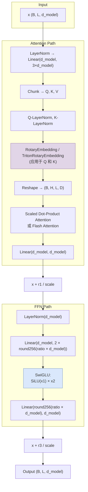

---
slug:15-rotary-embeddings-and-swiglu
blog_type:normal
---

ESM Transformer 架构融合了两种协同机制——**旋转位置编码**和 **SwiGLU 前馈网络**——二者共同决定了位置信息如何在注意力机制中传播，以及每个块中非线性特征变换如何发生。这些并非无足轻重的的设计选择；它们构成了 ESM3 多模态生成模型和 ESMC 表示模型共享的位置编码与激活骨干，并通过双路径实现（PyTorch 原生 vs. Triton 加速）在运行时适配硬件能力。

## 旋转位置编码：架构与实现

旋转位置编码通过在二维子空间中为每个维度对旋转查询和键向量来编码绝对位置，使得任意两个向量的点积仅取决于它们的相对距离。此特性使 RoPE 天然兼容注意力机制：位置 *m* 和位置 *n* 之间的注意力得分仅是 *m − n* 的函数，而无需显式的相对位置偏置表或可学习的位置编码。ESM 代码库通过两个类实现 RoPE——用于标准 PyTorch 路径的 `RotaryEmbedding` 和用于 Flash Attention 路径的 `TritonRotaryEmbedding`——两者皆源于 LLaMA 2 / GPT-NeoX 血统。

核心数学操作是**半旋转**。给定一个沿特征维度分为两半的输入向量 *x*，对于 GPT-NeoX 风格（前半/后半分割），旋转产生 `concat(−x₂, x₁)`；对于 GPT-J 风格（`(x[..., ::2], x[..., 1::2])`），则产生交错变体。`rotate_half` 函数通过 `interleaved` 标志在两种模式间进行分派。实际的旋转应用随后计算 `x[..., :ro_dim] * cos + rotate_half(x[..., :ro_dim]) * sin`，其中 `cos` 和 `sin` 由频率矩阵预计算得出，剩余维度 `x[..., ro_dim:]` 则保持不变通过。这意味着 RoPE 可以应用于头部维度的**一部分**（`ro_dim = cos.shape[-1] * 2`），而将其余部分保持未旋转状态——当旋转维度与完整头部宽度不同时，这种灵活性至关重要。

来源: [rotary.py](esm/layers/rotary.py#L36-L65), [rotary.py](esm/layers/rotary.py#L68-L81)

### 频率计算与缓存策略

逆频谱计算为 `inv_freq = 1 / (base ** (arange(0, dim, 2) / dim))`，其中 `base` 默认为 10000.0，`dim` 为旋转维度（设置为 `d_model // n_heads`，即每个头的维度）。这产生了 `dim / 2` 个频率分量，涵盖从低频（长程位置相关性）到高频（细粒度局部位置）的范围。`_update_cos_sin_cache` 方法会在序列长度增长、设备变更、数据类型变更或模型在训练和推理模式之间转换时，惰性计算并缓存 `cos` 和 `sin` 张量。这种缓存对效率至关重要：仅在必要时触发重新计算，且在自回归生成期间，缓存的张量会通过 `seqlen_offset` 进行切片，以应用正确的位置偏移而无需重新索引。

一个对精度至关重要的细节是 `pos_idx_in_fp32` 标志。当模型在纯 bf16（而非混合精度）下训练时，`inv_freq` 将是 bf16，导致如 1995.0 这样的位置索引被舍入为 2000.0——这破坏了长序列的位置保真度。该标志强制将位置索引和频率外积保持为 fp32，而不受模型参数数据类型的影响，然后再将最终的 `cos`/`sin` 向下转换为目标数据类型。此外，`scaling_factor` 参数为上下文扩展启用了**线性位置缩放**：将位置索引 `t` 除以 `scaling_factor` 可有效拉伸旋转周期，使得相同的频谱能够以降低的位置分辨率覆盖更长的序列。

来源: [rotary.py](esm/layers/rotary.py#L125-L197)

### 双实现：PyTorch vs. Triton

代码库提供了两种在注意力模块层级被选用的旋转嵌入后端：

| 方面 | `RotaryEmbedding` (PyTorch) | `TritonRotaryEmbedding` (Triton) |
|---|---|---|
| **使用者** | `MultiHeadAttention` | `FlashMultiHeadAttention` |
| **输入格式** | 分离的 `q`, `k` 张量 `(B, S, H, D)` | 打包的 `qkv` 张量 `(N, 3, H, D)` |
| **序列处理** | 直接的序列维度 | `cu_seqlens` + `max_seqlen` (变长) |
| **内核** | 纯 PyTorch (`apply_rotary_emb_torch`) | Triton 内核 (`apply_triton_rotary`) |
| **原地操作** | 可通过 `_inplace` 配置 | 始终原地操作 |
| **回退机制** | 始终可用 | 优雅的 `ImportError` 回退 |

`TritonRotaryEmbedding` 子类继承了 `RotaryEmbedding` 的所有初始化和缓存逻辑，但重写了 `forward` 方法，以接受 Flash Attention 所使用的打包 QKV 格式。它分别将 Triton 旋转内核应用于 `qkv[:, 0]`（查询）和 `qkv[:, 1]`（键），而保持值不变。`cu_seqlens`（累积序列长度）和 `max_seqlen` 参数允许内核处理打包在单个批处理中的变长序列——这对于 Flash Attention 所需的无填充表示至关重要。

来源: [rotary.py](esm/layers/rotary.py#L198-L264), [attention.py](esm/layers/attention.py#L38-L46), [attention.py](esm/layers/attention.py#L85-L115)

### 集成点：注意力模块

在 `MultiHeadAttention` 中，旋转嵌入应用于 QK LayerNorm **之后**，但在为缩放点积注意力进行头部重塑**之前**。`_apply_rotary` 方法首先将合并的 `(H*D)` 维度取消展平为 `(H, D)`，通过 `self.rotary(q, k)` 应用旋转变换，然后再展平回去。这种 LayerNorm → Rotary → Reshape → Attention 的顺序，确保旋转操作作用于归一化后的查询和键，从而稳定旋转向量的幅度。`FlashMultiHeadAttention` 变体遵循相同的逻辑顺序，但作用于打包的表示，在传递给 `flash_attn_varlen_qkvpacked_func` 之前，通过 `self.rotary(qkv_N3HD, cu_seqlens, max_seqlen)` 应用旋转。

<CgxTip>在追踪通过注意力的数据流时，请注意对于当前所有的 ESM 模型配置（ESM3: 1536/24, ESMC-600M: 1152/18, ESMC-300M: 960/15），`d_head = d_model // n_heads = 64`。这意味着旋转维度始终为 64，每个头产生 32 个频率分量——足以满足 ESM 处理的典型蛋白质序列长度。</CgxTip>

来源: [attention.py](esm/layers/attention.py#L16-L82), [attention.py](esm/layers/attention.py#L85-L122)

## SwiGLU：带 Swish 激活的门控线性单元

SwiGLU 激活函数用**门控架构**替代了前馈网络中标准的 ReLU 或 GELU，该架构将 Swish 激活路径与线性门控路径进行乘法组合。具体而言，给定分为两半的输入 *x*：`SwiGLU(x) = SiLU(x₁) * x₂`。此设计由 Shazeer (2020) 引入，并被 LLaMA、PaLM 及其他大规模 Transformer 采用，在每 FLOP 的下游质量上始终优于标准的 FFN 激活——门控机制提供了比单一激活函数更丰富的梯度信号和更强的非线性表达能力。

ESM 代码库包含两个 `SwiGLU` 类定义。`esm/layers/ffn.py` 中的那个被显式标记为**“当前未使用”**——它是一个没有周围 FFN 脚手架的独立模块。活跃的实现位于 `esm/layers/blocks.py` 中，嵌入在构建完整预归一化 FFN 子网络的 `swiglu_ln_ffn` 工厂函数内。

来源: [ffn.py](esm/layers/ffn.py#L1-L30), [blocks.py](esm/layers/blocks.py#L15-L38)

### 完整的 FFN 流程：LayerNorm → 投影 → 门控 → 投影

`swiglu_ln_ffn` 函数构造了一个包含四个阶段的顺序 `nn.Module`：**LayerNorm** → **线性扩展 (2×)** → **SwiGLU** → **线性投影**。扩展层从 `d_model` 投影到 `swiglu_correction_fn(expansion_ratio, d_model) * 2`——注意这里的 `* 2` 因子。因为 SwiGLU 将其输入一分为二，门控后的有效隐藏宽度为 `swiglu_correction_fn(expansion_ratio, d_model)`，随后再将其投影回 `d_model`。`swiglu_correction_fn` 将扩展值舍入到最接近的 256 的倍数，这种硬件对齐确保了张量操作能在 GPU 张量核心上命中高效的内存访问模式。

`TransformerStack` 中的默认 `expansion_ratio` 为 **8/3 ≈ 2.667**，显著小于传统 FFN 中使用的 4×。当与 SwiGLU 分割的 `* 2` 开销结合时，实际的线性层宽度变为 `2 * round256(8/3 * d_model)`。对于 `d_model = 1536` 的 ESM3，这产生了 `2 * round256(4096) = 2 * 4096 = 8192` 个输入到 SwiGLU 的特征，在分割后产生 4096 的有效隐藏维度——约 2.67× 的扩展，正如预期。与 4× GELU FFN（需要 6144 个隐藏单元）相比，这更具参数效率，同时通过门控机制保持了具有竞争力的表达力。

来源: [blocks.py](esm/layers/blocks.py#L10-L38), [transformer_stack.py](esm/layers/transformer_stack.py#L37-L38)

### SwiGLU vs. GELU：可配置的选择

`UnifiedTransformerBlock` 暴露了一个接受 `"swiglu"` 或 `"gelu"` 的 `ffn_type` 参数，默认为 `"swiglu"`。由 `gelu_ln_ffn` 构建的 GELU 变体遵循标准的预归一化 FFN 模式：LayerNorm → Linear(d_model, hidden_dim) → GELU → Linear(hidden_dim, d_model)，其中 `hidden_dim = int(expansion_ratio * d_model)`，没有 2× 开销或 256 对齐。这种可配置性是为了支持潜在的模型变体，尽管目前发布的所有 ESM 检查点均使用 SwiGLU。

| 属性 | SwiGLU FFN | GELU FFN |
|---|---|---|
| **激活** | `SiLU(x₁) * x₂` (门控) | `GELU(x)` (非门控) |
| **扩展因子** | `2 × round256(ratio × d)` → 有效 `round256(ratio × d)` | `int(ratio × d)` |
| **线性层** | 2 (扩展 + 投影) | 2 (扩展 + 投影) |
| **参数** | 较高 (由于 2× 扩展输入) | 较低 |
| **每 FLOP 表达力** | 较高 (门控提供更丰富的梯度) | 较低 |
| **硬件对齐** | 256 对齐的隐藏维度 | 未对齐的隐藏维度 |
| **默认比例** | 8/3 | 4.0 |

来源: [blocks.py](esm/layers/blocks.py#L30-L48), [blocks.py](esm/layers/blocks.py#L109-L114)

## 端到端数据流：贯穿块的位置编码

下图说明了旋转嵌入和 SwiGLU 在单个 `UnifiedTransformerBlock` 前向传播中是如何交互的：

残差连接通过 `residue_scaling_factor = sqrt(n_layers / 36)` 使用**深度缩放**，这在更深的模型中衰减残差贡献以防止激活爆炸。注意力残差（`r1`）和 FFN 残差（`r3`）在相加之前都除以该因子，确保在 48 层的 ESM3 和 36 层的 ESMC 配置中训练稳定。

来源: [blocks.py](esm/layers/blocks.py#L117-L157), [transformer_stack.py](esm/layers/transformer_stack.py#L50-L52)

## XPos 扩展：长度可外推的位置编码

`RotaryEmbedding` 类内置了对 **XPos** (Sun et al., 2022) 的支持，这是一种应用指数衰减尺度以实现长度外推的旋转嵌入变体。当设置 `scale_base` 时（推荐值：512），该类计算一个逐位置的缩放因子 `scale^(pos − seq_len/2) / scale_base`，该因子与查询的余弦/正弦相乘，并与键的余弦/正弦相除。这创造了一种自然的注意力衰减：相距较远的 Token 间的关注度降低，从而提高了对长于训练时所见序列的泛化能力。在当前的 ESM 代码库中，`scale_base` 默认为 `None`（禁用），这意味着 XPos 可用但在已发布的检查点中未被激活。如果 XPos 缩放被启用但在调用路径中未完全实现，`forward` 方法会显式抛出断言失败，作为防止部分配置的防护措施。

来源: [rotary.py](esm/layers/rotary.py#L78-L80), [rotary.py](esm/layers/rotary.py#L179-L196), [rotary.py](esm/layers/rotary.py#L229-L231)

## 设计理念与架构影响

RoPE 和 SwiGLU 的组合并非随意——它反映了与 LLaMA 系列模型共享的连贯架构理念。RoPE 消除了对可学习位置编码的需求（这类编码必须设定最大序列长度且泛化能力差），而 SwiGLU 则提供了比深层 GELU FFN 更具参数效率的非线性。两者共同减少了每层的总参数量，同时维持或提升了模型质量，这对于序列可达数千残基的蛋白质尺度模型至关重要。

<CgxTip>ESM 中的旋转维度始终等于完整的头维度（`d_head = 64`），这意味着 RoPE 应用于所有头特征，而非部分子集。这是比部分旋转配置（例如仅将 RoPE 应用于一半的头维度）更强的位置信号，它意味着每个注意力得分都承载了完整的位置依赖性。对于极长的蛋白质序列，这种全维度旋转可能会限制外推能力——而这正是 XPos 旨在解决的场景。</CgxTip>

`swiglu_correction_fn` 中的 256 对齐是一个微妙但重要的优化。当矩阵维度是 8 的倍数（fp16/bf16）或 16 的倍数（int8）时，NVIDIA 张量核心可达到峰值吞吐量，而舍入到 256 提供了充足的对齐余量，同时保持扩展比例接近理论上的 8/3。其代价最多是扩展维度中多出 255 个特征——微不足道的参数开销（对于 d_model ≥ 960，小于 0.3%），却在训练和推理的持续硬件利用率中回报丰厚。

来源: [blocks.py](esm/layers/blocks.py#L10-L12), [rotary.py](esm/layers/rotary.py#L136-L143)

## 下一步去哪

旋转嵌入和 SwiGLU 前馈网络运行在更广泛的 Transformer 堆栈中，该堆栈协调了它们与几何注意力和层级缩放的交互。有关这些组件如何堆叠和配置的完整图景，请参阅 [Transformer Stack Design](14-transformer-stack-design)。对于在 ESM3 早期层中与标准注意力并行运行的几何注意力机制，请参阅 [Geometric Attention and SE(3) Invariance](13-geometric-attention-and-se-3-invariance)。对于通过这些 Transformer 块驱动生成的迭代掩码采样过程，请参阅 [Iterative Masked Sampling](16-iterative-masked-sampling)。