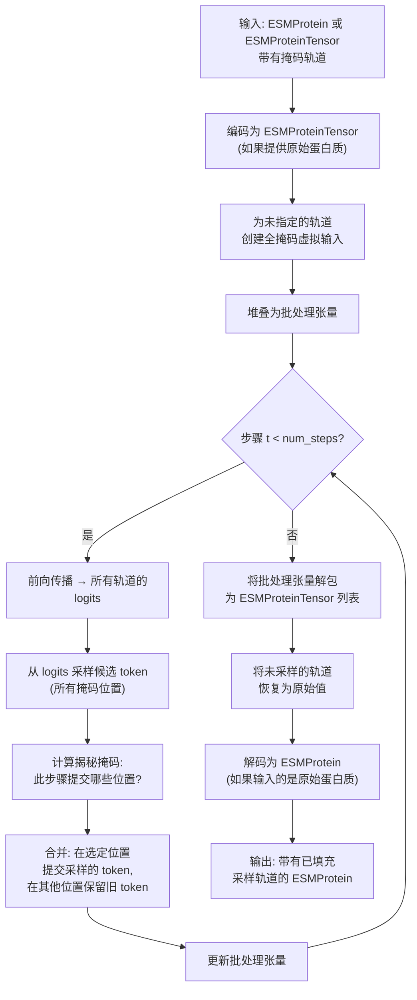

---
slug:16-iterative-masked-sampling
blog_type:normal
---


迭代掩码采样是核心生成机制，驱动 ESM3 合成新型蛋白质序列、结构和功能标注的能力。与自回归模型通过单次从左到右生成 token 不同，ESM3 从一个全掩码输入开始，在噪声调度和揭秘策略的引导下，通过多次前向传播逐步对 token 进行揭秘。该过程与训练期间使用的掩码语言建模目标相呼应，使得生成成为模型预训练范式的自然延伸——这一设计理念继承自 MaskGIT 系列图像生成器，并在此针对蛋白质数据多轨道、多模态的现实情况进行了适配。

来源: [generation.py](esm/utils/generation.py#L355-L534), [api.py](esm/sdk/api.py#L292-L326)

## 迭代循环：从全掩码到完全采样

ESM3 生成的核心在于 `iterative_sampling_tokens` 函数，该函数负责编排固定数量的解码步骤。在每一步中，模型对当前（部分掩码的）蛋白质张量执行一次完整的前向传播，计算每个位置的 logits，采样候选 token，然后根据调度确定的预算，有选择地仅提交这些候选 token 的一个子集。未被选中的位置保持掩码状态，并在后续步骤中重新考虑。当所有掩码 token 都被替换或配置的步骤数耗尽时，该过程终止。

下图展示了单次生成调用的完整生命周期：



来源: [generation.py](esm/utils/generation.py#L355-L534), [generation.py](esm/utils/generation.py#L130-L166)

## 揭秘掩码的计算方式

每次迭代中的关键决策是揭示*哪些*掩码位置。这由两个相互作用的控制项决定：**噪声调度**决定在第 *t* 步揭秘*多少*个 token，而**揭秘策略**决定当前被掩码的 token 中*哪些*优先被揭秘。

### 步骤预算计算

在每一步中，噪声调度将进度比例 `(step + 1) / num_steps` 映射为应保持掩码状态的 token 比例。当前掩码数量与该目标值之间的差值，即为本轮需要采样的 token 数量：

```
still_masked = 当前掩码位置的数量
perc_masked_after_this_step = schedule((step + 1) / num_steps)
num_tokens_masked_after = round(perc_masked_after_this_step × total_to_sample)
num_to_sample = still_masked - num_tokens_masked_after
```

在取整之前会加上一个小的 epsilon (0.1)，以避免浮点精度导致的差一错误——这一实用细节可防止模型在多个步骤中“滞留”单个掩码 token。

### 策略：熵 vs 随机

一旦预算确定，策略便决定填充*哪些*位置：

| 策略 | 选择标准 | 行为 | 最适用场景 |
|----------|--------------------|----------|----------|
| **`entropy`** | 优先揭秘 logit **熵最低**的位置 | 尽早提交最确定的预测，使模型能够以它们为条件进行后续更困难的决策 | 精确、高保真度的生成 |
| **`random`** | 在掩码位置中进行均匀随机选择 | 在提交顺序中引入随机多样性，产生更多样化的输出 | 探索性或多样性生成 |

熵策略从forward pass的输出中提取每个位置的熵，屏蔽不可采样的位置（已揭秘、BOS/EOS、填充），并选择 top-k 最低熵的位置。随机策略则简单地打乱掩码索引并取前 `num_to_sample` 个。

来源: [generation.py](esm/utils/generation.py#L241-L330), [generation.py](esm/utils/generation.py#L226-L238)

## 温度退火

温度控制采样分类分布的尖锐程度。ESM3 支持可选的**温度退火**机制，该机制在解码步骤中逐步降低温度，从早期的探索性采样过渡到最后的近贪心选择：

```python
annealed_temperature = max(initial_temperature - step_ratio, 0.001) ** 2
```

其中 `step_ratio = step / max(1, num_steps - 1)`。二次衰减意味着温度起初下降缓慢，随后急剧下降，使模型能够在细化细节之前锁定连贯的局部结构。当 `temperature_annealing=True`（使用 `use_generative_unmasking_strategy` 时的默认值）时，每步的温度将覆盖基础的 `GenerationConfig.temperature`。

来源: [generation.py](esm/utils/generation.py#L350-L352), [generation.py](esm/utils/generation.py#L454-L459)

## GenerationConfig API

`GenerationConfig` 数据类是迭代掩码采样的主要控制面。它指定生成*什么*、*如何*揭秘以及*如何*采样：

| 参数 | 类型 | 默认值 | 描述 |
|-----------|------|---------|-------------|
| `track` | `str` | `""` | 要采样的蛋白质轨道：`"sequence"`、`"structure"`、`"secondary_structure"`、`"sasa"` 或 `"function"` |
| `schedule` | `str` | `"cosine"` | 控制揭秘速度的噪声调度：`"cosine"` 或 `"linear"` |
| `strategy` | `str` | `"random"` | 揭秘策略：`"entropy"` 或 `"random"` |
| `num_steps` | `int` | `20` | 迭代解码的总步骤数 |
| `temperature` | `float` | `1.0` | 分类分布的采样温度 |
| `temperature_annealing` | `bool` | `True` | 是否在步骤中二次衰减温度 |
| `top_p` | `float` | `1.0` | 核采样阈值 (1.0 = 禁用) |
| `invalid_ids` | `Sequence[int]` | `[]` | 采样时要排除的 token ID |
| `condition_on_coordinates_only` | `bool` | `True` | 如果为 True，则清除结构 token 并仅以坐标为条件 |

两种便捷方法提供了预设配置：

- **`use_entropy_based_unmasking_strategy()`** — 设置 `schedule="cosine"`、`strategy="entropy"`、`temperature_annealing=False`。产生确定性的、高置信度的输出。
- **`use_generative_unmasking_strategy()`** — 设置 `schedule="cosine"`、`strategy="random"`、`temperature_annealing=True`。产生多样化、创造性的输出。

<CgxTip>当 `num_steps` 超过掩码 token 的数量时，系统会自动将其限制为掩码数量——因此你可以放心地设置较高的 `num_steps`，而不必担心对短序列过度步进。</CgxTip>

来源: [api.py](esm/sdk/api.py#L293-L326), [generation.py](esm/utils/generation.py#L390-L393)

## 特定轨道的采样行为

由于 token 结构不同，不同的蛋白质轨道需要不同的采样处理：

**整数 token 轨道**（`sequence`、`structure`、`secondary_structure`）通过 `sample_logits` 进行采样，该方法在从生成的分类分布中抽取之前，应用温度缩放、top-p 过滤和无效 ID 掩码。当温度为 0 时，分布退化为 argmax（贪心解码）。

**SASA** 作为离散化区间上的软期望进行采样，而非硬 token 选择，从而产生连续的浮点值。熵单独计算，以处理因无效 ID 掩码可能产生的 `-inf` logits。

**Function token** 具有多维结构 `(L, D)`，其中 `D` 是 InterPro 量化深度。一个特殊的 `<none>` 阈值 (`p_none_threshold=0.05`) 控制某个位置是否接收任何功能标注——当所有深度维度上 `<none>` 的平均概率超过该阈值时，整个位置被设置为 `<none>`，从而抑制虚假预测。

**残基标注** 使用多热点二元预测（伯努利分布，而非分类分布），因此它们的采样是通过选择高于概率阈值的 top-K 标注来完成的，而不是从 softmax 分布中采样。

**坐标和残基标注** 无法进行迭代采样——如果将其中任何一个指定为生成轨道，系统将返回 `ESMProteinError`。

来源: [generation.py](esm/utils/generation.py#L423-L428), [sampling.py](esm/utils/sampling.py#L153-L196), [sampling.py](esm/utils/sampling.py#L199-L237), [sampling.py](esm/utils/sampling.py#L260-L290)

## 合并步骤：选择性 token 提交

在对*所有*掩码位置采样候选 token 之后，迭代循环必须决定实际提交哪些候选。这就是**合并步骤**，实现为 `torch.where` 操作：

```python
new_track_samples = torch.where(
    where_to_sample,   # 布尔掩码：在要提交的位置为 True
    new_track_samples, # 本次前向传播的候选 token
    old_track_samples  # 现有 token（已提交或仍被掩码）
)
```

此设计确保先前提交的 token 永远不会被覆盖——一旦某个位置被揭秘，其值在生成的剩余时间内即被冻结。只有被揭秘掩码选中的位置才会从掩码状态转换为已采样状态。这种单调提交特性赋予了迭代掩码采样其连贯性：每一步都建立在不断增长的已解析 token 基础之上。

来源: [generation.py](esm/utils/generation.py#L499-L509)

## 批处理执行与按提示词隔离

虽然前向传播为了效率进行了批处理，但采样是**按提示词**执行的，因为不同的提示词可能有不同的 `GenerationConfig` 设置。系统切分批处理的前向输出，将 logits 裁剪为每个提示词的正确序列长度，应用按提示词的温度退火，然后单独计算揭秘掩码。错误也是按提示词跟踪的——如果一个提示词失败（例如，没有掩码 token），它将被记录为 `ESMProteinError` 并在后续步骤中跳过，而不会影响批处理中的其他提示词。

<CgxTip>当前实现在 `_get_iterative_sampling_mask_for_prompt_and_step` 中断言批大小为 1。当使用带有批处理生成的本地推理客户端时，系统会在按提示词的循环内单独处理每个提示词，因此这不构成实际限制——但这意味着批前向传播是唯一真正的并行机制；采样和揭秘决策在批维度上是顺序执行的。</CgxTip>

来源: [generation.py](esm/utils/generation.py#L410-L509), [generation.py](esm/utils/generation.py#L262-L265)

## 实际生成模式

迭代掩码采样框架通过简单的配置选择，支持多种截然不同的蛋白质设计工作流：

**序列设计** — 提供部分掩码的序列（使用 `_` 作为掩码字符）并生成缺失的残基。较低的温度和基于熵的揭秘生成的序列更接近训练分布；较高的温度配合随机揭秘则探索更新颖的领域。

**结构预测（折叠）** — 提供完整的序列并将所有其他轨道掩码，生成 `structure` 轨道。带有熵策略的余弦调度通常产生物理上最合理的折叠。

**逆折叠** — 提供坐标（并可选地设置 `condition_on_coordinates_only=True` 以绕过结构 token），掩码序列轨道，并生成与给定骨架兼容的序列。

**思维链生成** — 在一系列单独的 `generate` 调用中按顺序生成轨道，将前一次的输出作为后一次的输入。常见的顺序是 `secondary_structure → structure → sequence`，这让模型首先建立粗略的结构草图，然后再致力于原子级别的细节。

来源: [esm3.py](cookbook/snippets/esm3.py#L49-L137), [api.py](esm/sdk/api.py#L432-L438)

## 与周边系统的关系

迭代掩码采样位于 ESM3 生成管道的中心，消耗 Transformer 前向传播产生的 logits，并生成更新的 token 张量。控制其节奏的噪声调度在[噪声调度与揭秘策略](17-noise-schedules-and-unmasking-strategies)中有详细记录，`GenerationConfig` 和 `SamplingConfig` 的完整参数参考可在[生成配置参考](18-generation-configuration-reference)中找到。围绕迭代采样的编解码机制（在 `ESMProtein` ↔ `ESMProteinTensor` 之间转换）在[编解码管道](22-encode-decode-pipeline)中介绍。