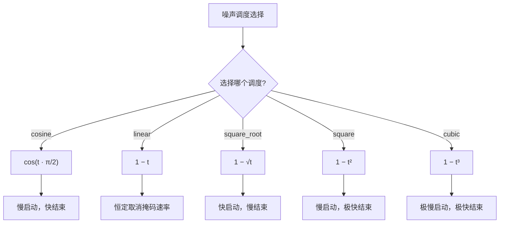
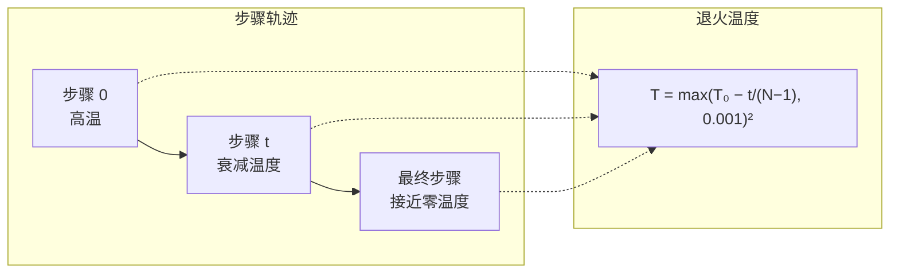
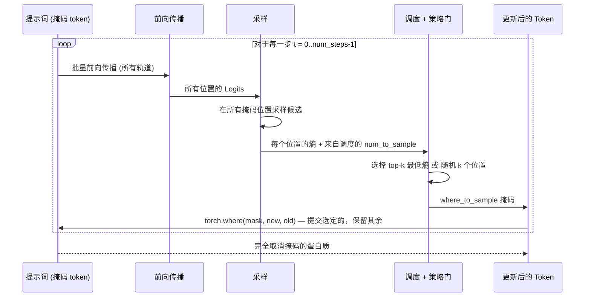

---
slug:17-noise-schedules-and-unmasking-strategies
blog_type:normal
---

ESM3 通过**迭代掩码采样**生成蛋白质轨道：在每个解码步骤中，模型预测所有掩码位置的 logits，采样候选 token，然后仅取消掩码一个精心挑选的子集，再进入下一步。两个相互关联的机制控制着这个过程——**噪声调度**控制每步要取消掩码*多少*个 token，而**取消掩码策略**控制要取消掩码*哪些*个 token。它们共同决定了从完全掩码输入到完整蛋白质的生成轨迹，它们的配置对生成质量、多样性和连贯性有着深远的影响。

## 从 MaskGIT 到蛋白质生成

ESM3 的迭代解码在架构上受到了 MaskGIT（掩码生成式图像 Transformer）范式的启发，并适配了蛋白质数据的多轨道离散 token 结构。在 MaskGIT 中，余弦调度控制着每步保持掩码状态的 token 比例，并且低置信度的位置会优先被取消掩码。ESM3 推广了这一思想：`GenerationConfig` 将 `schedule` 和 `strategy` 作为独立的、可组合的参数暴露出来，允许开发者将取消掩码的*速率*与*选择标准*解耦。

生成循环位于 `iterative_sampling_tokens` 中，它负责协调跨 `num_steps` 次前向传播的完整解码过程。在每一步 `t` 中，系统计算 `perc_masked_after_this_step = schedule((t + 1) / num_steps)`，然后推导出 `num_to_sample = still_masked - floor(perc_masked_after_this_step * total_to_sample)`。这意味着调度函数将归一化的步骤进度 `[0, 1]` 映射为*剩余掩码比例*，而实际取消掩码的 token 数量是连续调度值之间的差值——这些位置在本步的调度目标下，从“仍被掩码”转变为“应被取消掩码”。

来源: [noise_schedules.py](esm/utils/noise_schedules.py#L1-L34), [generation.py](esm/utils/generation.py#L280-L296), [api.py](esm/sdk/api.py#L293-L326)

## 调度注册表

五个调度函数注册在 `NOISE_SCHEDULE_REGISTRY` 中，每个函数都将归一化时间步 `t ∈ [0, 1]` 映射为应保持掩码状态的 token 比例。所有函数在 `t = 0` 时返回 `1.0`（全部掩码），在 `t = 1` 时返回 `0.0`（无掩码），但它们以截然不同的曲率穿过这个区间：

| 调度 | 公式 | `t=0.25` | `t=0.50` | `t=0.75` | 行为特征 |
|---|---|---|---|---|---|
| **cosine** | `cos(t · π/2)` | 0.924 | 0.707 | 0.383 | 早期少量 token 取消掩码，随后加速取消掩码。与 MaskGIT 匹配。 |
| **linear** | `1 − t` | 0.750 | 0.500 | 0.250 | 所有步骤中保持均匀的取消掩码速率。 |
| **square_root** | `1 − √t` | 0.500 | 0.293 | 0.134 | 早期激进取消掩码，随后进行精细化。 |
| **square** | `1 − t²` | 0.938 | 0.750 | 0.438 | 早期极度保守，后期快速取消掩码。 |
| **cubic** | `1 − t³` | 0.984 | 0.875 | 0.578 | 早期极其保守，末尾集中爆发。 |

**余弦调度**是默认调度，也是唯一通过 `GenerationConfig` 字段验证器（限制选择为 `"cosine"` 或 `"linear"`）为 ESM3 生成正式验证的调度。其余三个调度（`square_root`、`square`、`cubic`）存在于注册表中供实验使用——可以在通过编程方式构造配置或绕过验证器时访问它们，但它们在迭代循环中的行为尚未针对蛋白质生成质量进行官方表征。

<CgxTip>调度函数控制的是*剩余掩码比例*，而不是直接控制*每步取消掩码的数量*。因为 `num_to_sample = still_masked - round(schedule((step+1)/num_steps) * total_to_sample)`，凹向下调度（余弦、平方、立方）在早期步骤产生的取消掩码操作较少，而在后期步骤较多——模型首先提交“容易”的位置，将“困难”的位置留到上下文更丰富的后期。凸向上调度（square_root）则相反，这可能会过早锁定不确定的 token。</CgxTip>

来源: [noise_schedules.py](esm/utils/noise_schedules.py#L1-L34), [generation.py](esm/utils/generation.py#L280-L296), [api.py](esm/sdk/api.py#L297-L299)

## 取消掩码策略：熵 vs 随机

虽然调度决定了每步要取消掩码*多少*个 token，但**策略**决定了选择*哪些*仍被掩码的位置。ESM3 实现了两种策略，它们都在当前被掩码的位置集合中操作（不包括 BOS、EOS 和填充）：

### 基于熵的取消掩码 (`strategy="entropy"`)

熵策略优先取消掩码模型**最有信心**的位置。在每次前向传播后，通过 `torch.distributions.Categorical(logits=log_probs).entropy` 计算每个位置的 logits 分布熵。选择**熵最低**的位置进行取消掩码——这些是模型预测明确且无歧义的位置。这实现了一种基于置信度的贪心排序：模型在早期“锁定”简单的决策，为后续步骤中更难的位置提供日益丰富的上下文。

对于具有多维 token 结构 `(B, L, D)` 的功能轨道，在排序之前，会在深度维度上对熵求和，以生成每个位置的标量值。在非掩码位置，熵值会被 `torch.finfo.max` 掩码处理，以便在 `topk` 选择时排除它们。

### 随机取消掩码 (`strategy="random"`)

随机策略从仍被掩码的位置集合中均匀随机地选择位置。被掩码的索引通过 `torch.randperm` 打乱，然后选择前 `num_to_sample` 个索引。这在取消掩码顺序中引入了随机多样性——即使温度为 0，使用相同提示词的不同运行也可以产生不同的生成轨迹。

### 行为对比

| 方面 | 熵策略 | 随机策略 |
|---|---|---|
| **选择标准** | 最低的 logits 熵（最高置信度） | 掩码位置中的均匀随机 |
| **确定性** | 给定相同 logits 时具有确定性 | 每次运行都是随机的 |
| **生成多样性** | 较低——收敛于高置信度模式 | 较高——探索替代路径 |
| **质量 (pTM)** | 通常较高——模型提交连贯的结构 | 变化较大——可能会过早锁定不确定的 token |
| **用例** | 精确支架、保留基序的设计 | 探索性设计、多样化候选生成 |
| **温度退火** | 默认禁用（不需要） | 默认启用（补偿随机排序） |

来源: [generation.py](esm/utils/generation.py#L298-L330), [sampling.py](esm/utils/sampling.py#L153-L196), [api.py](esm/sdk/api.py#L303-L326)

## 温度退火

温度退火是一种补充机制，它跨解码步骤线性衰减采样温度。步骤 `t` 的退火温度计算为 `max(initial_temperature - t / (num_steps - 1), 0.001)²`，产生向接近零温度的二次衰减。在早期步骤中，高温鼓励多样化采样；在后期步骤中，低温迫使进行近乎贪心的 argmax 选择，将蛋白质向其最可能的完成状态精细化。

退火调度由 `GenerationConfig` 中的 `temperature_annealing` 标志控制。当使用 `use_generative_unmasking_strategy()` 时，退火会在 `schedule="cosine"` 和 `strategy="random"` 的情况下启用——随机取消掩码顺序与递减温度的组合允许模型在早期步骤进行广泛探索，然后在后期步骤收敛。当使用 `use_entropy_based_unmasking_strategy()` 时，退火被禁用，因为基于熵的排序已经提供了自然的收敛路径：位置按置信度顺序取消掩码，因此温度可以保持恒定。

<CgxTip>`_get_annealed_temperature` 中的二次衰减意味着温度起初缓慢下降，然后骤降。对于 `temperature=1.0` 的 20 步生成，第 10 步的温度为 `(1.0 - 10/19)² ≈ 0.028`——在半途时实际上已是贪心模式。如果你需要在后期步骤进行更多探索，请考虑禁用退火并使用大于 0 的固定温度。</CgxTip>

来源: [generation.py](esm/utils/generation.py#L350-L352), [generation.py](esm/utils/generation.py#L454-L459), [api.py](esm/sdk/api.py#L309-L326)

## 详述迭代采样循环

完整的取消掩码管道由 `iterative_sampling_tokens` 协调，它通过以下循环处理一批 `ESMProteinTensor` 输入：

1. **初始化**：为每个提示词计算 `total_to_sample`（被掩码的非特殊 token 的数量）。如果 `num_steps` 超过被掩码 token 的数量，则会将其向下截断。
2. **前向传播**：调用 `_batch_forward` 获取整个批次所有轨道的 logits。
3. **按提示词采样**：对于每个提示词，如果启用了温度退火则应用之，构建一个带有当前温度的 `SamplingConfig`，并调用 `_sample_per_prompt` 在*所有*被掩码的位置生成候选 token。
4. **调度门控选择**：调用 `_get_iterative_sampling_mask_for_prompt_and_step` 来计算 `where_to_sample`——一个布尔掩码，指示此步应提交哪些位置。此掩码由调度（多少）和策略（哪些）决定。
5. **选择性提交**：使用 `torch.where(where_to_sample, new_track_samples, old_track_samples)` 进行混合：标记为取消掩码的位置采用新采样的值；所有其他位置保留其先前状态（仍被掩码或先前已取消掩码）。
6. **迭代**：重复 `max_num_steps` 次，一旦其按提示词的步骤计数耗尽，就立即返回完成的蛋白质。

阶段 5 的关键混合步骤确保了先前取消掩码的 token 永远不会被覆盖——模型的提交在单次生成运行中是不可撤销的。这种单调取消掩码属性使得该过程成为*调度引导的精细化*，而不是类似扩散的去噪。

来源: [generation.py](esm/utils/generation.py#L355-L534), [generation.py](esm/utils/generation.py#L226-L330)

## 预设配置与 API 接口

`GenerationConfig` 数据类提供了两个便捷方法，它们将调度、策略和温度退火一起设置为连贯的预设：

| 预设方法 | 调度 | 策略 | 温度退火 | 预期用途 |
|---|---|---|---|---|
| `use_entropy_based_unmasking_strategy()` | `cosine` | `entropy` | `False` | 高质量、确定性生成。最适合支架和基序保留。 |
| `use_generative_unmasking_strategy()` | `cosine` | `random` | `True` | 多样化、探索性生成。最适合候选枚举和广阔的设计空间探索。 |

默认的 `GenerationConfig` 值（未调用任何预设时）为 `schedule="cosine"`、`strategy="random"`、`temperature_annealing=True` 和 `num_steps=20`。这与生成式取消掩码预设相匹配，反映了默认应鼓励多样性的设计理念。

值得注意的是，`GenerationConfig` 中的 `schedule` 字段验证器只允许 `"cosine"` 和 `"linear"`，即使 `NOISE_SCHEDULE_REGISTRY` 包含五个条目。要使用实验性调度（`square_root`、`square`、`cubic`），你必须绕过验证器——例如，通过在构造后直接修改属性，或对现有配置使用 `attr.evolve`。

来源: [api.py](esm/sdk/api.py#L293-L326), [noise_schedules.py](esm/utils/noise_schedules.py#L28-L34)

## 与轨道特定熵计算的交互

用于 `"entropy"` 策略的熵在 `_compute_track_metadata` 中按轨道计算，该函数从 `torch.distributions.Categorical(logits=log_probs).entropy` 中推导得出。不同的轨道产生不同维度的熵张量：

- **标量轨道**（序列、结构、二级结构、sasa）：熵的形状为 `(B, L)`——可直接用于 top-k 选择。
- **功能轨道**：熵的初始形状为 `(B, L, D)`，其中 `D` 是功能 token 深度；在 `_get_iterative_sampling_mask_for_prompt_and_step` 中选择之前，会在 `D` 上对其求和以生成 `(B, L)`。然后将生成的 `where_to_sample` 掩码扩展回 `(B, L, D)`，以统一应用于功能 token 的所有深度维度。

这种深度感知的处理确保了功能位置被原子化地取消掩码——一个位置的所有 `D` 个子 token 一起提交，从而维持 InterPro 量化表示的连贯性。

来源: [generation.py](esm/utils/generation.py#L298-L330), [generation.py](esm/utils/generation.py#L786-L823)

## 实践指导

**选择调度**：余弦调度是经过充分测试的默认选项。其慢启动特性意味着模型在填充细节之前首先构建高置信度位置的粗略支架，这反映了蛋白质结构的层次性质（二级结构元素先形成，然后是环区）。线性调度可用于调试，或者当你希望在各步骤间分配均匀计算预算时。对于实验性调度应谨慎对待——`square_root` 在早期激进地取消掩码，这可能导致局部结构不连贯，而 `cubic` 将几乎所有的取消掩码推迟到最后步骤，造成了计算瓶颈。

**选择策略**：当生成质量至关重要且你希望获得可复现的输出（给定初始前向传播相同的随机种子）时，请使用 `entropy`。当你需要采样设计空间并生成多样化候选时，请使用 `random`。带有温度退火的 `random` 策略对于迭代精细化工作流特别有效，在这些工作流中，你会生成许多候选并通过下游指标进行过滤。

**设置 `num_steps`**：默认的 20 步在超出该点后收益递减。对于短序列（< 100 个残基），较少的步骤（8–12）可能就足够了。对于极长的序列，增加到 30–50 步可以提高连贯性。如果你过度指定，系统会自动将 `num_steps` 截断为被掩码 token 的数量，因此不存在运行空步骤的风险。

有关完整的参数参考，请参见 [生成配置参考](18-generation-configuration-reference)。有关迭代采样如何融入 ESM3 生成管道的更广泛背景，请参见 [迭代掩码采样](16-iterative-masked-sampling)。