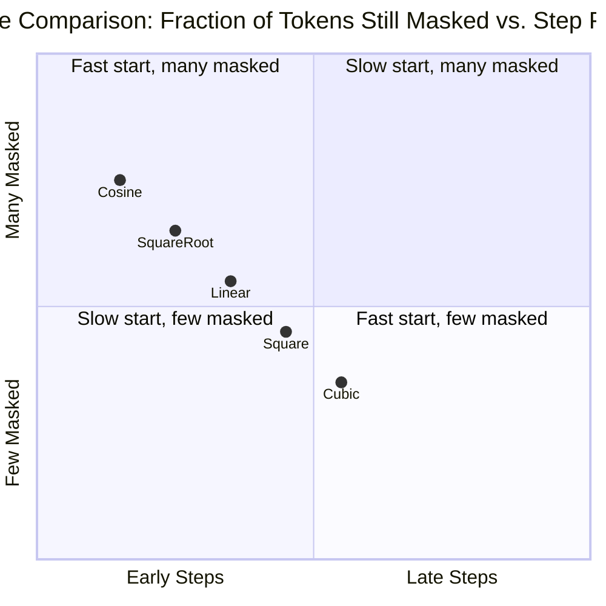
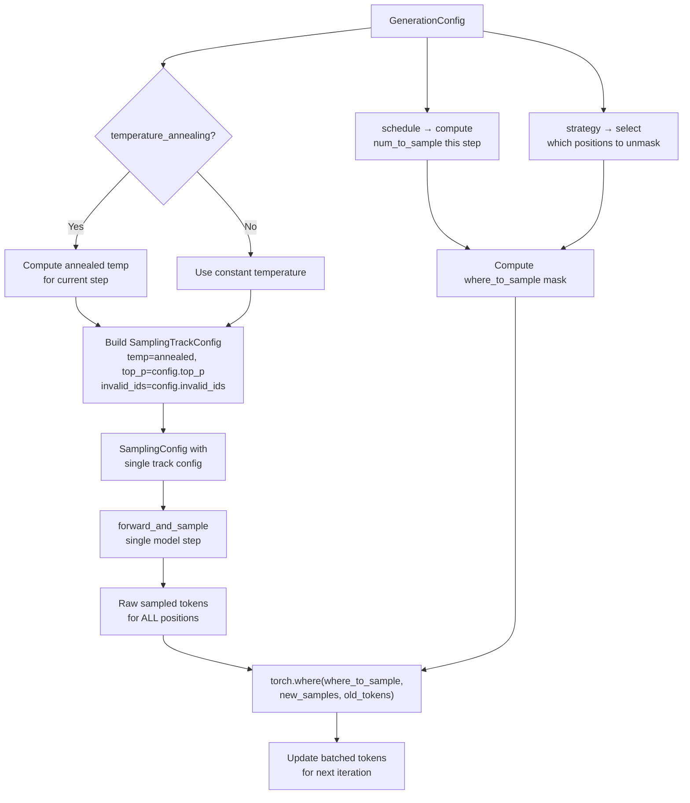

---
slug:18-generation-configuration-reference
blog_type:normal
---


ESM3 的生成流程由两个互补的配置层控制：**GenerationConfig** 控制高级的迭代解码策略（对哪个轨迹进行采样、执行多少步、采用何种揭码调度），而 **SamplingConfig** 控制低级的逐令牌选择（温度、top-p、有效令牌过滤）。理解这两个层级——以及它们在迭代掩码采样循环中是如何组合的——对于引导蛋白质生成朝向预期结果至关重要。本参考文档详细说明了每个可配置参数、其默认值、有效范围，及其对生成循环的精确影响。

来源：[api.py](/esm/sdk/api.py#L293-L326)，[generation.py](/esm/utils/generation.py#L355-L534)

## GenerationConfig — 高级解码控制

`GenerationConfig` 是传递给 `client.generate()` 和 `client.batch_generate()` 的主要配置对象。它指定生成*什么*（轨迹）、执行*多少*个迭代解码步，以及*哪种*策略决定令牌揭码的顺序。每个参数都具有经过精心挑选的默认值，适用于通用生成任务，但也可以针对特定设计目标进行调整。

```python
from esm.sdk.api import GenerationConfig

config = GenerationConfig(
    track="sequence",
    schedule="cosine",
    strategy="random",
    num_steps=20,
    temperature=1.0,
    temperature_annealing=True,
    top_p=1.0,
    condition_on_coordinates_only=True,
    only_compute_backbone_rmsd=False,
    invalid_ids=[],
)
```

来源：[api.py](/esm/sdk/api.py#L293-L326)

### 参数参考

| 参数 | 类型 | 默认值 | 有效值 | 描述 |
|---|---|---|---|---|
| `track` | `str` | `""` | `"sequence"`, `"structure"`, `"secondary_structure"`, `"sasa"`, `"function"` | 要迭代采样的蛋白质轨迹。**不能**是 `"coordinates"` 或 `"residue_annotations"`——它们是派生的，或通过单独的逻辑处理。 |
| `invalid_ids` | `Sequence[int]` | `[]` | 任意整数令牌 ID 列表 | 在所选轨迹的采样词表中要排除的令牌 ID。适用于抑制特定残基或结构令牌。 |
| `schedule` | `str` | `"cosine"` | `"cosine"`, `"linear"` | 控制各步之间揭开掩码令牌的*速率*。余弦调度在早期揭开更多令牌；线性调度以恒定速率揭码。 |
| `strategy` | `str` | `"random"` | `"random"`, `"entropy"` | 控制每步揭开*哪些*掩码位置。`"entropy"` 优先选择熵最低（最确信）的位置；`"random"` 则均匀随机选择。 |
| `num_steps` | `int` | `20` | `1` 到序列长度 | 迭代前向与采样的轮数。超过约 20 步后收益递减。如果掩码位置数量少于 `num_steps`，则会自动减少步数。 |
| `temperature` | `float` | `1.0` | `0.0` 到 `∞` | 每步应用的采样温度。`0.0` 产生贪心（argmax）解码。值越高，随机性越大。 |
| `temperature_annealing` | `bool` | `True` | `True`, `False` | 为 `True` 时，温度在 `num_steps` 内从 `temperature` 向 `0.001` 二次衰减。产生多样化的早期样本，并逐步收敛至确信的预测。 |
| `top_p` | `float` | `1.0` | `0.0` 到 `1.0` | 核采样阈值。累积概率 ≤ `top_p` 的令牌被保留；其余在采样前被掩码为 `-inf`。`1.0` 表示禁用过滤。 |
| `condition_on_coordinates_only` | `bool` | `True` | `True`, `False` | 为 `True` 且提供了坐标时，结构令牌会被清除，使模型仅基于 3D 坐标而非预编码的结构令牌进行条件生成。 |
| `only_compute_backbone_rmsd` | `bool` | `False` | `True`, `False` | 为 `True` 时，在评估期间计算 RMSD 时仅考虑骨架原子。不直接影响生成行为。 |

来源：[api.py](/esm/sdk/api.py#L293-L326)，[generation.py](/esm/utils/generation.py#L368-L398)

### 预设策略

`GenerationConfig` 提供了两个便捷方法，将相互兼容的参数选择打包为经过验证的配置。这些预设编码了关于调度、策略和退火如何相互作用的架构洞察——调用它们会覆盖相关字段。

| 方法 | 调度 | 策略 | 退火 | 用例 |
|---|---|---|---|---|
| `use_entropy_based_unmasking_strategy()` | `"cosine"` | `"entropy"` | `False` | 确定性的高保真生成。最低熵的位置被优先解析，从而产生级联的确信预测。最适用于结构预测与优化。 |
| `use_generative_unmasking_strategy()` | `"cosine"` | `"random"` | `True` | 创造性的多样化生成。带退火的随机揭码在早期步骤鼓励探索，在后期步骤促进收敛。最适用于*从头*蛋白质设计。 |

```python
config = GenerationConfig(track="sequence")
config.use_entropy_based_unmasking_strategy()  # 确定性优化
# 等价于：schedule="cosine", strategy="entropy", temperature_annealing=False

config = GenerationConfig(track="structure")
config.use_generative_unmasking_strategy()    # 创造性设计
# 等价于：schedule="cosine", strategy="random", temperature_annealing=True
```

来源：[api.py](/esm/sdk/api.py#L315-L326)

## SamplingConfig — 逐步令牌选择

`GenerationConfig` 编排迭代循环，而 `SamplingConfig` 则控制每个步骤*内部*的操作：如何将原始 logits 转换为令牌选择。它按轨迹组织，每个轨迹可以接收独立的 `SamplingTrackConfig`。这是传递给 `client.forward_and_sample()` 的配置，供想要单步控制的进阶用户使用。

```python
from esm.sdk.api import SamplingConfig, SamplingTrackConfig

sampling_config = SamplingConfig(
    sequence=SamplingTrackConfig(temperature=0.8, top_p=0.95, topk_logprobs=5),
    structure=SamplingTrackConfig(temperature=1.0, top_p=1.0),
    secondary_structure=None,   # 跳过此轨迹的采样
    sasa=None,
    function=None,
)
```

来源：[api.py](/esm/sdk/api.py#L337-L366)

### SamplingTrackConfig 参数参考

| 参数 | 类型 | 默认值 | 描述 |
|---|---|---|---|
| `temperature` | `float` | `1.0` | 分类采样的 Softmax 温度。`0.0` → 贪心 argmax；`1.0` → 标准采样；`>1.0` → 更平坦、更随机的分布。 |
| `top_p` | `float` | `1.0` | 核采样截断值。仅考虑累积 Softmax 概率 ≤ `top_p` 的令牌。`1.0` 表示禁用核过滤。 |
| `only_sample_masked_tokens` | `bool` | `True` | 为 `True` 时，仅对当前持有掩码令牌的位置进行重采样；未掩码的位置予以保留。为 `False` 时，允许对所有非特殊位置进行重采样。 |
| `invalid_ids` | `Sequence[int]` | `[]` | 要从采样词表中排除的令牌 ID。在 Softmax 之前，这些 ID 会在 logit 张量中被掩码为 `-inf`。 |
| `topk_logprobs` | `int` | `0` | 每个位置返回的前 k 个对数概率和令牌 ID 的数量。`0` 表示禁用。最大允许值为 32（每个轨迹的 `MAX_TOPK` 常量）。 |

来源：[api.py](/esm/sdk/api.py#L337-L343)，[api.py](/esm/utils/constants/api.py#L1-L5)

### 特定轨迹的默认值与约束

当 `iterative_sampling_tokens` 从 `GenerationConfig` 内部构造 `SamplingConfig` 时，它会为目标轨迹创建一个单独的 `SamplingTrackConfig`，并将所有其他轨迹设为 `None`。默认的采样配置工厂为每个轨迹提供了基线设置：

| 轨迹 | 默认 `only_sample_masked_tokens` | 默认 `temperature` | 默认 `top_p` | 最大 `topk_logprobs` |
|---|---|---|---|---|
| `sequence` | `True` | `1.0` | `1.0` | 32 |
| `structure` | `True` | `1.0` | `1.0` | 32 |
| `secondary_structure` | `False` | `1.0` | `1.0` | 32 |
| `sasa` | `False` | `1.0` | `1.0` | 32 |
| `function` | `False` | `1.0` | `1.0` | 32 |

对于 `secondary_structure`、`sasa` 和 `function`，`only_sample_masked_tokens` 标志为 `False`，因为这些轨迹使用了专门的采样逻辑（`function` 使用基于 argmax 的 `<none>` 过滤，残基注释使用基于阈值的选取，SASA 使用连续区间期望值），在这些逻辑中重采样所有位置才是预期行为。

<CgxTip>将某个轨迹的 `topk_logprobs` 设置为 `> 0`，会在 `ForwardAndSampleOutput` 中同时返回前 k 个对数概率及对应的令牌 ID。这对于分析模型置信度和探索替代预测非常有价值，但会增加输出大小——在批量处理场景中请谨慎使用。</CgxTip>

来源：[sampling.py](/esm/utils/sampling.py#L109-L131)，[api.py](/esm/utils/constants/api.py#L1-L5)

## 噪声调度 — 揭码速率控制

`GenerationConfig` 中的 `schedule` 参数选择一个噪声调度函数，该函数将当前步长比率 `t = step / num_steps`（`[0, 1]` 之间的值）映射到该步之后*仍被掩码的令牌比例*。调度决定了在迭代解码过程中揭开令牌的激进程度。尽管注册表中包含五个函数，但 `GenerationConfig` 仅针对 `"cosine"` 和 `"linear"` 进行验证。



| 调度 | 公式 | 行为 | 生成效果 |
|---|---|---|---|
| `cosine` | `cos(t · π/2)` | 早期揭开大量令牌，晚期揭开较少 | 快速构建粗略结构 → 精细优化。两种预设的默认选项。 |
| `linear` | `1 - t` | 每步揭开恒定比例的令牌 | 整个解码过程步调均匀。步与步之间的变化更可预测。 |

余弦调度源于 MaskGIT 论文，其作为默认选项的原因在于，这种前置加载式的揭码方式与 ESM3 多模态预测的聚合过程高度契合：早期步骤建立全局骨架，后期步骤优化局部细节。在步 `s` 中揭开的令牌数量计算为 `still_masked - round(schedule((s+1) / num_steps) * total_to_sample + 0.1)`，其中一个小 epsilon 值用于防止舍入误差。

来源：[noise_schedules.py](/esm/utils/noise_schedules.py#L1-L34)，[generation.py](/esm/utils/generation.py#L282-L296)

## 温度退火 — 从探索到收敛

当 `temperature_annealing=True`（生成式预设的默认值）时，每步的有效温度从初始 `temperature` 向 `0.001` 呈二次衰减：

```
annealed_temp(step) = max(initial_temp - step / max(1, num_steps - 1), 0.001)²
```

这创建了一条生成轨迹：从高随机性（探索多样化的令牌候选）开始，并逐渐收紧至近贪心选择（锁定确信的预测）。二次衰减意味着从探索到利用的过渡是平滑而非突变的。

| 步长比率 | 有效温度 (initial=1.0) | 采样行为 |
|---|---|---|
| 0.0 | 1.000 | 完全随机 — 多样化候选 |
| 0.25 | 0.562 | 中度探索 |
| 0.50 | 0.250 | 收窄选择 |
| 0.75 | 0.062 | 近贪心 — 高置信度 |
| 1.0 | 0.000001 | 实质上等同于 argmax |

当 `temperature_annealing=False`（基于熵的预设）时，温度在所有步骤中保持为 `config.temperature` 不变。这在使用基于熵的揭码时是合适的，因为该策略本身已经处理了置信度排序——位置是从最确定到最不确定依次解析的，这使得退火变得多余。

<CgxTip>在 `temperature_annealing=False` 的情况下设置 `temperature=0.0` 会产生完全确定性的贪心解码。然而，不支持部分温度为 0（即某些位置为 0 而其他位置不为 0）的情况，这将引发断言错误。</CgxTip>

来源：[generation.py](/esm/utils/generation.py#L350-L352)，[generation.py](/esm/utils/generation.py#L454-L459)，[sampling.py](/esm/utils/sampling.py#L185-L189)

## 揭码策略 — 位置选择逻辑

`strategy` 参数控制每步中选择*哪些*掩码位置进行揭码。在调度决定了要揭开*多少*位置之后，策略决定*哪些*位置被揭开。

### 基于熵的策略 (`"entropy"`)

在每一步中，模型根据 logit 分布计算每个位置的熵。选择具有**最低熵**（最高置信度）的 `num_to_sample` 个位置进行揭码。这会产生级联效应：首先解析确信的位置，为后续步骤中相邻不确定的位置提供更强的条件约束。

```python
# 内部逻辑（简化版）：
track_entropy = entropy_forward_output[track]       # (B, L) 或 (B, L, D)
if track == "function":
    track_entropy = track_entropy.sum(-1)            # (B, L, D) → (B, L)
track_entropy.masked_fill_(~sampling_mask, max_val)  # 排除非掩码位置
_, indices = track_entropy.topk(num_to_sample, largest=False)
where_to_sample = sampling_mask & is_top_k
```

### 随机策略 (`"random"`)

在每一步中，掩码位置被随机打乱，并选择前 `num_to_sample` 个位置。这不存在位置偏差，从而增加了不同运行之间输出的多样性——非常适合生成式设计，此时你希望探索解空间，而不是收敛到单一预测。

```python
# 内部逻辑（简化版）：
masked_indices = sampling_mask.nonzero()
shuffled = masked_indices[torch.randperm(len(masked_indices))]
selected = shuffled[:num_to_sample]
```

来源：[generation.py](/esm/utils/generation.py#L298-L330)

## 迭代循环中的配置组合

下图展示了 `GenerationConfig` 和 `SamplingConfig` 在核心生成例程 `iterative_sampling_tokens` 期间是如何组合的。`GenerationConfig` 参数用于派生控制每次前向与采样调用的逐步 `SamplingTrackConfig`。



关键洞察在于，`GenerationConfig` 参数**并不**直接传递给采样函数。相反，在每一步 `t`，迭代循环会：(1) 计算退火温度（如果启用），(2) 从 `GenerationConfig` 字段构造 `SamplingTrackConfig`，(3) 将其包装在针对目标轨迹的 `SamplingConfig` 中，(4) 运行完整的前向与采样以获取*所有*位置的预测，然后 (5) 使用调度和策略来选择提交*哪些*预测。这意味着来自 `GenerationConfig` 的 `top_p` 和 `temperature` 会影响逐步采样，而 `schedule` 和 `strategy` 控制步间的提交逻辑。

来源：[generation.py](/esm/utils/generation.py#L410-L534)

## 不支持的轨迹与边缘情况

迭代采样循环明确拒绝某些轨迹组合，并处理一些需要特别注意的边缘情况：

| 场景 | 行为 |
|---|---|
| `track="coordinates"` | 抛出 `ESMProteinError(500)` — 坐标不进行迭代采样；它们是通过 VQ-VAE 解码器从结构令牌解码而来的。 |
| `track="residue_annotations"` | 抛出 `ESMProteinError(500)` — 残基注释是多热伯努利预测，而非分类预测，并且是使用基于阈值的选取从 function 轨迹的 logits 派生而来的。 |
| `num_steps > number of masked tokens` | `num_steps` 自动减少为掩码位置的数量。不会发出警告。 |
| 输入在目标轨迹中没有掩码位置 | 抛出 `ValueError("Cannot sample {track} when input has no masks.")` — 必须至少存在一个掩码令牌才能开始生成。 |
| `topk_logprobs > MAX_TOPK (32)` | `validate_sampling_config` 发出警告（或在 `on_invalid="raise"` 时抛出异常）。输出会被截断至最大值。 |
| 带有 `invalid_ids` 的 function 轨迹 | 发出警告：`"For function sampling, invalid_ids sampling config is not supported."` 该参数对于 function 令牌将被忽略。 |

来源：[generation.py](/esm/utils/generation.py#L423-L428)，[generation.py](/esm/utils/generation.py#L390-L393)，[generation.py](/esm/utils/generation.py#L277-L278)，[sampling.py](/esm/utils/sampling.py#L133-L150)，[generation.py](/esm/utils/generation.py#L642-L643)

## 实用配置方案

下表将常见的生成目标映射为推荐的 `GenerationConfig` 设置。这些只是起点——请根据你特定的序列长度和所需的多样性来微调 `temperature` 和 `top_p`。

| 目标 | 轨迹 | 调度 | 策略 | 退火 | 温度 | 备注 |
|---|---|---|---|---|---|---|
| 从结构生成序列 | `"sequence"` | `"cosine"` | `"entropy"` | `False` | `1.0` | 逆折叠：使用 `entropy` 实现高保真序列恢复。 |
| 从序列生成结构 | `"structure"` | `"cosine"` | `"entropy"` | `False` | `1.0` | 结构预测：熵优先解析确信的位置。 |
| 从头序列设计 | `"sequence"` | `"cosine"` | `"random"` | `True` | `1.0` | 创造性：随机揭码 + 退火探索多样化序列。 |
| 从头结构设计 | `"structure"` | `"cosine"` | `"random"` | `True` | `1.0` | 具有收敛性的创造性结构生成。 |
| 高温探索 | `"sequence"` | `"cosine"` | `"random"` | `True` | `1.5` | 以局部连贯性为代价换取更广的多样性。 |
| 低温优化 | `"sequence"` | `"cosine"` | `"entropy"` | `False` | `0.5` | 更尖锐的预测，较少的多样性。 |
| 部分轨迹修复 | `"sequence"` | `"cosine"` | `"entropy"` | `False` | `1.0` | 仅掩码特定残基；熵保持上下文保真度。 |

来源：[api.py](/esm/sdk/api.py#L293-L326)，[generation.py](/esm/utils/generation.py#L350-L352)

---

**下一步**：有关迭代掩码采样循环的数学基础，请参阅 [Iterative Masked Sampling](16-iterative-masked-sampling)。关于噪声调度如何控制揭码动态的深入探讨，请参阅 [Noise Schedules and Unmasking Strategies](17-noise-schedules-and-unmasking-strategies)。要使用 Forge API 将这些配置付诸实践，请参阅 [Forge API Client](19-forge-api-client) 或 [Local Inference Client](20-local-inference-client)。