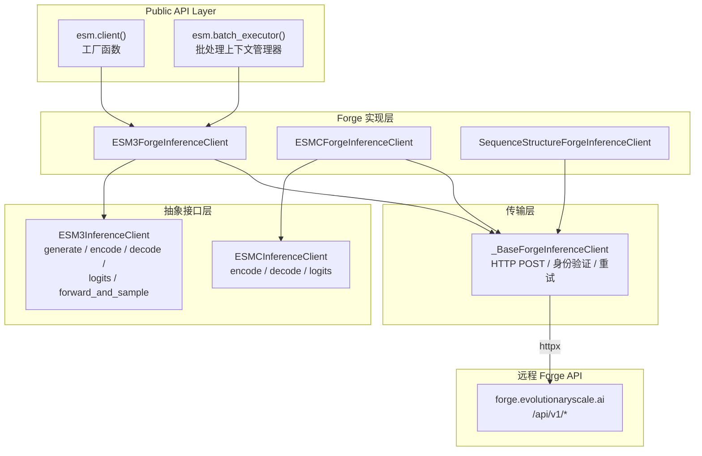
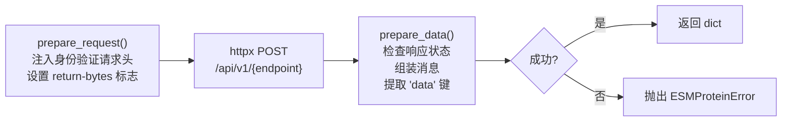

---
slug:19-forge-api-client
blog_type:normal
---


**Forge API 客户端**是通往 EvolutionaryScale 云托管 ESM 模型的远程推理网关。它提供了一个功能完备的 Python SDK，镜像了 `ESM3InferenceClient` 和 `ESMCInferenceClient` 中定义的抽象推理接口，将每个本地方法调用转化为向 `https://forge.evolutionaryscale.ai` 上的 Forge REST API 发起的带身份验证的 HTTP 请求。该 SDK 附带三个专用的客户端类——用于多模态生成推理的 **ESM3ForgeInferenceClient**、用于表征层推理的 **ESMCForgeInferenceClient**，以及用于折叠和逆折叠的 **SequenceStructureForgeInferenceClient**——它们均构建在共享的 HTTP 传输层之上，具备自动重试、连接池以及同步和异步执行路径。

来源: [__init__.py](esm/sdk/__init__.py#L1-L37), [forge.py](esm/sdk/forge.py#L1-L33)

## 架构概述

Forge 客户端遵循分层架构，其中抽象接口定义契约，共享基类处理 HTTP 传输，具体客户端实现各个模型家族的请求/响应序列化。每个公共方法都存在同步和 `async_` 变体，并且所有方法都装饰有处理瞬时服务器错误的自动重试机制。



工厂函数 `esm.client()` 默认返回一个 `ESM3ForgeInferenceClient`，从 `ESM_API_KEY` 环境变量中读取 API 令牌。`esm.batch_executor()` 返回一个用于并行批处理工作负载的 `ForgeBatchExecutor` 上下文管理器。ESM3 和 ESM-C 客户端都使用了**多重继承**——将各自的抽象接口与 `_BaseForgeInferenceClient` 相结合——在复用 HTTP 传输的同时强制执行完整的 API 契约。

来源: [__init__.py](esm/sdk/__init__.py#L9-L23), [api.py](esm/sdk/api.py#L431-L532), [base_forge_client.py](esm/sdk/base_forge_client.py#L10-L33)

## 客户端初始化与身份验证

所有三个 Forge 客户端通过 `_BaseForgeInferenceClient` 共享通用的初始化模式。**token** 参数是必填的——传入空字符串会立即触发 `RuntimeError`。该令牌作为 Bearer 凭据存储在 `Authorization` 请求头中，并附加到每个发出的请求上。

```python
from esm.sdk import client

# 推荐方式：从环境变量 ESM_API_KEY 中读取令牌
forge_client = client(model="esm3-sm-open-v1")

# 显式指定令牌和自定义端点
forge_client = client(
    model="esm3-sm-open-v1",
    url="https://forge.evolutionaryscale.ai",
    token="your_api_token_here",
    request_timeout=300,
)
```

| 参数 | 类型 | 默认值 | 描述 |
|---|---|---|---|
| `model` | `str` | `"esm3-sm-open-v1"` | Forge API 的模型标识符 |
| `url` | `str` | `"https://forge.evolutionaryscale.ai"` | Forge 服务器 URL |
| `token` | `str` | `""`（读取 `ESM_API_KEY` 环境变量） | API 身份验证令牌 |
| `request_timeout` | `int \| None` | `None` | 单次请求超时时间（秒）（None = 无限期等待） |
| `min_retry_wait` | `int` | `1` | 首次重试前的最短等待秒数 |
| `max_retry_wait` | `int` | `10` | 两次重试间的最长等待秒数 |
| `max_retry_attempts` | `int` | `5` | 最大重试次数 |

<CgxTip>对于 ESM3 模型，请始终使用 `esm.client()` 工厂函数；仅在使用 ESM-C 模型时才直接构造 `ESMCForgeInferenceClient`。该工厂函数会自动从你的环境中读取 `ESM_API_KEY`，避免传入空令牌的常见错误。</CgxTip>

基础客户端在首次访问时延迟实例化 `httpx.Client` 和 `httpx.AsyncClient`，支持同一实例的同步和异步用法。它还实现了上下文管理器协议（`__enter__`/`__exit__` 和 `__aenter__`/`__aexit__`），用于正确清理连接。

来源: [__init__.py](esm/sdk/__init__.py#L9-L23), [base_forge_client.py](esm/sdk/base_forge_client.py#L10-L68), [forge.py](esm/sdk/forge.py#L66-L93)

## ESM3ForgeInferenceClient — 高层端点

`ESM3ForgeInferenceClient` 是 ESM3 多模态生成模型的主要客户端。它实现了完整的 `ESM3InferenceClient` 接口，包含六项核心操作，每项操作均提供同步和异步变体。

### Generate（生成）

**generate** 端点是最高层的 API——它接受 `ESMProtein`（原始轨道空间）或 `ESMProteinTensor`（分词空间），并根据 `GenerationConfig` 迭代填充指定的轨道。当使用 `ESMProtein` 调用时，客户端内部会调用 `/api/v1/generate` 端点；当使用 `ESMProteinTensor` 调用时，则会调用 `/api/v1/generate_tensor` 端点。

```python
from esm.sdk.api import ESMProtein, GenerationConfig

protein = ESMProtein(sequence="_______________")  # 15 个 mask token
config = GenerationConfig(track="sequence", num_steps=20, temperature=1.0)

# 同步调用
result = forge_client.generate(protein, config)

# 异步调用
result = await forge_client.async_generate(protein, config)
```

generate 方法包含一个安全防护：如果 `num_steps` 超过序列长度，它将自动设限并打印警告。此外，当生成的轨道不是 `"function"` 或 `"residue_annotations"` 时，输入的 `function_annotations` 将在输出中保留，因为 function token 的编码/解码是有损的。

### Encode 和 Decode（编码与解码）

**encode** 将原始表示（序列字符串、坐标张量）的 `ESMProtein` 转换为分词表示的 `ESMProteinTensor`。**decode** 执行逆操作，将分词数据转换回原始轨道，包括预测的 `plddt` 和 `ptm` 指标。这是[编码-解码流水线](22-encode-decode-pipeline)的两个 halves。

```python
# 编码：raw → tokenized
protein_tensor = forge_client.encode(ESMProtein(sequence="MKWVTFISL"))

# 解码：tokenized → raw
protein = forge_client.decode(protein_tensor)
```

### Forward and Sample（前向与采样）

**forward_and_sample** 是面向高级用户的端点。它运行一次模型的前向传播，并根据逐轨道的 `SamplingConfig` 对 token 进行采样。与 `generate` 不同，它不进行迭代——仅执行一次前向传播，返回包含采样 token、对数概率、熵、top-k 预测以及可选嵌入的 `ForwardAndSampleOutput`。该请求使用 `Accept: application/x-es-pickle` 请求头来协商张量数据的高效二进制序列化。

```python
from esm.sdk.api import ESMProteinTensor, SamplingConfig, SamplingTrackConfig

sampling_config = SamplingConfig(
    sequence=SamplingTrackConfig(temperature=0.5, top_p=0.9),
    return_mean_embedding=True,
    return_per_residue_embeddings=True,
)
output = forge_client.forward_and_sample(protein_tensor, sampling_config)
# output.protein_tensor  — 采样得到的 ESMProteinTensor
# output.mean_embedding  — 序列级嵌入
# output.entropy         — 逐轨道的熵 ForwardTrackData
```

### Logits（逻辑值）

**logits** 端点返回原始的模型 logits，主要用于高级用例。API 不建议频繁使用，因为 logit 张量非常大。`return_bytes=True` 的默认值通过 base64 编码的 pickle 序列化启用高效的二进制传输，随后在客户端使用 `deserialize_tensors` 进行解码。

### Batch Generate（批量生成）

`batch_generate` 和 `async_batch_generate` 并行化多个 `generate` 调用。同步变体使用 `ThreadPoolExecutor`，而异步变体使用 `asyncio.gather`。单个失败会被捕获为 `ESMProteinError` 结果，而不是为整个批次抛出异常。

来源: [forge.py](esm/sdk/forge.py#L285-L928), [api.py](esm/sdk/api.py#L291-L428)

## ESM3ForgeInferenceClient — 端点概览

| 端点 | 同步方法 | 异步方法 | 输入类型 | 输出类型 | API 路径 |
|---|---|---|---|---|---|
| Generate (raw) | `generate()` | `async_generate()` | `ESMProtein` | `ESMProtein` | `/api/v1/generate` |
| Generate (token) | `generate()` | `async_generate()` | `ESMProteinTensor` | `ESMProteinTensor` | `/api/v1/generate_tensor` |
| Encode | `encode()` | `async_encode()` | `ESMProtein` | `ESMProteinTensor` | `/api/v1/encode` |
| Decode | `decode()` | `async_decode()` | `ESMProteinTensor` | `ESMProtein` | `/api/v1/decode` |
| Forward & Sample | `forward_and_sample()` | `async_forward_and_sample()` | `ESMProteinTensor` | `ForwardAndSampleOutput` | `/api/v1/forward_and_sample` |
| Logits | `logits()` | `async_logits()` | `ESMProteinTensor` | `LogitsOutput` | `/api/v1/logits` |
| Batch Generate | `batch_generate()` | `async_batch_generate()` | `Sequence[ProteinType]` | `Sequence[ProteinType]` | (并行化的 `generate`) |

来源: [forge.py](esm/sdk/forge.py#L621-L928)

## ESMCForgeInferenceClient — 表征模型客户端

`ESMCForgeInferenceClient` 实现了 ESM-C 表征模型的 `ESMCInferenceClient` 接口。与 ESM3 不同，ESM-C 仅在**序列轨道**上操作——它不处理结构、二级结构、SASA 或 function token。这一限制反映在其简化的 encode/decode/logits 实现中。

```python
from esm.sdk.forge import ESMCForgeInferenceClient

esmc_client = ESMCForgeInferenceClient(
    model="esmc-300m-2024-12",
    token=os.environ.get("ESM_API_KEY", ""),
)

# 编码：仅处理序列
protein_tensor = esmc_client.encode(ESMProtein(sequence="MKWVTFISL"))
# protein_tensor.sequence 已填充；所有其他轨道为 None

# Logits：仅序列 logits 可用
logits_output = esmc_client.logits(protein_tensor, LogitsConfig(sequence=True))
```

| 端点 | 输入类型 | 输出类型 | 处理的轨道 |
|---|---|---|---|
| Encode | `ESMProtein` | `ESMProteinTensor` | 仅序列 |
| Decode | `ESMProteinTensor` | `ESMProtein` | 仅序列 |
| Logits | `ESMProteinTensor` | `LogitsOutput` | 仅序列 |

来源: [forge.py](esm/sdk/forge.py#L931-L1117)

## SequenceStructureForgeInferenceClient — 折叠端点

`SequenceStructureForgeInferenceClient` 提供了三个用于结构预测和 MSA 检索的专用端点，独立于 ESM3/ESM-C 的生成 API。

### Fold（折叠）

**fold** 从蛋白质序列预测 3D 坐标。它将序列发送到 `/api/v1/fold`，并返回填充了 `coordinates`、`ptm` 和 `plddt` 的 `ESMProtein`。

### Inverse Fold（逆折叠）

**inverse_fold** 从 3D 坐标生成蛋白质序列——即从结构到序列的方向。它接受 `torch.Tensor` 形式的坐标和用于采样参数的 `InverseFoldingConfig`，并返回带有预测序列的 `ESMProtein`。

### MSA 检索

**_fetch_msa** 通过 `/api/v1/msa` 检索给定序列的多序列比对。这是一个长时间运行的操作（客户端会打印 "Fetching MSA ... this may take a few minutes"）。`|` 和 `:` 字符均被接受为链断裂 token，并在内部进行规范化。

| 端点 | 同步方法 | 异步方法 | 输入 | 输出 |
|---|---|---|---|---|
| Fold | `fold()` | `async_fold()` | 序列 `str` | 带有坐标的 `ESMProtein` |
| Inverse Fold | `inverse_fold()` | `async_inverse_fold()` | 坐标 `Tensor` + `InverseFoldingConfig` | 带有序列的 `ESMProtein` |
| MSA | `_fetch_msa()` | `_async_fetch_msa()` | 序列 `str` | `MSA` 对象 |

来源: [forge.py](esm/sdk/forge.py#L65-L283)

## HTTP 传输与请求流水线

所有 Forge 客户端均通过 `_BaseForgeInferenceClient._post()`（同步）和 `_BaseForgeInferenceClient._async_post()`（异步）路由请求。该流水线遵循一致的流程：



`prepare_request` 方法将 Bearer 令牌合并到请求头中，并为支持二进制序列化的端点可选地设置 `return-bytes: true` 请求头。`prepare_data` 方法检查 `response.is_success`，如果失败则抛出带有 HTTP 状态码和响应体的 `ESMProteinError`。如果成功，它会调用 `assemble_message` 解析响应，并在响应使用 Next.js 风格嵌套时提取 `"data"` 键。响应中的任何 `warning_messages` 都会以红色打印到 stderr。

<CgxTip>Forge API 使用 Next.js 风格的响应封装，输出可能嵌套在 `data.outputs` 之下。客户端的 `prepare_data` 方法会自动提取这种嵌套。如果你检查原始 HTTP 响应，会遇到这种间接结构；SDK 会透明地处理它。</CgxTip>

来源: [base_forge_client.py](esm/sdk/base_forge_client.py#L70-L162)

## 自动重试机制

每个公共客户端方法都使用 `@retry_decorator` 进行装饰，该装饰器将调用包装在基于 `tenacity` 的重试循环中。装饰器在装饰时检查函数以确定其是否为协程，并应用相应的同步或异步包装器。

**重试触发条件** — 装饰器会在遇到带有 HTTP 状态码 `{429, 500, 502, 504}` 的 `ESMProteinError` 异常（或返回值）时进行重试。这些状态码对应于速率限制和瞬时服务器故障。客户端错误（4xx 中除 429 以外的错误）**不会**被重试。

**重试时间** — 使用 `wait_incrementing`，具有可配置的起始值（`min_retry_wait`，默认 1 秒）和最大值（`max_retry_wait`，默认 10 秒），每次尝试增加 1 秒。最大尝试次数由 `max_retry_attempts`（默认 5 次）控制。

**跳过机制** — 名为 `skip_retries_var` 的 `ContextVar` 允许调用者禁用特定操作的重试，这在需要显式处理失败的批处理场景中非常有用。

**错误回调** — 在所有重试尝试最终失败后，`return_last_value` 会将最后一个 `ESMProteinError` 作为值返回而不是抛出它，这与客户端返回 `ESMProtein | ESMProteinError` 联合类型的模式相匹配。

```python
from esm.sdk.retry import skip_retries_var

# 为特定调用禁用重试
token = skip_retries_var.set(True)
try:
    result = forge_client.generate(protein, config)
finally:
    skip_retries_var.reset(token)
```

来源: [retry.py](esm/sdk/retry.py#L1-L86)

## 配置数据类型

Forge 客户端依赖 `esm.sdk.api` 中多个由 `attrs` 定义的配置类。这些类被直接序列化为每个端点的 JSON 请求体。

### GenerationConfig

控制 `generate` 端点的迭代生成过程。

| 字段 | 类型 | 默认值 | 描述 |
|---|---|---|---|
| `track` | `str` | `""` | 要生成的目标轨道（序列、结构等） |
| `invalid_ids` | `Sequence[int]` | `[]` | 采样时要排除的 token ID |
| `schedule` | `str` | `"cosine"` | 揭掩码计划：`"cosine"` 或 `"linear"` |
| `strategy` | `str` | `"random"` | token 选择策略：`"random"` 或 `"entropy"` |
| `num_steps` | `int` | `20` | 迭代解码步数 |
| `temperature` | `float` | `1.0` | 采样温度 |
| `temperature_annealing` | `bool` | `True` | 是否在各步中对温度进行退火 |
| `top_p` | `float` | `1.0` | 核采样阈值 |
| `condition_on_coordinates_only` | `bool` | `True` | 仅基于坐标进行条件生成 |

两种便捷方法配置了常用策略：`use_entropy_based_unmasking_strategy()` 设置余弦计划 + 熵策略 + 无退火，而 `use_generative_unmasking_strategy()` 设置余弦计划 + 随机策略 + 启用退火。有关基础理论，请参阅[迭代掩码采样](16-iterative-masked-sampling)和[噪声计划与揭掩码策略](17-noise-schedules-and-unmasking-strategies)。

### SamplingConfig 和 SamplingTrackConfig

控制单次前向传播的 `forward_and_sample` 端点，具有逐轨道的粒度控制。

| SamplingTrackConfig 字段 | 类型 | 默认值 | 描述 |
|---|---|---|---|
| `temperature` | `float` | `1.0` | 此轨道的采样温度 |
| `top_p` | `float` | `1.0` | 核采样阈值 |
| `only_sample_masked_tokens` | `bool` | `True` | 仅在掩码位置采样 |
| `invalid_ids` | `Sequence[int]` | `[]` | 要排除的 token ID |
| `topk_logprobs` | `int` | `0` | 要返回的 top-k 对数概率数量 |

`SamplingConfig` 聚合了五个可选的 `SamplingTrackConfig` 实例（sequence、structure、secondary_structure、sasa、function），以及 `return_per_residue_embeddings` 和 `return_mean_embedding` 标志。

### InverseFoldingConfig

| 字段 | 类型 | 默认值 | 描述 |
|---|---|---|---|
| `invalid_ids` | `Sequence[int]` | `[]` | 要排除的 token ID |
| `temperature` | `float` | `0.1` | 采样温度（低值以获得确定性输出） |
| `seed` | `int \| None` | `None` | 用于可复现性的随机种子 |
| `decode_in_residue_index_order` | `bool` | `False` | 按残基索引顺序解码 |

### LogitsConfig

| 字段 | 类型 | 默认值 | 描述 |
|---|---|---|---|
| `sequence` | `bool` | `False` | 返回序列 logits |
| `structure` | `bool` | `False` | 返回结构 logits（Forge 不支持） |
| `secondary_structure` | `bool` | `False` | 返回 SS logits（Forge 不支持） |
| `sasa` | `bool` | `False` | 返回 SASA logits（Forge 不支持） |
| `function` | `bool` | `False` | 返回 function logits（Forge 不支持） |
| `return_embeddings` | `bool` | `False` | 返回逐残基嵌入 |
| `return_mean_embedding` | `bool` | `False` | 返回平均池化嵌入 |
| `return_hidden_states` | `bool` | `False` | 返回隐藏状态 |
| `ith_hidden_layer` | `int` | `-1` | 提取哪一层 Transformer 层（-1 = 最后一层） |

来源: [api.py](esm/sdk/api.py#L291-L428)

## 错误处理

Forge 客户端使用 `ESMProteinError` 作为其统一的错误类型。它是 `Exception` 和 `ProteinType` 的子类，携带 `error_code`（HTTP 状态）和 `error_msg`。两种错误处理模式并存：

**作为值返回** — 大多数高层方法（`generate`、`encode`、`decode`、`fold`、`inverse_fold`）在内部捕获 `ESMProteinError`，并从其 `ProteinType | ESMProteinError` 联合类型中将其作为值返回。这使得调用者无需 try/except 即可检查失败：

```python
result = forge_client.generate(protein, config)
if isinstance(result, ESMProteinError):
    print(f"Error {result.error_code}: {result.error_msg}")
else:
    print(f"Generated sequence: {result.sequence}")
```

**作为异常抛出** — 传输层（`_post`、`_async_post`）在遇到 HTTP 失败或意外异常时抛出 `ESMProteinError`。重试装饰器会捕获这些异常，并在耗尽尝试后可能重新抛出。像 `forward_and_sample` 和 `logits` 这样的底层方法会传播异常，而不是将其作为值返回。

`ESMProteinError` 还被用作验证守卫：如果在不期望 `ESMProteinTensor` 的地方意外传入了 `ESMProteinError`，`_validate_protein_tensor_input` 会抛出 `ValueError`，从而防止将错误结果作为模型输入的静默误用。

来源: [api.py](esm/sdk/api.py#L286-L289), [forge.py](esm/sdk/forge.py#L53-L63), [base_forge_client.py](esm/sdk/base_forge_client.py#L85-L132)

## 数据序列化

Forge 客户端处理 Python 对象和 JSON 负载之间的双向转换。这涉及几种序列化模式：

**张量 → 列表**：`maybe_list()` 将 `torch.Tensor` 实例转换为嵌套的 Python 列表以进行 JSON 序列化，并通过 `convert_nan_to_none=True` 将 NaN 值替换为 `None`（因为 JSON 没有 NaN 表示）。

**列表 → 张量**：`maybe_tensor()` 执行逆转换，并通过 `convert_none_to_nan=True` 将 `None` 值恢复为结果张量中的 NaN。

**功能注释**：`FunctionAnnotation` 对象通过 `to_tuple()` 序列化为元组，并通过构造函数反序列化。

**二进制 logits**：对于 `logits` 和 `forward_and_sample` 端点，客户端可以通过 `Accept: application/x-es-pickle` 请求头和 `return-bytes: true` 自定义请求头请求二进制序列化。二进制响应是 base64 编码的 pickle 负载，由 `deserialize_tensors` 解码，这对于大型张量比 JSON 高效得多。

来源: [forge.py](esm/sdk/forge.py#L35-L50), [forge.py](esm/sdk/forge.py#L597-L619)

## 批量执行

除了每个客户端的 `batch_generate` 方法外，SDK 还通过 `esm.batch_executor()` 提供了专用的 `ForgeBatchExecutor` 上下文管理器。这是为需要进度跟踪和超出 `batch_generate` 所能提供的弹性的高吞吐量工作负载而设计的。

```python
from esm.sdk import batch_executor

with batch_executor(max_attempts=10, show_progress=True) as executor:
    executor.execute_batch(fn, **kwargs)
```

| 参数 | 类型 | 默认值 | 描述 |
|---|---|---|---|
| `max_attempts` | `int` | `10` | 放弃前的最大重试次数 |
| `show_progress` | `bool` | `True` | 显示 tqdm 进度条 |

来源: [__init__.py](esm/sdk/__init__.py#L26-L37)

## 下一步

- **本地推理**：要在没有网络依赖的情况下运行 ESM 模型，请参阅[本地推理客户端](20-local-inference-client)，了解使用 `esm.pretrained` 的离线推理路径。
- **编码-解码内部机制**：有关 Forge 的 encode/decode 端点在服务器端调用的分词流水线的详细信息，请参阅[编码-解码流水线](22-encode-decode-pipeline)。
- **生成理论**：要了解 `generate` 背后的迭代掩码采样算法，请参阅[迭代掩码采样](16-iterative-masked-sampling)和[生成配置参考](18-generation-configuration-reference)。
- **规模化部署**：有关基于 SageMaker 的批量执行，请参阅[SageMaker 与批处理执行](21-sagemaker-and-batch-execution)。