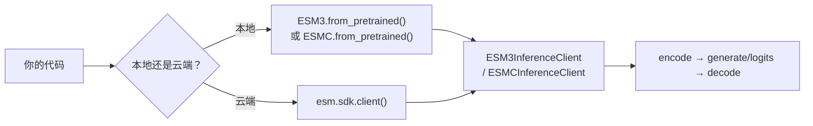
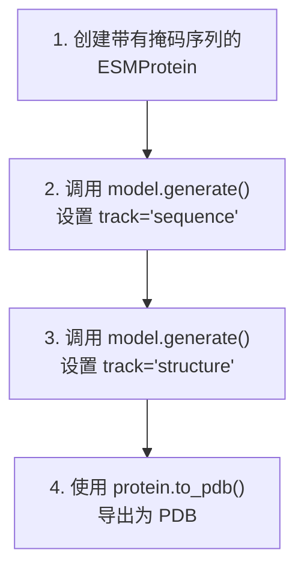
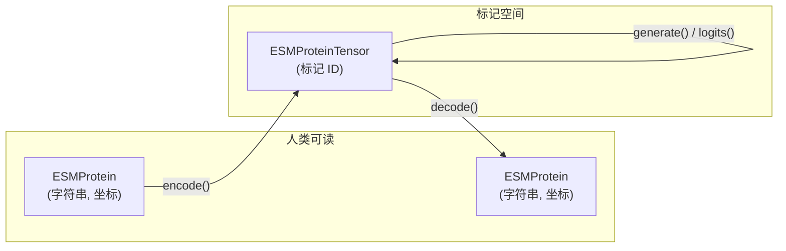

---
slug:2-quick-start
blog_type:normal
---


在五分钟内从零开始完成你的首次蛋白质生成。本页将带你安装 `esm` 库，在两个模型系列之间做出选择，并运行你的首次推理——无论是在本地硬件上还是通过云 API。

## 前提条件与安装

`esm` 包需要 **Python 3.12** 和 **PyTorch ≥ 2.2**。使用一条命令即可完成所有安装：

```bash
pip install esm
```

若要在 NVIDIA GPU 上加速注意力计算，可选择安装 Flash Attention：

```bash
pip install flash-attn --no-build-isolation
```

至此完成——所有核心依赖（transformers、biotite、BioPython、scikit-learn 等）都会被自动拉取。

<CgxTip>如果你使用的是 macOS ARM 或 Linux x86_64 架构，还可以使用内置的 **pixi** 环境。在代码库根目录运行 `pixi install`，即可创建一个类似 conda 的隔离环境，其中包含每个依赖的锁定版本，也包括构建工具。</CgxTip>

来源: [pyproject.toml](/pyproject.toml#L6-L9), [pyproject.toml](/pyproject.toml#L21-L45), [README.md](/README.md#L33-L36)

## 选择你的模型系列

ESM 提供两个截然不同的模型系列，各自针对不同的主要任务进行了优化：

| | **ESM3** (生成式) | **ESM C** (表征式) |
|---|---|---|
| **目的** | 可控蛋白质*生成*——折叠、逆折叠、设计 | 蛋白质*表征*——嵌入、logits、隐藏状态 |
| **输入模态** | 序列 + 结构 + 功能（多模态） | 仅序列 |
| **关键方法** | 搭配 `GenerationConfig` 的 `generate()` | 搭配 `LogitsConfig` 的 `logits()` |
| **开源模型** | `esm3-sm-open-v1` (14亿参数) | `esmc-300m` (3亿参数), `esmc-600m` (6亿参数) |
| **Forge 上的最大模型** | `esm3-large-2024-03` (980亿参数) | `esmc-6b-2024-12` (60亿参数) |
| **客户端类** | `ESM3InferenceClient` | `ESMCInferenceClient` |

**ESM 新手？** 如果你想设计或补全蛋白质，请从 **ESM3** 开始；如果你需要用于下游 ML 任务的嵌入，请从 **ESM C** 开始。


来源: [README.md](/README.md#L50-L69), [README.md](/README.md#L128-L146), [esm/sdk/api.py](/esm/sdk/api.py#L435-L520)

## 两种运行方式：本地 vs. Forge API

ESM 生态系统中的每个模型都可以通过两个可互换的客户端之一进行访问。两者的 API 接口完全一致——只需修改一行代码，其余代码保持不变。



### 本地推理（开放权重）

模型权重会在首次使用时从 HuggingFace Hub 下载并缓存在本地。你需要一个具有 **Read** 访问令牌的 HuggingFace 账户。

```python
from huggingface_hub import login
from esm.models.esm3 import ESM3
from esm.sdk.api import ESM3InferenceClient

login()  # 一次性操作：通过 HuggingFace Hub 进行身份验证

# 下载权重，并在 GPU 上实例化模型
model: ESM3InferenceClient = ESM3.from_pretrained("esm3-sm-open-v1").to("cuda")
```

`from_pretrained()` 类方法会处理权重下载、设备分配，并在 CUDA 设备上自动进行 bfloat16 转换。

来源: [esm/models/esm3.py](/esm/models/esm3.py#L247-L261), [esm/pretrained.py](/esm/pretrained.py#L93-L110), [README.md](/README.md#L71-L80)

### Forge API（云端推理）

对于本地硬件无法容纳的较大模型，请使用 **EvolutionaryScale Forge** 云服务。在 [forge.evolutionaryscale.ai](https://forge.evolutionaryscale.ai) 获取 API 令牌。

```python
import esm
from esm.sdk.api import ESM3InferenceClient

model: ESM3InferenceClient = esm.sdk.client(
    model="esm3-medium-2024-08",
    token="<your-forge-token>",       # 或者设置 ESM_API_KEY 环境变量
)
```

`esm.sdk.client()` 工厂方法会返回一个实现了相同 `ESM3InferenceClient` 接口的 `ESM3ForgeInferenceClient`——因此所有 `.generate()`、`.encode()`、`.decode()` 和 `.logits()` 调用的行为与本地推理完全一致。针对并发工作负载，还提供了异步变体（`async_generate`、`async_encode` 等）。

<CgxTip>将 `ESM_API_KEY` 环境变量设置为你的 Forge 令牌。这样 `esm.sdk.client()` 就会自动获取它——无需显式传递 `token=` 参数。代码片段中使用了此模式：`if os.environ.get("ESM_API_KEY", ""): main(client())`。</CgxTip>

来源: [esm/sdk/__init__.py](/esm/sdk/__init__.py#L5-L24), [esm/sdk/forge.py](/esm/sdk/forge.py#L1-L30), [README.md](/README.md#L96-L111), [cookbook/snippets/esm3.py](/cookbook/snippets/esm3.py#L200-L207)

## 你的首次生成 (ESM3)

ESM3 是一个**掩码语言模型**，能够对序列、结构和功能进行联合推理。你通过部分（掩码）输入作为提示词，它会迭代地填充空白。下划线字符 `_` 代表一个被掩码的位置。

### 循序渐进：序列补全



```python
from esm.models.esm3 import ESM3
from esm.sdk.api import ESM3InferenceClient, ESMProtein, GenerationConfig

model: ESM3InferenceClient = ESM3.from_pretrained("esm3-sm-open-v1").to("cuda")

# 步骤 1：定义一个部分的碳酸酐酶序列。
# 下划线是模型将填充的掩码位置。
prompt = "___________________________________________________DQATSLRILNNGHAFNVEFDDSQDKAVLKGGPLDGTYRLIQFHFHWGSLDGQGSEHTVDKKKYAAELHLVHWNTKYGDFGKAVQQPDGLAVLGIFLKVGSAKPGLQKVVDVLDSIKTKGKSADFTNFDPRGLLPESLDYWTYPGSLTTPP___________________________________________________________"
protein = ESMProtein(sequence=prompt)

# 步骤 2：生成序列（迭代地解掩码序列轨道）。
protein = model.generate(
    protein,
    GenerationConfig(track="sequence", num_steps=8, temperature=0.7)
)

# 步骤 3：为补全的序列预测 3D 结构。
protein = model.generate(
    protein,
    GenerationConfig(track="structure", num_steps=8)
)

# 步骤 4：将结果保存为 PDB 文件。
protein.to_pdb("./my_first_generation.pdb")
```

### 理解 `GenerationConfig`

`GenerationConfig` 控制迭代解掩码的过程。以下是你最常接触的参数：

| 参数 | 类型 | 默认值 | 描述 |
|---|---|---|---|
| `track` | `str` | `""` | 要生成的模态：`"sequence"`、`"structure"`、`"secondary_structure"`、`"sasa"` 或 `"function"` |
| `num_steps` | `int` | `20` | 迭代解掩码的轮数（超过约 20 轮后收益递减） |
| `temperature` | `float` | `1.0` | 采样温度；越低越保守，越高越多样的结果 |
| `schedule` | `str` | `"cosine"` | 解掩码调度策略：`"cosine"`（初期快，晚期慢）或 `"linear"` |
| `strategy` | `str` | `"random"` | 优先解掩码哪些标记：`"random"` 或 `"entropy"`（优先解掩码熵最低的） |
| `top_p` | `float` | `1.0` | 核采样阈值 |

来源: [esm/sdk/api.py](/esm/sdk/api.py#L295-L330), [README.md](/README.md#L82-L94), [cookbook/snippets/esm3.py](/cookbook/snippets/esm3.py#L42-L56)

## 你的首次嵌入 (ESM C)

ESM C 能够生成蛋白质序列丰富的数值表征——这对于属性预测、相似性搜索或作为下游模型的输入非常有用。

```python
from esm.models.esmc import ESMC
from esm.sdk.api import ESMProtein, ESMProteinTensor, LogitsConfig

model = ESMC.from_pretrained("esmc-300m").to("cuda")

# 将蛋白质序列编码为标记张量。
protein = ESMProtein(sequence="MKWVTFISLLFLFSSAYSRGVFRRDAHKSE")
protein_tensor: ESMProteinTensor = model.encode(protein)

# 运行前向传播以获取 logits 和嵌入。
output = model.logits(
    protein_tensor,
    LogitsConfig(sequence=True, return_embeddings=True)
)

print(f"Logits 形状:   {output.logits.sequence.shape}")
print(f"Embedding 形状: {output.embeddings.shape}")
```

`LogitsConfig` 控制模型的返回内容：

| 参数 | 默认值 | 描述 |
|---|---|---|
| `sequence` | `False` | 返回每个位置的序列 logits |
| `return_embeddings` | `False` | 返回最终层的嵌入 |
| `return_hidden_states` | `False` | 返回每一层的隐藏状态 |
| `ith_hidden_layer` | `-1` | 要提取的特定隐藏层的索引（`-1` = 所有层） |

来源: [esm/models/esmc.py](/esm/models/esmc.py#L83-L105), [esm/models/esmc.py](/esm/models/esmc.py#L161-L226), [cookbook/snippets/esmc.py](/cookbook/snippets/esmc.py#L21-L46), [esm/sdk/api.py](/esm/sdk/api.py#L383-L399)

## 核心数据流

ESM3 和 ESM C 共享一个通用的 **encode → compute → decode** 流水线。理解这三个阶段的流程是有效使用 SDK 的关键：



| 阶段 | 输入 | 输出 | 方法 | 何时使用 |
|---|---|---|---|---|
| **编码 (Encode)** | `ESMProtein` | `ESMProteinTensor` | `client.encode()` | 将原始蛋白质数据转换为标记 |
| **计算 (Compute)** | `ESMProteinTensor` | `ESMProteinTensor` 或 `LogitsOutput` | `client.generate()` / `client.logits()` | 运行模型推理 |
| **解码 (Decode)** | `ESMProteinTensor` | `ESMProtein` | `client.decode()` | 将标记转换回人类可读的形式 |

当你直接传入 `ESMProtein` 时，高层的 `generate()` 方法会自动串联这三个阶段——它在一次调用中完成编码、迭代采样和解码。高级用户可以在 `ESMProteinTensor` 层面进行操作，以对多步思维链生成进行细粒度控制。

来源: [esm/sdk/api.py](/esm/sdk/api.py#L30-L132), [esm/sdk/api.py](/esm/sdk/api.py#L435-L470), [esm/models/esm3.py](/esm/models/esm3.py#L500-L540)

## 常见任务一览

以下是你将执行的五个最常见操作，以及每个操作的最简代码：

| 任务 | 关键代码 |
|---|---|
| **序列补全** | `model.generate(protein, GenerationConfig(track="sequence", num_steps=8))` |
| **结构预测** | `model.generate(protein, GenerationConfig(track="structure", num_steps=len(protein)//16))` |
| **逆折叠** | 设置 `protein.sequence = None`，然后调用 `model.generate(protein, GenerationConfig(track="sequence"))` |
| **功能预测** | `model.generate(protein, GenerationConfig(track="function", num_steps=len(protein)//16))` |
| **获取嵌入** | `model.logits(model.encode(protein), LogitsConfig(return_embeddings=True)).embeddings` |

来源: [cookbook/snippets/esm3.py](/cookbook/snippets/esm3.py#L42-L104), [README.md](/README.md#L82-L94)

## 故障排除

| 问题 | 原因 | 解决方案 |
|---|---|---|
| `Model not found in local model registry` | 模型名称拼写错误 | 使用准确的名称：`"esm3-sm-open-v1"`、`"esmc-300m"`、`"esmc-600m"` |
| `huggingface_hub.errors.LocalEntryNotFoundError` | 未通过 HuggingFace 身份验证 | 使用 Read 令牌运行 `huggingface_hub.login()` |
| ESM3 上出现 CUDA 内存不足 | 14亿参数模型需要约 6 GB 显存 | 使用 `.to("cpu")` 进行推理（较慢），或切换至 Forge API |
| `flash-attn` 导入错误 | Flash Attention 未针对你的 GPU 编译 | 使用 `pip install flash-attn --no-build-isolation` 安装，或传入 `use_flash_attn=False` |
| 来自 Forge 的 `ESMProteinError` | 无效输入（例如，没有掩码位置） | 确保目标轨道中有 `_`（序列）或 `None`（坐标）代表需要生成的位置 |

来源: [esm/pretrained.py](/esm/pretrained.py#L122-L126), [esm/models/esmc.py](/esm/models/esmc.py#L36-L42), [cookbook/snippets/esm3.py](/cookbook/snippets/esm3.py#L175-L198)

## 接下来去哪

你已完成设置并成功运行——以下是深化理解的推荐阅读路径：

1. **[ESMProtein 数据模型](3-esmprotein-data-model)** — 掌握 `ESMProtein` / `ESMProteinTensor` 类、轨道字段和转换方法
2. **[架构概述](7-architecture-overview)** — 了解 ESM3 和 ESM C 在底层架构上的差异
3. **[Forge API 客户端](19-forge-api-client)** — 生产模式：批处理、异步、重试和速率限制
4. **[本地推理客户端](20-local-inference-client)** — GPU 优化、批量生成和内存管理
5. **[迭代掩码采样](16-iterative-masked-sampling)** — `generate()` 背后的算法，以及调度策略/选择策略如何影响输出质量