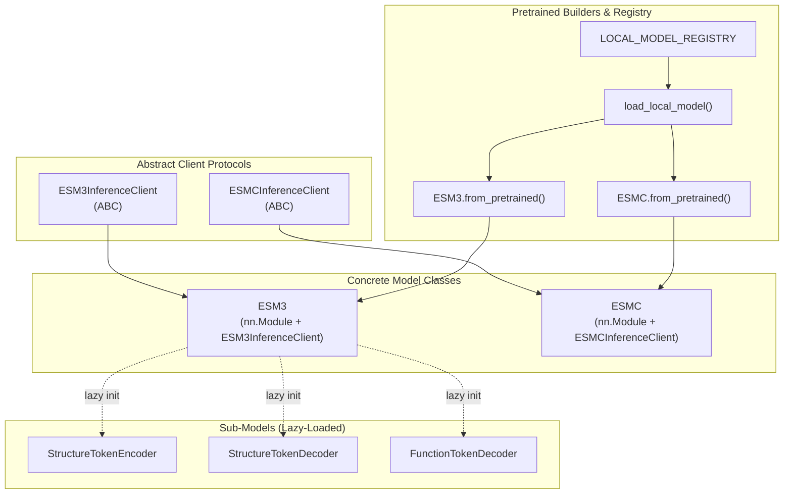
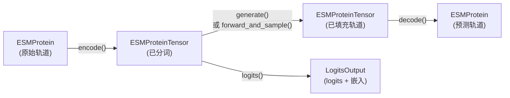

---
slug:20-local-inference-client
blog_type:normal
---


本地推理客户端使你能够完全在自己的硬件上运行 ESM 模型——无需 API 密钥、无需网络调用、无速率限制。**ESM3** 多模态生成模型和 **ESM C** 表示模型均作为 `nn.Module` 的子类发布，它们直接实现了各自的推理客户端接口（`ESM3InferenceClient` 和 `ESMCInferenceClient`），这意味着你通过 [Forge API Client](19-forge-api-client) 使用的 `encode` → `generate` → `decode` 工作流在本地运行时完全一致。这一架构决策——模型即客户端——消除了对单独本地包装器的需求，并确保你的代码无需任何重构即可在本地和远程执行之间无缝移植。

来源: [esm3.py](esm/models/esm3.py#L181-L184), [esmc.py](esm/models/esmc.py#L44-L53), [api.py](esm/sdk/api.py#L431-L501)

## 架构：模型即推理客户端

核心设计原则是每个模型类都同时继承自 `nn.Module` 和一个抽象推理客户端。这种双重继承意味着模型对象本身满足客户端协议——没有适配层，没有代理，也没有间接调用。当你调用 `model.encode(protein)` 时，模型直接调用其分词器和结构编码器；当你调用 `model.generate(protein, config)` 时，它在与承载 Transformer 权重的同一个对象上运行迭代采样。



`ESM3` 类持有对其子模型（`_structure_encoder`、`_structure_decoder`、`_function_decoder`）的延迟引用。这些庞大的子模型仅在首次通过 `get_structure_encoder()`、`get_structure_decoder()` 或 `get_function_decoder()` 访问时才会被实例化，这对于 VRAM 管理至关重要——你可以仅加载所需的部分，并在各阶段之间通过 `torch.cuda.empty_cache()` 显式释放内存。

来源: [esm3.py](esm/models/esm3.py#L181-L258), [esmc.py](esm/models/esmc.py#L44-L98), [pretrained.py](esm/pretrained.py#L114-L134)

## 加载本地模型

加载预训练模型有两个等效的入口点，它们均由相同的 `LOCAL_MODEL_REGISTRY` 提供支持：

| 入口点 | 语法 | 自动转换为 bfloat16 | 使用场景 |
|---|---|---|---|
| **类方法** | `ESM3.from_pretrained("esm3_sm_open_v1")` | ✅ (在 CUDA 上) | 推荐——类型安全，简洁 |
| **注册表函数** | `load_local_model("esm3_sm_open_v1", device)` | ❌ (原始模型) | 需要float32或自定义设备控制时 |
| **ESMC 类方法** | `ESMC.from_pretrained("esmc_300m")` | ✅ (在 CUDA 上) | 适用于 ESM C 模型的同等便利方式 |

`from_pretrained` 类方法是惯用选择。它们会自动检测 CUDA 的可用性，从本地数据根目录加载权重，并在 GPU 上运行时向上转型为 `bfloat16`——这与模型训练时的精度相匹配。`load_local_model` 函数为你提供未经数据类型转换的原始模型，当你需要完整的 float32 精度或想要应用自定义量化时，这会非常有用。

### 可用的本地模型

| 模型键名 | 架构 | 参数量 | 轨道 |
|---|---|---|---|
| `esm3_sm_open_v1` | ESM3 (小型, 开源) | 1.4B | 序列、结构、二级结构、SASA、功能 |
| `esmc_300m` | ESM C | 300M | 序列（侧重表示） |
| `esmc_600m` | ESM C | 600M | 序列（侧重表示） |
| `esm3_structure_encoder_v0` | VQ-VAE 编码器 | — | 结构 → Token |
| `esm3_structure_decoder_v0` | VQ-VAE 解码器 | — | Token → 坐标 |
| `esm3_function_decoder_v0` | 功能解码器 | — | 功能 Token → InterPro |

模型名称规范化层透明地处理别名解析——`"esm3-open"`、`"esm3-open-2024-03"` 和 `"esm3-sm-open-v1"` 都会解析为注册表中相同的 `ESM3_OPEN_SMALL` 键。

来源: [pretrained.py](esm/pretrained.py#L95-L134), [models.py](esm/utils/constants/models.py#L1-L29)

## 高层 API：encode → generate → decode

高层 API 与 [Forge API Client](19-forge-api-client) 完全一致。你需要处理两种数据类型——`ESMProtein`（人类可读）和 `ESMProteinTensor`（已分词）——以及构成完整推理管道的三个核心操作：



**`encode(ESMProtein) → ESMProteinTensor`** 使用模型附带的分词器对提供的每个轨道进行分词。对于 ESM3，这包括运行结构编码器（VQ-VAE）以将 3D 坐标转换为离散的结构 token。输入中保留为 `None` 的轨道在输出中也会作为 `None` 传递——你只需为你提供的轨道支付计算成本。

**`generate(ProteinType, GenerationConfig) → ProteinType`** 运行迭代掩码采样以填充目标轨道。当传入 `ESMProtein` 时，它内部会调用 `encode` → `batch_generate` → `decode`；当传入 `ESMProteinTensor` 时，它会跳过编码/解码步骤，直接在 token 空间中操作。`GenerationConfig` 控制要生成的轨道（`track`）、去掩码计划（`cosine` 或 `linear`）、去掩码策略（`random` 或 `entropy`）以及采样参数（`temperature`、`top_p`）。

**`decode(ESMProteinTensor) → ESMProtein`** 是 encode 的逆操作——它运行结构解码器和功能解码器，将分词后的表示转换回人类可读的坐标和功能注释。

<CgxTip>对于 ESM3，请务必在 encode/generate 与 decode 阶段之间调用 `torch.cuda.empty_cache()`。结构和功能解码器是延迟加载的大型子模型；在解码前释放主模型的 KV 缓存，可以避免消费级 GPU 上出现本可避免的内存不足错误。</CgxTip>

来源: [esm3.py](esm/models/esm3.py#L376-L501), [api.py](esm/sdk/api.py#L293-L334), [raw_forwards.py](cookbook/local/raw_forwards.py#L88-L151)

## 底层 API：forward、logits 与 forward_and_sample

当高层 `generate` 抽象无法提供足够的控制力时，底层 API 暴露了原始的前向传播和逐步采样。这是为构建自定义思维链管道、引导生成或研究实验的高级用户提供的逃生舱口。

### 原始前向传播

`forward()` 方法接受单独的 token 张量，并返回一个包含**所有六个轨道**（序列、结构、二级结构、SASA、功能和残基注释）logits 的 `ESMOutput`，以及嵌入张量。任何未指定的 token 输入默认为该轨道的掩码 token，因此你可以使用部分输入运行前向传播：

```python
output = model.forward(
    sequence_tokens=sequence_tokens,    # 已提供
    function_tokens=function_tokens,    # 已提供
    # structure_tokens, ss8, sasa 默认为掩码 token
)
```
这是在单次传递中获取多轨道预测最节省 VRAM 的方式，因为没有迭代采样的开销。

### Logits 端点

`logits(ESMProteinTensor, LogitsConfig)` 方法使用 `torch.no_grad()` 和 `torch.autocast(bfloat16)` 上下文管理器包装前向传播，然后过滤输出，仅返回你通过 `LogitsConfig` 请求的轨道。当你需要嵌入、隐藏状态或特定的 logit 轨道时，这是正确的入口点：

| `LogitsConfig` 字段 | 效果 |
|---|---|
| `sequence=True` | 返回序列 logits |
| `structure=True` | 返回结构 logits |
| `return_embeddings=True` | 返回逐残基嵌入 |
| `return_hidden_states=True` | 返回所有层的隐藏状态 |
| `ith_hidden_layer=5` | 仅返回第 5 层的隐藏状态 |
| `return_mean_embedding=True` | 返回平均池化嵌入 |

<CgxTip>与 Forge API（由于带宽限制仅支持 `sequence` logits）不同，本地客户端可以返回**所有轨道**的 logits，包括结构、二级结构、SASA 和功能。这使得本地推理成为访问完整多轨道 logit 分布以进行自定义采样策略的唯一途径。</CgxTip>

### 前向传播与采样

`forward_and_sample(ESMProteinTensor, SamplingConfig)` 方法运行单次前向传播，然后根据每个轨道的 `SamplingTrackConfig` 设置对 token 进行采样。每个轨道都可以独立配置自己的 `temperature`、`top_p`、`invalid_ids` 和 `topk_logprobs`。该方法返回一个 `ForwardAndSampleOutput`，其中同时包含 logits 和采样后的 `ESMProteinTensor`，以及用于分析的熵、概率和 top-k 对数概率。

来源: [esm3.py](esm/models/esm3.py#L260-L374), [esm3.py](esm/models/esm3.py#L503-L599), [api.py](esm/sdk/api.py#L337-L429)

## ESM C：表示模型本地推理

ESM C 模型（`ESMC` 类）实现了更简单的 `ESMCInferenceClient` 接口，该接口公开了 `encode`、`decode` 和 `logits`，但没有 `generate` 或 `forward_and_sample`——ESM C 是一个表示模型，而非生成模型。其工作流非常直观：

```python
model = ESMC.from_pretrained("esmc_300m")  # 或 "esmc_600m"
protein = ESMProtein(sequence="MKWVTFISLLFLFSSAYSRGVFRRDAHKSE")
protein_tensor = model.encode(protein)
output = model.logits(protein_tensor, LogitsConfig(
    sequence=True, return_embeddings=True, return_hidden_states=True
))
# output.embeddings: 逐残基表示
# output.hidden_states: 所有层隐藏状态 [n_layers, B, L, D]
```

ESM C 在可用时（在导入时通过 `flash_attn` 检测）会利用 Flash Attention，使用 unpad/pad 范式跳过对填充 token 的计算。`from_pretrained` 方法会自动检测这一点并相应地配置模型。当 Flash Attention 处于激活状态时，`sequence_id` 参数必须是布尔掩码而非整数 ID。

ESM3 和 ESMC 上的 `raw_model` 属性均返回 `self`——即底层的 `nn.Module`。当你需要访问模型内部结构（如 `model.transformer` 或 `model.embed`）以进行完全绕过客户端接口的自定义前向传播时，这会非常有用。

来源: [esmc.py](esm/models/esmc.py#L44-L226), [esmc.py](cookbook/snippets/esmc.py#L54-L70)

## 注册自定义模型

`LOCAL_MODEL_REGISTRY` 是一个简单的 `dict[str, ModelBuilder]`，将模型名称映射到签名为 `Callable[[torch.device | str], nn.Module]` 的构建器函数。`register_local_model` 函数允许你将自己微调或修改过的模型添加到注册表中，以便它们可以通过 `from_pretrained` 加载：

```python
from esm.pretrained import register_local_model

def my_custom_esm3(device: torch.device | str = "cpu"):
    model = ESM3(
        d_model=1536, n_heads=24, v_heads=256, n_layers=48,
        structure_encoder_fn=ESM3_structure_encoder_v0,
        structure_decoder_fn=ESM3_structure_decoder_v0,
        function_decoder_fn=ESM3_function_decoder_v0,
        tokenizers=get_esm3_model_tokenizers("esm3_sm_open_v1"),
    ).eval()
    state_dict = torch.load("path/to/my_weights.pth", map_location=device)
    model.load_state_dict(state_dict)
    return model

register_local_model("esm3_custom_v1", my_custom_esm3)
# 现在：ESM3.from_pretrained("esm3_custom_v1") 可以工作了
```

这种可扩展模式意味着本地推理路径不仅限于已发布的预训练权重——你可以将任何兼容的架构注入到相同的客户端接口中。

来源: [pretrained.py](esm/pretrained.py#L21-L134)

## 完整工作流示例

### ESM3：折叠、逆折叠与功能预测

高层 `generate` API 使用相同的调用签名处理所有三项任务，仅在目标轨道和保留为 `None`（掩码）的轨道上有所不同：

| 任务 | 输入轨道 | `track` 配置 | 输出 |
|---|---|---|---|
| **折叠** | 序列, (可选: 功能) | `"structure"` | 3D 坐标 |
| **逆折叠** | 坐标 | `"sequence"` | 氨基酸序列 |
| **功能预测** | 序列, 坐标 | `"function"` | InterPro 注释 |

迭代采样步骤数（`num_steps`）随序列长度按比例变化。一个实用的启发式方法是，结构和功能轨道的 `num_steps = sequence_length // 16`，而序列生成通常在 8-20 步内收敛，与长度无关。

### 思维链生成

本地推理所支持的最强大模式之一是多步思维链生成，你可以在前一次预测的基础上迭代地预测下一个轨道：

```python
# 功能 → 二级结构 → 结构 → 序列
protein_tensor = client.encode(cot_protein)
for track in ["secondary_structure", "structure", "sequence"]:
    protein_tensor = client.generate(
        protein_tensor,
        GenerationConfig(track=track, schedule="cosine", num_steps=10),
    )
final_protein = client.decode(protein_tensor)
```

每次 `generate` 调用在保留先前预测轨道的同时填充一个轨道，逐步构建出完整的蛋白质表示。这种模式仅在本地才切实可行，因为它需要多次顺序前向传播——每一步都依赖于上一步——通过远程 API 执行会慢得令人望而却步。

来源: [esm3.py](cookbook/snippets/esm3.py#L38-L137), [raw_forwards.py](cookbook/local/raw_forwards.py#L21-L151)

## VRAM 与性能考量

ESM3 小型开源模型需要大量的 GPU 内存。主 Transformer（bf16 精度下约 1.4B 参数）仅权重就消耗约 2.8 GB，但推理还需要分配与序列长度和层数成正比的 KV 缓存。解码时子模型会进一步增加开销：

| 组件 | 大致 VRAM (bf16) | 加载时机 |
|---|---|---|
| ESM3 主模型 | ~2.8 GB 权重 + KV 缓存 | `from_pretrained()` |
| 结构编码器 | ~0.1 GB | 首次带坐标的 `encode()` |
| 结构解码器 | ~2.5 GB | 首次带结构 token 的 `decode()` |
| 功能解码器 | ~0.3 GB | 首次带功能 token 的 `decode()` |

子模型的延迟加载设计是有意为之——你仅在调用 `decode()` 时才为解码器支付开销。对于原始前向传播（例如嵌入提取），你根本不需要加载解码器。`from_pretrained` 在 CUDA 设备上应用的 `bfloat16` 自动转型，与 float32 相比将内存占用减半，且对质量的影响可以忽略不计，因为模型正是以这种精度训练的。

来源: [esm3.py](esm/models/esm3.py#L220-L258), [esm3.py](esm/models/esm3.py#L503-L526), [pretrained.py](esm/pretrained.py#L95-L111)

## 接下来阅读什么

- **[Forge API Client](19-forge-api-client)** — 将远程 API 客户端接口与本文描述的本地客户端进行比较；两者共享相同的 `ESM3InferenceClient` / `ESMCInferenceClient` 协议。
- **[Iterative Masked Sampling](16-iterative-masked-sampling)** — 了解在底层驱动 `generate()` 和 `batch_generate()` 的生成算法。
- **[Generation Configuration Reference](18-generation-configuration-reference)** — 深入探讨 `GenerationConfig` 和 `SamplingConfig` 的每个参数，以实现精细控制。
- **[Encode-Decode Pipeline](22-encode-decode-pipeline)** — 详细演练分词、结构编码/解码和功能解码如何组合成 `encode` → `decode` 的往返过程。