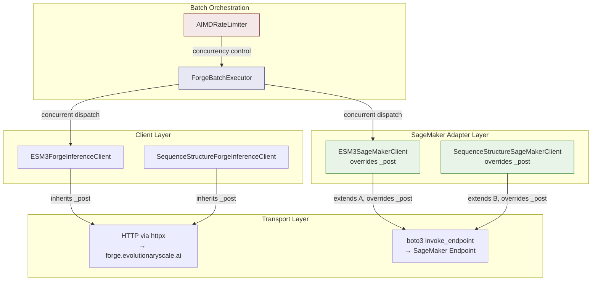
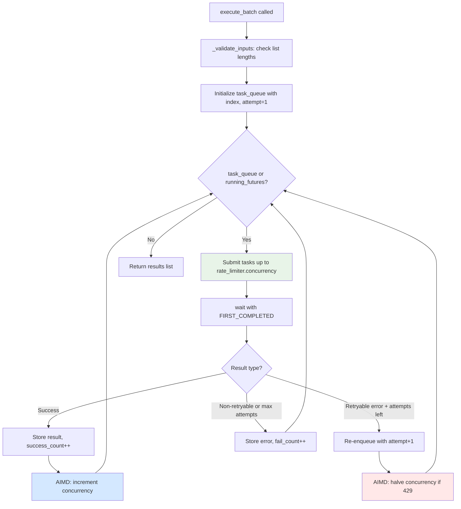

---
slug:21-sagemaker-and-batch-execution
blog_type:normal
---


ESM SDK 提供了两种互补的路径，用于在 Forge 云 API 之外大规模运行推理：直接连接到 AWS 托管模型端点的 **SageMaker 客户端**，以及通过自适应速率限制来编排并发请求的**批处理执行器**。结合使用，这些工具能让你从针对 Forge API 的原型开发，无缝过渡到在自有基础设施上实现生产级、高吞吐量的推理。

## 架构概述：Forge 与 SageMaker

SageMaker 客户端是 Forge 客户端的**直接替代品**。它们继承了相同的公共 API 接口——`generate`、`encode`、`decode`、`logits`、`forward_and_sample`、`fold`、`inverse_fold`——但重写了内部的 `_post` 方法，将请求通过 AWS SageMaker 的 `invoke_endpoint` API 进行路由，而非通过 HTTP 调用 Forge 服务器。这意味着任何基于 Forge 客户端编写的代码都可以在不做修改的情况下直接用于 SageMaker 客户端。



核心设计原则是**基于继承的替换**：SageMaker 客户端扩展了其对应的 Forge 客户端，使用占位符 URL 和 token 值调用父类构造函数，然后仅替换传输机制。来自 Forge 父类的所有请求序列化、响应解析和重试逻辑均被完全复用。

来源：[sagemaker.py](/esm/sdk/sagemaker.py#L1-L120), [forge.py](/esm/sdk/forge.py#L1-L50)

## ESM3SageMakerClient

`ESM3SageMakerClient` 通过 SageMaker 实时端点提供了完整的 ESM3 推理能力——生成、编码、解码、logits 以及前向传播与采样。它扩展了 `ESM3ForgeInferenceClient` 并重写了 `_post`，以将请求序列化为 JSON，并通过 `boto3.client("sagemaker-runtime").invoke_endpoint()` 进行分发。

### 初始化

```python
from esm.sdk.sagemaker import ESM3SageMakerClient

client = ESM3SageMakerClient(
    endpoint_name="your-sagemaker-endpoint",
    model="esm3-sm-open-v1",
)
```

| 参数 | 类型 | 描述 |
|---|---|---|
| `endpoint_name` | `str` | **必填。**你部署的 SageMaker 端点名称。 |
| `model` | `str` | **必填。**ESM3 模型标识符（例如，`"esm3-sm-open-v1"`）。 |
| `token` | `str` | 可选。默认为 `"dummy"`——SageMaker 端点使用 IAM 身份验证，而非 API token。 |

<CgxTip>`model` 参数是必填的（不同于 Forge 客户端中无默认值的设计），因为 SageMaker 端点可能会提供多个模型变体。model 字段会包含在每个请求的负载中，以便服务容器能够路由到正确的模型。</CgxTip>

### 请求协议

当调用 `_post` 时，SageMaker 客户端会将请求负载封装在一个与 Forge API 预期格式相匹配的结构中。此封装确保了与处理 Forge 流量的同一服务容器的兼容性：

```python
# SageMaker _post 发送至 invoke_endpoint 的内容
invocations_request = {
    "model": request["model"],           # 在顶层重复
    "request_id": "",                    # Forge 特定字段（未使用）
    "user_id": "",                       # Forge 特定字段（未使用）
    "api_ver": "v1",                     # 必须为 "v1"
    "endpoint": endpoint,                # 例如，"generate"，"encode"
    endpoint: request,                   # 嵌套在 endpoint 键下的请求
}
```

`CustomAttributes` 标头携带了 `return_bytes` 标志（`"return_bytes=true"` 或 `"return_bytes=false"`），SageMaker 服务容器使用该标志来决定是将张量数据作为 base64 编码的 pickle 字节返回，还是作为普通 JSON 返回。这对于 `logits` 端点至关重要，因为该处的原始张量数据可能会非常大。

### 响应处理

在 `invoke_endpoint` 返回后，响应体会被解析为 JSON。客户端会断言响应的 `endpoint` 键与请求的端点相匹配，然后从嵌套的 `data[endpoint]` 键中提取实际数据。这映射了 Forge 的响应结构，确保父类的 `_process_*_response` 方法无需修改即可正常工作。

来源：[sagemaker.py](/esm/sdk/sagemaker.py#L84-L120), [forge.py](/esm/sdk/forge.py#L244-L268)

## SequenceStructureSageMakerClient

`SequenceStructureSageMakerClient` 通过 SageMaker 处理折叠和逆折叠端点。它扩展了 `SequenceStructureForgeInferenceClient`，并遵循与 ESM3 客户端相同的重写模式，但有一个关键区别：**它不支持 `return_bytes` CustomAttributes 标头**。

### 初始化

```python
from esm.sdk.sagemaker import SequenceStructureSageMakerClient

fold_client = SequenceStructureSageMakerClient(
    endpoint_name="your-folding-endpoint",
    model="esm3-small-2024-03",  # 此客户端可选
)
```

| 参数 | 类型 | 描述 |
|---|---|---|
| `endpoint_name` | `str` | **必填。**SageMaker 端点名称。 |
| `model` | `str \| None` | 可选。模型名称，默认为 `None`。 |

### 可用方法

由于此客户端继承自 `SequenceStructureForgeInferenceClient`，它暴露了 **fold** 和 **inverse_fold** 操作：

| 方法 | 输入 | 输出 | 描述 |
|---|---|---|---|
| `fold(sequence)` | 蛋白质序列字符串 | 带有坐标的 `ESMProtein` | 从序列预测 3D 结构 |
| `inverse_fold(coordinates, config)` | 坐标张量 + 配置 | 带有序列的 `ESMProtein` | 从结构预测序列 |
| `async_fold(sequence)` | 与 `fold` 相同 | 与 `fold` 相同 | 异步变体 |
| `async_inverse_fold(...)` | 与 `inverse_fold` 相同 | 与 `inverse_fold` 相同 | 异步变体 |
| `_fetch_msa(sequence)` | 序列字符串 | `MSA` 对象 | 获取多序列比对 |

来源：[sagemaker.py](/esm/sdk/sagemaker.py#L8-L82), [forge.py](/esm/sdk/forge.py#L131-L218)

## ForgeBatchExecutor：大规模并发推理

当你需要运行成百上千次推理调用时——无论是针对 Forge 还是 SageMaker——`ForgeBatchExecutor` 提供了一个带有**自适应速率限制**和**自动重试**的托管并发层。它通过便捷函数 `esm.sdk.batch_executor()` 暴露。

### 基本用法

```python
from esm.sdk import batch_executor
from esm.sdk.api import ESMProtein, GenerationConfig

proteins = [ESMProtein(sequence=s) for s in sequences]
configs = [GenerationConfig(track="sequence") for _ in sequences]

with batch_executor(max_attempts=10, show_progress=True) as executor:
    results = executor.execute_batch(
        esm3_client.generate,        # 任何可调用对象（Forge 或 SageMaker）
        input=proteins,               # 列表类型的参数会按任务切片分配
        config=configs,
    )
```

`execute_batch` 方法会检查所有的关键字参数和位置参数。任何属于 `list` 的参数都会按元素逐一切片分配给各个任务；标量参数则会原样传递给每个任务。所有列表类型的参数**必须具有相同的长度**。

### 工作原理



### AIMD 速率限制

`AIMDRateLimiter` 实现了**加法增/乘法减**拥塞控制——这与 TCP 中使用的算法相同。这在访问具有速率限制的端点时至关重要：

| 条件 | 动作 | 原因 |
|---|---|---|
| 成功响应 | `concurrency += step_up`（默认 +1） | 逐步探测更多容量 |
| HTTP 429（速率限制） | `concurrency //= 2` | 激进退避 |
| 其他可重试错误（500, 502, 504） | 并发数不变 | 这些是服务端错误，而非速率限制 |

| 参数 | 默认值 | 描述 |
|---|---|---|
| `initial_concurrency` | 32 | 起始并行度 |
| `min_concurrency` | 1 | 乘法减少后的下限 |
| `max_concurrency` | 64 | 加法增加后的上限 |
| `step_up` | 1 | 每次成功的加法增量 |

<CgxTip>`ForgeBatchExecutor` 禁用了每次调用的重试（通过 `skip_retries_var` 上下文变量），而是在批处理级别自行处理重试。这避免了“双重重试”问题，即单个方法上的 `@retry_decorator` 和批处理执行器会独立地重试同一个请求。使用批处理执行器时，你只会拥有唯一的重试机制——执行器自身的机制。</CgxTip>

来源：[forge_context_manager.py](/esm/utils/forge_context_manager.py#L1-L157), [__init__.py](/esm/sdk/__init__.py#L1-L37)

## 对比：Forge 与 SageMaker 与 批处理

| 特性 | Forge API 客户端 | SageMaker 客户端 | ForgeBatchExecutor |
|---|---|---|---|
| **传输方式** | HTTPS (httpx) | AWS SageMaker Runtime (boto3) | 封装以上任意客户端 |
| **身份验证** | API token (`Bearer`) | IAM 角色 / AWS 凭证 | 继承自被封装的客户端 |
| **完整 ESM3 API** | ✅ generate, encode, decode, logits, forward_and_sample | ✅ 与 Forge 相同 | ✅ 任何可调用对象 |
| **折叠 / 逆折叠** | ✅ 通过 `SequenceStructureForgeInferenceClient` | ✅ 通过 `SequenceStructureSageMakerClient` | ✅ 任何可调用对象 |
| **自动重试** | ✅ `@retry_decorator` (429, 500, 502, 504) | ✅ 继承自 Forge 父类 | ✅ 内置重试 + AIMD |
| **异步支持** | ✅ 所有方法均具有 `async_` 变体 | ✅ 继承异步方法 | ❌ 仅基于线程 |
| **并发控制** | ❌ 单一请求 | ❌ 单一请求 | ✅ AIMD 速率限制器 |
| **进度条** | ❌ | ❌ | ✅ tqdm |
| **基础设施** | EvolutionaryScale 云端 | 你的 AWS 账户 | 两者皆可 |
| **数据驻留** | 数据离开你的 VPC | 数据留在你的 AWS VPC 内 | 取决于被封装的客户端 |

来源：[sagemaker.py](/esm/sdk/sagemaker.py#L1-L120), [forge.py](/esm/sdk/forge.py#L1-L50), [forge_context_manager.py](/esm/utils/forge_context_manager.py#L1-L157)

## SageMaker 端点前提条件

在使用 SageMaker 客户端之前，你必须将 ESM3 模型部署到 SageMaker 实时端点。服务容器必须接受与 Forge 兼容的请求格式（嵌套的 `endpoint` 键结构及 `api_ver: "v1"`）。关键的 AWS 侧要求如下：

1. **IAM 权限**：调用身份需要对目标端点具有 `sagemaker-runtime:InvokeEndpoint` 权限。
2. **端点配置**：端点必须已部署并处于 `InService` 状态。
3. **网络**：如果使用 VPC 端点，请确保从你的计算环境到 SageMaker Runtime 服务的连接畅通。
4. **boto3 配置**：适用标准的 boto3 凭证解析链——环境变量、IAM 实例配置文件或 `~/.aws/credentials`。

## 结合 SageMaker 与批处理执行

真正的强大之处在于将 SageMaker 客户端与批处理执行器结合使用。这为你带来了**VPC 隔离的推理**以及**自适应并发控制**：

```python
from esm.sdk.sagemaker import ESM3SageMakerClient
from esm.sdk import batch_executor
from esm.sdk.api import ESMProtein, GenerationConfig

# SageMaker 客户端 —— 流量保留在你的 AWS 账户内
sm_client = ESM3SageMakerClient(
    endpoint_name="esm3-production-endpoint",
    model="esm3-sm-open-v1",
)

# 批处理执行器 —— 管理针对你端点的并发
with batch_executor(max_attempts=5, show_progress=True) as executor:
    proteins = [ESMProtein(sequence=s) for s in large_sequence_list]
    configs = [GenerationConfig(track="structure", num_steps=8)] * len(proteins)
    
    results = executor.execute_batch(
        sm_client.generate,
        input=proteins,
        config=configs,
    )
```

在针对你控制的 SageMaker 端点运行时，你可以根据端点的实例类型和自动扩缩容配置来调整 `AIMDRateLimiter` 参数。例如，由单个 `ml.g5.12xlarge` 实例支持的端点可能可以容忍 16-32 个并发请求，而具有自动扩缩容的多实例端点则可以处理更多的请求。

来源：[sagemaker.py](/esm/sdk/sagemaker.py#L84-L120), [forge_context_manager.py](/esm/utils/forge_context_manager.py#L66-L157), [__init__.py](/esm/sdk/__init__.py#L21-L37)

## 错误处理与重试语义

SageMaker 客户端继承了 Forge 层相同的错误处理机制。当 `invoke_endpoint` 抛出 boto3 异常时，它会被捕获并作为 `RuntimeError` 重新抛出。每个方法上的 `@retry_decorator`（继承自 Forge 父类）随后会根据错误类型决定是否重试该调用：

| 错误码 | 可重试？ | 含义 |
|---|---|---|
| 429 | ✅ | 速率限制——退避并重试 |
| 500 | ✅ | 内部服务器错误 |
| 502 | ✅ | 网关错误 |
| 504 | ✅ | 网关超时 |
| 400 | ❌ | 错误请求——客户端错误，重试无济于事 |
| 403 | ❌ | 禁止访问——身份验证/授权失败 |
| 404 | ❌ | 未找到——无效的端点或模型 |

当使用 `ForgeBatchExecutor` 时，每个方法的 `@retry_decorator` 会被禁用（通过 `skip_retries_var`），转而由执行器级别处理重试。执行器仅在遇到相同的错误码时重试，每个任务最多重试 `max_attempts` 次。特别是在遇到 HTTP 429 错误时，它还会触发 AIMD 乘法减少以降低并发度。

来源：[retry.py](/esm/sdk/retry.py#L1-L86), [sagemaker.py](/esm/sdk/sagemaker.py#L56-L67), [forge_context_manager.py](/esm/utils/forge_context_manager.py#L103-L157)

## 下一步

- 要了解 SageMaker 客户端所扩展的 Forge API 客户端，请参阅 [Forge API 客户端](19-forge-api-client)。
- 如需无需任何远程调用的本地推理，请参阅 [本地推理客户端](20-local-inference-client)。
- 要了解所有客户端共享的编码/解码流水线，请参阅 [编码-解码流水线](22-encode-decode-pipeline)。
- 有关与 `generate()` 配合使用的生成配置选项，请参阅 [生成配置参考](18-generation-configuration-reference)。