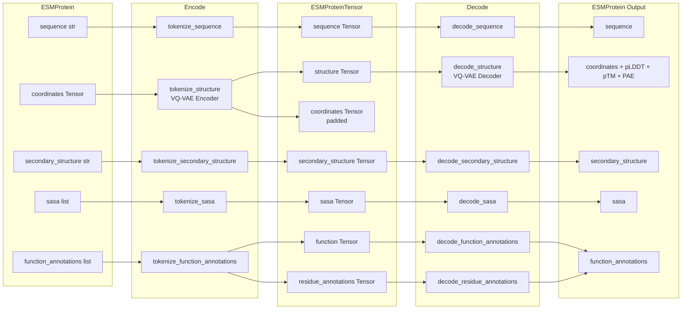

---
slug:22-encode-decode-pipeline
blog_type:normal
---


ESM3 的编码-解码流水线是**人类可读的蛋白质表示**（`ESMProtein`）与**模型可消费的词元张量**（`ESMProteinTensor`）之间的双向桥梁。与 ESM3 的每一次交互——无论是生成全新序列、预测结构，还是解码模型输出——都要经过该流水线。理解其运作机制对于控制模型看到的输入、做出的预测，以及你如何解读结果至关重要。

## 两种表示，同一个蛋白质

该流水线作用于 SDK API 中定义的两种数据模型。**`ESMProtein`** 保存原始的领域级数据：氨基酸字符串、坐标张量、二级结构标签、SASA 值和功能注释。**`ESMProteinTensor`** 保存经过分词后的相同信息：整型张量（以及经过填充的坐标张量），它们已准备好供 Transformer 使用。`encode()` 方法将其转换为 `ESMProtein → ESMProteinTensor`；`decode()` 方法则执行逆向操作，即 `ESMProteinTensor → ESMProtein`。

| 轨道 | `ESMProtein` 字段 | `ESMProteinTensor` 字段 | 分词器 | 词表大小 |
|---|---|---|---|---|
| 序列 | `sequence: str` | `sequence: Tensor` | `EsmSequenceTokenizer` | 64 |
| 结构 | `coordinates: Tensor` | `structure: Tensor` | `StructureTokenizer` + VQ-VAE 编码器 | 4096 + 5 个特殊词元 |
| 二级结构 | `secondary_structure: str` | `secondary_structure: Tensor` | `SecondaryStructureTokenizer` (ss8) | 8 + 3 个特殊词元 |
| SASA | `sasa: list[float\|None]` | `sasa: Tensor` | `SASADiscretizingTokenizer` | 16 + 3 个特殊词元 |
| 功能 | `function_annotations: list[FunctionAnnotation]` | `function: Tensor` (depth=8) | `InterProQuantizedTokenizer` | 260 × 8 深度 |
| 残基注释 | *(合并至 function_annotations)* | `residue_annotations: Tensor` (depth=16) | `ResidueAnnotationsTokenizer` | 1478 |
| 坐标 | `coordinates: Tensor` | `coordinates: Tensor` | *(∞-填充直通)* | — |

来源: [api.py](esm/sdk/api.py#L26-L111), [api.py](esm/sdk/api.py#L201-L283), [__init__.py](esm/tokenization/__init__.py#L15-L46)

## 流水线架构

编码-解码流水线并非单一函数，而是一个**协同调度**过程——每个轨道遵循各自的编码与解码路径，由推理客户端顶层的 `encode()` / `decode()` 方法进行统一调度。下图展示了原始蛋白质如何通过分词流入 Transformer 并返回的过程：



来源: [encoding.py](esm/utils/encoding.py#L1-L230), [decoding.py](esm/utils/decoding.py#L1-L244)

## 编码：从原始数据到词元

编码路径通过任何 `ESM3InferenceClient` 实现（本地模型、Forge API 或 SageMaker）上的 `encode()` 方法暴露。在内部，它委托给 `esm.utils.encoding` 中的模块级函数，其中每个函数接收一个轨道的原始数据以及相应的分词器。

**序列编码**是最简单的路径：原始字符串中的掩码字符（`_`）被替换为分词器的掩码词元，随后标准的 `encode()` 调用会生成一个由 BOS/EOS 词元包裹残基词元的整型张量。[encoding.py](esm/utils/encoding.py#L35-L45)

**结构编码**最为复杂：坐标张量 `(L, 37, 3)` 首先被转换为 `ProteinChain` 对象，该对象生成结构编码器可用的输入（坐标、pLDDT、残基索引）。接着，`StructureTokenEncoder`（一个 VQ-VAE）将这些输入编码为离散的结构词元。原始坐标和 pLDDT 与词元一同保留——坐标在 BOS/EOS 位置进行 ∞-填充，pLDDT 进行零填充。这种双重输出至关重要，因为 Transformer 的几何注意力层使用原始坐标进行 SE(3) 不变的帧计算，而离散词元则馈入标准的嵌入路径。[encoding.py](esm/utils/encoding.py#L48-L97)

**二级结构和 SASA 编码**遵循与序列相同的模式——字符串或浮点数转离散词元化——其中 SASA 使用离散化分词器，将连续的溶剂可及性值分入 16 个离散区间之一。[encoding.py](esm/utils/encoding.py#L100-L135)

**功能注释编码**被拆分为两个子轨道。`esm.utils.function.encode_decode` 中的 `encode_function_annotations()` 辅助函数首先通过对每个注释的标签进行分类，检查其是否匹配 InterPro 登录号（`IPR\d+`）、TF-IDF 功能关键字，或残基注释标签。InterPro 和关键字注释被路由至 `InterProQuantizedTokenizer`，生成 `(L+2, 8)` 深度张量；残基级注释被路由至 `ResidueAnnotationsTokenizer`，生成 `(L+2, 16)` 深度张量。这种拆分之所以存在，是因为功能词元代表*分类*分布（在词表上做 softmax），而残基注释则是*多热*编码（每个标签对应独立的伯努利分布）。[encode_decode.py](esm/utils/function/encode_decode.py#L13-L81)

### 默认（掩码）词元

当 `ESMProtein` 中的某个轨道为 `None` 时，编码器会使用**掩码默认词元**填充它——在每个位置填充掩码词元 ID，并由 BOS 和 EOS 包裹。这正是实现部分条件生成的基础：你只需提供已知的轨道（例如序列），其余部分保留掩码状态，交由模型生成。

| 默认生成器 | 形状 | 填充值 |
|---|---|---|
| `get_default_sequence_tokens` | `(L+2,)` | `mask_token_id` |
| `get_default_structure_tokens` | `(L+2,)` | `mask_token_id` |
| `get_default_secondary_structure_tokens` | `(L+2,)` | `mask_token_id` |
| `get_default_sasa_tokens` | `(L+2,)` | `mask_token_id` |
| `get_default_function_tokens` | `(L+2, 8)` | `pad_token_id` |
| `get_default_residue_annotation_tokens` | `(L+2, 16)` | `pad_token_id` |

`ESMProteinTensor.empty()` 类方法使用这些生成器来创建给定长度的全掩码张量表示——这是无条件生成的起点。[api.py](esm/sdk/api.py#L251-L278), [encoding.py](esm/utils/encoding.py#L156-L229)

<CgxTip>功能词元使用 `pad_token_id` 作为默认填充（而非 `mask_token_id`），因为 InterPro 量化分词器的“无注释”状态由填充表示。结构和序列轨道使用 `mask_token_id`，因为它们代表“未知，请预测”的状态。这一区别至关重要：填充意味着“此处无信号”，而掩码意味着“模型应填补此处”。</CgxTip>

## 解码：从词元还原为原始数据

推理客户端上的 `decode()` 方法调用 `decode_protein_tensor()`，后者协调所有轨道的逆向调度。解码并非编码的完美逆操作——它会从结构解码器中产生**额外的质量指标**（pLDDT、pTM、PAE），而这些在编码时是不存在的。

### 解码前清理

在解码任何轨道之前，`decode_protein_tensor()` 会执行一次**填充检查**：它剥离 BOS/EOS 词元，将张量展平，并检查剩余的每个词元是否等于该轨道的 `pad_token_id`。如果是，则将该轨道设为 `None`——它不包含真实信息。特别是对于结构轨道，如果*任何*词元是掩码词元，整个结构就会被设为 `None`，因为不支持部分结构解码（在解码坐标之前，结构词元必须完全解析）。[decoding.py](esm/utils/decoding.py#L47-L61)

### 结构解码详解

结构解码是最为复杂的轨道。`StructureTokenDecoder`（VQ-VAE 解码器）接收结构词元，并生成主链坐标预测以及置信度指标：

1. **词元 → 主链**：解码器输出形状为 `(1, L+2, ...)` 的 `bb_pred`，从中裁剪掉 BOS/EOS 位置，得到 `(L, 3, 3)` 的主链原子坐标（N, Cα, C）。
2. **置信度提取**：如果解码器输出中存在 pLDDT（残基级置信度）、pTM（预测 TM 分数）和 PAE（预测对齐误差），则将其提取出来。
3. **氧原子推断**：`ProteinChain.from_backbone_atom_coordinates()` 构造器基于三个主链原子构建蛋白质链，`infer_oxygen()` 则通过几何方法重构羰基氧的位置。
4. **最终坐标**：返回该蛋白质链的 `atom37_positions`，作为 `(L, 37, 3)` 张量。

[decoding.py](esm/utils/decoding.py#L138-L169)

### 功能解码与注释合并

功能解码从词元预测中重建 `FunctionAnnotation` 对象。`decode_function_tokens()` 辅助函数调用 `FunctionTokenDecoder.decode()`，后者生成 InterPro 注释和功能关键字注释，并将它们转换为 `FunctionAnnotation(label, start, end)` 实例。残基注释解码遍历 16 个深度位置，将非零词元 ID 映射回其词表标签并构建逐位置注释，随后通过 `merge_annotations()` 将其**合并**——该函数将相同标签的相邻或近似相邻注释进行合并。短于 `annotation_min_length`（默认为 5）的注释会被丢弃。[encode_decode.py](esm/utils/function/encode_decode.py#L84-L180)

### BOS/EOS 验证

每个轨道解码器（功能和残基注释除外）都会调用 `_bos_eos_warn()`，如果第一个词元不是 BOS 或最后一个词元不是 EOS，它会发出警告——而非报错。这种宽容的方式允许对部分裁剪的张量进行解码，同时仍能提醒用户潜在的数据损坏问题。SASA 解码更为严格：如果缺少 BOS/EOS 词元，它会抛出 `ValueError`。[decoding.py](esm/utils/decoding.py#L114-L122), [decoding.py](esm/utils/decoding.py#L184-L188)

## 分词器集合

所有六个分词器都被捆绑到一个实现了 `TokenizerCollectionProtocol` 的 `TokenizerCollection` 数据类中。`get_esm3_model_tokenizers()` 工厂函数为给定的模型变体构造正确的分词器实例。此集合存储在 `ESM3` 模型对象上，并传递给编码/解码函数，确保在流水线的双向流程中使用一致的词表。

```python
# 每个分词器集合必须满足的协议
class TokenizerCollectionProtocol(Protocol):
    sequence: EsmSequenceTokenizer
    structure: StructureTokenizer
    secondary_structure: SecondaryStructureTokenizer
    sasa: SASADiscretizingTokenizer
    function: InterProQuantizedTokenizer
    residue_annotations: ResidueAnnotationsTokenizer
```

来源: [__init__.py](esm/tokenization/__init__.py#L15-L46)

<CgxTip>使用本地 `ESM3` 模型时，分词器会通过 `from_pretrained()` 自动加载。使用 Forge API 客户端时，编码/解码在服务器端进行——你永远不会直接处理 `ESMProteinTensor`。Forge 客户端上的 `encode()`/`decode()` 方法会将 `ESMProtein` 序列化为 JSON 并反序列化响应，从而抽象掉了整个分词层。</CgxTip>

## 生成循环中的编码-解码

编码-解码流水线不仅仅是预处理步骤——它还交织在核心生成循环中。`ESM3` 上的 `generate()` 方法遵循以下序列：

1. **编码**：如果输入是 `ESMProtein`，则调用 `encode()` 生成 `ESMProteinTensor`（已知轨道被分词，未知轨道被掩码）。
2. **迭代采样**：运行 `iterative_sampling_tokens()`，该方法根据 `GenerationConfig` 的调度和策略反复调用 `forward_and_sample()` 来取消词元掩码。
3. **解码**：调用 `decode()` 将完全解析的 `ESMProteinTensor` 转换回 `ESMProtein`。

如果输入已经是 `ESMProteinTensor`，则跳过步骤 1——类似地，输出类型与输入类型相匹配，因此张量输入会产生张量输出。这种设计允许高级用户在编码和解码之间注入自定义的词元模式。[esm3.py](esm/models/esm3.py#L377-L399)

## 逐轨道编码参考

| 函数 | 输入 | 输出 | 特殊处理 |
|---|---|---|---|
| `tokenize_sequence` | `str` + `EsmSequenceTokenizer` | `Tensor (L+2,)` | `_` → `mask_token` 替换 |
| `tokenize_structure` | `Tensor (L,37,3)` + 编码器 + 分词器 | `(coords, plddt, structure_tokens)` | VQ-VAE 编码；在 BOS/EOS 处 ∞-填充坐标 |
| `tokenize_secondary_structure` | `str` 或 `list[str]` + `SecondaryStructureTokenizer` | `Tensor (L+2,)` | 逐字符分词；`_` → 掩码 |
| `tokenize_sasa` | `list[float\|None]` + `SASADiscretizingTokenizer` | `Tensor (L+2,)` | `None` → 掩码词元；连续值 → 16 区间离散化 |
| `tokenize_function_annotations` | `list[FunctionAnnotation]` + 两种分词器 | `(function_tokens, residue_annotation_tokens)` | 标签分类 → 拆分为两个子轨道 |

来源: [encoding.py](esm/utils/encoding.py#L35-L152)

## 逐轨道解码参考

| 函数 | 输入 | 输出 | 特殊处理 |
|---|---|---|---|
| `decode_sequence` | `Tensor` + `EsmSequenceTokenizer` | `str` | 去除空格、cls、eos；mask_token → `_` |
| `decode_structure` | `Tensor` + `StructureTokenDecoder` + `StructureTokenizer` | `(atom37_coords, pLDDT, pTM, PAE)` | VQ-VAE 解码 → 主链 → 氧原子推断 → atom37 |
| `decode_secondary_structure` | `Tensor` + `SecondaryStructureTokenizer` | `str` | 剥离 BOS/EOS，然后解码 |
| `decode_sasa` | `Tensor` + `SASADiscretizingTokenizer` | `list[float]` | 离散 → 浮点数；NaN → None |
| `decode_function_annotations` | `Tensor` + `FunctionTokenDecoder` + `InterProQuantizedTokenizer` | `list[FunctionAnnotation]` | InterPro + 关键字注释，带有合并 + 最小长度过滤 |
| `decode_residue_annotations` | `Tensor` + `ResidueAnnotationsTokenizer` | `list[FunctionAnnotation]` | 逐深度非零提取 → 合并 → 过滤 |

来源: [decoding.py](esm/utils/decoding.py#L125-L233)

## 相关页面

- 支持每个轨道的各个分词器详见[序列与结构分词器](10-sequence-and-structure-tokenizers)和[VQ-VAE 结构编码](11-vq-vae-structure-encoding)。
- 关于功能和残基注释分词的内部机制，请参阅[功能与残基注释词元](12-function-and-residue-annotation-tokens)。
- 在编码与解码之间运行的迭代采样循环在[迭代掩码采样](16-iterative-masked-sampling)中介绍。
- 有关特定部署环境下的编码/解码行为（Forge vs. 本地 vs. SageMaker），请参阅 [Forge API 客户端](19-forge-api-client)和[本地推理客户端](20-local-inference-client)。