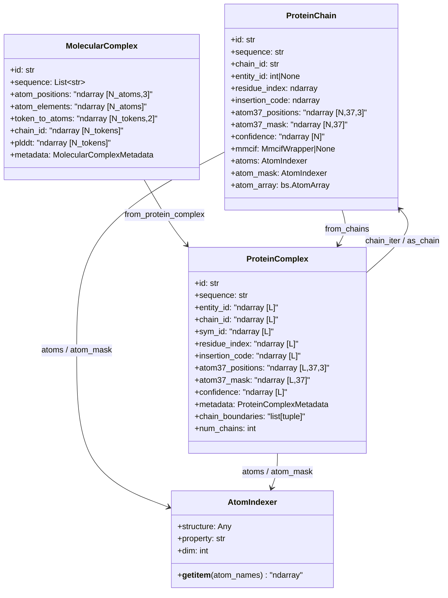
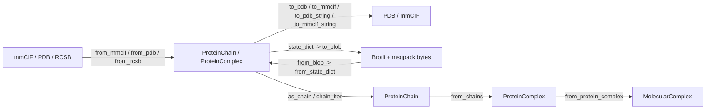

---
slug:23-protein-chain-and-complex-utilities
blog_type:normal
---


ESM 结构工具提供了一个分层类型系统，用于在逐步丰富的组合粒度级别上表示蛋白质结构——从单条多肽链，到多链生物装配体，再到包含核酸和小分子配体的完全异质分子复合物。每一层都是一个基于 NumPy 数组的冻结数据类（frozen dataclass），采用 **atom37** 坐标表示，并支持通过 PDB、mmCIF 和压缩的二进制大对象格式进行往返序列化。本页面涵盖了将这些类型绑定在一起的架构约定、构造模式、度量计算和相互转换路径。

## 类型层次结构与数据模型

三个核心数据类构成了严格的层次结构：`ProteinChain` 捕获单条多肽，`ProteinComplex` 组合了带有链断裂标记和装配体元数据的多条链，而 `MolecularComplex` 则进一步泛化为支持非蛋白质分子的扁平化标记表示。`AtomIndexer` 提供了跨所有类型的便捷原子名称访问。



`ProteinComplex` 中的 `L` 维度包含链断裂标记（`|`），用于在拼接的序列数组中分隔各条链。所有逐残基的数组——`atom37_positions`、`atom37_mask`、`confidence`、`residue_index`、`entity_id`、`chain_id`、`sym_id`——共享相同的以 `L` 为长度的第一维度，其中分隔符行使用哨兵值填充（NaN 位置、零掩码、`-1` 残基索引）。

来源：[protein_chain.py](/esm/utils/structure/protein_chain.py#L101-L128), [protein_complex.py](/esm/utils/structure/protein_complex.py#L72-L107), [molecular_complex.py](/esm/utils/structure/molecular_complex.py#L42-L100), [atom_indexer.py](/esm/utils/structure/atom_indexer.py#L1-L16)

## ProteinChain：单链表示

`ProteinChain` 是一个冻结数据类，在 atom37 坐标系中存储一条多肽链——即一个 `[N_residues, 37, 3]` 的位置张量，其中 37 个标准原子槽位均遵循 `residue_constants.atom_order` 中定义的顺序。布尔类型的 `atom37_mask` 指示哪些原子携带有有效坐标；缺失的原子（在低分辨率结构中的侧链中很常见）其位置为 NaN。

### 构造路径

| 工厂方法 | 输入格式 | 关键行为 |
|---|---|---|
| `from_rcsb(pdb_id, chain_id, entity_id)` | RCSB PDB 标识符 | 从 RCSB 获取 mmCIF，委托给 `from_mmcif` |
| `from_mmcif(path, chain_id, entity_id, is_predicted)` | mmCIF 文件/缓冲区 | 通过 `MmcifWrapper` 解析，按 ID 或实体选择链；默认为第一个实体 |
| `from_pdb(path, chain_id, id, is_predicted)` | PDB 文件/缓冲区 | 通过 biotite 解析；`chain_id="detect"` 选取第一条链 |
| `from_atom37(atom37_positions, sequence, ...)` | 原始 `[N,37,3]` 数组 | 从 `isfinite` 推断掩码；为缺失的元数据填充默认值 |
| `from_backbone_atom_coordinates(coords, ...)` | `[N,3,3]` N/CA/C 数组 | 扩展至完整的 atom37，非骨架原子用 `inf` 填充 |
| `from_atomarray(atom_array, id, is_predicted)` | biotite `AtomArray` | 通过 PDB 序列化进行往返转换 |
| `from_blob(input)` | 压缩字节 | Brotli 解压 → msgpack 反序列化 → `from_state_dict` |
| `from_mds(data)` | 原始字典 | 从字典直接进行字段赋值 |

从 mmCIF 加载时，`chain_id` 参数按**作者链 ID** 进行选择，而 `entity_id` 按 mmCIF 实体标识符进行选择。如果两者均未提供，工厂方法默认选择具有最小 ID 的实体。对于 `is_predicted=True` 的结构，CA 原子的 B 因子会被作为 pLDDT 代理读入 `confidence` 字段。

<CgxTip>单链输出硬编码了常量 `CHAIN_ID_CONST = "A"`——诸如 `to_pdb` 和 `to_mmcif` 等方法会将所有原子标记为链 "A"，而忽略原始链标识符。当你需要忠实还原多链标签时，请使用 `ProteinComplex`。</CgxTip>

### 坐标归一化与原子推断

两个关键的重建工具用于补全部分骨架坐标：

- **`infer_oxygen()`** —— 使用通过 `Affine3D.from_graham_schmidt(CA, C, N_next)` 应用的固定局部坐标系偏移向量 `[0.6240, -1.0613, 0.0103]`，从*下一个*残基的 N-CA-C 坐标系计算羰基氧位置。返回一个补全了原先缺失的 O 原子的新 `ProteinChain`。
- **`infer_cbeta(infer_cbeta_for_glycine=False)`** —— 使用受 trDesign 启发的几何构造（键长 `L=1.522Å`，键角 `A=1.927rad`，二面角 `D=-2.143rad`），从 N、C、CA 三联体重建 Cβ 位置。甘氨酸残基默认被排除，因为它们缺乏 Cβ。

**坐标归一化**流程——`get_normalization_frame()` → `apply_frame()` → `normalize_coordinates()`——以 CA 平均位置为中心对齐链，并通过 N/CA/C 平均向量的 Gram-Schmidt 正交化进行对齐。这生成了一个对于前馈模型输入非常有用的规范 SE(3) 坐标系。

来源：[protein_chain.py](/esm/utils/structure/protein_chain.py#L996-L1195), [protein_chain.py](/esm/utils/structure/protein_chain.py#L200-L399)

## ProteinComplex：多链装配体

`ProteinComplex` 通过使用**链断裂标记**（`|`）作为分隔符拼接逐链数组，将 atom37 表示扩展到了生物装配体。序列字符串变为 `"ACDEF...|GHIKL...|..."`，其中 `|` 标记链之间的边界。三个额外的逐残基数组用于跟踪多链身份：

| 字段 | 形状 | 语义 |
|---|---|---|
| `entity_id` | `[L]` | 将残基映射到唯一序列实体——共享相同氨基酸序列的链将获得相同的实体 ID |
| `chain_id` | `[L]` | 数值链标识符——同一实体的多个副本获得不同的链 ID |
| `sym_id` | `[L]` | 对称副本索引——区分装配体内的对称副本 |

`ProteinComplexMetadata` 数据类携带查找字典（`chain_lookup`、`entity_lookup`），将数值 ID 映射到其字符串标签，另外还有一个 `assembly_composition` 字典，用于将装配体 ID 映射到其组成链 ID，以便进行生物装配体切换。

### 链访问与迭代

```python
# 作为 ProteinChain 对象迭代各个链
for chain in complex.chain_iter():
    print(chain.chain_id, len(chain))

# 按位置索引直接访问
chain_0 = complex.get_chain_by_index(0)

# 按作者链 ID 访问（在重复项中随机抽样）
chain_A = complex.get_chain_by_id("A")

# 将单链复合物转换回 ProteinChain
chain = complex.as_chain()          # 断言为单链
chain = complex.as_chain(force_conversion=True)  # 展平多链
```

`chain_boundaries` 缓存属性通过扫描 `|` 标记来计算 `[(start, end), ...]` 对。当使用布尔掩码对 `ProteinComplex` 进行切片时，`__getitem__` 实现会自动保留链断裂标记并移除连续的 `||` 伪影，从而确保结果的结构完整性。

### 装配体操作

`ProteinComplex` 支持对从 mmCIF 加载的结构进行**生物装配体切换**。`switch_assembly(id)` 方法从源 mmCIF 文件重新解析装配体变换，并应用旋转/平移算子来生成请求的生物装配体。`find_assembly_ids_with_chain(id)` 方法查询哪些装配体包含给定的链。

内部函数 `get_assembly_fast()` 从 mmCIF 文件解析 `pdbx_struct_assembly_gen` 和 `pdbx_struct_oper_list` 类别，通过 `_get_transformations` 计算变换矩阵，并通过 `_apply_transformations_fast` 应用它们——该函数遍历操作表达式的笛卡尔积以生成所有对称副本。

<CgxTip>在 `ProteinComplex` 上计算 RMSD 或 lDDT 时，这些方法默认设置 `compute_chain_assignment=True`，这会在对齐之前在内部运行完整的 DockQ 计算以寻找最优的链映射。这虽然准确但开销很大——如果链已经对齐，请设置 `compute_chain_assignment=False`。</CgxTip>

来源：[protein_complex.py](/esm/utils/structure/protein_complex.py#L72-L200), [protein_complex.py](/esm/utils/structure/protein_complex.py#L996-L1207)

## MolecularComplex：异质分子装配体

`MolecularComplex` 超越了纯蛋白质结构，支持蛋白质 alongside 的**核酸（RNA/DNA）和小分子配体**。它不使用固定的 atom37 表示，而是采用带有标记到原子索引映射的**扁平化原子数组**：

| 字段 | 形状 | 描述 |
|---|---|---|
| `atom_positions` | `[N_atoms, 3]` | 跨所有分子的所有原子的扁平化坐标数组 |
| `atom_elements` | `[N_atoms]` | 每个原子的元素符号 |
| `token_to_atoms` | `[N_tokens, 2]` | 每个标记在扁平化原子数组中的起始/结束索引 |
| `atom_names` | `[N_atoms]`（可选） | PDB 原子名称，从源结构中保留 |
| `atom_hetero` | `[N_atoms]`（可选） | 源结构中的 HETATM 标记 |

各个标记通过由 `__getitem__` 返回的 `Molecule` 数据类进行访问，该数据类携带 `molecule_type`（PROTEIN=0, RNA=1, DNA=2, LIGAND=3）和 `residue_type` 字段。`from_protein_complex()` 类方法提供了从纯蛋白质世界过渡的桥梁：它移除链断裂标记，通过 `restype_1to3` 将 1 字母代码转换为 3 字母残基名称，并将 atom37 数组展平为标记索引的扁平化表示。

`MolecularComplexResult` 数据类封装了带有标准质量度量的折叠输出——`plddt`、`ptm`、`iptm`、`pae`、`distogram` 和 `pair_chains_iptm`——代表复合物折叠预测的完整输出。

来源：[molecular_complex.py](/esm/utils/structure/molecular_complex.py#L1-L200)

## 结构度量与对齐

`ProteinChain` 和 `ProteinComplex` 都公开了一致的比较度量集合，全部委托给 `metrics.py` 和 `Aligner` 类中的底层实现：

| 度量 | 方法 | 算法 | 备注 |
|---|---|---|---|
| RMSD | `.rmsd(target, ...)` | 通过 `Aligner` 进行 Kabsch 对齐 | `also_check_reflection` 用于处理手性歧义 |
| lDDT-CA | `.lddt_ca(native, ...)` | 距离差异容忍度 | **非对称**——始终以 `prediction.lddt_ca(native)` 方式调用 |
| GDT-TS | `.gdt_ts(target, ...)` | 基于阈值的 CA 叠合 | 使用 1Å、2Å、4Å、8Å 距离截断值 |
| DockQ | `.dockq(native)` (仅限 Complex) | 外部 DockQ-v2 二进制文件 | 完整界面评分；返回带有逐界面细分的 `DockQResult` |

对于 `ProteinComplex`，`rmsd`、`lddt_ca` 和 `gdt_ts` 方法接受一个 `compute_chain_assignment` 标志，当为 True 时，首先运行 `dockq()` 以在计算度量之前确定最优的链映射——这考虑到了预测结构和天然结构之间的链顺序可能不同的情况。

### 对齐工作流

`Aligner` 类（来自 `aligner.py`）执行 Kabsch 叠合。`ProteinChain` 上的 `.align(target)` 方法返回一个对齐后的新链，而底层的 `Aligner.apply()` 方法可以在给定移动索引和参考索引的情况下对齐任何结构：

```python
aligned = chain.align(target, mobile_inds=[0,1,2], target_inds=[5,6,7], only_use_backbone=True)
rmsd_value = chain.rmsd(target, only_compute_backbone_rmsd=True)
```

### 链级生物物理属性（仅限 ProteinChain）

| 属性 | 方法 | 计算 |
|---|---|---|
| SASA | `.sasa(by_residue=True)` | Biotite `bs.sasa()` 逐原子计算，通过 `bincount` 聚合 |
| SAP 分数 | `.sap_score(aggregation="residue")` | 5Å 半径内的空间聚集倾向 |
| 球形度 | `.globularity()` | MVEE 体积比 × 拉伸度度量 |
| 回转半径 | `.radius_of_gyration()` | Biotite `bs.gyration_radius()` |
| Cβ 接触 | `.cbeta_contacts(distance_threshold=8.0)` | 来自（推断的）Cβ 位置的成对距离矩阵 |

来源：[protein_chain.py](/esm/utils/structure/protein_chain.py#L399-L796), [protein_complex.py](/esm/utils/structure/protein_complex.py#L598-L797), [metrics.py](/esm/utils/structure/metrics.py)

## 序列化与 I/O

所有三个数据类都支持针对不同用例优化的分层序列化策略：

### 文件格式 I/O



### Blob 序列化细节

`to_blob()` / `from_blob()` 流水线通过依次应用三种技术实现了大幅压缩：(1) **稀疏编码** —— `atom37_positions` 仅为被掩码掩盖的原子存储，消除了 NaN 填充；(2) **dtype 降维** —— 索引由 `int64` 降为 `int32`，坐标和置信度由 `float64/float32` 降为 `float16`；(3) 质量等级为 5 的 **Brotli 压缩**。这将每百万条链的存储空间从约 52GB 减少到了约 20GB。`state_dict()` 方法还接受 `backbone_only=True` 以剥离侧链原子掩码，以及 `json_serializable=True` 以将数组转换为嵌套列表。

### mmCIF 质量标注

`ProteinChain` 上的 `to_mmcif()` 方法将 `ma_qa_metric` 和 `ma_qa_metric_local` 类别写入 CIF 文件，使 Molstar 的 "AlphaFold view" 能够直接根据置信度数组渲染逐残基的 pLDDT 着色。`ProteinComplex` 上的 `to_mmcif_string()` 方法通过将具有相同序列的链分组到共享实体中，额外生成了 `_entity`、`_entity_poly` 和 `_struct_asym` 类别。

来源：[protein_chain.py](/esm/utils/structure/protein_chain.py#L253-L398), [protein_complex.py](/esm/utils/structure/protein_complex.py#L399-L597), [molecular_complex.py](/esm/utils/structure/molecular_complex.py#L200-L400)

## 相互转换模式

类型系统专为流畅的相互转换而设计。`ProteinComplex` 上的 `from_chains()` 类方法拼接 `ProteinChain` 对象列表，插入 `CHAIN_BREAK_TOKEN` 分隔符，并通过检测共享的链 ID 和实体 ID 来构建 `entity_id`/`chain_id`/`sym_id` 索引数组。反向操作——`as_chain()`——将单实体复合物展平回 `ProteinChain`，除非 `force_conversion=True`，否则会断言其唯一性。

工具函数 `protein_chain_to_protein_complex()` 处理 `ProteinChain` 的序列中已包含链断裂标记（例如，来自模型输出）的边缘情况，在 `|` 位置将其拆分为子链，并重建出合法的 `ProteinComplex`。

对于泛化路径，`MolecularComplex.from_protein_complex()` 通过迭代残基、提取被掩码掩盖的原子以及构建 `token_to_atoms` 索引映射，将 atom37 表示转换为扁平化标记模型。这是需要超越纯蛋白质限制的混合成分结构的入口点。

来源：[protein_complex.py](/esm/utils/structure/protein_complex.py#L449-L560), [molecular_complex.py](/esm/utils/structure/molecular_complex.py#L103-L200), [protein_complex.py](/esm/utils/structure/protein_complex.py#L1160-L1207)

## 后续步骤

- 有关将这些结构转换为模型输入的标记化流水线，请参阅 [Encode-Decode Pipeline](22-encode-decode-pipeline)。
- 有关 VQ-VAE 如何将 atom37 坐标编码为离散结构标记的信息，请参阅 [VQ-VAE Structure Encoding](11-vq-vae-structure-encoding)。
- 有关在推理期间对 3D 坐标进行操作的几何注意力机制的信息，请参阅 [Geometric Attention and SE(3) Invariance](13-geometric-attention-and-se-3-invariance)。