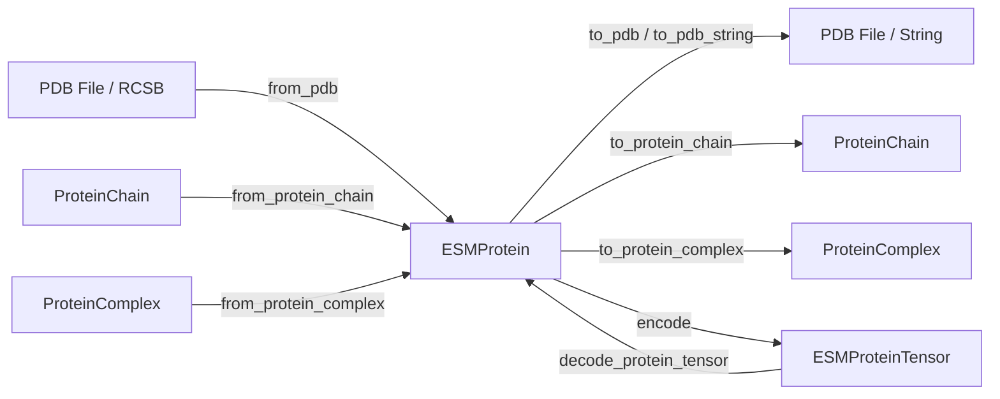

---
slug:3-esmprotein-data-model
blog_type:normal
---


**ESMProtein** 类是你在使用 ESM3 的每个阶段都会遇到的核心数据对象。它是一个容器，包含多个*轨道*（track）——即单个蛋白质在序列、结构和功能上的并行表示——它既作为你提供给模型的输入，也作为你接收的输出。理解每个轨道包含的内容、它们之间的关联，以及如何构造和转换 `ESMProtein`，是完成从简单的嵌入查找到完整生成设计等所有任务的基础。

来源：[api.py](/esm/sdk/api.py#L26-L55), [1_esmprotein.ipynb](/cookbook/tutorials/1_esmprotein.ipynb#L7-L31)

## 五个输入轨道

ESM3 对蛋白质的三个基本生物学特性进行联合推理：序列、结构和功能。这些特性在 `ESMProtein` 内部被分解为**五个可提示的轨道**。每个轨道都是可选的（默认为 `None`），你可以在调用模型时将它们中的任意子集设置为部分或完全未掩码——这就是你*提示* ESM3 进行生成或推理的机制。

| 轨道 | 属性 | Python 类型 | 生物学含义 |
|---|---|---|---|
| **序列** | `sequence` | `str \| None` | 单字母氨基酸序列（例如 `"MKTLL..."`） |
| **坐标** | `coordinates` | `torch.Tensor \| None` | atom37 格式的 3D 原子位置，形状为 `(L, 37, 3)` |
| **二级结构** | `secondary_structure` | `str \| None` | 每个残基的 8 类 DSSP 标签（例如 `"HHHEEC..."`） |
| **SASA** | `sasa` | `list[float \| None] \| None` | 每个残基的溶剂可及表面积 |
| **功能注释** | `function_annotations` | `list[FunctionAnnotation] \| None` | 源自 InterPro 的残基范围关键字注释 |

<CgxTip>所有五个轨道都是可选的，默认值为 `None`。当某个轨道为 `None` 时，在模型输入期间会将其视为完全掩码。将轨道设置为包含 `_` 字符（掩码简写）的字符串会部分掩码该轨道，让你能细粒度地控制模型应预测哪些残基。</CgxTip>

来源：[api.py](/esm/sdk/api.py#L26-L32), [1_esmprotein.ipynb](/cookbook/tutorials/1_esmprotein.ipynb#L23-L31)

### 序列轨道

`sequence` 属性是最简单的轨道：一个由单字母氨基酸代码组成的 Python 字符串，遵循标准的 20 种残基字母表及特殊标记。下划线 `_` 字符在原始字符串表示中充当**掩码标记**——任何标记为 `_` 的位置都会指示模型预测该残基。完整的词汇表包括标准氨基酸（`L, A, G, V, S, E, R, T, I, D, P, K, Q, N, F, Y, M, H, W, C`）、非标准代码（`X, B, U, Z, O`）、缺口（`.`）、链断裂（`|`）和掩码（`<mask>`，由 `_` 映射而来）。

```python
# 长度为 10 的完全掩码蛋白质（模型将预测所有内容）
protein = ESMProtein(sequence="__________")

# 部分掩码的蛋白质（模型预测第 4-6 位）
protein = ESMProtein(sequence="MKT___VILP")

# 完全指定的序列（无需预测）
protein = ESMProtein(sequence="MKTLIVILPF")
```

来源：[esm3.py](/esm/utils/constants/esm3.py#L46-L59), [encoding.py](/esm/utils/encoding.py#L22-L45)

### 坐标轨道

`coordinates` 属性以形状为 `(L, 37, 3)` 的 `torch.Tensor` 存储 3D 原子位置，其中 `L` 是残基数量。**atom37** 表示法为每个氨基酸编码最多 37 个重原子（这是一个涵盖所有标准残基类型的固定超集）。给定残基中不存在的原子用 `NaN` 值填充。最后一个维度的三个值是以埃为单位的 `(x, y, z)` 笛卡尔坐标。

```python
# 从 PDB 加载后，坐标会自动填充
protein = ESMProtein.from_pdb("1cm4.pdb", chain_id="A")
print(protein.coordinates.shape)  # torch.Size([L, 37, 3])
```

<CgxTip>在仅使用坐标（没有序列）初始化 `ESMProtein` 时，模型在 PDB 转换期间会将所有残基视为丙氨酸。当你在下游分析或可视化中需要正确的氨基酸身份时，务必将坐标与序列配对使用。</CgxTip>

来源：[api.py](/esm/sdk/api.py#L28-L32), [1_esmprotein.ipynb](/cookbook/tutorials/1_esmprotein.ipynb#L120-L127)

### 二级结构轨道

`secondary_structure` 属性使用**8 类 DSSP 分类**（SS8）。每个残基被分配一个代表其局部结构基序的八种字符之一：

| SS8 代码 | 类别 | 3 类映射 | 描述 |
|---|---|---|---|
| `H` | α-螺旋 | H | 标准阿尔法螺旋 |
| `G` | 3₁₀-螺旋 | H | 短螺旋（每圈 3 个残基） |
| `I` | π-螺旋 | H | 宽螺旋（每圈 5 个残基） |
| `E` | 延伸链 | E | Beta 折叠（参与） |
| `B` | 孤立 beta 桥 | E | 单个 beta 桥残基 |
| `T` | 转角 | C | 氢键转角 |
| `S` | 弯曲 | C | 非螺旋弯曲 |
| `C` | 无规卷曲 | E → C | 环 / 不规则 |

可以使用内置映射将 8 类标签折叠为 3 类表示（`H`, `E`, `C`）。当你在本地未安装 DSSP 时，可以通过 `biotite.structure.annotate_sse` 获取近似的 3 类表示。

```python
# SS8 字符串：每个残基一个字符
protein.secondary_structure = "HHHHHHEEEESSSCCCCTTT"
```

来源：[esm3.py](/esm/utils/constants/esm3.py#L61-L72), [1_esmprotein.ipynb](/cookbook/tutorials/1_esmprotein.ipynb#L215-L245)

### SASA 轨道

**溶剂可及表面积**（SASA）轨道量化了每个残基暴露于溶剂的程度，表示为每个残基的连续浮点值。在内部，ESM3 根据边界 `[0.8, 4.0, 9.6, 16.4, 24.5, 32.9, 42.0, 51.5, 61.2, 70.9, 81.6, 93.3, 107.2, 125.4, 151.4]` 定义的区间将 SASA 离散化，产生 16 个离散标记。作为用户，你只需提供一个浮点数列表（或使用 `None` 表示掩码位置），分词器会自动处理离散化。

```python
# 每个残基的 SASA 值——从 ProteinChain 或模型输出计算得出
protein.sasa = protein_chain.sasa()  # 浮点数列表
# 部分掩码：[12.5, None, 33.1, ...] — None 表示“在此预测”
```

埋藏在蛋白质核心的残基往往具有较低的 SASA 值（低于约 10），而表面暴露的残基该值可超过 100。

来源：[esm3.py](/esm/utils/constants/esm3.py#L74-L90), [1_esmprotein.ipynb](/cookbook/tutorials/1_esmprotein.ipynb#L627-L643)

### 功能注释轨道

`function_annotations` 轨道在结构上最为复杂，它由 `FunctionAnnotation` 对象列表组成，而不是简单的逐残基数组。每个 `FunctionAnnotation` 跨越一个残基范围并带有一个标签：

```python
@dataclass
class FunctionAnnotation:
    label: str    # InterPro ID 或关键字字符串
    start: int    # 从 1 开始索引，包含边界
    end: int      # 从 1 开始索引，包含边界
```

ESM3 支持两种类型的功能注释：**InterPro 条目注释**（例如 `"IPR011992"`）和源自 InterPro 条目描述及 Gene Ontology 映射的**关键字注释**。该模型旨在与关键字注释配合使用，这些注释将每个 InterPro 条目扩展为覆盖相同残基范围的多个描述性关键字。你可以使用 `InterProQuantizedTokenizer` 在两者之间进行转换：

```python
from esm.tokenization import InterProQuantizedTokenizer
from esm.utils.types import FunctionAnnotation

# 定义 InterPro 注释（从 1 开始索引，包含边界）
interpro_annotations = [
    FunctionAnnotation(label="IPR011992", start=1, end=143),
    FunctionAnnotation(label="IPR018247", start=17, end=29),
]

# 为 ESM3 输入转换为关键字注释
tokenizer = InterProQuantizedTokenizer()
keyword_annotations = []
for ann in interpro_annotations:
    keywords = tokenizer.interpro2keywords.get(ann.label, [])
    keyword_annotations.extend(
        FunctionAnnotation(label=kw, start=ann.start, end=ann.end)
        for kw in keywords
    )
protein.function_annotations = keyword_annotations
```

来源：[types.py](/esm/utils/types.py#L14-L33), [1_esmprotein.ipynb](/cookbook/tutorials/1_esmprotein.ipynb#L456-L593)

## 置信度指标

除了五个可提示的输入轨道外，`ESMProtein` 还包含三个**只读指标**字段，它们在结构预测期间由模型填充。它们不是输入——而是量化模型对其生成坐标的置信度的输出。

| 指标 | 属性 | 形状 | 含义 |
|---|---|---|---|
| **pLDDT** | `plddt` | `(L,)` | 每残基置信度分数（0–100） |
| **pTM** | `ptm` | 标量 | 整条链的预测 TM 分数 |
| **pAE** | `pae` | `(L, L)` | 所有残基对之间的预测对齐误差 |

来源：[api.py](/esm/sdk/api.py#L34-L37)

## 构造与转换方法

`ESMProtein` 提供了多种类方法和实例方法，用于从外部来源构造蛋白质并将其转换为其他格式。下图展示了完整的转换体系：



### 从外部来源

创建 `ESMProtein` 最常见的方法是从 PDB 文件或 RCSB 条目加载。`from_pdb` 类方法加载 PDB 文件，将其解析为 `ProteinChain`，并转换为已填充 `sequence` 和 `coordinates` 的 `ESMProtein`：

```python
from esm.sdk.api import ESMProtein
from esm.utils.structure.protein_chain import ProteinChain

# 方式 1：直接从 PDB 文件加载
protein = ESMProtein.from_pdb("my_structure.pdb", chain_id="A")

# 方式 2：从 ProteinChain 构建（控制更精细）
protein_chain = ProteinChain.from_rcsb("1cm4", "A")
protein = ESMProtein.from_protein_chain(protein_chain)

# 方式 3：从带注释的 ProteinChain 构建（同时填充 SASA）
protein = ESMProtein.from_protein_chain(protein_chain, with_annotations=True)
```

当设置 `with_annotations=True` 时，该工厂方法还会根据 `ProteinChain` 计算出的 SASA 值填充 `sasa` 轨道。若不设置，则仅填充 `sequence`、`coordinates` 和 `plddt`。

来源：[api.py](/esm/sdk/api.py#L57-L90), [1_esmprotein.ipynb](/cookbook/tutorials/1_esmprotein.ipynb#L74-L94)

### 转换为外部格式

转换回标准结构格式同样简单直接：

```python
# 写入 PDB 文件
protein.to_pdb("output.pdb")

# 直接获取 PDB 字符串（用于可视化或流式传输）
pdb_string = protein.to_pdb_string()

# 转换为 ProteinChain 进行结构分析
chain = protein.to_protein_chain()

# 转换为 ProteinComplex（需要同时具有 sequence 和 coordinates）
complex_ = protein.to_protein_complex()
```

请注意，`to_protein_chain` 需要设置 `coordinates`，而 `to_protein_complex` 需要同时设置 `sequence` 和 `coordinates`。`to_pdb` 和 `to_pdb_string` 方法在序列化之前，会在内部转换为 `ProteinComplex` 并推断氧原子位置。

来源：[api.py](/esm/sdk/api.py#L112-L194)

## 分词后的对应物：ESMProteinTensor

当 ESM3 实际处理蛋白质时，人类可读的 `ESMProtein` 会被**编码**为 `ESMProteinTensor`——这是一个并行结构，其中每个轨道都表示为离散的整数标记（PyTorch 张量），而不是原始字符串或浮点数。此编码步骤由分词管线处理，你通常不需要手动构造 `ESMProteinTensor`。然而，理解这两种类型之间的映射关系至关重要：

| ESMProtein 轨道 | ESMProteinTensor 轨道 | 标记类型 |
|---|---|---|
| `sequence` (str) | `sequence` (Tensor) | 带有 BOS/EOS 的氨基酸标记 ID |
| `coordinates` (Tensor) | `structure` (Tensor) | VQ-VAE 码本索引 |
| `secondary_structure` (str) | `secondary_structure` (Tensor) | SS8 类别标记 ID |
| `sasa` (list[float]) | `sasa` (Tensor) | 离散化区间标记 ID |
| `function_annotations` (list) | `function` (Tensor) | 量化的 InterPro 关键字 ID |
| *(无对应项)* | `residue_annotations` (Tensor) | 每残基注释标记 ID |

所有分词后的张量都包含 BOS（序列起始）和 EOS（序列结束）特殊标记，使其长度变为 `L + 2`。`ESMProteinTensor.empty(length, tokenizers)` 工厂方法会创建一个指定长度的完全掩码张量，为生成做好准备。

来源：[api.py](/esm/sdk/api.py#L201-L283), [encoding.py](/esm/utils/encoding.py#L156-L229)

## 长度与掩码语义

`ESMProtein` 上的 `__len__` 方法根据它找到的第一个非 `None` 轨道确定蛋白质长度，检查顺序为：`sequence` → `secondary_structure` → `sasa` → `coordinates`。如果所有轨道都为 `None`，则会引发 `ValueError`。这种设计意味着你无需显式指定长度——它总是从你提供的数据中推断出来。

掩码在字符串轨道（`sequence`, `secondary_structure`）中使用 `_` 字符，在列表轨道（`sasa`）中使用 `None` 条目。掩码简写 `_` 在分词期间会被转换为 `<mask>`。对于 `coordinates`，掩码是通过结构标记掩码在 `ESMProteinTensor` 层面处理的。

```python
# 蛋白质长度会自动推断
protein = ESMProtein(sequence="MKTL_III__")
print(len(protein))  # 10

# 复制蛋白质以便安全修改
protein_copy = protein.copy()
```

来源：[api.py](/esm/sdk/api.py#L45-L55), [encoding.py](/esm/utils/encoding.py#L35-L44)

## 快速参考：ESMProtein 概览

| 类别 | 属性 / 方法 | 类型 / 签名 | 描述 |
|---|---|---|---|
| **轨道** | `sequence` | `str \| None` | 氨基酸字符串，`_` = 掩码 |
| **轨道** | `coordinates` | `Tensor \| None` | 形状 `(L, 37, 3)`，atom37 格式 |
| **轨道** | `secondary_structure` | `str \| None` | SS8 字符串，`_` = 掩码 |
| **轨道** | `sasa` | `list[float \| None] \| None` | 每残基浮点数，`None` = 掩码 |
| **轨道** | `function_annotations` | `list[FunctionAnnotation] \| None` | 残基上的带标签跨度 |
| **指标** | `plddt` | `Tensor \| None` | 每残基置信度 |
| **指标** | `ptm` | `Tensor \| None` | 预测的 TM 分数 |
| **指标** | `pae` | `Tensor \| None` | 预测的对齐误差矩阵 |
| **工厂** | `from_pdb(path, chain_id)` | `→ ESMProtein` | 从 PDB 文件加载 |
| **工厂** | `from_protein_chain(chain)` | `→ ESMProtein` | 从 ProteinChain 转换 |
| **工厂** | `from_protein_complex(cpx)` | `→ ESMProtein` | 从 ProteinComplex 转换 |
| **导出** | `to_pdb(path)` | `→ None` | 写入 PDB 文件 |
| **导出** | `to_pdb_string()` | `→ str` | PDB 格式字符串 |
| **导出** | `to_protein_chain()` | `→ ProteinChain` | 转换为 ProteinChain |
| **导出** | `to_protein_complex()` | `→ ProteinComplex` | 转换为 ProteinComplex |
| **工具** | `copy()` | `→ ESMProtein` | 深拷贝 |
| **工具** | `__len__()` | `→ int` | 从第一个非 None 轨道推断 |

来源：[api.py](/esm/sdk/api.py#L26-L199)

## 接下来去哪

现在你已经了解了 `ESMProtein` 数据模型，可以准备好将其与模型结合使用了。自然的下一步是：

- **[嵌入](2-quick-start)** — 了解如何将 `ESMProtein` 传递给模型以获取嵌入和预测
- **[序列与结构分词器](10-sequence-and-structure-tokenizers)** — 理解每个轨道如何转换为离散标记
- **[编码-解码管线](22-encode-decode-pipeline)** — 演练从 `ESMProtein` → `ESMProteinTensor` → 模型 → `ESMProtein` 的完整往返过程
- **[蛋白质链与复合物工具](23-protein-chain-and-complex-utilities)** — 探索与 `ESMProtein` 互操作的 `ProteinChain` 和 `ProteinComplex` 类