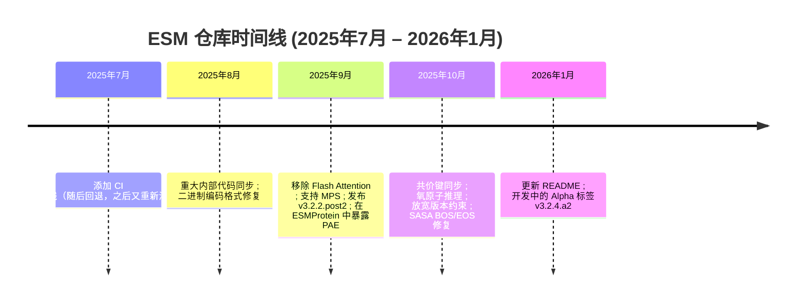
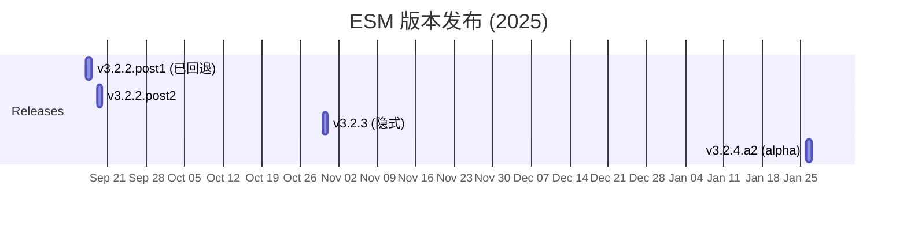

---
slug:4-latest-updates
blog_type:buzz
---

ESM 仓库一直都不平静。在 2025 年中至 2026 年初期间，EvolutionaryScale 团队持续推送了大量的补丁、架构清理和新功能——与此同时，社区也暴露出了一些直击模型处理蛋白质数据核心方式的 Bug。以下是对这些重要变更的结构化梳理。

## 宏观视角：3.2 版本后的成熟期

自 2024 年 12 月发布 [ESM Cambrian 公告](https://www.evolutionaryscale.ai/blog/esm-cambrian)（推出了 300M、600M 和 6B 参数规模的 ESM C 系列模型）以来，该开源仓库一直处于整合阶段。版本历史清晰地记录了这一切：

这种模式对于任何维护过快速迭代的 ML 库的人来说都不陌生：**同步内部代码，修复故障，加固构建，然后不断循环**。但在这套常规的循环之下，有几项具体的变更值得深入探讨。

## Flash Attention：被移除，而非被替换

在可以说是最具架构意义的提交中，Zeming Lin 通过 [Remove flash attention (#269)](https://github.com/Biohub/esm/commit/7454c3d77bc731990c534936ef091db3851455a3) 彻底剥离了 `flash_attn` 依赖。紧接着，[pyright ignore flash_attn import (#274)](https://github.com/Biohub/esm/commit/97eb26b2fe04386205bd8049033cc14f022d1fa3) 为现在已被条件守护的导入添加了类型检查忽略规则。

为什么这很重要？Flash Attention 一直是基于 Transformer 模型的性能利器，能在 NVIDIA GPU 上提供显著的加速。移除它意味着两种可能：要么是团队发现兼容性问题过于棘手（Flash Attention 的 CUDA 内核要求在不同 PyTorch 版本间出了名的脆弱），要么是他们已经找到了不需要它的替代路径。`flash_attn` 目前仍被*条件守护*而非彻底删除，这一事实表明他们保留了后续恢复的可能性——但默认路径已不再依赖它。对于使用非 NVIDIA 硬件的用户来说，这无疑是个好消息。

## Mac Silicon 支持：终于来了

9 月份合入了呼声最高的功能之一：[Enable running ESM on Mac silicon using MPS (#99)](https://github.com/Biohub/esm/commit/c8969198c62129fd76eba5e450b091d2d3b012ac)，由 Imran Qureshi 编写，Zeming Lin 联合创作。该功能启用了 Metal Performance Shaders (MPS) 后端，让研究人员能够在 Apple M 系列芯片上运行推理。

这个时机颇为微妙。PyTorch 的 MPS 后端[走过了一段坎坷的维护之路](https://docs.pytorch.org/serve/hardware_support/apple_silicon_support.html)，官方甚至发布公告称其“不再积极维护”。ESM 选择在*当下*添加 MPS 支持，表明团队认为 Apple 硬件上的研究者需求已经足够大，足以支撑此举——或许仅限于推理层面而非训练。无论如何，这都为相当一部分学术界用户降低了准入门槛。

## 结构与编码修复：默默无闻却至关重要

9 月至 10 月间的一组提交解决了编码和结构正确性问题：

| 提交 | 作者 | 变更内容 |
|--------|--------|--------------|
| [sasa BOS/EOS fix (#286)](https://github.com/Biohub/esm/commit/6e89bf7d127b06e95d8243c020936cd67d862229) | Ishaan Mathur | 修复了 SASA token 未以正确的 BOS/EOS 标记开头/结尾的问题 |
| [syncing covalent bonds (#280)](https://github.com/Biohub/esm/commit/23b084b94f3b5f6fd700ae41f46a2787a9a5c12b) | Ishaan Mathur | 同步了内部与开源代码间的共价键处理逻辑 |
| [Ishaan/infer oxygen (#283)](https://github.com/Biohub/esm/commit/232a1041d807cce2d58ab8501750e0bfda6c26c4) | Ishaan Mathur | 增加了蛋白质复合物中的氧原子推理 |
| [sync (#278)](https://github.com/Biohub/esm/commit/e8117a2f68b264657eb9717308d55e5f8690588c) | Ishaan Mathur | 常规的内部到外部代码同步 |
| [Exposing pae in ESMProtein (#164)](https://github.com/Biohub/esm/commit/79c1208e96e84f9cce4479d243daf9865263c50e) | Ventura Rivera | 在 ESMProtein 数据模型中暴露了 Predicted Aligned Error (PAE) 分数 |

**SASA BOS/EOS 修复**值得重点关注，因为它直接关联到[一个用户反馈的问题](https://github.com/Biohub/esm/issues/258)：功能预测代码因 `ValueError: SASA does not start with 0 corresponding to BOS token` 而崩溃。根本原因在于 SASA token 在 BOS/EOS 位置使用 `inf` 而非 `0` 进行填充——这是一个隐蔽的编码 Bug，仅在解码功能注释时才会暴露。

**PAE 暴露**是开发者体验上的一次胜利。Predicted Aligned Error 对于评估预测结构的置信度至关重要，将其直接放在 `ESMProtein` 上，而不是深埋在原始输出张量中，使得 API 的易用性大幅提升。

**氧原子推理**提交解决了一个切实存在的功能缺口：ESM3 生成的 PDB 文件在主链羰基中[缺失 O 原子](https://github.com/Biohub/esm/issues/279)。团队没有要求用户对结构进行后处理，而是直接在流水线中加入了推理逻辑。

## 依赖与构建规范

有几项提交处理了保持包可构建性这一不太光鲜但至关重要的任务：

- [loosen version (#284)](https://github.com/Biohub/esm/commit/e103c9c1c4047c38e8c7f1215c91f8481268e366)：将 `transformers` 的版本上限从 `<=4.48.2` 放宽以允许更新版本，这是对[用户请求](https://github.com/Biohub/esm/issues/265)的直接回应，该请求指出 ESM 在 `transformers>=4.49.0` 上运行良好。
- [adding CI (#257)](https://github.com/Biohub/esm/commit/b237fe781ccd290bf458d9d4a7484a21ac00c7bc)：添加了检查代码规范、类型检查和运行测试的 CI 流水线——此前[的一次尝试曾遭回退](https://github.com/Biohub/esm/commit/e0669a4a05a05395dde08d4ff2eb0219bcc2f79e)。
- [various merge errors for the new binary encoding format (#261)](https://github.com/Biohub/esm/commit/2a19c4edde933c171dcb78baa304942338fbb23f)：修复了从内部代码同步过来的新二进制编码格式中与合并相关的 Bug。

放宽版本约束尤其值得关注，因为**过于严格的依赖锁定是科学 Python 领域长期的痛点**。当用户需要在同一环境中将 ESM 与其他 ML 库结合使用时，这会引发依赖冲突。EvolutionaryScale 在问题提交后几个月内就作出了回应，这是一个好迹象。

## 未来展望：Alpha 标签与 SAE 工作

GitHub 活动动态揭示了两个尚未合入 `main` 分支的活跃开发分支：

1. **稀疏自编码器 (SAE) 支持** — 分支 `ishaan/sae` 以及 `thomas-a-neil` 对它的贡献显示了集成 SAE 特征提取的工作进展。这与蛋白质语言模型机械可解释性日益增长的研究兴趣相吻合，正如 [ICLR 2025 的 LMRL Workshop](https://iclr.cc/virtual/2025/35912) 所展示的那样。该分支包含提取 SAE 特征的示例和一个 6B 规模的 SAE 名称，表明团队正在将可解释性工具扩展到其最大模型上。

2. **折叠示例** — `ishaan/folding` 分支添加了蛋白质折叠示例，支持超过 800 个残基的序列以及将 pLDDT 输出为 mmCIF 格式。

3. **3.2.4 版本** — 创建了标签 `mga esm v3.2.4.a2`，表明下一个版本正处于 Alpha 测试阶段。

## 不可忽视的 Bug：仍在开放的问题

虽然提交记录显示了进展，但几个待解决的问题暴露了尚未解决的结构性问题：

| 问题 | 严重度 | 核心问题 |
|-------|----------|--------------|
| [Attention mask bug (#299)](https://github.com/Biohub/esm/issues/299) | **高** | 填充 token 之间相互注意而非注意空内容——导致填充的隐藏状态不正确 |
| [NaN coordinates vs None (#294)](https://github.com/Biohub/esm/issues/294) | **高** | 传入 `coordinates=torch.full(..., nan)` 产生的 pTM 分数 (0.096) 远差于传入 `coordinates=None` (0.426) |
| [cls_token setter error (#240)](https://github.com/Biohub/esm/issues/240) | **中** | `ESMC.from_pretrained` 在版本 ≥3.1.5 上因 `AttributeError: property 'cls_token' has no setter` 失败 |
| [Forge API 403 errors (#296)](https://github.com/Biohub/esm/issues/296) | **中** | 拥有有效 Forge 额度的用户依然收到 "User does not have access to model" |
| [Unused dependencies (#303)](https://github.com/Biohub/esm/issues/303) | **低** | `pyproject.toml` 中依然列出了 `torchvision` 和已废弃的 `torchtext` |

从正确性的角度来看，**注意力掩码 Bug** 最令人担忧。该问题提供了精确的复现路径：当前实现使用 `seq_id` 的相等比较（`seq_id.unsqueeze(-1) == seq_id.unsqueeze(-2)`），这使得填充 token 形成了它们自己的注意力集群。正确的行为——使用逻辑与（`seq_id[:, None, :, None] & seq_id[:, None, None, :]`）——将确保填充 token *不注意任何内容*。这不仅仅影响填充隐藏状态的正确性；正如报告者所指出的，它还在处理变长序列的大批量时**浪费了计算资源**。

**NaN 与 None 坐标差异**同样令人不安，因为它违背直觉。用户有理由认为显式传入填充 NaN 的坐标应等同于 `coordinates=None`，然而 pTM 分数却下降了 4 倍多。这表明模型在处理坐标时，针对显式和隐式空坐标采用了不同的代码路径，而显式 NaN 路径正在悄无声息地降低质量。

## 版本发布时间线

发布后的版本号（`.post1`、`.post2`），以及 `3.2.2.post1` 被[立即回退](https://github.com/Biohub/esm/commit/cbaccc1693c033b5e7e9517c929d22b24370ddca)，然后[作为 `.post2` 重新发布](https://github.com/Biohub/esm/commit/3e109e2d1bc1d25445c14b41706cf3eb6f313d7d)这一事实，表明团队在发布工程方面仍在摸索。2025 年 7 月添加 CI 是朝着正确方向迈出的一步，但这种回退又重新应用的模式表明内部与外部代码库之间的同步仍然存在坎坷。

## 总结

ESM 仓库正处于**从快速迭代向稳定化过渡的阶段**。移除 Flash Attention、支持 MPS 以及放宽版本约束，都指向团队正努力拓宽硬件和软件的兼容性。结构性修复（SASA、氧原子推理、共价键）表明他们正在关注那些决定一个项目是演示 demo 还是生产工具的细节。

但未解决的 Bug 也讲述了平行的另一面：注意力掩码问题、NaN 坐标差异以及持续存在的 Forge 访问问题并非边缘情况——它们会影响所有进行批量推理、基于部分坐标进行结构预测或基于云端调用 API 的用户。即将到来的 SAE 和折叠工作令人期待，但团队最好在堆叠新功能之前先解决这些正确性问题。一个对填充序列悄无声息地产生错误隐藏状态的蛋白质语言模型，是无法在生产环境中被信任的。