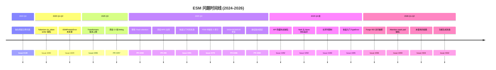
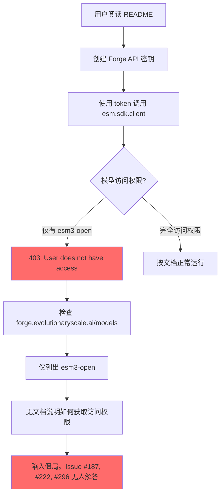

---
slug:5-issues-and-feedbacks
blog_type:buzz
---


ESM 仓库处于一个不同寻常的交汇点：一个由 EvolutionaryScale 和 Chan Zuckerberg Biohub 支持的、兼具生产级应用抱负的研究级蛋白质语言模型。但是，正如任何跨越研究与生产界限的项目一样，当真实用户开始挑战边界时，裂痕便会显现。本页汇总了最重大的反复出现的问题、社区的痛点，以及项目的开源雄心与其闭源基础设施现实发生冲突的领域。

## 问题全貌概览

在深入探讨之前，这里有一张标明社区痛点分布的高层级图谱：

| 类别 | 待解决问题 | 已关闭问题 | 严重程度 |
|---|---|---|---|
| 核心模型缺陷 | 3 | 2 | 高 |
| 依赖与兼容性 | 2 | 3 | 中 |
| Forge API 访问 | 1 | 0 | 高 |
| 生成质量与局限性 | 2 | 1 | 高 |
| SDK 与 API 设计 | 2 | 1 | 中 |
| 文档缺失 | 2 | 1 | 低 |



---

## 核心模型缺陷：最关键的问题

### Attention Mask：Pad Token 相互关注

这可以说是目前技术上最重大的未解决缺陷。[Issue #299](https://github.com/Biohub/esm/issues/299) 表明，ESM3 和 ESMC 中当前的 attention mask 实现允许 pad token 在批量推理时相互关注。

[`esm/layers/attention.py`](https://github.com/evolutionaryscale/esm/blob/main/esm/layers/attention.py#L67) 中当前的 mask 计算逻辑：

```python
mask_BLL = seq_id.unsqueeze(-1) == seq_id.unsqueeze(-2)
mask_BHLL = mask_BLL.unsqueeze(1)
```

问题在于：`seq_id` 派生自 `batch != PAD_TOKEN`，这会产生一个布尔值，其中 pad token 为 `False`。相等性检查 `False == False` 的结果为 `True`，这意味着 **pad 位置会关注其他 pad 位置**。修复方法很简单——使用逻辑与代替相等性判断：

```python
correct_mask = seq_id[:, None, :, None] & seq_id[:, None, None, :]
```

该 issue 的作者提供了一个完整的复现脚本，展示了这种差异。虽然非 pad token 的输出不受影响（它们的注意力正确地排除了 pad 位置），但此缺陷**浪费了** pad 对 pad 关注的**计算资源**，并产生了**不正确的 pad 位置隐藏状态**。对于任何在下游使用完整隐藏状态张量（而不仅仅是非 pad 切片）的人来说，这是一个隐秘的正确性陷阱。

截至本文撰写时，该 issue 仍处于开放状态，维护者未作任何回应。

### NaN 坐标与 coordinates=None：4 倍的性能差距

[Issue #294](https://github.com/Biohub/esm/issues/294) 揭示了一个令人震惊的性能差异：传入 `coordinates=torch.full((256, 3, 3), float("nan"))` 与传入 `coordinates=None` 会产生截然不同的生成质量。

| 输入 | 平均 pTM（30 次运行） |
|---|---|
| `coordinates=None` | **0.4264** |
| `coordinates=NaN 张量` | **0.0958** |

这相当于约 4.5 倍的性能退化。根本原因似乎在于编码流水线处理空坐标的方式：当 `coordinates=None` 时，模型内部会用 NaN 值填充；但当显式传入 NaN 张量时，会为 BOS/EOS token 添加 `torch.inf` 填充。这意味着，取决于你传入的是“无”还是“显式的无”，模型看到的坐标输入是截然不同的。

对于一个声称能够跨序列、结构和功能进行联合推理的模型而言，这是一个极其危险的隐患。用户如果理所当然地认为 `NaN` 坐标等同于 `None`，将会得到默默退化的结果。

### SASA BOS/EOS Token 不匹配

[Issue #258](https://github.com/Biohub/esm/issues/258)（已关闭）暴露了一个相关的编码/解码不一致问题：在执行功能预测时，SASA 解码步骤会抛出 `ValueError: SASA does not start with 0 corresponding to BOS token`，因为在 BOS/EOS 位置插入了 `inf` 值而不是预期的 `0`。这个问题已在 [PR #286](https://github.com/Biohub/esm/commit/6e89bf7d127b06e95d8243c020936cd67d862229)（“sasa BOS/EOS 修复”）中得到解决，但这种模式是一致的：**编码-解码流水线在处理特殊 token 时存在脆弱的边界条件**，且修复往往是治标不治本的权宜之计，而非系统性的纠正。

---

## Tokenizer 版本陷阱

[Issue #240](https://github.com/Biohub/esm/issues/240) 记录了一个特别令人沮丧的版本回归问题：从 ESM v3.1.5 开始，调用 `ESMC.from_pretrained("esmc_300m")` 会抛出：

```
AttributeError: property 'cls_token' of 'EsmSequenceTokenizer' object has no setter
```

该问题影响 ESMC 模型（esmc-300m 和 esmc-600m），并一直持续到当前版本。社区发现的临时解决方案是：**降级到 ESM v3.1.4**。这种回归表明内部代码库（通过诸如 [PR #266](https://github.com/Biohub/esm/commit/95239e2d195f797bc224e2d07e38cec082c14bbe) 这样的批量推送同步到开源版本）与发布在 PyPI 上的版本存在分歧，并且同步过程没有包含充分的版本门控测试。

---

## Forge API：闭门造车的问题

如果有一个主题最能引发社区的挫败感，那就是 EvolutionaryScale 的 Forge API 访问权限。[Issue #296](https://github.com/Biohub/esm/issues/296) 是一连串问题中的最新一个（包括 issue #187 和 #222），都在问同一个问题：**为什么即使有有效的额度，我也无法访问 Forge 上的模型？**

报告者完全按照 README 的说明，通过 [forge.evolutionaryscale.ai/apikeys](https://forge.evolutionaryscale.ai/apikeys) 创建了 API 密钥，却收到了：

```
(403, 'Failure in generate: {"status":"error","message":"User does not have access to model"}')
```

当被要求检查 [forge.evolutionaryscale.ai/models](https://forge.evolutionaryscale.ai/models) 上有哪些可用模型时，答案令人深思：**只有 `esm3-open` 可访问**。没有旗舰模型、已发布模型或实验模型。

这指向了项目架构中的一个根本矛盾：开源仓库是一个主要为闭源 API 服务的网关。README 将用户引导至 Forge，但 Forge 的访问模式是不透明的——没有任何文档说明如何获得除开放权重变体以外的模型访问权限。该 issue 仍未解决。



---

## 生成质量：功能条件化失效

[Issue #302](https://github.com/Biohub/esm/issues/302)（已关闭，但很说明问题）提出了一个严谨的实证发现：**ESM3-open 未能生成符合所提供功能域注释的序列**，这在大多数测试的蛋白质域中都有所体现。在 20 个不同的 InterPro 域中，通过 [InterPro Sequence Search](https://www.ebi.ac.uk/interpro/search/sequence/) 验证时，只有 2 个生成了与目标域匹配的序列。

作者进行了详尽的测试：
- 多个 ESM3 版本（v3.0.8 到 v3.2.3）
- 各种提示词策略（序列长度、注释分隔符、温度、采样策略）
- 使用 ESM3 自身从自然序列中获得的功能预测作为提示词

模式如下：**像 PF00072 这样的高频家族可以生成；而像 PF00076 这样较不常见的家族则完全失败**。这表明功能条件化机制实际上是在记忆高频域，而不是从注释轨道中进行泛化——这对于一个标榜能够实现“可控蛋白质生成”的模型来说是一个重大局限。

与 [ESM3 论文声称的](https://www.science.org/doi/10.1126/science.ads0018)提示词一致性和功能关键字恢复相比，现实世界中基于功能的生成似乎远不如基准测试所表明的那样可靠。

---

## 依赖地狱与同步问题

### 未使用的依赖

[Issue #303](https://github.com/Biohub/esm/issues/303) 指出，`torchvision` 和 `torchtext` 在 `pyproject.toml` 中被列为依赖项，但在源代码或示例中从未被导入。更糟的是，**torchtext 已于 2024 年被弃用**。这些并不是无害的多余项——它们增加了安装开销、潜在的版本冲突和安全受攻击面。

### Transformers 版本上限

[Issue #265](https://github.com/Biohub/esm/issues/265)（已关闭）要求取消 `transformers<=4.48.2` 的上限，该上限阻止了用户将 ESM 与较新的库结合使用。这在 [PR #284](https://github.com/Biohub/esm/commit/e103c9c1c4047c38e8c7f1215c91f8481268e366)（“放松版本限制”）中得到了解决，但潜在的模式值得注意：**版本约束往往过于保守**，可能是因为内部代码库在同步之前没有针对较新的依赖版本进行测试。

### Flash Attention：被移除但未被遗忘

[PR #269](https://github.com/Biohub/esm/commit/7454c3d77bc731990c534936ef091db3851455a3) 彻底移除了 flash attention，随后 [PR #274](https://github.com/Biohub/esm/commit/97eb26b2fe04386205bd8049033cc14f022d1fa3) 为现在受保护的导入添加了 `pyright` 忽略规则。这可能是一个务实的决定——flash attention 特定于硬件的要求一直是安装问题的持续来源——但这确实意味着 ESM 放弃了在兼容硬件上显著的推理加速。

### MPS 支持：受欢迎的补充

积极的一面是，[PR #99](https://github.com/Biohub/esm/commit/c8969198c62129fd76eba5e450b091d2d3b012ac) 使得 ESM 能够通过 MPS 在 Apple Silicon 上运行，由 Zeming Lin 共同提交。对于许多使用 Mac 硬件的研究人员来说，这是一个意义重大的体验改善。

---

## SDK 设计痛点

### ESMProteinError：隐式失败

[Issue #224](https://github.com/Biohub/esm/issues/224) 强调，当 Forge API 调用失败时，返回类型是 `ESMProteinError` 而不是异常。这意味着像这样的代码：

```python
all_mean_embeddings = [
    torch.mean(output.hidden_states, dim=-2).squeeze() for output in outputs
]
```

……会因 `AttributeError: 'ESMProteinError' object has no attribute 'hidden_states'` 而崩溃，而不是提供清晰的错误信息。[官方快速入门 notebook](https://virtualcellmodels.cziscience.com/quickstart/esmc-quickstart) 甚至因此包含了防御性的 `try/except` 包装，表明这是一个已知但未解决的模式。**使用错误对象而不是异常是一种设计选择，它将错误处理负担推给了每个调用者**，却没有提供相应的类型安全保证。

### API 在请求均值时返回所有隐藏状态

[Issue #292](https://github.com/Biohub/esm/issues/292) 报告称，为 ESM-C-6B 设置 `LogitsConfig(return_mean_hidden_states=True)` 也会返回所有层的完整隐藏状态，导致 API 调用不必要地缓慢。对于 6B 模型，完整的隐藏状态非常庞大——当只请求均值池化状态时却通过网络发送完整状态，这是一个明确的后端缺陷，直接影响用户体验。

### 2048 Token 墙

[Issue #289](https://github.com/Biohub/esm/issues/289) 提出了一个不可避免的问题：ESM 能否处理超过 2048 个氨基酸的蛋白质？答案是不能——API 和本地模型都强制执行此上下文窗口限制。对于一个在最长 2048 个残基的蛋白质上训练的模型来说，这是一个架构限制，但这是一个有意义的限制：许多生物学上重要的蛋白质（肌联蛋白、肌营养不良蛋白、黏蛋白）超过了这个长度。目前没有任何文档说明的分块或滑动窗口的解决方法。

---

## 文档与可用性缺口

### 序列 Logit 映射：未文档化且令人困惑

[Issue #252](https://github.com/Biohub/esm/issues/252)（已关闭）问了一个直截了当的问题：序列 logit 张量的 64 个维度如何映射到氨基酸 token？`SEQUENCE_VOCAB` 常量列出了 33 个 token，论文的附录 A.1.3 指定了 29 个有意义的 token，但 logit 张量却是 64 维的。

经过社区讨论，答案浮出水面：**索引 0-28 按词表顺序映射到有意义的 token，索引 29-63 应被忽略**（它们被诸如 -18.625 这样的大负值填充，起到有效的 -inf 作用）。但这种映射在官方文档中无处可寻。任何将代码从 ESM2 移植到 ESM3/ESMC 的人都必须对其进行逆向工程。

### 两个额外的 Embedding Token

[Issue #241](https://github.com/Biohub/esm/issues/241)（已关闭）询问为什么 ESMC embeddings 比输入序列长度多出两个 token。答案是：预置/追加了 BOS 和 EOS token。同样，这是标准的 Transformer 实践，但没有被记录在案，迫使通过实验去发现并手动去除首尾的 embeddings。

### 缺失词表文件

[Issue #139](https://github.com/Biohub/esm/issues/139) 报告称 `data/uniref90_and_mgnify90_residue_annotations_gt_1k_proteins.csv`——残基注释 token 化所需的文件——并未包含在仓库中。该 issue 自 2024 年 11 月以来一直处于开放状态，未获解决，这实际上使得残基注释功能对任何无法访问内部代码库的人来说都无法使用。

---

## 宏观视角：同步驱动的开源模式

许多问题都有一个共同的根源：**ESM 的开源仓库是内部代码库的下游同步，而不是一个社区优先的项目**。证据就在提交历史中：

| 模式 | 证据 |
|---|---|
| 批量代码倾倒 | [PR #266](https://github.com/Biohub/esm/commit/95239e2d195f797bc224e2d07e38cec082c14bbe): "Sync over internal code to open source" |
| 回退并重新同步 | [PR #272](https://github.com/Biohub/esm/commit/cbaccc1693c033b5e7e9517c929d22b24370ddca) 由于合并错误回退了 [PR #270](https://github.com/Biohub/esm/commit/f4f97929b2d0b278a32b4d953f0b838bd34b9682) |
| CI 不稳定 | [PR #257](https://github.com/Biohub/esm/commit/b237fe781ccd290bf458d9d4a7484a21ac00c7bc) 添加了 CI，[随即被回退](https://github.com/Biohub/esm/commit/e0669a4a05a05395dde08d4ff2eb0219bcc2f79e)，之后又重新添加 |
| 二进制编码格式错误 | [PR #261](https://github.com/Biohub/esm/commit/2a19c4edde933c171dcb78baa304942338fbb23f): "various merge errors for the new binary encoding format" |
| 文件缺失 | 存在于内部但未同步的词表文件、模型配置和数据 |

这种同步驱动的模式解释了为什么问题会一直存在：维护者主要关注内部代码库，GitHub 仓库是一个发布渠道而不是开发平台。这也解释了为什么像 tokenizer 缺陷（#240）这样的版本回归会悄然混入——内部代码库可能已经越过了这个破坏性变更，但发布的 PyPI 包并没有经过独立的测试。

---

## 正常运作的部分

本着客观的态度，应当承认团队做对的事情：

- **MPS 支持**（[PR #99](https://github.com/Biohub/esm/commit/c8969198c62129fd76eba5e450b091d2d3b012ac)）向 Mac 研究社区开放了 ESM
- **SASA BOS/EOS 修复**（[PR #286](https://github.com/Biohub/esm/commit/6e89bf7d127b06e95d8243c020936cd67d862229)）解决了一个真实的编码缺陷
- **放松版本锁定**（[PR #284](https://github.com/Biohub/esm/commit/e103c9c1c4047c38e8c7f1215c91f8481268e366)）解决了依赖冲突
- **移除 Flash attention**（[PR #269](https://github.com/Biohub/esm/commit/7454c3d77bc731990c534936ef091db3851455a3)）消除了一个主要的安装痛点
- **PAE 暴露**（[PR #164](https://github.com/Biohub/esm/commit/79c1208e96e84f9cce4479d243daf9865263c50e)）增加了对预测对齐误差的访问
- **PDB 输出的氧原子修复**（[Issue #279](https://github.com/Biohub/esm/issues/279)，已关闭）恢复了主链 O 原子

---

## 面向用户的未决问题总结

如果你正在考虑基于 ESM 进行开发，以下未解决的问题应该纳入你的决策考量：

1. **Attention mask 缺陷**（#299）：带有填充的批量推理会产生不正确的 pad 隐藏状态。请使用单样本推理或自行修补 mask 计算逻辑。
2. **NaN 与 None 坐标**（#294）：对于无条件结构生成，务必使用 `coordinates=None`。显式的 NaN 张量会产生严重退化的结果。
3. **Tokenizer 回归**（#240）：如果使用 ESMC 模型，请固定版本至 ESM <=3.1.4，或修补 tokenizer。
4. **Forge 访问权限**（#296）：只有 `esm3-open` 可以稳定访问。生产环境中不要依赖 Forge 上的更大模型。
5. **功能条件化生成**（#302）：不要期望 ESM3-open 能够可靠地生成匹配特定 InterPro 域的序列，尤其是对于较不常见的家族。
6. **缺失词表文件**（#139）：没有缺失的 CSV 文件，残基注释功能将无法使用。
7. **2048 token 限制**（#289）：长蛋白质暂无变通方案。需计划截断或拆分处理。

ESM 项目代表了真正令人赞叹的科学成就。但论文声明与 SDK 可靠性之间的差距比应有的要大——而且同步驱动的发布模式意味着，在团队投入精力将开源仓库视为一等重要的产出物而非下游镜像之前，这种差距可能持续存在。