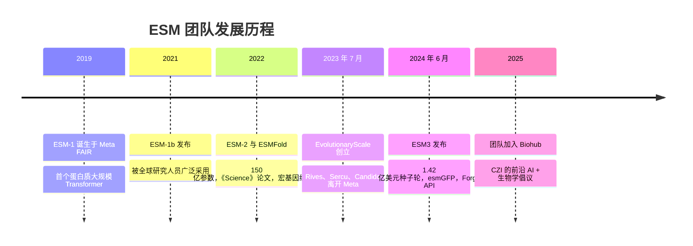
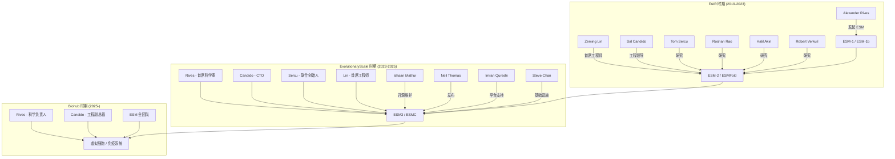

---
slug:6-about-contributors
blog_type:buzz
---

ESM 仓库不仅仅是一个代码库——它是 AI for biology（人工智能驱动的生物学）领域最具影响力的研究谱系之一的公开成果。这些提交记录背后的人们，走出了一条从 Meta FAIR 实验室，历经 1.42 亿美元融资的初创企业，最终加入由 Chan Zuckerberg Initiative 资助的非营利研究机构 Biohub 的发展之路。了解他们是谁以及来自何方，能让你深刻理解 ESM 为何呈现出如今的面貌与运作方式。

## 从 Meta FAIR 到 EvolutionaryScale 再到 Biohub

ESM 项目诞生于 Meta 的基础人工智能研究（FAIR）实验室。Alexander Rives 在那里发起并领导了 Evolutionary Scale Modeling 项目，构建了[被广泛公认为首个蛋白质大规模 Transformer 语言模型](https://press.aboutamazon.com/aws/2024/6/evolutionaryscale-launches-with-esm3-a-milestone-ai-model-for-biology)（即 2019 年的 ESM-1）。最初的 `facebookresearch/esm` 仓库容纳了 ESM-1b、ESM-2、ESMFold 和 MSA Transformer——这些模型共同成为了全球计算生物学的基础设施。

2023 年 4 月，他们在 FAIR 的团队解散后，三位核心人物——**Alexander Rives**、**Tom Sercu** 和 **Salvatore Candido**——离开 Meta，独立延续这项研究。他们于 2023 年 7 月创立了 [EvolutionaryScale](https://www.evolutionaryscale.ai)，作为一家公益性质的公司，筹集了由 Nat Friedman、Daniel Gross 和 Lux Capital 领投、Amazon 和 NVentures（Nvidia 的风险投资部门）参投的[ 1.42 亿美元种子轮资金](https://techcrunch.com/2024/06/25/evolutionaryscale-backed-by-amazon-and-nvidia-raises-142m-for-protein-generating-ai)。开源仓库也随之从 `facebookresearch/esm` 迁移至 `evolutionaryscale/esm`（即现在的 `Biohub/esm`）。

紧接着迎来了下一次转折。2025 年，EvolutionaryScale 团队加入了由 Chan Zuckerberg Initiative 发起的非营利研究机构 [Biohub](https://biohub.org/blog/frontier-ai-biology-initiative)。Rives 出任 CZI 的科学负责人，主导一项将前沿 AI 与前沿生物学相结合的倡议。Biohub 的公告将其描述为“首个将前沿 AI 与前沿生物学相结合的大规模科学努力”，并计划到 2028 年将算力规模扩展至 10,000 块 GPU。

## 核心贡献者

### Alexander Rives——架构师

[Alex Rives](https://biohub.org/team/alex-rives) 是 ESM 项目的思想创始人。他在 Meta FAIR 发起并领导了 ESM，作为首席科学家联合创立了 EvolutionaryScale，现任 Biohub 科学负责人。他同时还是**博德研究所的核心研究所成员**以及**麻省理工学院 EECS 助理教授**——这种罕见的双重任职彰显了这项工作跨越机构的吸引力。

他的学术背景本身也值得瞩目：在耶鲁大学获得**哲学与生物学**学士学位，随后在纽约大学获得**计算机科学**博士学位。这种双重背景——对生物系统的哲学思辨，通过计算加以形式化——可以说是整个 ESM 谱系的思想 DNA。正如他在 ESM3 发布时[对媒体所说](https://www.synbiobeta.com/read/evolutionaryscale-raises-142m-and-unveils-ai-model-esm3-to-transform-biology)：“ESM3 迈向了生物学未来的一步，在那个未来中，AI 是一种从第一性原理出发进行工程设计的工具，就像我们设计结构、机器、微芯片和编写计算机程序一样。”

Rives 并不是开源仓库中的频繁提交者——他的角色一直是研究领导——但从 ESM-1 的掩码语言建模目标到 ESM3 的多模态生成设计，每一个架构决策都留有他的印记。

### Zeming Lin——首席工程师

如果说 Rives 是架构师，那么 **Zeming Lin** 就是建造者。Lin 是具有里程碑意义的 [ESM-2/ESMFold 《Science》论文](https://pubmed.ncbi.nlm.nih.gov/36927031)（"Evolutionary-scale prediction of atomic-level protein structure with a language model", 《Science》, 2023）的**第一作者**，该论文证明了 150 亿参数的蛋白质语言模型能够直接从序列中学习原子分辨率的结构。论文脚注标明 Lin 和 Rives 共同承担“研究与工程领导工作”。

在仓库中，Lin 的提交记录显示出他对性能和基础设施的关注。他撰写了 [Remove flash attention](https://github.com/Biohub/esm/commit/7454c3d77bc731990c534936ef091db3851455a3) 提交、[为发布准备的版本号升级](https://github.com/Biohub/esm/commit/35c2088b75ee606c03b6d6848f694e8d656f4537) 提交，以及 CI 回退操作，这表明他是最终决定哪些代码可以发布、哪些不能发布的人。他此前在 Meta FAIR，后转至 EvolutionaryScale，现就职于 Biohub。

### Salvatore Candido——系统思考者

[Sal Candido](https://biohub.org/team/salvatore-candido) 是 Biohub 的工程研究员及副总裁，此前是 EvolutionaryScale 的联合创始人兼 CTO。他的职业轨迹是三人中最不走寻常路的：在伊利诺伊大学获得**控制系统与 AI 博士学位**后，在 Google 和 Meta 担任杰出工程师。在 Google[x]，他是 **Project Loon（平流层自主气球项目）AI 导航算法的技术负责人**。在此之前，他参与了 Google 搜索算法的工作。

在 Meta FAIR，他共同领导了数学与科学 AI 支柱。他的 Biohub 简历指出，他在 EvolutionaryScale“主导了公司所有旗舰研究工作，或为其做出了基础性技术贡献”。Candido 在控制理论和自主系统方面的背景，很可能塑造了 ESM 的迭代掩码采样方法——这是一种由反馈驱动的生成过程，在结构上更接近控制系统，而非 LLM 中常见的单次自回归生成。

### Tom Sercu——联合创始人

**Tom Sercu** 是 EvolutionaryScale 的第三位联合创始人，同样来自 Meta FAIR。他是 ESM-2 《Science》论文的合著者，也是 ESM3 研究团队的核心成员。虽然他在提交日志中的曝光率不如其他贡献者，但 Sercu 作为创始研究员的角色，使他处于 ESM 谱系中每一个重大设计决策的中心。

### Roshan Rao——蛋白质 ML 研究员

**Roshan Rao** 是另一位来自 FAIR 时期的核心研究员，先后转战 EvolutionaryScale 和 Biohub。他的[个人主页](https://rmrao.github.io)读起来就像是 ESM 项目的纪事：ESM3、ESMFold 与宏基因组图谱、使用语言模型进行可编程蛋白质设计、变异效应预测、MSA Transformer、接触预测，以及 TAPE 基准测试。他不仅是 ESM-2 《Science》论文的合著者，还参与了早期分解注意力/接触预测的研究，该研究为 Transformer 为何能学习蛋白质结构奠定了理论基础。

Rao 在 TAPE（Tasks Assessing Protein Embeddings）上的工作尤为值得注意——它创建了整个蛋白质语言模型社区采纳的评估框架，实质上定义了什么是“好”的蛋白质表示。这种基础设施类的工作虽不会登上头条，却塑造了整个领域。

### Halil Akin——研究员兼工程师

**Halil Akin** 是另一位来自 FAIR 时期的合著者，名列 ESM-2 《Science》论文之中。他在 ESM v3.2.3 的 Zenodo 发布致谢中显示为“halilakin”，证实了他在 EvolutionaryScale 和 Biohub 的转变过程中持续参与。

## 开源维护者

虽然创始人们设定了研究方向，但维护开源仓库的日常工作落在一个规模更小、更侧重运营的群体身上。这些人是在提交日志中出现最频繁、并回应用户提出的问题的人。

### Ishaan Mathur——最忙碌的提交者

**Ishaan Mathur** (`ishaan@evolutionaryscale.ai`) 就提交量而言，是仓库近期历史上最活跃的贡献者。他的提交记录展示了一位维护者正在做着维持项目生存所必需的、虽不起眼却至关重要的工作：

| 提交 | 告诉我们的信息 |
|--------|-----------------|
| [sasa BOS/EOS fix](https://github.com/Biohub/esm/commit/6e89bf7d127b06e95d8243c020936cd67d862229) | 修复了 [Issue #258](https://github.com/Biohub/esm/issues/258) 中报告的确切 Bug |
| [loosen version](https://github.com/Biohub/esm/commit/e103c9c1c4047c38e8c7f1215c91f8481268e366) | 回应关于依赖锁定的 [Issue #265](https://github.com/Biohub/esm/issues/265) |
| [infer oxygen](https://github.com/Biohub/esm/commit/232a1041d807cce2d58ab8501750e0bfda6c26c4) | 根据 [Issue #279](https://github.com/Biohub/esm/issues/279) 修复 PDB 输出中缺失的 O 原子 |
| [syncing covalent bonds](https://github.com/Biohub/esm/commit/23b084b94f3b5f6fd700ae41f46a2787a9a5c12b) | 内部到外部的代码同步 |
| [adding CI](https://github.com/Biohub/esm/commit/b237fe781ccd290bf458d9d4a7484a21ac00c7bc) | 设置代码检查、类型检查和测试 CI |
| [Sync over internal code to open source](https://github.com/Biohub/esm/commit/95239e2d195f797bc224e2d07e38cec082c14bbe) | 关键的“开源镜像”提交 |

Mathur 是 EvolutionaryScale 内部开发与公开仓库之间的桥梁。“同步”提交尤其发人深省：它们表明开源仓库是内部代码库的下游镜像，而非主要的开发界面。这就解释了为什么许多 Issue 会迟迟得不到解决——修复往往已经存在于内部，只是尚未同步。

### Neil Thomas——发布经理

**Neil Thomas** (`neil@evolutionaryscale.ai`) 主要出现在版本号升级和发布提交中：[3.2.2.post2](https://github.com/Biohub/esm/commit/3e109e2d1bc1d25445c14b41706cf3eb6f313d7d)、[回退 sync 3.2.2.post1](https://github.com/Biohub/esm/commit/cbaccc1693c033b5e7e9517c929d22b24370ddca) 以及 [README 更新](https://github.com/Biohub/esm/commit/453b2e2e713ee35a1dcbc684b11d03303a59294e)。这种“回退后重新发布”的模式表明他是负责包完整性的人——当发布出现问题时，由他负责回退。

### Steve Chan——CI 与编码修复者

**Steve Chan** 处理了关键的基础设施工作：为测试依赖[修复 CI](https://github.com/Biohub/esm/commit/7e0ebdb788b7c0d5de046d8d8c6aea2c97e8c7f9)，以及[修复二进制编码格式中的合并错误](https://github.com/Biohub/esm/commit/2a19c4edde933c171dcb78baa304942338fbb23f)。编码格式修复值得关注，因为它影响了结构 Token 的序列化方式——这是 ESM3 流水线的核心部分。

### Imran Qureshi——平台推动者

**Imran Qureshi** 与 Zeming Lin 合作，撰写了 [Enable running ESM on Mac silicon using MPS](https://github.com/Biohub/esm/commit/c8969198c62129fd76eba5e450b091d2d3b012ac) 提交。这类改变虽不会推进研究前沿，但却极大地扩展了用户群——突然之间，每位拥有 M 系列 MacBook 的研究员都能在本地运行 ESM 了。

### Ventura Rivera——社区贡献者

**Ventura Rivera**（根据 Zenodo 元数据，隶属于 [Albert Invent](https://zenodo.org/records/17353381)）贡献了 [Exposing pae in ESMProtein](https://github.com/Biohub/esm/commit/79c1208e96e84f9cce4479d243daf9865263c50e)。这很有意思，因为 PAE（Predicted Aligned Error，预测对齐误差）是结构预测的关键质量指标，而在 `ESMProtein` 数据模型中暴露该指标是社区的明确诉求。Rivera 似乎是一名外部贡献者，而非 EvolutionaryScale 的员工。

## 完整团队

[Zenodo v3.2.3 版本](https://zenodo.org/records/17353381)列出了 18 位贡献者，为我们提供了最完整的团队全景：

| 贡献者 | 已知角色/所属机构 |
|-------------|------------------------|
| Zeming Lin | 第一作者，ESM-2；研究与工程领导 |
| Chetan Mishra | 贡献者 |
| santiag0m | 贡献者 |
| Jun Gong | 贡献者 |
| Neil Thomas | 发布管理，EvolutionaryScale |
| Ishaan Mathur | 主要开源维护者，EvolutionaryScale |
| tina-z-jia | 贡献者 |
| Tom Sercu | 联合创始人，EvolutionaryScale；FAIR 校友 |
| Steve Chan | CI 与编码基础设施 |
| Salvatore Candido | 联合创始人/CTO，EvolutionaryScale；现任 Biohub 副总裁 |
| Jenna MacCarley | 贡献者 |
| Imran Qureshi | 平台支持 (MPS/Mac silicon) |
| Jordan Safer | 贡献者 |
| robert-verkuil | 合著者，ESM-2 《Science》论文；FAIR 校友 |
| Ventura Rivera | 社区贡献者 |
| blenderwang | 贡献者 |
| carolynkim | 贡献者 |
| halilakin | 合著者，ESM-2 《Science》论文；FAIR 校友 |

## 提交模式揭示了什么

提交历史讲述了关于该项目如何运作的结构性故事：

**开源仓库是下游镜像。** Ishaan Mathur 反复的“同步”提交——[将内部代码同步至开源](https://github.com/Biohub/esm/commit/95239e2d195f797bc224e2d07e38cec082c14bbe)、[sync](https://github.com/Biohub/esm/commit/e8117a2f68b264657eb9717308d55e5f8690588c)、[syncing covalent bonds](https://github.com/Biohub/esm/commit/23b084b94f3b5f6fd700ae41f46a2787a9a5c12b)——证实了主要开发是在内部进行的，并定期推送到 GitHub。这就是为什么问题解决可能让人感觉缓慢：反馈循环比表面上看起来要长。

**团队规模小且捉襟见肘。** Zenodo 记录上约有 18 名贡献者，但只有少数人进行定期提交，用户与维护者的比例悬殊。ESM 在制药界和学术界拥有数千名用户，但开源维护的重担主要落在 Mathur 和 Thomas 肩上。

**发布纪律严格但易出错。** [回退 3.2.2.post1](https://github.com/Biohub/esm/commit/cbaccc1693c033b5e7e9517c929d22b24370ddca) 之后紧接 [3.2.2.post2](https://github.com/Biohub/esm/commit/3e109e2d1bc1d25445c14b41706cf3eb6f313d7d)，展示了一个发布迅速但在出现故障时也能快速回退的团队。`.postN` 版本控制模式表明他们使用的是发布后补丁，而不是切割完整的次版本——这对于研究代码库是一种务实的选择，但可能会让下游的依赖管理器感到困惑。

## 为何重要

ESM 团队的不同寻常之处在于，他们经历了三个组织机构的变迁，却始终保持着连贯的技术愿景。大多数研究项目在论文发表后团队解散便无疾而终；而 ESM 却在两次公司重组和一次向非营利组织转变的过程中，从 ESM-1 演进到了 ESM-3 和 ESMC。核心团队——Rives、Lin、Candido、Sercu、Rao、Akin——已经共事超过六年，这在 ML 研究领域几乎是闻所未闻的。

这种连续性带来了一个技术层面的结果：**ESM 代码库比大多数同龄项目经历的架构 U 型转弯更少。** 其基本设计决策（掩码语言建模、用于生成的迭代解掩码、VQ-VAE 结构 Token）一直在被不断优化，而非被替代。当 Zeming Lin [移除 flash attention](https://github.com/Biohub/esm/commit/7454c3d77bc731990c534936ef091db3851455a3) 时，并不是因为团队改变了关于注意力机制的看法——这只是务实的架构精简。

展望未来，风险在于组织精力的稀释。Biohub 的使命比蛋白质语言模型更广阔——它涵盖了虚拟细胞、免疫系统建模和冷冻电子断层扫描。ESM 专属团队能否在追求这些更宏大目标的同时，维持对开源仓库同样强度的关注，仍是一个悬而未决的问题。最近几个月的提交频率——由同步和补丁提交主导，而非功能开发——表明重心可能已经在转移。