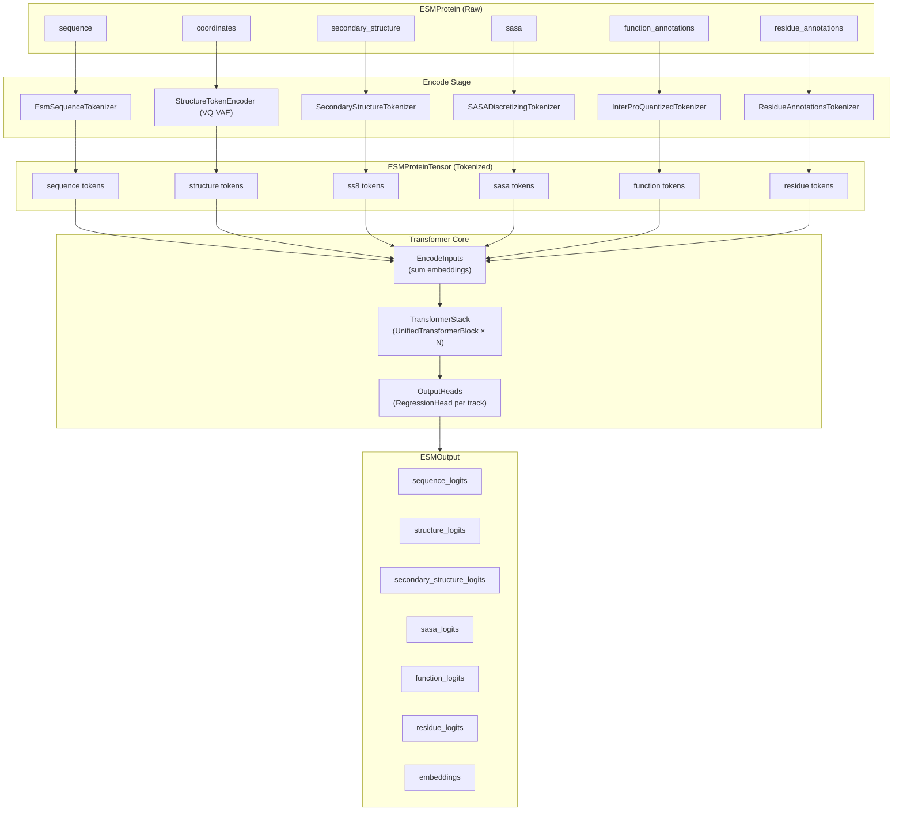
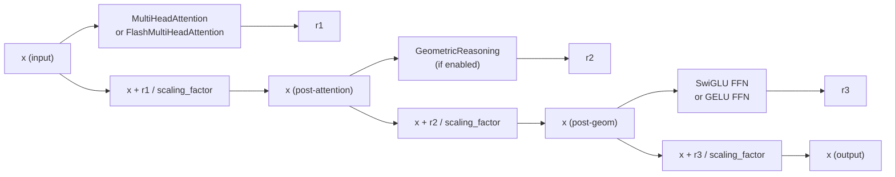
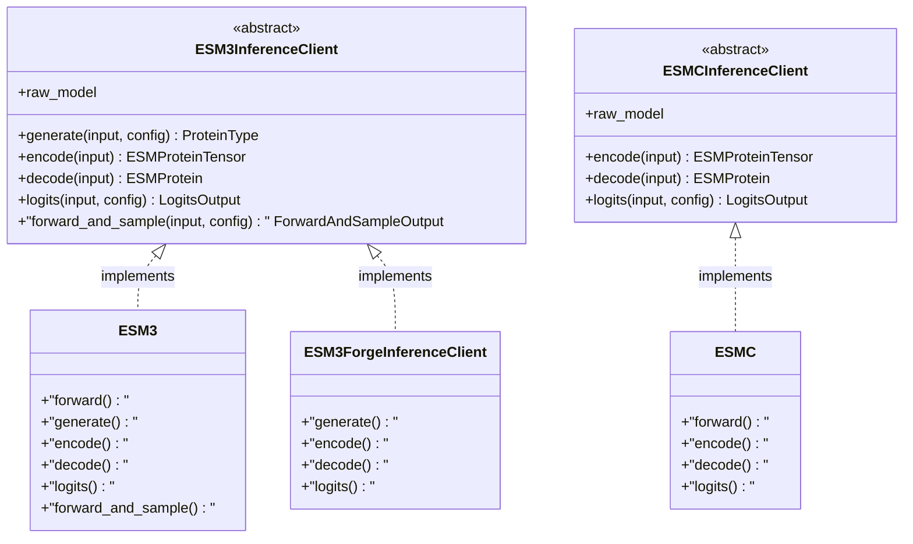

---
slug:7-architecture-overview
blog_type:normal
---


ESM 代码库是一个**多轨道蛋白质语言模型框架**，围绕两个不同的模型系列——ESM3 和 ESMC——构建而成，统一于共享的 Transformer 基础设施、可组合的分词管线以及客户端抽象的 SDK 层。其核心架构遵循**编码 → Transformer 前向传播 → 解码**的数据流：蛋白质信息（序列、结构、二级结构、溶剂可及性、功能注释和残基注释）流经并行的分词轨道，被嵌入到共享的隐空间中，经由带有可选几何推理的 Transformer 块堆栈进行处理，最后通过独立的输出头投射回原空间。本页映射了代码库的高层结构拓扑，以便你能够在后续深入了解相关内容。


## 系统级数据流

整个系统可以理解为一个三阶段的管线。**阶段 1（编码）**通过各轨道分词器和 VQ-VAE 结构编码器，将原始蛋白质表示（`ESMProtein`）转换为分词后的张量表示（`ESMProteinTensor`）。**阶段 2（前向传播）**将求和后的多轨道嵌入传入由 `UnifiedTransformerBlock` 实例组成的 `TransformerStack`——其中每个实例可选择性地结合 SE(3) 等变几何注意力——然后应用最终的 `LayerNorm`。**阶段 3（解码）**通过独立的 `RegressionHead` 模块投射 Transformer 输出，以生成各轨道的 logits；而在生成任务中，则迭代地进行采样并取消掩码，直到指定轨道被完全解析。



来源: [esm3.py](/esm/models/esm3.py#L61-L178), [api.py](/esm/sdk/api.py#L26-L58), [api.py](/esm/sdk/api.py#L201-L278)

## 两大模型系列

该代码库实现了两个架构截然不同的模型系列，分别针对不同类别的蛋白质建模任务而设计。**ESM3** 是一个完整的多模态生成模型，处理所有六个蛋白质轨道，并支持跨任意轨道组合的迭代掩码生成。**ESM C** 是一个精简的表示模型，仅基于序列操作，并针对提取高质量嵌入和隐状态进行了优化。两者共享相同的 `TransformerStack` 骨干网络，但在编码器复杂度、注意力机制和输出能力上有所不同。

| 维度 | ESM3（多模态生成） | ESM C（表示） |
|---|---|---|
| **输入轨道** | 序列、结构、SS8、SASA、功能、残基 | 仅序列 |
| **编码器** | `EncodeInputs`（8 个嵌入模块，求和） | `nn.Embedding(64, d_model)` |
| **几何注意力** | 是（可配置 `n_layers_geom`） | 否（`n_layers_geom=0`） |
| **输出头** | 6 个独立的 `RegressionHead` 模块 | 1 个用于序列的 `RegressionHead` |
| **VQ-VAE 编解码器** | 结构编码器 + 解码器，功能解码器 | 无 |
| **生成** | 跨轨道的迭代掩码采样 | 不支持 |
| **客户端接口** | `ESM3InferenceClient`（7 个方法） | `ESMCInferenceClient`（3 个方法） |
| **预训练规模** | Small Open（d=1536，48 层） | 300M（d=960，30 层），600M（d=1152，36 层） |
| **Flash Attention** | 默认未启用 | 默认启用 |
| **隐状态** | 默认不返回 | 堆叠并以 `[n_layers, B, L, D]` 形式返回 |

ESM3 的 `EncodeInputs` 模块将每个轨道投射到共享的 `d_model` 维度空间，然后**将所有嵌入按元素求和**——这是一项关键的架构决策，使得任意轨道的条件控制成为可能，因为缺失的轨道只会提供零值的填充嵌入。相比之下，ESMC 模型完全摒弃了这种多轨道机制，仅嵌入序列分词并将其直接路由至纯注意力的 Transformer 堆栈。这两个模型均通过 `pretrained.py` 中的 `LOCAL_MODEL_REGISTRY` 加载，该注册表将模型名称字符串映射到构建器函数，从而实例化模型、加载权重，并可选择在 GPU 上转换为 `bfloat16`。

来源: [esm3.py](/esm/models/esm3.py#L181-L234), [esmc.py](/esm/models/esmc.py#L44-L98), [pretrained.py](/esm/pretrained.py#L95-L135)

## Transformer 核心架构

`TransformerStack` 是两个模型系列共享的计算骨干。它由一系列 `UnifiedTransformerBlock` 实例和紧跟其后的一个最终 `LayerNorm` 组成。每个块都是一个**双重注意力残差模块**，可选择在标准多头注意力之外包含几何注意力，使得相同的块架构既能服务于感知 SE(3) 的 ESM3，也能服务于纯序列的 ESM C。



有三个架构细节值得强调。首先，**残差缩放因子**（`math.sqrt(n_layers / 36)`）按深度对残差流进行归一化，防止深层堆栈中的信号爆炸——这在 ESM3 中同时应用于注意力残差和 FFN 残差，而 ESM C 则禁用了此功能（当 `v_heads=None` 时 `scale_residue=False`）。其次，**SwiGLU FFN** 是默认的前馈变体，计算 `Linear(SiLU(x1) * x2)`，其中输入被对半分块，隐维度向上取整至 256 的最近倍数以提升硬件效率。第三，**几何注意力**层将注意力权重计算为旋转项（经旋转变换的查询与键的点积）和负距离项（经平移变换的查询-键差值的 L2 范数）的习得组合，确保了注意力模式的 SE(3) 不变性，同时保留了值流的等变性。

<CgxTip>当 ESM3 中 `n_layers_geom > 0` 时，只有前 `n_layers_geom` 个块包含几何注意力。其余块仅使用标准的多头注意力。这种分层设计意味着模型在浅层处理 3D 结构信息，并在深层通过标准注意力精炼表示。</CgxTip>

来源: [transformer_stack.py](/esm/layers/transformer_stack.py#L10-L94), [blocks.py](/esm/layers/blocks.py#L51-L157), [geom_attention.py](/esm/layers/geom_attention.py#L9-L149)

## SDK 抽象层

SDK 层通过抽象客户端协议，在不同的部署后端之间提供**统一的推理接口**。`ESM3InferenceClient` 和 `ESMCInferenceClient` 定义了具体实现——本地模型、Forge API 和 SageMaker——必须满足的契约。这意味着无论你是调用远程 API 还是在本地 GPU 上运行，相同的 `编码 → 生成 → 解码` 工作流都能以相同的方式运作。



**客户端工厂函数** `esm.sdk.client()` 返回一个配置了 Forge API URL 和你的 API 密钥的 `ESM3ForgeInferenceClient`。对于本地推理，`ESM3.from_pretrained()` 和 `ESMC.from_pretrained()` 返回直接实现相同客户端协议的模型实例，从而在本地和远程执行之间切换时无需修改任何代码。`ForgeBatchExecutor` 上下文管理器为批量 API 调用包装了重试逻辑和进度跟踪。

<CgxTip>`ESM3` 模型类同时继承自 `nn.Module` 和 `ESM3InferenceClient`，使其兼具 PyTorch 模块和推理客户端的双重身份。这种双重特性意味着你可以直接在已加载的模型上调用 `model.generate(protein, config)`，而无需将其包装在任何适配器中——本地模型即是原生推理客户端。</CgxTip>

来源: [api.py](/esm/sdk/api.py#L431-L531), [esm3.py](/esm/models/esm3.py#L181-L258), [esmc.py](/esm/models/esmc.py#L44-L76), [__init__.py](/esm/sdk/__init__.py#L1-L36)

## 项目目录映射

代码库被组织为 `esm/` 下的六个顶层子系统，每个子系统都有清晰的职责边界：

```
esm/
├── models/              # 模型架构
│   ├── esm3.py          # ESM3: EncodeInputs + TransformerStack + OutputHeads
│   ├── esmc.py          # ESMC: Embed + TransformerStack + SequenceHead
│   ├── vqvae.py         # StructureTokenEncoder/Decoder (VQ-VAE 编解码器)
│   └── function_decoder.py  # FunctionTokenDecoder
├── layers/              # 可复用的神经网络组件
│   ├── blocks.py        # UnifiedTransformerBlock (双重注意力 + FFN)
│   ├── transformer_stack.py  # 块堆栈 + LayerNorm
│   ├── attention.py     # MultiHeadAttention, FlashMultiHeadAttention
│   ├── geom_attention.py    # SE(3) 几何推理
│   ├── rotary.py        # 旋转位置嵌入
│   ├── codebook.py      # 用于 VQ-VAE 的 EMA 码本
│   └── structure_proj.py    # 6D 旋转结构头
├── tokenization/        # 各轨道分词器实现
│   ├── sequence_tokenizer.py     # 氨基酸分词器（基于 HuggingFace）
│   ├── structure_tokenizer.py    # 结构分词映射
│   ├── ss_tokenizer.py           # 8 类二级结构
│   ├── sasa_tokenizer.py         # 离散化溶剂可及性
│   ├── function_tokenizer.py     # InterPro 量化功能分词
│   └── residue_tokenizer.py      # 残基注释分词器
├── sdk/                 # 推理客户端抽象
│   ├── api.py           # ESMProtein, ESMProteinTensor, 客户端协议
│   ├── forge.py         # Forge API 客户端（折叠、生成、编码等）
│   ├── sagemaker.py     # SageMaker 部署客户端
│   └── retry.py         # 指数退避重试逻辑
├── utils/               # 共享工具
│   ├── encoding.py      # 分词/反分词辅助函数
│   ├── decoding.py      # ESMProteinTensor → ESMProtein 转换
│   ├── generation.py    # 迭代采样编排
│   ├── sampling.py      # Logit 采样（温度、top-p、熵）
│   ├── noise_schedules.py   # 余弦/线性去掩码调度
│   └── structure/       # Affine3D, ProteinChain, ProteinComplex
└── data/                # 静态数据文件（InterPro 映射，关键词词表）
```

来源: [esm3.py](/esm/models/esm3.py#L1-L47), [vqvae.py](/esm/models/vqvae.py#L1-L10), [__init__.py](/esm/tokenization/__init__.py#L1-L22), [api.py](/esm/sdk/api.py#L1-L18), [generation.py](/esm/utils/generation.py#L1-L34)

## 阅读路径

你在此处看到的架构是理解后续页面中记录的专门子系统的基础。推荐的推进路径为：从模型系列向内深入到 Transformer 内部机制，然后向外扩展到生成与部署：

1. **模型系列** —— 从 [ESM3 多模态生成模型](8-esm3-multimodal-generative-model) 和 [ESM C 表示模型](9-esm-c-representation-model) 开始，了解每个模型如何配置共享组件
2. **分词管线** —— 接着探索[序列与结构分词器](10-sequence-and-structure-tokenizers)和 [VQ-VAE 结构编码](11-vq-vae-structure-encoding)，了解原始蛋白质数据如何输入模型
3. **Transformer 核心** —— 深入研究[几何注意力与 SE(3) 不变性](13-geometric-attention-and-se-3-invariance)和 [Transformer 堆栈设计](14-transformer-stack-design)，探究系统的计算心脏
4. **生成与采样** —— 通过[迭代掩码采样](16-iterative-masked-sampling)和[噪声调度与去掩码策略](17-noise-schedules-and-unmasking-strategies)理解迭代解码循环
5. **SDK 与部署** —— 最后，了解所有功能如何通过 [Forge API 客户端](19-forge-api-client)和[本地推理客户端](20-local-inference-client)暴露给用户