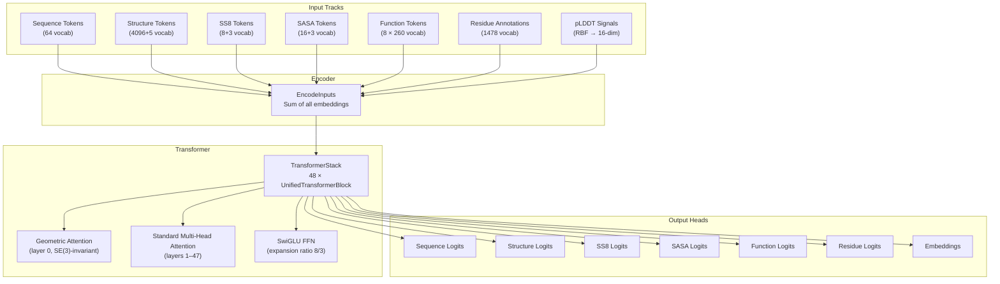
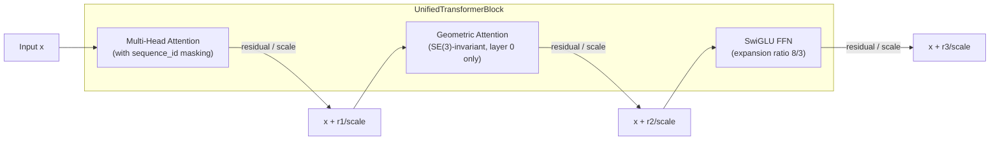
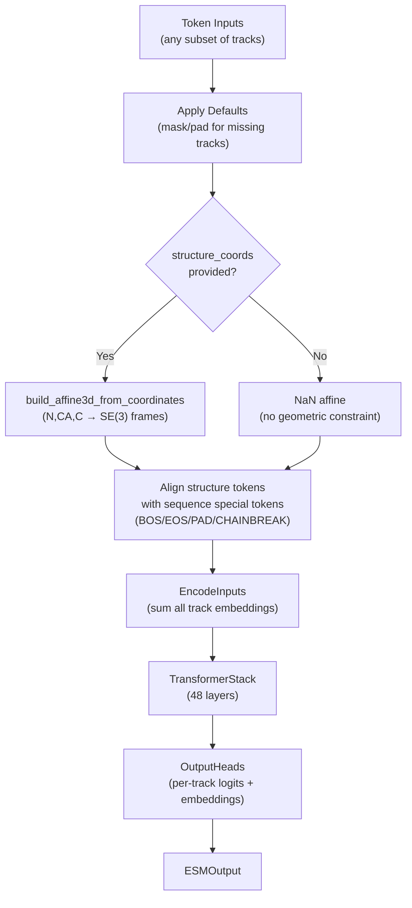

---
slug:8-esm3-multimodal-generative-model
blog_type:normal
---


ESM3 是一个蛋白质生成式语言模型，能够同时对**序列**、**结构**和**功能**这蛋白质生物学的三种基本模态进行推理。与仅用于表征的模型（如 [ESM C](9-esm-c-representation-model)）不同，ESM3 是一个完整的**掩码语言模型**架构，具备条件生成能力：给定任意轨道组合的部分观测信息，它能迭代地对缺失信息进行采样。本次开源发布提供了 `esm3_sm_open_v1` 检查点（14 亿参数，48 个 Transformer 层，d_model=1536），以及用于结构编解码和功能解码的专用子模型。

来源：[esm3.py](esm/models/esm3.py#L181-L217), [pretrained.py](esm/pretrained.py#L95-L111), [models.py](esm/utils/constants/models.py#L1-L8)

## 架构概述

ESM3 架构遵循**轨道融合编码器**模式：每种蛋白质模态被独立分词并嵌入，随后各嵌入向量被求和合并为一个隐状态，由一个共享的 Transformer 堆叠层处理该组合表征。最后，输出头独立预测每个轨道的 logits。这种设计确保了可以提供任意轨道子集作为输入——模型会用已学习的默认值（mask 或 pad token）以及 pLDDT 条件信号优雅地填充缺失的模态。



该架构的核心洞见在于：**模态是在嵌入层以加法方式融合的**，而非通过交叉注意力或后期融合策略。这意味着每个残基位置承载一个 `d_model` 维的向量，同时编码来自*所有*提供轨道的信息。随后，Transformer 的自注意力机制在各个位置间传播信息，使模型在前向传播和迭代生成期间能够解析序列、结构和功能之间的相互依赖关系。

来源：[esm3.py](esm/models/esm3.py#L61-L147), [esm3.py](esm/models/esm3.py#L260-L374), [transformer_stack.py](esm/layers/transformer_stack.py#L10-L94)

## 多模态轨道嵌入

`EncodeInputs` 模块是入口，所有蛋白质轨道在此被投影到共享的 `d_model` 维空间中。每个轨道采用针对其数据类型量身定制的嵌入策略：

| 轨道 | 嵌入策略 | 词表大小 | 输出维度 |
|-------|-------------------|-----------------|------------|
| 序列 (Sequence) | `nn.Embedding` | 64（氨基酸 + 特殊 token） | d_model |
| 结构 (Structure) | `nn.Embedding` | 4096 + 5（码本 + 特殊 token） | d_model |
| 二级结构 (Secondary Structure, SS8) | `nn.Embedding` | 8 + 3（类别 + 特殊 token） | d_model |
| SASA | `nn.Embedding` | 16 + 3（离散化分箱 + 特殊 token） | d_model |
| 功能 (Function) | 8 × `nn.Embedding`（拼接） | 每深度 260，深度=8 | d_model |
| 残基注释 (Residue Annotations) | `nn.EmbeddingBag`（求和模式） | 1478 | d_model |
| 平均 pLDDT (Average pLDDT) | RBF(16 bins) → `nn.Linear` | 16 → d_model | d_model |
| 逐残基 pLDDT (Per-residue pLDDT) | RBF(16 bins) → `nn.Linear` | 16 → d_model | d_model |

**功能轨道**采用分解嵌入：8 个独立的 `nn.Embedding(260, d_model // 8)` 模块分别应用于 8 个深度位置，生成的向量沿特征维度拼接，产生完整的 `d_model` 维嵌入。这反映了功能 token 通过局部敏感哈希（LSH）进行量化的事实，其中 8 个深度维度各自独立编码哈希的不同位切片。

**残基注释轨道**使用 `mode="sum"` 的 `nn.EmbeddingBag`，因为每个残基位置可以携带多个注释标签（最多 16 个）。该 Bag 模块通过对相应的嵌入求和，将变长的注释列表折叠为单一向量，随后将其重塑回 `(B, L, d_model)`。

**pLDDT 条件**对标量置信度值应用径向基函数（RBF）扩展，并通过线性层进行投影。平均 pLDDT 在所有位置广播全局置信度信号，而逐残基 pLDDT 提供位置特定的条件信号。这些信号告知模型应该多大程度上信任所提供的坐标信息。

<CgxTip>当未提供坐标时，`per_res_plddt` 默认为 0，`average_plddt` 默认为 1——这向模型发出“无结构约束”的信号。当提供了坐标时，对于具有有效（非 NaN）坐标的位置，`per_res_plddt` 会自动设置为 1.0，从而将模型的结构预测锚定到观测数据上。</CgxTip>

来源：[esm3.py](esm/models/esm3.py#L61-L147), [esm3.py](esm/models/esm3.py#L299-L348)

## Transformer 堆叠与统一块设计

`TransformerStack` 是 ESM3 的计算核心，由 `n_layers` 个 `UnifiedTransformerBlock` 实例以及紧随其后的最终 `LayerNorm` 组成。对于开源的小型模型，这是 48 层、24 个注意力头和 256 个投票头。



每个 `UnifiedTransformerBlock` 包含最多三个子层，它们按顺序应用并带有**缩放的残差连接**：

1. **标准多头注意力** — 应用旋转位置嵌入和 QK-LayerNorm。`sequence_id` 张量创建分块对角注意力掩码，确保来自不同链或序列的残基不会相互关注。

2. **几何注意力**（仅第 0 层） — 通过 `GeometricReasoningOriginalImpl` 模块实现 SE(3) 不变的几何推理，该模块以从骨架坐标派生的 3D 仿射帧为条件。`mask_and_zero_frameless` 标志确保没有有效坐标的位置被正确掩码。

3. **SwiGLU 前馈网络** — 使用 SwiGLU 激活函数（`SiLU(x1) * x2`），扩展比为 8/3。隐藏维度被圆整到最接近的 256 的倍数，以提高硬件效率。

<CgxTip>每个块中的 `residue_scaling_factor` 为 `sqrt(n_layers / 36)`，该因子缩放残差贡献，以防止深层堆叠中出现幅度爆炸。对于 48 层的开源模型，该因子为 `sqrt(48/36) ≈ 1.155`，意味着残差贡献相对于 36 层基线略有*放大*。</CgxTip>

Transformer 返回三个输出：**后归一化**隐状态（由输出头使用）、**预归一化**隐状态（用作嵌入），以及**逐层隐状态**列表（可用于更深入的分析）。

来源：[transformer_stack.py](esm/layers/transformer_stack.py#L10-L94), [blocks.py](esm/layers/blocks.py#L51-L157)

## 输出头与 Logit 预测

`OutputHeads` 模块将 Transformer 的输出投影回各轨道的 logit 空间。每个头都是一个 `RegressionHead`——一个带有 GELU 激活和 LayerNorm 的两层 MLP：

```
Linear(d_model → d_model) → GELU → LayerNorm → Linear(d_model → vocab_size)
```

| 输出头 | Logit 维度 | 备注 |
|-------------|-----------------|-------|
| 序列 (Sequence) | `(B, L, 64)` | 氨基酸词表 |
| 结构 (Structure) | `(B, L, 4096)` | VQ-VAE 码本条目 |
| 二级结构 (Secondary Structure) | `(B, L, 11)` | 8 个 SS8 类别 + 3 个特殊 token |
| SASA | `(B, L, 19)` | 16 个离散化分箱 + 3 个特殊 token |
| 功能 (Function) | `(B, L, 8, 260)` | 由扁平的 `(B, L, 2080)` 重塑而来 |
| 残基注释 (Residue Annotations) | `(B, L, 1478)` | 注释词表 |

功能 logit 会从 `(B, L, 260*8)` 重塑为 `(B, L, 8, 260)`，反映了功能 token 的 8 深度量化结构。`ESMOutput` 数据类还承载了来自 Transformer 预归一化输出的原始 `embeddings` 张量。

来源：[esm3.py](esm/models/esm3.py#L150-L178), [regression_head.py](esm/layers/regression_head.py#L1-L112)

## 前向传播：Token 级数据流

`forward` 方法编排了完整的 token 级流水线。它接收每个轨道的原始 token 张量，为任何缺失的输入应用智能默认值，将坐标数据处理为 SE(3) 帧，并返回完整的 `ESMOutput`：



前向传播中的一个关键细节是**结构 token 对齐**逻辑。在默认填充之后，结构 token 会被选择性地替换，以匹配序列轨道的特殊 token 位置——序列轨道中的 BOS、EOS、PAD 和 CHAINBREAK token 会强制结构轨道中对应位置替换为相应的特殊 token。此外，任何值为 `-1` 的结构 token（分词前的占位符）都会被替换为结构掩码 token。这确保了即使在仅提供部分数据的情况下，两个轨道在特殊位置也能保持同步。

当完全没有提供任何轨道时，该方法会抛出 `ValueError`——至少需要一个非 None 的输入，以便模型能推断序列长度 `L` 和设备。

来源：[esm3.py](esm/models/esm3.py#L260-L374)

## ESM3 推理客户端接口

`ESM3` 类实现了 `ESM3InferenceClient` 协议，提供了包含四个核心操作的高级 API，与 SDK 的客户端接口相呼应：

| 方法 | 输入 | 输出 | 描述 |
|--------|-------|--------|-------------|
| `encode` | `ESMProtein` | `ESMProteinTensor` | 将所有原始轨道分词为整数张量 |
| `decode` | `ESMProteinTensor` | `ESMProtein` | 将张量轨道反分词为原始数据 |
| `logits` | `ESMProteinTensor` + `LogitsConfig` | `LogitsOutput` | 单次前向传播，返回所选的 logits/embeddings |
| `generate` | `ESMProtein` + `GenerationConfig` | `ESMProtein` | 多步迭代掩码采样 |

### 编码 (Encode)

`encode` 方法将 `ESMProtein`（原始字符串/浮点数/张量数据）转换为 `ESMProteinTensor`（整数 token 张量）。它将任务分派给各轨道专用的编码函数：

- **序列**：使用 `EsmSequenceTokenizer` 的 `tokenize_sequence`，并添加 BOS/EOS 特殊 token。
- **结构**：`tokenize_structure`，首先在 3D 坐标上运行 `StructureTokenEncoder`（VQ-VAE）以生成离散结构 token，然后用特殊 token 将其包裹。
- **二级结构 / SASA**：离散化分词器，将连续或分类值映射到整数分箱。
- **功能 / 残基注释**：`tokenize_function_annotations`，将 InterPro 标签和残基级注释映射到量化的功能 token 词表。

该方法从最先可用的轨道推断蛋白质长度（优先级：序列 → 二级结构 → SASA → 结构）。如果无法推断出长度，则会抛出错误。

来源：[esm3.py](esm/models/esm3.py#L414-L493), [api.py](esm/sdk/api.py#L26-L199)

### 解码 (Decode)

`decode` 方法委托给 `decode_protein_tensor`，它使用适当的分词器和子模型解码器为每个轨道逆转分词过程：

- **结构 token → 坐标**：`StructureTokenDecoder`（一个 30 层、d_model=1280 的 Transformer）从离散结构 token 重建 3D 骨架坐标，同时生成 pLDDT、PAE 和距离预测。
- **功能 token → 注释**：`FunctionTokenDecoder` 将量化的功能 token 映射回 InterPro 注释和关键词预测。
- **其他轨道**：标准分词器反分词（SS8 类别标签、SASA 浮点值、氨基酸字母）。

来源：[esm3.py](esm/models/esm3.py#L495-L501)

### Logit 预测 (Logits)

`logits` 方法执行单次前向传播，并仅返回由 `LogitsConfig` 指定的请求输出。关键行为如下：

- **自动 pLDDT 条件化**：如果提供了坐标，对于具有有效坐标的位置，`per_res_plddt` 会被设置为 1.0；否则为 `None`。
- **自动混合精度**：在 CUDA 上，前向传播在 `torch.autocast` 下以 `bfloat16` 数据类型运行，随后输出 logits 会被向上转型为 `float32`。
- **选择性输出**：`LogitsConfig` 允许仅请求特定的 logit 轨道及可选的 embeddings/隐状态，从而避免不必要的计算和内存开销。

```python
# 示例：仅获取序列 logits 和 embeddings
config = LogitsConfig(sequence=True, return_embeddings=True)
output = model.logits(protein_tensor, config)
# output.logits.sequence → (B, L, 64) tensor
# output.embeddings → (B, L, d_model) tensor
```

来源：[esm3.py](esm/models/esm3.py#L503-L559), [api.py](esm/sdk/api.py#L378-L398)

### 生成 (Generate)

`generate` 方法是蛋白质设计的主要入口点。它封装了 `batch_generate` 并分派到两条迭代采样路径之一：

- **`iterative_sampling_raw`**：当输入为 `ESMProtein` 对象时调用。先编码为 token，运行迭代采样，然后再解码回去。
- **`iterative_sampling_tokens`**：当输入为 `ESMProteinTensor` 对象时调用。完全在 token 空间中操作，避免了编码/解码的开销。

这两条路径实现了相同的核心算法：由 `GenerationConfig` 控制的多步迭代掩码采样。

来源：[esm3.py](esm/models/esm3.py#L377-L412)

## 迭代掩码采样

ESM3 通过**迭代掩码去噪**过程生成蛋白质数据。从完全或部分掩码的输入开始，模型重复以下步骤：(1) 执行前向传播以预测所有位置的 logits，(2) 在掩码位置的一个子集中对 token 进行采样，(3) 用采样的 token 填充这些位置。此过程持续进行，直到所有掩码都被解析。

```mermaid
flowchart TD
    START["Partially Masked Input<br/>(some tracks have <mask> tokens)"] --> COUNT["Count total masked positions<br/>per track"]
    COUNT --> STEP["Step i / num_steps"]
    STEP --> FWD["Forward Pass<br/>(logits for all tracks)"]
    FWD --> SCHEDULE["Decoding Schedule<br/>(cosine or linear)"]
    SCHEDULE --> NUM["Compute # tokens to unmask<br/>this step"]
    NUM --> STRATEGY{"Unmasking Strategy"}
    STRATEGY -->|entropy|"Select lowest-entropy<br/>masked positions"
    STRATEGY -->|random|"Randomly select<br/>masked positions"
    STRATEGY --> SAMPLE["Sample tokens from logits<br/>(temperature, top-p)"]
    SAMPLE --> FILL["Fill sampled tokens<br/>into masked positions"]
    FILL --> DONE{"All masks<br/>resolved?"}
    DONE -->|No| STEP
    DONE -->|Yes| OUTPUT["Fully Decoded Output"]
```

采样循环由 `GenerationConfig` 参数控制：

| 参数 | 默认值 | 描述 |
|-----------|---------|-------------|
| `track` | `""` | 要生成的轨道（例如 `"sequence"`、`"structure"`、`"sasa"`） |
| `schedule` | `"cosine"` | 每步解除掩码的 token 数量——余弦调度在早期揭示更多，线性调度则均匀分布 |
| `strategy` | `"random"` | 解除哪些掩码位置——`"entropy"` 选择最有信心的，`"random"` 随机选择 |
| `num_steps` | `20` | 迭代前向-采样轮次的总数 |
| `temperature` | `1.0` | logit softmax 的采样温度 |
| `temperature_annealing` | `True` | 如果启用，温度在步数中从初始值二次衰减至 0.001 |
| `top_p` | `1.0` | 核采样阈值 |
| `condition_on_coordinates_only` | `True` | 如果为 true，则清除结构 token，使模型仅从坐标帧生成 |

**温度退火**公式为 `max(initial_temp - step_ratio, 0.001)²`，其中 `step_ratio = step / (num_steps - 1)`。这意味着采样在后续步骤中变得越来越确定，有助于模型在不引入末期噪声的情况下优化其预测。

**解码调度**决定了每步之后仍被掩码的 token 比例。对于余弦调度，仍被掩码的 token 比例遵循从 1 到 0 的余弦曲线，这意味着在早期步骤中揭示更多 token，在后期步骤中揭示较少——这是一种从粗到精的生成策略。

来源：[generation.py](esm/utils/generation.py#L99-L398), [api.py](esm/sdk/api.py#L293-L326)

## 预训练模型与配置

ESM3 开源发布包含以下预训练模型，均注册在 `LOCAL_MODEL_REGISTRY` 中：

| 模型名称 | 常量 | 架构 | 参数 |
|------------|----------|-------------|------------|
| `esm3_sm_open_v1` | `ESM3_OPEN_SMALL` | ESM3 (d_model=1536, 24 heads, 48 layers) | ~1.4B |
| `esm3_structure_encoder_v0` | `ESM3_STRUCTURE_ENCODER_V0` | StructureTokenEncoder (d_model=1024, 2 layers) | — |
| `esm3_structure_decoder_v0` | `ESM3_STRUCTURE_DECODER_V0` | StructureTokenDecoder (d_model=1280, 30 layers) | — |
| `esm3_function_decoder_v0` | `ESM3_FUNCTION_DECODER_V0` | FunctionTokenDecoder (d_model=1024, 3 layers) | — |

模型名称规范化系统接受同一检查点的多个别名——`"esm3-open-2024-03"`、`"esm3-sm-open-v1"` 和 `"esm3-open"` 都会解析到 `ESM3_OPEN_SMALL`。模型通过 `ESM3.from_pretrained()` 加载，该函数会在可用时自动选择 CUDA，并在 GPU 上转换为 `bfloat16`：

```python
model = ESM3.from_pretrained("esm3_sm_open_v1")
# 等效写法: ESM3.from_pretrained("esm3-open")
```

结构编码器、结构解码器和功能解码器采用**延迟实例化**——它们作为工厂函数（`structure_encoder_fn`、`structure_decoder_fn`、`function_decoder_fn`）存储，只有在首次通过 `get_structure_encoder()`、`get_structure_decoder()` 或 `get_function_decoder()` 访问时才会被加载到 GPU。这避免了在真正需要之前加载约 10 亿个额外的解码器参数。

来源：[pretrained.py](esm/pretrained.py#L24-L134), [models.py](esm/utils/constants/models.py#L1-L29), [esm3.py](esm/models/esm3.py#L220-L258)

## 轨道分词器集合

ESM3 依赖于协调一致的六个分词器集合，被打包为满足 `TokenizerCollectionProtocol` 的 `TokenizerCollection`：

| 分词器 | 类 | 关键行为 |
|-----------|-------|-------------|
| `sequence` | `EsmSequenceTokenizer` | BPE 分词器，64 词表，添加 BOS/EOS |
| `structure` | `StructureTokenizer` | 封装 VQ-VAE 编码器输出，4096 码本 |
| `secondary_structure` | `SecondaryStructureTokenizer` | 8 类 SS8 离散化 |
| `sasa` | `SASADiscretizingTokenizer` | 16 分箱溶剂可及性 |
| `function` | `InterProQuantizedTokenizer` | 基于 LSH 的 8 深度量化，每深度 260 词表 |
| `residue_annotations` | `ResidueAnnotationsTokenizer` | 1478 标签残基注释词表 |

每个分词器都提供 `mask_token_id`、`pad_token_id`、`bos_token_id` 和 `eos_token_id`——这些特殊 token 对于迭代采样过程至关重要，因为它们定义了哪些位置是“未知”的并需要被生成。

来源：[tokenization/__init__.py](esm/tokenization/__init__.py#L15-L46)

## 子模型：结构编码器与解码器

### StructureTokenEncoder

结构编码器通过 VQ-VAE 流水线将 3D 骨架坐标（N、CA、C 原子）压缩为离散 token。它在**局部结构邻域**上操作：

1. **KNN 图构建**：对于每个残基，在 3D 空间中找到 16 个最近邻（按 CA 距离计算）。
2. **局部邻域编码**：重塑为 `(B*L, 16)` 批次的局部邻域。应用相对位置嵌入，然后通过 `GeometricEncoderStack`（2 个纯几何 Transformer 层，d_model=1024）传递。
3. **查询节点提取**：提取查询残基的嵌入（由于自距离为 0，它总是第一个 KNN 邻居）。
4. **VQ-VAE 量化**：通过 `pre_vq_proj`（1024→128）投影，然后通过 `EMACodebook`（4096 个码字，128 维）进行量化。

这种局部感受野设计意味着每个结构 token 捕获的是残基周围的**局部骨架几何**，而非全局折叠信息。全局结构一致性是从主 ESM3 Transformer 对结构 token 序列操作的注意力机制中涌现的。

### StructureTokenDecoder

结构解码器使用 30 层的 `TransformerStack`（d_model=1280，20 个头，无几何注意力）从离散结构 token 重建 3D 坐标。它生成：

- **骨架坐标**：通过 `Dim6RotStructureHead`（6D 旋转表示）
- **成对预测**（距离图、方向、预测对齐误差）：通过 `PairwisePredictionHead`
- **逐残基 pLDDT**：通过 `RegressionHead`

来源：[vqvae.py](esm/models/vqvae.py#L179-L322), [vqvae.py](esm/models/vqvae.py#L325-L398), [function_decoder.py](esm/models/function_decoder.py#L54-L176)

## 子模型：功能 Token 解码器

`FunctionTokenDecoder` 将量化的功能 token 转换回人类可解释的注释。它使用一个紧凑的 3 层 Transformer（d_model=1024，8 个头，GELU FFN）：

1. **解包 LSH 位**：8 个深度位置各有 8 个位，每个残基产生 64 个二进制特征。每个位都有自己的嵌入偏移，使它们获得独特的表征。
2. **跨位置池化**：沿序列维度对 Transformer 输出进行平均池化。
3. **预测三个头**：`keyword_logits`（58,641 个关键词）、`keyword_tfidf`（回归的 TF-IDF 值）和 `interpro_logits`（29,026 个 InterPro 类别）。

decode 方法支持阈值化（`annotation_threshold`、`keywords_threshold`）和合并邻近注释（`annotation_gap_merge_max`），以生成带有标签、起始和结束位置的干净 `FunctionAnnotation` 对象。

来源：[function_decoder.py](esm/models/function_decoder.py#L21-L176)

## 接下来去哪里

- 要深入了解原始蛋白质数据如何变为 token，请阅读[序列与结构分词器](10-sequence-and-structure-tokenizers)和 [VQ-VAE 结构编码](11-vq-vae-structure-encoding)。
- 关于赋予 ESM3 3D 推理能力的几何注意力机制，请参阅[几何注意力与 SE(3) 不变性](13-geometric-attention-and-se-3-invariance)。
- 有关迭代采样算法的完整详细信息，请参阅[迭代掩码采样](16-iterative-masked-sampling)和[噪声调度与解除掩码策略](17-noise-schedules-and-unmasking-strategies)。
- 有关部署选项（Forge API、本地推理、SageMaker），请参阅 [Forge API 客户端](19-forge-api-client)和[本地推理客户端](20-local-inference-client)。
- 对于更轻量级的纯表征替代方案，请参阅 [ESM C 表征模型](9-esm-c-representation-model)。