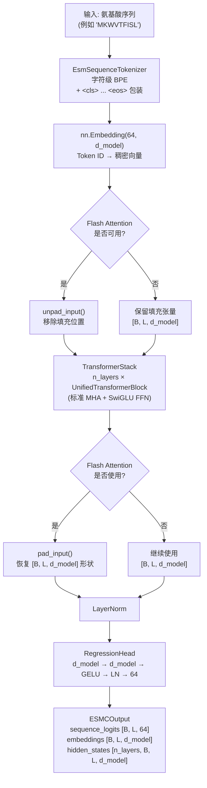

---
slug:9-esm-c-representation-model
blog_type:normal
---


ESM C 是 EvolutionaryScale 的**纯序列表示模型**——一款精简的 Transformer，旨在提取高质量的蛋白质嵌入，而无需承担多轨生成架构的开销。[ESM3](8-esm3-multimodal-generative-model) 通过几何注意力层处理序列、结构、二级结构、SASA 和功能 Token，与此不同的是，ESM C 将架构精简至其本质：仅对氨基酸 Token 进行操作的深度 Transformer 堆栈，生成逐残基的嵌入和隐藏状态，以支持从酶活性预测到远缘同源性检测等下游任务。这种设计理念使得该模型部署更简单、推理更快速，并且在不需要结构条件的任务上，其表征通常优于多模态替代方案。

## 架构理念：专为纯序列设计

ESM C 背后的核心洞见在于：**并非每个蛋白质理解任务都需要结构或功能的 Token 轨道**。许多下游应用——预测溶解度、分类酶类别或计算序列间的相似度——主要受益于丰富的上下文嵌入，而非完整的生成能力。ESM C 利用这一点，移除了所有辅助 Token 化流水线（结构 VQ-VAE、SASA 离散化、二级结构分类、InterPro 功能 Token）以及所有几何注意力块，只留下一个纯序列到嵌入的 Transformer。

这一架构决策带来三个具体影响。首先，`encode` 步骤仅接受 `ESMProtein.sequence` 字符串，并使用标准的 `EsmSequenceTokenizer` 对其进行 Token 化——没有结构编码器，也没有坐标处理。其次，Transformer 堆栈在构建时设置了 `n_layers_geom=0`，这意味着每个块都使用带有旋转嵌入的标准多头注意力，而不是 ESM3 中使用的 SE(3)-等变几何注意力。第三，输出头仅产生基于 64 词表大小的 `sequence_logits`；没有结构、SASA 或功能预测头。

来源: [esmc.py](/esm/models/esmc.py#L56-L95), [esmc.py](/esm/models/esmc.py#L108-L138), [pretrained.py](/esm/pretrained.py#L69-L88)

## 模型架构

ESM C 模型被实现为 `ESMC` 类，该类继承自 `nn.Module` 和 `ESMCInferenceClient`。其前向传播遵循清晰的三阶段流水线：**Token 嵌入 → Transformer 堆栈 → 序列头**。



嵌入层将 64 个可能的 Token ID（33 个标准氨基酸 Token，加上包括 `<cls>`、`<pad>`、`<eos>`、`<unk>`、`<mask>` 和链断裂符 `|` 在内的特殊 Token）映射到 `d_model` 维空间。随后，Transformer 堆栈通过 `n_layers` 个相同的 `UnifiedTransformerBlock` 实例处理这些嵌入——每个实例包含 LayerNorm → 带有旋转嵌入的 QK 范数多头注意力 → 残差连接 → LayerNorm → SwiGLU FFN → 残差连接。最终的 LayerNorm 生成输出嵌入，而 `RegressionHead`（一个带有 GELU 激活和中间 LayerNorm 的两层 MLP）将其投影为序列 logits。

<CgxTip>当 Flash Attention 可用时，ESM C 使用 **unpad/pad 模式**：在进入 Transformer 之前，通过 `unpad_input` 移除填充 Token，Transformer 仅处理真实 Token，之后 `pad_input` 恢复原始批次形状。这消除了在填充位置上的无效计算，可以显著加速变长批次的推理。</CgxTip>

来源: [esmc.py](/esm/models/esmc.py#L56-L95), [transformer_stack.py](/esm/layers/transformer_stack.py#L23-L95), [blocks.py](/esm/layers/blocks.py#L65-L158), [regression_head.py](/esm/layers/regression_head.py#L1-L23), [attention.py](/esm/layers/attention.py#L16-L59)

## 模型变体与超参数

有两个 ESM C 检查点可用于本地推理，它们在深度、宽度和头数量上有所不同。Forge API 平台上存在一个更大的 6B 参数变体，但未分发用于本地使用。

| 属性 | ESMC 300M | ESMC 600M |
|---|---|---|
| **模型名称** | `esmc_300m` | `esmc_600m` |
| **Forge 名称** | `esmc-300m-2024-12` | `esmc-600m-2024-12` |
| **d_model** | 960 | 1152 |
| **n_heads** | 15 | 18 |
| **n_layers** | 30 | 36 |
| **d_head** | 64 | 64 |
| **FFN 类型** | SwiGLU (8/3× 扩展) | SwiGLU (8/3× 扩展) |
| **几何注意力** | 无 (`n_layers_geom=0`) | 无 (`n_layers_geom=0`) |
| **词表大小** | 64 | 64 |
| **HuggingFace 仓库** | `EvolutionaryScale/esmc-300m-2024-12` | `EvolutionaryScale/esmc-600m-2024-12` |

这两个模型均通过 `ESMC.from_pretrained(model_name)` 加载，该函数从 HuggingFace 下载权重，将其应用于模型，并在 CUDA 设备上自动转换为 `bfloat16`。`from_pretrained` 类方法委托给 `load_local_model`，后者在 `LOCAL_MODEL_REGISTRY` 字典中查找模型名称并调用相应的构建器函数。

来源: [pretrained.py](/esm/pretrained.py#L69-L105), [models.py](/esm/utils/constants/models.py#L1-L12), [esm3.py](/esm/utils/constants/esm3.py#L108-L118)

## Tokenization 流水线

ESM C 使用单一 Token 化器——`EsmSequenceTokenizer`，这是一个字符级 BPE Token 化器（无合并操作，使其实际上是一个逐字符的词表查找）。该 Token 化器在每个输入序列的开头用 `<cls>` 包裹，末尾用 `<eos>` 包裹，并支持 `<mask>` Token 用于掩码位置，以及 `|` 用于链断裂。词表由 33 个氨基酸字符（20 个标准 + 5 个模糊 + 特殊 Token）加上控制 Token 组成，共计 64 个条目。

`ESMC` 类上的 `encode` 方法接受一个带有 `sequence` 字段的 `ESMProtein`，通过 `_tokenize` 运行它（内部调用带有 `add_special_tokens=True` 的 `encoding.tokenize_sequence`），并返回一个仅包含 `sequence` 张量的 `ESMProteinTensor`——所有其他轨道（结构、sasa 等）均为 `None`。相反，`decode` 接受一个 `ESMProteinTensor`，剥离填充和特殊 Token，并将 Token ID 映射回氨基酸字符。

<CgxTip>由于 ESM C 的 `encode` 仅处理 `sequence` 字段，因此在 `ESMProtein` 输入中提供的任何结构坐标或功能注释都会被静默忽略。如果你需要结构感知的表征，请改用 [ESM3](8-esm3-multimodal-generative-model)。</CgxTip>

来源: [sequence_tokenizer.py](/esm/tokenization/sequence_tokenizer.py#L10-L72), [encoding.py](/esm/utils/encoding.py#L37-L49), [esmc.py](/esm/models/esmc.py#L140-L162), [__init__.py](/esm/tokenization/__init__.py#L57-L58)

## 推理 API：ESMCInferenceClient

ESM C 实现了 `ESMCInferenceClient` 抽象基类，该类定义了完整 `ESM3InferenceClient` 接口的一个专注子集。这种精简的契约反映了 ESM C 仅用于表征的目的——没有 `generate`、`forward_and_sample` 或 `batch_generate` 方法，因为 ESM C 不是生成模型。

| 方法 | 用途 | 输入 | 输出 |
|---|---|---|---|
| `encode` | 对原始序列进行 Token 化 | `ESMProtein` | `ESMProteinTensor` |
| `decode` | 反 Token 化回序列 | `ESMProteinTensor` | `ESMProtein` |
| `logits` | 带有可配置输出的前向传播 | `ESMProteinTensor` + `LogitsConfig` | `LogitsOutput` |
| `raw_model` | 访问底层 `nn.Module` | — | `ESMC` 实例 |

`logits` 方法是提取表征的主要入口点。它接受一个 `LogitsConfig`，用于控制模型返回的内容：

- **`sequence=True`**：通过 `ForwardTrackData.sequence` 返回基于 64 词表大小的逐位置 logits——适用于掩码 Token 预测或伪似然评分。
- **`return_embeddings=True`**：返回最终层的嵌入（LayerNorm 之后）作为 `[B, L, d_model]` 张量——这是下游任务最常用的输出。
- **`return_hidden_states=True`**：返回所有中间层输出作为 `[n_layers, B, L, d_model]` 张量——对于探测逐层行为或选择任务最优层至关重要。
- **`ith_hidden_layer`**：当设置为非负整数时，仅返回该特定层的隐藏状态，而非所有层——这对于大型模型（尤其是 Forge 上的 6B 变体）的内存高效推理至关重要。

`logits` 方法会在 CUDA 上自动将前向传播包装在 `torch.no_grad()` 和 `torch.autocast(dtype=torch.bfloat16)` 中，确保无需手动上下文管理即可进行高效推理。

来源: [api.py](/esm/sdk/api.py#L503-L532), [api.py](/esm/sdk/api.py#L378-L411), [esmc.py](/esm/models/esmc.py#L196-L226)

## 输出数据结构

原始 `forward` 方法返回一个包含三个张量的 `ESMCOutput` 数据类，而 SDK 级别的 `logits` 方法将其包装为带有可配置可用性的 `LogitsOutput`：

| 字段 | 形状 | 描述 |
|---|---|---|
| `sequence_logits` | `[B, L, 64]` | 基于氨基酸词表的逐位置 logits |
| `embeddings` | `[B, L, d_model]` | LayerNorm 之后的最终层输出（逐残基嵌入） |
| `hidden_states` | `[n_layers, B, L, d_model]` | 所有中间层输出（如果指定了 `ith_hidden_layer`，则为单层） |

`hidden_states` 张量是通过堆叠每个 `UnifiedTransformerBlock` 在所有层上的输出（前归一化残差流）构建的。请注意，`embeddings` 与 `hidden_states` 的最后一个条目不同：`embeddings` 是完整 Transformer 堆栈的后 LayerNorm 输出，而 `hidden_states[-1]` 是前归一化残差。对于大多数下游用例，`embeddings` 是正确的选择。

来源: [esmc.py](/esm/models/esmc.py#L28-L32), [esmc.py](/esm/models/esmc.py#L108-L138), [transformer_stack.py](/esm/layers/transformer_stack.py#L76-L95)

## 使用模式

### 本地推理

在本地加载和运行 ESM C 只需 `esm` 包和 GPU（CPU 也可以运行，但速度明显较慢）：

```python
from esm.models.esmc import ESMC
from esm.sdk.api import ESMProtein, LogitsConfig

model = ESMC.from_pretrained("esmc_300m")  # 或 "esmc_600m"

protein = ESMProtein(sequence="MKWVTFISLLFLFSSAYSRGVFRR")
protein_tensor = model.encode(protein)

output = model.logits(
    protein_tensor,
    LogitsConfig(
        sequence=True,
        return_embeddings=True,
        return_hidden_states=True,
    ),
)

# 访问结果
embeddings = output.embeddings          # [1, L, d_model]
logits = output.logits.sequence         # [1, L, 64]
hiddens = output.hidden_states          # [n_layers, 1, L, d_model]
```

### Forge API 推理

对于更大的 6B 模型或基于云的推理，Forge API 客户端遵循相同的 `ESMCInferenceClient` 接口：

```python
from esm.sdk import client
from esm.sdk.api import ESMProtein, LogitsConfig

model = client(model="esmc-300m-2024-12", url="https://forge.evolutionaryscale.ai", token=token)
protein = ESMProtein(sequence="MKWVTFISLLFLFSSAYSRGVFRR")
protein_tensor = model.encode(protein)
output = model.logits(protein_tensor, LogitsConfig(return_embeddings=True))
```

### 原生前向传播（绕过 SDK）

为了获得最大控制权，你可以直接使用预先 Token 化的输入调用 `model.forward`：

```python
sequences = ["MKWVTFISLLFLFSSAYSRGVFRR", "AQVINTFDGVADYLQTYHKLPDNYIT"]
input_ids = model._tokenize(sequences)  # [B, L] Token ID
output = model(input_ids)               # 直接输出 ESMCOutput
```

### 选择特定隐藏层

为了实现内存高效的中间表征提取（这对于 Forge 上的 6B 模型尤其重要），请使用 `ith_hidden_layer`：

```python
# 仅获取第 20 层的隐藏状态，而不是所有 30+ 层
output = model.logits(
    protein_tensor,
    LogitsConfig(return_hidden_states=True, ith_hidden_layer=20),
)
# output.hidden_states 形状: [1, B, L, d_model] (单层)
```

来源: [esmc.py](/esm/models/esmc.py#L96-L106), [esmc.py](/esm/models/esmc.py#L196-L226), [esmc.py](/cookbook/snippets/esmc.py#L1-L86)

## ESM C 与 ESM3：架构对比

要了解何时选择 ESM C 而不是 ESM3，需要清楚地了解它们的架构差异以及由此产生的权衡：

| 维度 | ESM C | ESM3 |
|---|---|---|
| **输入模态** | 仅序列 | 序列、结构、SS、SASA、功能 |
| **注意力类型** | 标准 MHA（所有层） | 几何 MHA（前 `n_layers_geom` 层） + 标准 MHA |
| **输出头** | 仅序列 logits | 序列、结构、SS、SASA、功能 logits |
| **所需 Token 化器** | 仅 `EsmSequenceTokenizer` | 完整 `TokenizerCollection`（6 个 Token 化器） |
| **结构编码器/解码器** | 无 | VQ-VAE 编码器 + 解码器 |
| **生成能力** | 无（仅表征） | 跨所有轨道的迭代掩码采样 |
| **推理客户端** | `ESMCInferenceClient`（3 个方法） | `ESM3InferenceClient`（7+ 个方法） |
| **嵌入重点** | 主要设计目标 | 次于生成 |
| **部署复杂度** | 单模型文件 | 模型 + 结构编码器 + 结构解码器 + 功能解码器 |

当你的任务需要**高质量的序列嵌入**用于下游预测、相似性搜索或迁移学习时，请选择 ESM C。当你需要**以结构或功能信息为条件进行生成**，或者需要迭代掩码生成时，请选择 [ESM3](8-esm3-multimodal-generative-model)。

来源: [esmc.py](/esm/models/esmc.py#L56-L95), [esm3.py](/esm/models/esm3.py#L50-L80), [api.py](/esm/sdk/api.py#L431-L532)

## Transformer 块内部机制

ESM C 的每个 `UnifiedTransformerBlock` 实例（设置 `use_geom_attn=False`）在每层执行以下计算：

1. **LayerNorm → QKV 投影**：输入 `x` 经过层归一化，并通过融合的 `layernorm_qkv` 操作线性投影为查询、键和值。
2. **QK LayerNorm**：查询和键张量独立进行层归一化（由 `qk_layernorm=True` 控制），以稳定注意力幅度。
3. **旋转位置嵌入**：应用于查询和键，将相对位置信息直接编码到注意力计算中。
4. **多头注意力**：标准的缩放点积注意力，包含 `n_heads` 个头，每个头的维度为 `d_head = d_model // n_heads`。序列身份掩码可防止批次中不同序列之间的交叉注意力。
5. **残差连接**：注意力输出除以 `residue_scaling_factor`（与 `sqrt(n_layers / 36)` 成正比），然后才与输入相加——这可以防止深度堆栈中的残差幅度爆炸。
6. **SwiGLU FFN**：注意力后的残差经过 LayerNorm → 线性层（以 8/3× 扩展进行上投影，向上取整至 256 的倍数） → SwiGLU 激活（SiLU 门控 × 值） → 线性层（下投影） → 残差相加，同样带有缩放。

`residue_scaling_factor` 计算为 `sqrt(n_layers / 36)`，这意味着 30 层的 300M 模型使用 `sqrt(30/36) ≈ 0.913`，而 36 层的 600M 模型使用 `sqrt(36/36) = 1.0`。这种归一化确保了残差流的方差无论模型深度如何都能保持稳定。

来源: [blocks.py](/esm/layers/blocks.py#L95-L158), [attention.py](/esm/layers/attention.py#L16-L59), [transformer_stack.py](/esm/layers/transformer_stack.py#L43-L60)

## 关于层选择的实用指南

在为下游任务提取嵌入时，选择使用哪一层至关重要。`return_embeddings` 标志返回最终的后 LayerNorm 输出，这是大多数应用的有力默认选择。然而，关于 Transformer 表征的研究一致表明：**不同的层编码不同级别的抽象**。早期层捕获局部生化属性（疏水性、电荷），中间层捕获结构基序（二级结构倾向），后期层捕获全局功能和进化信号。

在没有针对特定任务进行探测的情况下盲目选择时，**倒数第二层隐藏状态**通常是一个稳健的选择。另一种启发式方法是提取网络大约 **三分之二处**的层（300M 模型的第 20 层，600M 模型的第 24 层）。对于 Forge 托管的具有 80 层的 6B 模型，由于同时物化所有 80 层的内存成本，通过 `ith_hidden_layer` 一次请求单层不仅是建议，更是实际需要。

来源: [api.py](/esm/sdk/api.py#L378-L398), [2_embed.ipynb](/cookbook/tutorials/2_embed.ipynb)

## 后续步骤

- 要了解 ESM C 所简化的完整多模态架构，请参阅 [ESM3 多模态生成模型](8-esm3-multimodal-generative-model)。
- 有关两个模型共享的序列 Token 化器的详细信息，请参阅 [序列与结构 Token 化器](10-sequence-and-structure-tokenizers)。
- 有关 ESM C 使用的 Transformer 组件，请参阅 [Transformer 堆栈设计](14-transformer-stack-design) 和 [旋转嵌入与 SwiGLU](15-rotary-embeddings-and-swiglu)。
- 要大规模部署 ESM C，请参阅 [Forge API 客户端](19-forge-api-client) 或 [本地推理客户端](20-local-inference-client)。