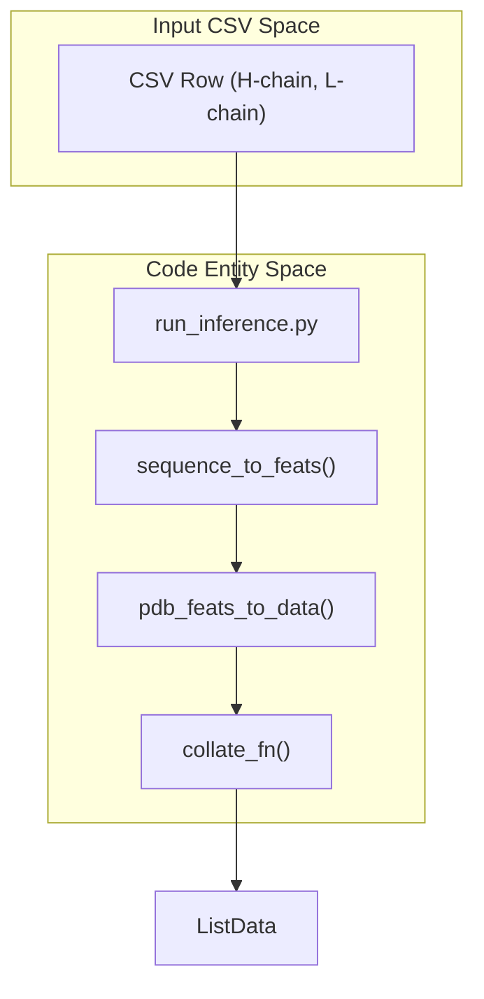
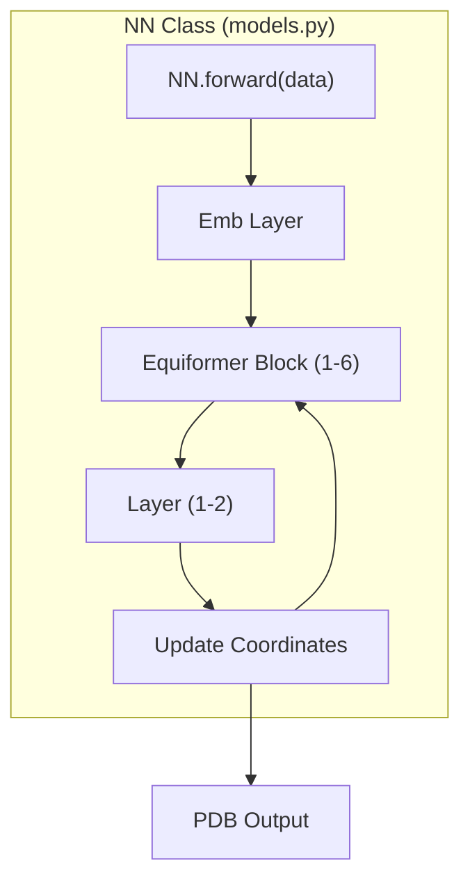

# Antibody Model (ab)

> **Relevant source files**
> * [models/ab_config.json](https://github.com/Genentech/equifold/blob/2e466856/models/ab_config.json)
> * [models/ab_weights.pt](https://github.com/Genentech/equifold/blob/2e466856/models/ab_weights.pt)

The **Antibody Model (ab)** is a specialized configuration of EquiFold optimized for the structural prediction of antibody Fv regions. It utilizes a specific hyperparameter set and a paired-chain input mechanism to handle the heavy and light chains characteristic of immunoglobulins.

### Model Configuration & Hyperparameters

The model is defined by `models/ab_config.json`, which specifies a deeper architecture compared to the general-purpose science model. It uses 6 distinct blocks with 2 layers each, totaling 12 refinement steps. The configuration employs a higher `fape_clip_val` of 30.0 to allow for larger structural updates during the initial phases of folding.

| Hyperparameter | Value | Description |
| --- | --- | --- |
| `num_blocks` | 6 | Number of iterative refinement blocks [models/ab_config.json L1](https://github.com/Genentech/equifold/blob/2e466856/models/ab_config.json#L1-L1) |
| `num_layers` | 2 | Layers per block, resulting in 12 total iterations [models/ab_config.json L1](https://github.com/Genentech/equifold/blob/2e466856/models/ab_config.json#L1-L1) |
| `nc` | 64 | Number of scalar features (channels) [models/ab_config.json L1](https://github.com/Genentech/equifold/blob/2e466856/models/ab_config.json#L1-L1) |
| `interaction_type` | `attn-direct` | Uses the Equiformer-based geometric attention mechanism [models/ab_config.json L1](https://github.com/Genentech/equifold/blob/2e466856/models/ab_config.json#L1-L1) |
| `fape_clip_val` | 30.0 | Clipping threshold for Frame Aligned Point Error [models/ab_config.json L1](https://github.com/Genentech/equifold/blob/2e466856/models/ab_config.json#L1-L1) |
| `lr_anneal_final_step` | 100,000 | Steps for the cosine annealing schedule [models/ab_config.json L1](https://github.com/Genentech/equifold/blob/2e466856/models/ab_config.json#L1-L1) |
| `weight_struct_loss` | 0.2 | Weight for structural violation losses (bonds, angles, clashes) [models/ab_config.json L1](https://github.com/Genentech/equifold/blob/2e466856/models/ab_config.json#L1-L1) |

**Sources:** [models/ab_config.json L1](https://github.com/Genentech/equifold/blob/2e466856/models/ab_config.json#L1-L1)

---

### Paired Chain Input Handling

Unlike the single-chain "science" model, the antibody pipeline is designed to process paired heavy (H) and light (L) chains. The data flow involves parsing these sequences from a CSV, generating features for both, and concatenating them into a single graph representation where the chains are distinguished by residue indexing.

#### Data Flow: Sequence to Graph

The `sequence_to_feats` function in `utils_data.py` handles the conversion of amino acid strings into the tensor format required by the model. For antibodies, this function is called for both chains, and the results are aggregated.

"Natural Language to Code Entity: Input Handling"



**Sources:** [run_inference.py L80-L102](https://github.com/Genentech/equifold/blob/2e466856/run_inference.py#L80-L102)

 [utils_data.py L108-L140](https://github.com/Genentech/equifold/blob/2e466856/utils_data.py#L108-L140)

---

### Checkpoint and Weights

The pre-trained weights for this model are stored in `models/ab_weights.pt`. This file contains the `OrderedDict` of state tensors for the `NN` LightningModule. The weights include embeddings for scalar and vector features (`embs`), edge embeddings (`embed_edge`), and the internal parameters for the `Equiformer` layers (RadialNN, Attention weights, and LayerNorm).

#### Weight Structure (Partial)

Based on the `OrderedDict` keys in the checkpoint:

* **Embeddings:** `embs.0.embed_s.weight`, `embs.0.embed_v.weight` [models/ab_weights.pt L3-L10](https://github.com/Genentech/equifold/blob/2e466856/models/ab_weights.pt#L3-L10)
* **Geometric Layers:** `enns.0.layers.0.attn_msg_w_s`, `enns.0.layers.0.radialnn.mlp.layers.0.weight` [models/ab_weights.pt L8-L9](https://github.com/Genentech/equifold/blob/2e466856/models/ab_weights.pt#L8-L9)
* **Normalization:** `enns.0.layers.0.layer_norm_attn.gamma_s` [models/ab_weights.pt L8](https://github.com/Genentech/equifold/blob/2e466856/models/ab_weights.pt#L8-L8)

**Sources:** [models/ab_weights.pt L1-L10](https://github.com/Genentech/equifold/blob/2e466856/models/ab_weights.pt#L1-L10)

---

### Implementation Details

The `NN` class (the core model) uses the configuration to instantiate the iterative refinement loop. In the antibody model, `distinct_blocks` is set to `true`, meaning each of the 6 blocks has its own set of weights, rather than sharing weights across iterations.

"Code Entity Space: Model Forward Pass"



**Sources:** [models/ab_config.json L1](https://github.com/Genentech/equifold/blob/2e466856/models/ab_config.json#L1-L1)

 [run_inference.py L102](https://github.com/Genentech/equifold/blob/2e466856/run_inference.py#L102-L102)

#### Inference Execution

To run the antibody model, the `--model_type ab` flag is used in `run_inference.py`. This directs the script to load `ab_config.json` and `ab_weights.pt` automatically.

```markdown
# Internal logic for model selection in run_inference.pyconfig_file = "models/ab_config.json"weights_file = "models/ab_weights.pt"# The model is instantiated using these parametersmodel = NN(config)model.load_state_dict(torch.load(weights_file))
```

**Sources:** [run_inference.py L102](https://github.com/Genentech/equifold/blob/2e466856/run_inference.py#L102-L102)