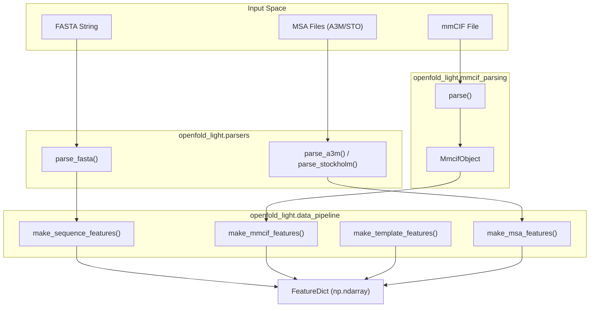
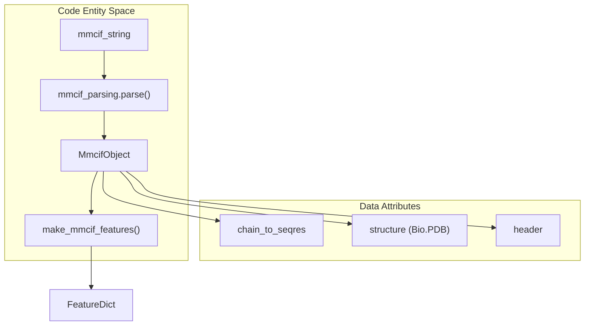

# Data Pipeline & File Parsers

> **Relevant source files**
> * [openfold_light/data_pipeline.py](https://github.com/Genentech/equifold/blob/2e466856/openfold_light/data_pipeline.py)
> * [openfold_light/mmcif_parsing.py](https://github.com/Genentech/equifold/blob/2e466856/openfold_light/mmcif_parsing.py)
> * [openfold_light/parsers.py](https://github.com/Genentech/equifold/blob/2e466856/openfold_light/parsers.py)

The data pipeline and file parsing modules provide the infrastructure for ingesting biological data formats (FASTA, mmCIF, MSA) and converting them into structured feature dictionaries (`FeatureDict`) compatible with the EquiFold model. These utilities are primarily located within the `openfold_light` sub-package, adapting logic from OpenFold for efficient sequence and structure processing.

### Data Pipeline Core Logic

The `data_pipeline.py` module acts as the central coordinator for feature assembly. It defines the `FeatureDict` type and provides functions to build features from sequences, templates, and existing protein objects.

#### Feature Dictionary Construction

The pipeline produces a `FeatureDict`, defined as a `Mapping[str, np.ndarray]` [openfold_light/data_pipeline.py L27](https://github.com/Genentech/equifold/blob/2e466856/openfold_light/data_pipeline.py#L27-L27)

 Key functions include:

* **`make_sequence_features`**: Generates basic sequence metadata, including one-hot encoded amino acid types (`aatype`), residue indices, and sequence length [openfold_light/data_pipeline.py L66-L85](https://github.com/Genentech/equifold/blob/2e466856/openfold_light/data_pipeline.py#L66-L85)
* **`make_template_features`**: Orchestrates the extraction of structural templates. If no hits are provided, it defaults to `empty_template_feats` [openfold_light/data_pipeline.py L39-L63](https://github.com/Genentech/equifold/blob/2e466856/openfold_light/data_pipeline.py#L39-L63)
* **`empty_template_feats`**: Returns a dictionary of zeroed arrays with shapes matching the expected template feature dimensions (e.g., `template_all_atom_positions` at `(0, n_res, 37, 3)`) [openfold_light/data_pipeline.py L29-L36](https://github.com/Genentech/equifold/blob/2e466856/openfold_light/data_pipeline.py#L29-L36)
* **`make_mmcif_features`**: High-level wrapper that converts an `MmcifObject` into a complete set of features, including atom coordinates and resolution [openfold_light/data_pipeline.py L88-L121](https://github.com/Genentech/equifold/blob/2e466856/openfold_light/data_pipeline.py#L88-L121)

#### Data Flow: Raw Input to FeatureDict

**Sources:** [openfold_light/data_pipeline.py L27-L121](https://github.com/Genentech/equifold/blob/2e466856/openfold_light/data_pipeline.py#L27-L121)

 [openfold_light/parsers.py L41-L161](https://github.com/Genentech/equifold/blob/2e466856/openfold_light/parsers.py#L41-L161)

 [openfold_light/mmcif_parsing.py L176-L215](https://github.com/Genentech/equifold/blob/2e466856/openfold_light/mmcif_parsing.py#L176-L215)

---

### File Parsers

The `parsers.py` module contains specialized parsers for various bioinformatics formats, converting raw strings into structured Python objects or matrices.

#### Key Entities

* **`TemplateHit`**: A dataclass representing a structural template match, storing alignment indices for both the query and the hit sequence [openfold_light/parsers.py L27-L39](https://github.com/Genentech/equifold/blob/2e466856/openfold_light/parsers.py#L27-L39)
* **`DeletionMatrix`**: A type alias for `Sequence[Sequence[int]]`, representing the number of deletions relative to a query sequence in an alignment [openfold_light/parsers.py L24](https://github.com/Genentech/equifold/blob/2e466856/openfold_light/parsers.py#L24-L24)

#### Parsing Functions

| Function | Input | Output | Description |
| --- | --- | --- | --- |
| `parse_fasta` | FASTA string | `(sequences, descriptions)` | Extracts AA sequences and their headers [openfold_light/parsers.py L41-L67](https://github.com/Genentech/equifold/blob/2e466856/openfold_light/parsers.py#L41-L67) |
| `parse_a3m` | A3M string | `(aligned_seqs, deletion_matrix)` | Parses sequences and calculates deletion counts [openfold_light/parsers.py L130-L161](https://github.com/Genentech/equifold/blob/2e466856/openfold_light/parsers.py#L130-L161) |
| `parse_stockholm` | STO string | `(msa, deletion_matrix, names)` | Handles Stockholm alignment format [openfold_light/parsers.py L70-L127](https://github.com/Genentech/equifold/blob/2e466856/openfold_light/parsers.py#L70-L127) |

**Sources:** [openfold_light/parsers.py L24-L161](https://github.com/Genentech/equifold/blob/2e466856/openfold_light/parsers.py#L24-L161)

---

### mmCIF Structure Ingestion

The `mmcif_parsing.py` module provides a robust interface for reading mmCIF files, which are the standard for large macromolecular structures.

#### Implementation Details

* **`MmcifObject`**: The primary data structure containing the Biopython structure, chain-to-sequence mappings, and SEQRES metadata [openfold_light/mmcif_parsing.py L78-L101](https://github.com/Genentech/equifold/blob/2e466856/openfold_light/mmcif_parsing.py#L78-L101)
* **`parse()`**: The entry point for mmCIF ingestion. It utilizes `Bio.PDB.MMCIFParser` to load the structure and manually extracts the `_mmcif_dict` to access metadata not exposed by the standard Biopython object [openfold_light/mmcif_parsing.py L176-L200](https://github.com/Genentech/equifold/blob/2e466856/openfold_light/mmcif_parsing.py#L176-L200)
* **`mmcif_loop_to_list` / `mmcif_loop_to_dict`**: Utility functions that parse the `loop_` syntax in mmCIF files, converting prefixed data items into iterable Python dictionaries [openfold_light/mmcif_parsing.py L121-L174](https://github.com/Genentech/equifold/blob/2e466856/openfold_light/mmcif_parsing.py#L121-L174)

#### Code Entity Mapping: mmCIF Parsing

**Sources:** [openfold_light/mmcif_parsing.py L78-L101](https://github.com/Genentech/equifold/blob/2e466856/openfold_light/mmcif_parsing.py#L78-L101)

 [openfold_light/mmcif_parsing.py L176-L215](https://github.com/Genentech/equifold/blob/2e466856/openfold_light/mmcif_parsing.py#L176-L215)

 [openfold_light/data_pipeline.py L88-L121](https://github.com/Genentech/equifold/blob/2e466856/openfold_light/data_pipeline.py#L88-L121)

---

### MSA and Template Handling

The pipeline supports complex evolutionary features through MSA and structural templates.

* **MSA Features**: `make_msa_features` processes multiple alignments, deduplicates sequences, and converts amino acids to numerical IDs using `residue_constants.HHBLITS_AA_TO_ID` [openfold_light/data_pipeline.py L181-L214](https://github.com/Genentech/equifold/blob/2e466856/openfold_light/data_pipeline.py#L181-L214)
* **Protein-to-Features**: The function `make_protein_features` bridges the gap between the `protein.Protein` dataclass and the `FeatureDict`, ensuring that atom positions and masks are correctly typed as `float32` for model consumption [openfold_light/data_pipeline.py L131-L158](https://github.com/Genentech/equifold/blob/2e466856/openfold_light/data_pipeline.py#L131-L158)

**Sources:** [openfold_light/data_pipeline.py L131-L214](https://github.com/Genentech/equifold/blob/2e466856/openfold_light/data_pipeline.py#L131-L214)