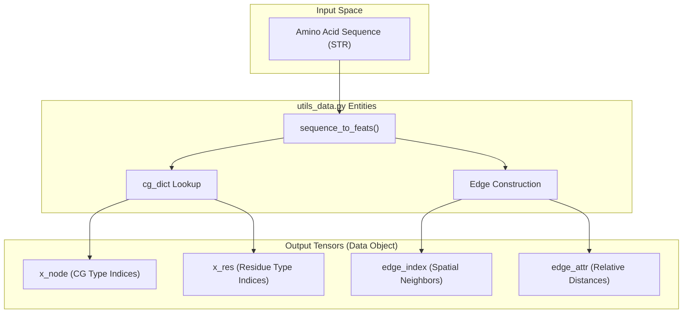
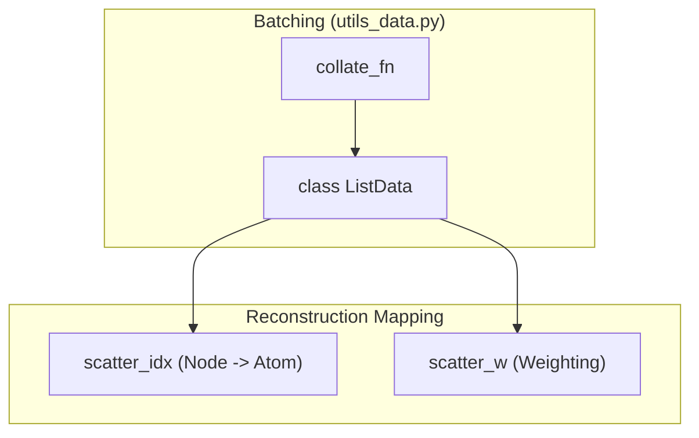

# Data Processing Utilities (utils_data.py)

> **Relevant source files**
> * [cg.py](https://github.com/Genentech/equifold/blob/2e466856/cg.py)
> * [utils_data.py](https://github.com/Genentech/equifold/blob/2e466856/utils_data.py)

The `utils_data.py` module serves as the primary bridge between raw biological sequences/structures and the coarse-grained (CG) graph representation required by the EquiFold model. It manages the conversion of amino acid sequences into feature tensors, handles batching through specialized collators, and precomputes structural constraints (bonds, angles, and van der Waals radii) used to calculate structural violation losses during training.

## Sequence to Features Pipeline

The featurization process converts a primary sequence into a set of node-level and edge-level features. A key component of this pipeline is the mapping of residues to their constituent coarse-grained beads as defined in `cg.py`.

### Featurization Logic

The function `sequence_to_feats` (and its multi-chain counterpart `sequence_to_feats_ab`) performs the following transformations:

1. **Node Construction**: Maps each residue to its CG beads using `cg_to_idx` [cg.py L41-L48](https://github.com/Genentech/equifold/blob/2e466856/cg.py#L41-L48)
2. **Edge Construction**: Builds a relative distance matrix between residues, clipped at `MAX_DIST = 32` [utils_data.py L14-L15](https://github.com/Genentech/equifold/blob/2e466856/utils_data.py#L14-L15)
3. **Ambiguity Mapping**: Identifies atoms within residues that belong to multiple CG beads or exhibit 180-degree rotational symmetry (e.g., ASP, PHE) using `cg_atom_ambiguous_np` [cg.py L81-L89](https://github.com/Genentech/equifold/blob/2e466856/cg.py#L81-L89)

**Data Flow: Sequence to Graph**
The following diagram illustrates how a sequence is transformed into the internal `Data` object.

"Sequence to Features Flow"

Sources: [utils_data.py L228-L305](https://github.com/Genentech/equifold/blob/2e466856/utils_data.py#L228-L305)

 [cg.py L10-L31](https://github.com/Genentech/equifold/blob/2e466856/cg.py#L10-L31)

## Structural Violation Precomputations

EquiFold utilizes physical constraints to regularize the folding process. `utils_data.py` precomputes these constraints by loading stereo-chemical properties from `openfold_light`.

### Bond and Angle Constraints

* **Bonds**: The module iterates through `residue_bonds` and `residue_virtual_bonds` to identify pairs of atoms that must maintain specific distances [utils_data.py L41-L60](https://github.com/Genentech/equifold/blob/2e466856/utils_data.py#L41-L60)
* **Angles**: It computes cosine-based tolerances for bond angles using `residue_bond_angles` [utils_data.py L72-L98](https://github.com/Genentech/equifold/blob/2e466856/utils_data.py#L72-L98)
* **Clashes**: Van der Waals radii are mapped to every atom type to detect steric clashes [utils_data.py L100](https://github.com/Genentech/equifold/blob/2e466856/utils_data.py#L100-L100)

### Ambiguity Handling

If an atom is shared between two CG beads (e.g., the CA atom in many residues), the loss function must account for this redundancy. The `ambiguous_atoms` set tracks these occurrences to mask or weight losses appropriately [utils_data.py L25-L30](https://github.com/Genentech/equifold/blob/2e466856/utils_data.py#L25-L30)

Sources: [utils_data.py L22-L100](https://github.com/Genentech/equifold/blob/2e466856/utils_data.py#L22-L100)

 [openfold_light/residue_constants.py L5-L8](https://github.com/Genentech/equifold/blob/2e466856/openfold_light/residue_constants.py#L5-L8)

## Batching and Data Loading

Because protein graphs vary in size (number of CG nodes), EquiFold uses a custom batching strategy rather than standard tensor padding.

### ListData and collate_fn

The `collate_fn` returns a `ListData` object, which is a simple wrapper around a list of `torch_geometric.data.Data` objects [utils_data.py L133-L153](https://github.com/Genentech/equifold/blob/2e466856/utils_data.py#L133-L153)

 This allows the `LightningModule` to iterate through the batch manually or process it as a list, avoiding the overhead of large, sparse padded tensors.

### Scatter Reduction

During the transformation from CG nodes back to atomic coordinates, the model uses `scatter` operations. The `scatter_idx` and `scatter_w` (weights) are constructed in `pdb_feats_to_data` to map CG bead positions back to the full-atom PDB representation [utils_data.py L328-L339](https://github.com/Genentech/equifold/blob/2e466856/utils_data.py#L328-L339)

"Batching and Scatter Mapping"

Sources: [utils_data.py L133-L153](https://github.com/Genentech/equifold/blob/2e466856/utils_data.py#L133-L153)

 [utils_data.py L328-L345](https://github.com/Genentech/equifold/blob/2e466856/utils_data.py#L328-L345)

## PDB Generation (x_to_pdb)

The final stage of the pipeline converts coordinate tensors into a standard PDB string format.

| Parameter | Role | Source |
| --- | --- | --- |
| `x` | Coordinate array (N, 3) | Model Output |
| `resnum` | Residue indices | `Data.res_idx` |
| `resname` | 3-letter residue codes | `restype_1to3` mapping |
| `atoms` | Atom names (CA, N, etc.) | `residue_atoms` mapping |

The function `x_to_pdb` implements the columnar PDB format strictly, ensuring compatibility with visualization tools like PyMOL [utils_data.py L154-L205](https://github.com/Genentech/equifold/blob/2e466856/utils_data.py#L154-L205)

 It handles `ATOM` record spacing, chain IDs, and `TER` termination lines [utils_data.py L181-L201](https://github.com/Genentech/equifold/blob/2e466856/utils_data.py#L181-L201)

Sources: [utils_data.py L154-L212](https://github.com/Genentech/equifold/blob/2e466856/utils_data.py#L154-L212)

 [openfold_light/residue_constants.py L5-L8](https://github.com/Genentech/equifold/blob/2e466856/openfold_light/residue_constants.py#L5-L8)

## Key Functions Summary

| Function | Description |
| --- | --- |
| `sequence_to_feats` | Converts a single AA sequence into a `torch_geometric` Data object with CG features [utils_data.py L228](https://github.com/Genentech/equifold/blob/2e466856/utils_data.py#L228-L228) |
| `pdb_feats_to_data` | Converts parsed PDB data (from training sets) into the internal graph format [utils_data.py L308](https://github.com/Genentech/equifold/blob/2e466856/utils_data.py#L308-L308) |
| `get_cg_RT` | Computes the Rotation (R) and Translation (T) for a CG bead relative to the template `cg_X0` [utils_data.py L122](https://github.com/Genentech/equifold/blob/2e466856/utils_data.py#L122-L122) |
| `subtract_centroid_and_mask` | Normalizes coordinates by centering on the protein centroid and applying masks [utils_data.py L110](https://github.com/Genentech/equifold/blob/2e466856/utils_data.py#L110-L110) |

Sources: [utils_data.py L110-L308](https://github.com/Genentech/equifold/blob/2e466856/utils_data.py#L110-L308)