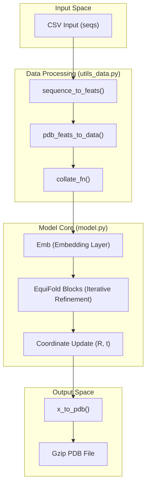
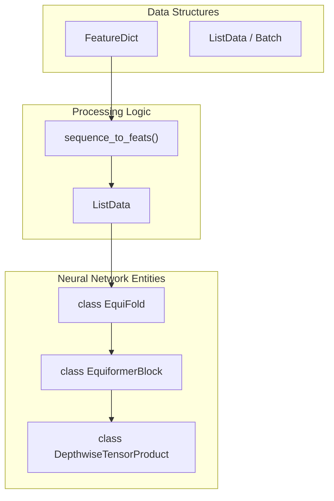

# EquiFold Overview

> **Relevant source files**
> * [.gitignore](https://github.com/Genentech/equifold/blob/2e466856/.gitignore)
> * [LICENSE.md](https://github.com/Genentech/equifold/blob/2e466856/LICENSE.md?plain=1)
> * [README.md](https://github.com/Genentech/equifold/blob/2e466856/README.md?plain=1)

EquiFold is an end-to-end differentiable protein structure prediction model developed by Prescient Design (a Genentech accelerator). It introduces a novel **coarse-grained (CG)** representation of protein structures, allowing for efficient folding of both general proteins and antibodies without the computational overhead of all-atom modeling during the initial folding stages [README.md L1-L3](https://github.com/Genentech/equifold/blob/2e466856/README.md?plain=1#L1-L3)

The system is designed to predict 3D atomic coordinates directly from amino acid sequences by leveraging equivariant neural networks that operate on a graph-based representation of protein residues.

### Core Design Philosophy: Coarse-Grained Folding

Unlike traditional methods that may model every atom or only the $C\alpha$ backbone, EquiFold utilizes a specific coarse-grained topology where each of the 20 amino acids is represented by a small set of "beads" or nodes. This approach maintains the essential geometric constraints of the residue while simplifying the search space for the neural network.

The architecture is built upon:

* **Equivariant Processing**: Utilizing `e3nn` and `Equiformer`-based blocks to ensure the model respects 3D rotations and translations.
* **Iterative Refinement**: The model predicts structure updates across multiple blocks, progressively refining the coordinates.
* **End-to-End Differentiability**: The pipeline from sequence to final PDB coordinates is fully differentiable, trained using Frame Aligned Point Error (FAPE) and structural violation losses.

### System Architecture & Data Flow

The EquiFold pipeline transitions from raw sequence data to a structured graph, which is then processed by the `EquiFold` model to produce 3D coordinates.

#### Logic Flow: Sequence to Structure

The following diagram illustrates how the codebase transforms input CSV sequences into PDB outputs through its major subsystems.

**EquiFold Inference Pipeline**

**Sources:** [run_inference.py L84-L102](https://github.com/Genentech/equifold/blob/2e466856/run_inference.py#L84-L102)

 [model.py L270-L320](https://github.com/Genentech/equifold/blob/2e466856/model.py#L270-L320)

 [utils_data.py L263-L305](https://github.com/Genentech/equifold/blob/2e466856/utils_data.py#L263-L305)

### Major Subsystems

EquiFold is organized into several key modules that handle the lifecycle of a structure prediction:

| Subsystem | Primary Code Entities | Responsibility |
| --- | --- | --- |
| **Inference Entrypoint** | `run_inference.py` | Orchestrates model loading, multiprocessing for data prep, and PDB generation. |
| **Model Architecture** | `model.py:EquiFold` | The LightningModule containing `Equiformer` blocks and the structural update loop. |
| **Data Featurization** | `utils_data.py` | Converts amino acid strings into the coarse-grained graph representation. |
| **Geometric Utils** | `utils.py` | Handles SE(3) transformations, FAPE loss calculation, and Kabsch alignment. |
| **Protein Constants** | `openfold_light/` | Provides chemical constants, PDB parsing, and residue-level definitions. |

#### Code Entity Mapping: Data to Model

This diagram maps the high-level data structures to the specific classes and functions defined in the codebase.

**Data-to-Code Mapping**

**Sources:** [utils_data.py L21-L45](https://github.com/Genentech/equifold/blob/2e466856/utils_data.py#L21-L45)

 [utils_data.py L307-L319](https://github.com/Genentech/equifold/blob/2e466856/utils_data.py#L307-L319)

 [model.py L165-L180](https://github.com/Genentech/equifold/blob/2e466856/model.py#L165-L180)

 [model.py L270-L285](https://github.com/Genentech/equifold/blob/2e466856/model.py#L270-L285)

### Child Pages

For detailed technical documentation, please refer to the following sections:

* **[Getting Started & Installation](/Genentech/equifold/1.1-getting-started-and-installation)**: Setup the `conda` environment and run your first inference using `run_inference.py`. [README.md L11-L45](https://github.com/Genentech/equifold/blob/2e466856/README.md?plain=1#L11-L45)
* **[Input & Output Formats](/Genentech/equifold/1.2-input-and-output-formats)**: Details on the CSV schema for antibody (heavy/light) and science (single-chain) pipelines, and how the model writes compressed PDBs. [run_inference.py L21-L50](https://github.com/Genentech/equifold/blob/2e466856/run_inference.py#L21-L50)

**Sources:** [README.md L1-L81](https://github.com/Genentech/equifold/blob/2e466856/README.md?plain=1#L1-L81)

 [run_inference.py L1-L102](https://github.com/Genentech/equifold/blob/2e466856/run_inference.py#L1-L102)

 [model.py L1-L400](https://github.com/Genentech/equifold/blob/2e466856/model.py#L1-L400)

 [utils_data.py L1-L400](https://github.com/Genentech/equifold/blob/2e466856/utils_data.py#L1-L400)