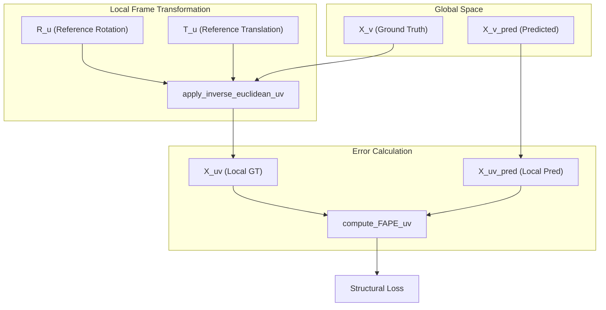
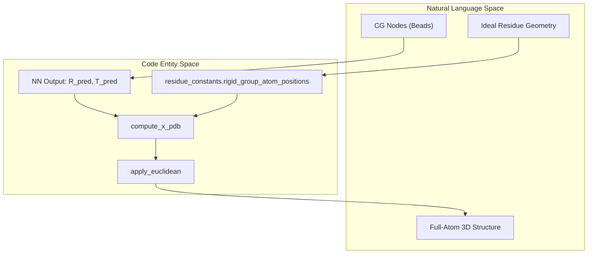

# Geometric Utility Functions (utils.py)

> **Relevant source files**
> * [utils.py](https://github.com/Genentech/equifold/blob/2e466856/utils.py)

This page documents the geometric utility functions located in `utils.py`. These functions form the mathematical backbone of EquiFold, providing the operations necessary for 3D coordinate transformations, frame-aligned error calculations, structural loss computation, and Kabsch alignment.

## Coordinate Transformations and Frames

EquiFold operates by predicting updates to local reference frames (represented by a rotation matrix $R$ and a translation vector $T$). The utilities here facilitate moving coordinates between these local frames and the global Euclidean space.

### Frame Composition and Application

The model iteratively refines structure by composing rotation updates. The function `compose_rotations` performs a batch matrix multiplication of two rotation matrices [utils.py L13-L14](https://github.com/Genentech/equifold/blob/2e466856/utils.py#L13-L14)

To move a set of points $x$ (e.g., atom coordinates) from a local frame to the global frame, `apply_euclidean` is used:
$$x_{global} = R \cdot x_{local} + T$$
Conversely, `apply_inverse_euclidean` transforms global coordinates back into a local frame [utils.py L111-L128](https://github.com/Genentech/equifold/blob/2e466856/utils.py#L111-L128)

### Rotation Representation

While the model often works with rotation matrices, it utilizes a 3-component "quaternion-u" representation for updates to ensure differentiability and ease of normalization. The function `R_from_quaternion_u` converts these 3D vectors into $3 \times 3$ rotation matrices using a normalized quaternion formulation [utils.py L138-L166](https://github.com/Genentech/equifold/blob/2e466856/utils.py#L138-L166)

### SLERP (Spherical Linear Interpolation)

During training, a warmup period uses SLERP to interpolate between the initial identity rotation and the predicted rotation. `quaternion_slerp` handles this by converting matrices to quaternions, calculating the spherical arc, and interpolating based on a time parameter $t$ [utils.py L226-L247](https://github.com/Genentech/equifold/blob/2e466856/utils.py#L226-L247)

Sources: [utils.py L13-L14](https://github.com/Genentech/equifold/blob/2e466856/utils.py#L13-L14)

 [utils.py L111-L128](https://github.com/Genentech/equifold/blob/2e466856/utils.py#L111-L128)

 [utils.py L138-L166](https://github.com/Genentech/equifold/blob/2e466856/utils.py#L138-L166)

 [utils.py L226-L247](https://github.com/Genentech/equifold/blob/2e466856/utils.py#L226-L247)

---

## Frame Aligned Point Error (FAPE)

FAPE is the primary structural loss in EquiFold. It measures the distance between predicted and ground truth atom positions after aligning the local frames of each residue.

### Implementation Logic

1. **Ambiguity Handling**: For residues with symmetric side chains (e.g., PHE, ASP), `compute_X_uv` compares the prediction against both possible symmetry states (`alt`) and selects the one with the lower error [utils.py L59-L80](https://github.com/Genentech/equifold/blob/2e466856/utils.py#L59-L80)
2. **Local Transformation**: `apply_inverse_euclidean_uv` transforms all atom positions $v$ into the local frame of residue $u$, resulting in a coordinate tensor of shape $[N, N, N_{atoms}, 3]$ [utils.py L130-L136](https://github.com/Genentech/equifold/blob/2e466856/utils.py#L130-L136)
3. **Loss Calculation**: `compute_FAPE_uv` calculates the Euclidean distance between these frame-aligned points, clamps them at `d_max` (typically 10Å), and normalizes by a factor $Z$ [utils.py L94-L108](https://github.com/Genentech/equifold/blob/2e466856/utils.py#L94-L108)

### Data Flow: Global to Local FAPE

The following diagram illustrates how global coordinates $X$ are transformed into the relative $X_{uv}$ space for loss computation.

**FAPE Calculation Pipeline**

Sources: [utils.py L59-L80](https://github.com/Genentech/equifold/blob/2e466856/utils.py#L59-L80)

 [utils.py L94-L108](https://github.com/Genentech/equifold/blob/2e466856/utils.py#L94-L108)

 [utils.py L130-L136](https://github.com/Genentech/equifold/blob/2e466856/utils.py#L130-L136)

---

## Structural Alignment and Metrics

### Kabsch Alignment

The `get_euclidean_kabsch` function implements the Kabsch algorithm to find the optimal rotation and translation that minimizes the RMSD between two sets of points. It uses Singular Value Decomposition (SVD) and includes a check on the determinant of $U V^T$ to ensure a right-handed coordinate system (preventing reflections) [utils.py L169-L208](https://github.com/Genentech/equifold/blob/2e466856/utils.py#L169-L208)

### RMSD Calculation

`compute_rmsd` provides a wrapper around the Kabsch alignment to calculate the Root Mean Square Deviation between a predicted structure and a ground truth structure, accounting for atom masking [utils.py L349-L361](https://github.com/Genentech/equifold/blob/2e466856/utils.py#L349-L361)

Sources: [utils.py L169-L208](https://github.com/Genentech/equifold/blob/2e466856/utils.py#L169-L208)

 [utils.py L349-L361](https://github.com/Genentech/equifold/blob/2e466856/utils.py#L349-L361)

---

## Structural Violation Losses

To ensure the model produces physically plausible geometries, `compute_struct_loss` calculates penalties for violations of known chemical constraints [utils.py L276-L324](https://github.com/Genentech/equifold/blob/2e466856/utils.py#L276-L324)

| Loss Component | Function / Logic | Code Reference |
| --- | --- | --- |
| **Bond Length** | Penalizes deviations from standard covalent bond lengths using `d_bond_vals`. | [utils.py L291-L297](https://github.com/Genentech/equifold/blob/2e466856/utils.py#L291-L297) |
| **Bond Angle** | Penalizes deviations from standard 3-atom bond angles using `d_angle_vals`. | [utils.py L299-L305](https://github.com/Genentech/equifold/blob/2e466856/utils.py#L299-L305) |
| **Steric Clash** | Penalizes atoms that are closer than the sum of their Van der Waals radii (using `d_clash_vals`). | [utils.py L307-L313](https://github.com/Genentech/equifold/blob/2e466856/utils.py#L307-L313) |

These losses are computed using pre-calculated distance matrices provided by the data pipeline [utils.py L278-L285](https://github.com/Genentech/equifold/blob/2e466856/utils.py#L278-L285)

Sources: [utils.py L276-L324](https://github.com/Genentech/equifold/blob/2e466856/utils.py#L276-L324)

---

## PDB Generation

The function `compute_x_pdb` is the final step in the inference pipeline. It takes the predicted Coarse-Grained (CG) positions and local frames and maps them back to the full-atom representation required for PDB files.

1. It retrieves the ideal local coordinates for all atoms in a residue type from `residue_constants.rigid_group_atom_positions` [utils.py L338-L340](https://github.com/Genentech/equifold/blob/2e466856/utils.py#L338-L340)
2. It applies the predicted rotation and translation to these ideal coordinates using `apply_euclidean` [utils.py L346-L347](https://github.com/Genentech/equifold/blob/2e466856/utils.py#L346-L347)

**Entity Mapping: CG Nodes to PDB Atoms**

Sources: [utils.py L327-L347](https://github.com/Genentech/equifold/blob/2e466856/utils.py#L327-L347)

 [openfold_light/residue_constants.py L460-L500](https://github.com/Genentech/equifold/blob/2e466856/openfold_light/residue_constants.py#L460-L500)