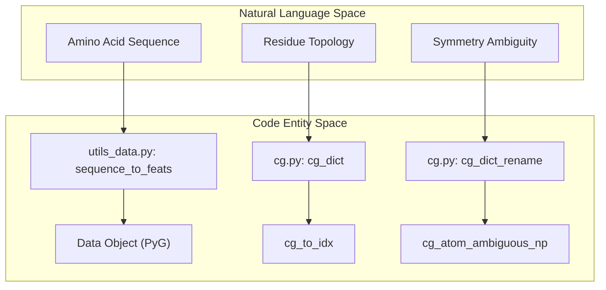
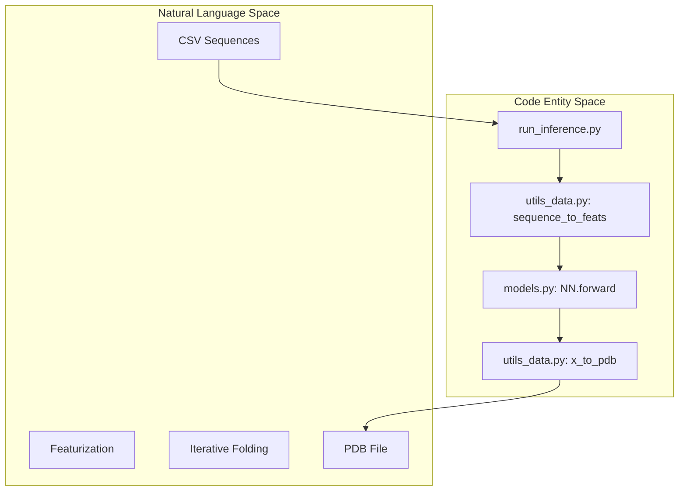

# Glossary

> **Relevant source files**
> * [README.md](https://github.com/Genentech/equifold/blob/2e466856/README.md?plain=1)
> * [cg.py](https://github.com/Genentech/equifold/blob/2e466856/cg.py)
> * [cg_X0.npz](https://github.com/Genentech/equifold/blob/2e466856/cg_X0.npz)
> * [models.py](https://github.com/Genentech/equifold/blob/2e466856/models.py)
> * [models/ab_config.json](https://github.com/Genentech/equifold/blob/2e466856/models/ab_config.json)
> * [models/science_config.json](https://github.com/Genentech/equifold/blob/2e466856/models/science_config.json)
> * [openfold_light/residue_constants.py](https://github.com/Genentech/equifold/blob/2e466856/openfold_light/residue_constants.py)
> * [utils.py](https://github.com/Genentech/equifold/blob/2e466856/utils.py)
> * [utils_data.py](https://github.com/Genentech/equifold/blob/2e466856/utils_data.py)

This glossary defines technical terms, abbreviations, and domain-specific concepts used throughout the EquiFold codebase. It serves as a reference for understanding the implementation of coarse-grained equivariant protein folding.

## 1. Coarse-Graining (CG) Concepts

EquiFold operates on a coarse-grained representation of proteins where residues are decomposed into several "beads" or nodes rather than individual atoms.

| Term | Definition | Code Pointers |
| --- | --- | --- |
| **Bead / CG Node** | A group of atoms represented as a single node in the graph. Most residues have 2-4 beads. | [cg.py L10-L31](https://github.com/Genentech/equifold/blob/2e466856/cg.py#L10-L31) |
| **cg_dict** | A mapping defining which atoms belong to which bead for each of the 20 standard amino acids. | [cg.py L10-L31](https://github.com/Genentech/equifold/blob/2e466856/cg.py#L10-L31) |
| **cg_to_idx** | A global indexing map that assigns a unique integer ID to every specific bead type (e.g., ALA bead 0 vs ALA bead 1). | [cg.py L41-L48](https://github.com/Genentech/equifold/blob/2e466856/cg.py#L41-L48) |
| **N_CG_MAX** | The maximum number of atoms contained within a single coarse-grained bead (currently 9). | [cg.py L34](https://github.com/Genentech/equifold/blob/2e466856/cg.py#L34-L34) |
| **cg_X0.npz** | A template coordinate file containing the idealized local coordinates for every bead type, used to reconstruct atomic positions. | [utils_data.py L17-L21](https://github.com/Genentech/equifold/blob/2e466856/utils_data.py#L17-L21) |

### Natural Language to Code Entity Mapping: Coarse Graining

The following diagram illustrates how residue-level information is transformed into the internal CG representation.

**Sources:** [cg.py L10-L89](https://github.com/Genentech/equifold/blob/2e466856/cg.py#L10-L89)

 [utils_data.py L17-L21](https://github.com/Genentech/equifold/blob/2e466856/utils_data.py#L17-L21)

---

## 2. Geometric & Equivariant Terms

EquiFold utilizes $E(3)$-equivariant neural networks, meaning the model's predictions rotate and translate consistently with the input coordinates.

| Term | Definition | Code Pointers |
| --- | --- | --- |
| **Equivariant Block** | A structural update layer that processes both scalar features and vector features (irreps). | [models.py L348-L406](https://github.com/Genentech/equifold/blob/2e466856/models.py#L348-L406) |
| **FAPE** | Frame Aligned Point Error. A coordinate-independent loss function that measures structural similarity by aligning local frames. | [utils.py L94-L108](https://github.com/Genentech/equifold/blob/2e466856/utils.py#L94-L108) |
| **Local Frame** | A coordinate system $(R, T)$ defined for each bead, where $R$ is a rotation matrix and $T$ is a translation vector. | [utils.py L21-L28](https://github.com/Genentech/equifold/blob/2e466856/utils.py#L21-L28) |
| **SLERP** | Spherical Linear Interpolation. Used to smoothly interpolate between rotation matrices during training warmup. | [utils.py L210-L224](https://github.com/Genentech/equifold/blob/2e466856/utils.py#L210-L224) |
| **Kabsch Alignment** | An algorithm to find the optimal rotation and translation between two sets of points to minimize RMSD. | [utils.py L169-L207](https://github.com/Genentech/equifold/blob/2e466856/utils.py#L169-L207) |

**Sources:** [models.py L348-L406](https://github.com/Genentech/equifold/blob/2e466856/models.py#L348-L406)

 [utils.py L94-L224](https://github.com/Genentech/equifold/blob/2e466856/utils.py#L94-L224)

---

## 3. Neural Network Architecture

The core model is implemented as a `LightningModule` that iteratively refines the protein structure.

| Term | Definition | Code Pointers |
| --- | --- | --- |
| **NN (Class)** | The main EquiFold model architecture inheriting from `pl.LightningModule`. | [models.py L537](https://github.com/Genentech/equifold/blob/2e466856/models.py#L537-L537) |
| **Equiformer** | The geometric attention mechanism used to update node features based on relative distances and orientations. | [models.py L348-L406](https://github.com/Genentech/equifold/blob/2e466856/models.py#L348-L406) |
| **RadialNN** | A sub-network that processes scalar distances $r_{ij}$ into weights for geometric interactions using Bessel bases. | [models.py L93-L135](https://github.com/Genentech/equifold/blob/2e466856/models.py#L93-L135) |
| **Bessel Basis** | A sinusoidal radial basis function used to expand scalar distances into a high-dimensional feature vector. | [models.py L70-L89](https://github.com/Genentech/equifold/blob/2e466856/models.py#L70-L89) |
| **Blackhole Init** | A structural initialization where all beads start at the origin $(0,0,0)$ with identity rotations. | [models.py L25-L27](https://github.com/Genentech/equifold/blob/2e466856/models.py#L25-L27) |

### Natural Language to Code Entity Mapping: Inference Flow

The diagram below bridges the high-level inference process to the specific code functions responsible for each stage.

**Sources:** [run_inference.py L1-L102](https://github.com/Genentech/equifold/blob/2e466856/run_inference.py#L1-L102)

 [models.py L537-L750](https://github.com/Genentech/equifold/blob/2e466856/models.py#L537-L750)

 [utils_data.py L154-L205](https://github.com/Genentech/equifold/blob/2e466856/utils_data.py#L154-L205)

---

## 4. Loss & Violation Terms

During training, EquiFold optimizes for both global shape and local chemical validity.

* **Structural Violation Loss:** A combination of bond length, bond angle, and steric clash penalties. * Defined in: [utils.py L302-L366](https://github.com/Genentech/equifold/blob/2e466856/utils.py#L302-L366) * Parameters loaded from: `openfold_light.residue_constants.load_stereo_chemical_props` [utils_data.py L23](https://github.com/Genentech/equifold/blob/2e466856/utils_data.py#L23-L23)
* **Steric Clash:** Occurs when two non-bonded atoms are closer than the sum of their Van der Waals radii. * Implementation: [utils.py L349-L366](https://github.com/Genentech/equifold/blob/2e466856/utils.py#L349-L366)
* **Ambiguity Handling:** For residues like PHE or ASP that have 180-degree rotational symmetry, the loss is calculated against the best-fitting symmetry equivalent. * Logic: [utils.py L59-L79](https://github.com/Genentech/equifold/blob/2e466856/utils.py#L59-L79)

**Sources:** [utils.py L302-L366](https://github.com/Genentech/equifold/blob/2e466856/utils.py#L302-L366)

 [utils_data.py L23-L31](https://github.com/Genentech/equifold/blob/2e466856/utils_data.py#L23-L31)

---

## 5. Data Structures

| Symbol | Description | File |
| --- | --- | --- |
| `nc` | Number of channels for scalar features. | [models.py L176](https://github.com/Genentech/equifold/blob/2e466856/models.py#L176-L176) |
| `rc` | Radial cutoff distance for graph edges. | [models.py L97](https://github.com/Genentech/equifold/blob/2e466856/models.py#L97-L97) |
| `ListData` | A wrapper for batches of geometric data objects to facilitate device movement. | [utils_data.py L138-L152](https://github.com/Genentech/equifold/blob/2e466856/utils_data.py#L138-L152) |
| `Protein` | A dataclass containing atom positions, residue types, and masks for AlphaFold-style data handling. | [openfold_light/protein.py L35-L43](https://github.com/Genentech/equifold/blob/2e466856/openfold_light/protein.py#L35-L43) |

**Sources:** [models.py L176](https://github.com/Genentech/equifold/blob/2e466856/models.py#L176-L176)

 [utils_data.py L138-L152](https://github.com/Genentech/equifold/blob/2e466856/utils_data.py#L138-L152)

 [openfold_light/protein.py L35-L43](https://github.com/Genentech/equifold/blob/2e466856/openfold_light/protein.py#L35-L43)