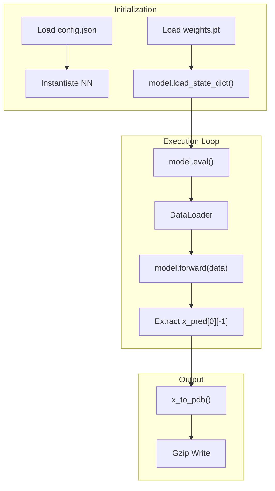

# Inference Pipeline

> **Relevant source files**
> * [run_inference.py](https://github.com/Genentech/equifold/blob/2e466856/run_inference.py)
> * [utils_data.py](https://github.com/Genentech/equifold/blob/2e466856/utils_data.py)

The EquiFold inference pipeline transforms raw amino acid sequences into 3D structural predictions in PDB format. The process involves high-level data orchestration, parallelized sequence featurization, and a forward pass through the equivariant transformer model. The pipeline is designed to handle both single-chain proteins and paired antibody (heavy/light) chains.

### Pipeline Overview

The lifecycle of an inference request follows a linear path from data ingestion to coordinate generation:

1. **Input Parsing**: A CSV file containing sequences and unique identifiers is loaded.
2. **Featurization**: Sequences are converted into coarse-grained (CG) graph features using a multiprocessing pool.
3. **Batching**: Data is wrapped in a `ListData` container via a custom `collate_fn`.
4. **Forward Pass**: The `NN` model iteratively refines the positions and orientations of CG beads.
5. **Reconstruction**: Coarse-grained outputs are expanded to full-atom coordinates and written to compressed PDB files.

### System Flow Diagram

The following diagram illustrates the transition from sequence space to the structural outputs, highlighting the key code entities involved in the transformation.

"Inference Data Flow"

**Sources:** [run_inference.py L17-L45](https://github.com/Genentech/equifold/blob/2e466856/run_inference.py#L17-L45)

 [run_inference.py L68-L102](https://github.com/Genentech/equifold/blob/2e466856/run_inference.py#L68-L102)

 [utils_data.py L133-L152](https://github.com/Genentech/equifold/blob/2e466856/utils_data.py#L133-L152)

---

### Data Preparation and Multiprocessing

To optimize throughput, EquiFold utilizes a `multiprocessing.Pool` to featurize sequences in parallel. The `process_one` function acts as the worker, converting raw strings into `torch_geometric.data.Data` objects.

* **Sequence Featurization**: The `sequence_to_feats` utility maps amino acids to their coarse-grained beads based on the `cg_dict` topology [utils_data.py L19](https://github.com/Genentech/equifold/blob/2e466856/utils_data.py#L19-L19)
* **Antibody Handling**: For the "ab" model, heavy and light chains are concatenated with a `MAX_DIST` offset (default 32) to maintain residue index separation in the graph [run_inference.py L22-L24](https://github.com/Genentech/equifold/blob/2e466856/run_inference.py#L22-L24)
* **Coordinate Templates**: Initial coarse-grained coordinates are pulled from `cg_X0`, a precomputed template file (`cg_X0.npz`) [run_inference.py L36](https://github.com/Genentech/equifold/blob/2e466856/run_inference.py#L36-L36)  [utils_data.py L17-L21](https://github.com/Genentech/equifold/blob/2e466856/utils_data.py#L17-L21)

For details on the featurization logic, see [Data Processing Utilities (utils_data.py)](/Genentech/equifold/3.2-data-processing-utilities-(utils_data.py)).

### Inference Execution

The core inference loop is managed within the `run_inference.py` script. It handles model instantiation from a configuration JSON and weight loading.

"Inference Entrypoint Logic"

**Sources:** [run_inference.py L58-L65](https://github.com/Genentech/equifold/blob/2e466856/run_inference.py#L58-L65)

 [run_inference.py L89-L102](https://github.com/Genentech/equifold/blob/2e466856/run_inference.py#L89-L102)

The model is set to `eval()` mode and `torch.no_grad()` is invoked to disable gradient tracking, reducing memory overhead [run_inference.py L65](https://github.com/Genentech/equifold/blob/2e466856/run_inference.py#L65-L65)

 [run_inference.py L89](https://github.com/Genentech/equifold/blob/2e466856/run_inference.py#L89-L89)

 The final prediction `x_pred` is extracted from the last iteration of the refinement loop [run_inference.py L95](https://github.com/Genentech/equifold/blob/2e466856/run_inference.py#L95-L95)

For a line-by-line walkthrough, see [run_inference.py Entrypoint](/Genentech/equifold/3.1-run_inference.py-entrypoint).

---

### Geometric and Structural Utilities

The pipeline relies on a suite of geometric utilities to handle 3D transformations and structural integrity:

* **Rotations and Translations**: Transformations are managed via quaternions and Euclidean apply functions [utils.py](https://github.com/Genentech/equifold/blob/2e466856/utils.py)
* **Structural Violations**: During training and evaluation, the pipeline monitors bond lengths, angles, and steric clashes using precomputed arrays derived from `stereo_chemical_props.txt` [utils_data.py L22-L101](https://github.com/Genentech/equifold/blob/2e466856/utils_data.py#L22-L101)
* **PDB Generation**: The `x_to_pdb` function performs the final mapping from predicted coordinates to a standard PDB columnar format [utils_data.py L154-L190](https://github.com/Genentech/equifold/blob/2e466856/utils_data.py#L154-L190)

For details on geometric operations, see [Geometric Utility Functions (utils.py)](/Genentech/equifold/3.3-geometric-utility-functions-(utils.py)).

---

### Child Pages

* **[run_inference.py Entrypoint](/Genentech/equifold/3.1-run_inference.py-entrypoint)**: Detailed breakdown of the CLI tool, argument handling, and the top-level execution loop.
* **[Data Processing Utilities (utils_data.py)](/Genentech/equifold/3.2-data-processing-utilities-(utils_data.py))**: Technical documentation of featurization, `ListData` batching, and residue-level structural constants.
* **[Geometric Utility Functions (utils.py)](/Genentech/equifold/3.3-geometric-utility-functions-(utils.py))**: Mathematical definitions for SE(3) transformations, FAPE loss, and Kabsch alignment used throughout the pipeline.