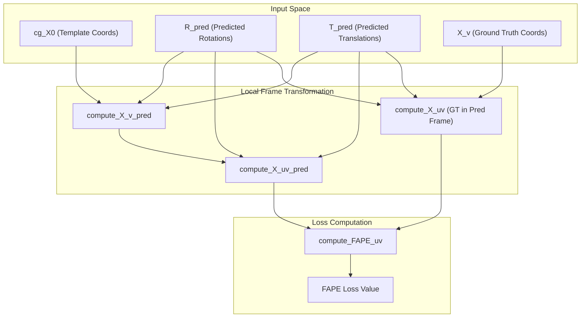

# Loss Functions & Training

> **Relevant source files**
> * [models.py](https://github.com/Genentech/equifold/blob/2e466856/models.py)
> * [utils.py](https://github.com/Genentech/equifold/blob/2e466856/utils.py)

This page details the optimization objectives and training strategies used in EquiFold. The model is trained using a combination of structural accuracy losses (FAPE) and physical constraint losses (violations) across iterative refinement steps, employing a manual optimization loop with specific scheduling for rotation interpolation and learning rate annealing.

## Structural Loss: FAPE

The primary objective is the **Frame Aligned Point Error (FAPE)**, which measures the structural difference between predicted and ground-truth coordinates by aligning them in local reference frames. Unlike global RMSD, FAPE is robust to domain movements and does not require a global alignment step.

### Implementation Details

EquiFold computes FAPE at the coarse-grained level using the `compute_FAPE_uv` function [utils.py L94-L109](https://github.com/Genentech/equifold/blob/2e466856/utils.py#L94-L109)

 The process involves:

1. **Local Frame Alignment**: Predicted coordinates are transformed into the local coordinate system of each coarse-grained bead using the predicted rotations ($R_{pred}$) and translations ($T_{pred}$).
2. **Symmetry Handling**: For residues with symmetric side chains (e.g., PHE, ASP), the loss considers both possible orientations. The `compute_X_uv` function [utils.py L59-L80](https://github.com/Genentech/equifold/blob/2e466856/utils.py#L59-L80)  selects the orientation that minimizes the distance to the prediction.
3. **Clamping and Scaling**: Distances are clamped at `d_max` (typically 10.0 Å) and scaled by a constant $Z=10.0$ [utils.py L94-L105](https://github.com/Genentech/equifold/blob/2e466856/utils.py#L94-L105)

### Data Flow for FAPE

The following diagram illustrates how coordinates and frames are processed to calculate the FAPE loss.

**FAPE Calculation Data Flow**

**Sources:** [utils.py L59-L109](https://github.com/Genentech/equifold/blob/2e466856/utils.py#L59-L109)

 [models.py L82-L92](https://github.com/Genentech/equifold/blob/2e466856/models.py#L82-L92)

---

## Structural Violation Losses

To ensure the physical plausibility of the predicted structures, EquiFold incorporates three violation losses implemented in `compute_struct_loss` [utils.py L233-L274](https://github.com/Genentech/equifold/blob/2e466856/utils.py#L233-L274)

| Loss Type | Code Identifier | Description |
| --- | --- | --- |
| **Bond Length** | `loss_bond` | Penalizes deviations from standard covalent bond lengths between adjacent beads [utils.py L249-L254](https://github.com/Genentech/equifold/blob/2e466856/utils.py#L249-L254) |
| **Bond Angle** | `loss_angle` | Penalizes deviations from standard bond angles [utils.py L255-L260](https://github.com/Genentech/equifold/blob/2e466856/utils.py#L255-L260) |
| **Steric Clash** | `loss_clash` | Penalizes atoms that are closer than the sum of their Van der Waals radii, adjusted by a tolerance [utils.py L261-L267](https://github.com/Genentech/equifold/blob/2e466856/utils.py#L261-L267) |

These losses utilize precomputed constants for bond lengths, angles, and clash tolerances stored in `data_violation` [utils.py L233](https://github.com/Genentech/equifold/blob/2e466856/utils.py#L233-L233)

 which are derived from `stereo_chemical_props.txt`.

**Sources:** [utils.py L233-L274](https://github.com/Genentech/equifold/blob/2e466856/utils.py#L233-L274)

 [utils_data.py L245-L280](https://github.com/Genentech/equifold/blob/2e466856/utils_data.py#L245-L280)

---

## Training Schedule & Optimization

EquiFold uses a manual optimization strategy within `pytorch_lightning` to manage complex scheduling of rotation updates and learning rates.

### SLERP Warmup

During the initial refinement iterations of a training step, the model uses **Spherical Linear Interpolation (SLERP)** to smoothly transition rotations. The `quaternion_slerp` function [utils.py L224-L231](https://github.com/Genentech/equifold/blob/2e466856/utils.py#L224-L231)

 interpolates between the previous iteration's rotation and the new prediction. The interpolation factor `t` is determined by the `slerp_step` hyperparameter [models.py L936](https://github.com/Genentech/equifold/blob/2e466856/models.py#L936-L936)

### Iterative Refinement Weights

The total loss is a weighted sum of FAPE and violation losses across all refinement iterations. The weight for iteration $m$ is scaled as:
$$ \text{weight}_m = \frac{1}{\text{num_refinement}} $$
This ensures that the final iterations, which represent the model's best guess, contribute significantly to the gradient [models.py L936](https://github.com/Genentech/equifold/blob/2e466856/models.py#L936-L936)

### Learning Rate & Annealing

The model employs a `CosineAnnealingLR` scheduler [models.py L936](https://github.com/Genentech/equifold/blob/2e466856/models.py#L936-L936)

* **Warmup**: Linear warmup for the first 1000 steps [models.py L936](https://github.com/Genentech/equifold/blob/2e466856/models.py#L936-L936)
* **Annealing**: The learning rate follows a cosine curve over a total number of steps defined in the config (e.g., 100k for `ab`, 200k for `science`).

### Manual Optimization Loop

The `training_step` in `NN` (LightningModule) performs the following [models.py L936](https://github.com/Genentech/equifold/blob/2e466856/models.py#L936-L936)

:

1. **Forward Pass**: Iterates through `num_refinement` steps.
2. **Loss Aggregation**: Sums FAPE and structural losses.
3. **Manual Backward**: `self.manual_backward(loss)`.
4. **Gradient Clipping**: `nn.utils.clip_grad_norm_` is applied to stabilize training [models.py L936](https://github.com/Genentech/equifold/blob/2e466856/models.py#L936-L936)
5. **Optimizer Step**: `opt.step()` and `sch.step()`.

**Code Entity to Training Logic Mapping**

**Sources:** [models.py L936](https://github.com/Genentech/equifold/blob/2e466856/models.py#L936-L936)

 [models.py L936](https://github.com/Genentech/equifold/blob/2e466856/models.py#L936-L936)

 [utils.py L224-L231](https://github.com/Genentech/equifold/blob/2e466856/utils.py#L224-L231)

---

## Configuration Hyperparameters

Loss behavior is controlled via the model configuration JSON:

* **`fape_clip_val`**: The maximum distance for FAPE clamping (e.g., 10.0 or 30.0) [models.py L936](https://github.com/Genentech/equifold/blob/2e466856/models.py#L936-L936)
* **`loss_weight_fape`**: Multiplier for the FAPE component [models.py L936](https://github.com/Genentech/equifold/blob/2e466856/models.py#L936-L936)
* **`loss_weight_struct`**: Multiplier for the violation components [models.py L936](https://github.com/Genentech/equifold/blob/2e466856/models.py#L936-L936)
* **`num_refinement`**: Number of iterative updates per training sample [models.py L936](https://github.com/Genentech/equifold/blob/2e466856/models.py#L936-L936)

**Sources:** [models.py L936](https://github.com/Genentech/equifold/blob/2e466856/models.py#L936-L936)