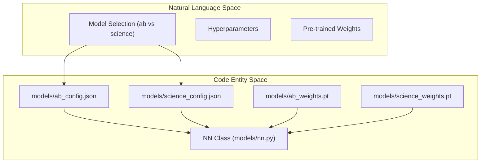
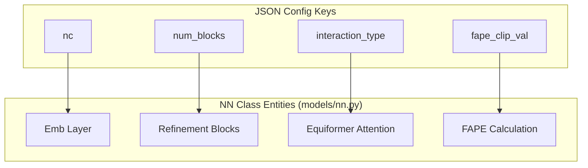

# Pre-trained Models & Configuration

> **Relevant source files**
> * [models/ab_config.json](https://github.com/Genentech/equifold/blob/2e466856/models/ab_config.json)
> * [models/ab_weights.pt](https://github.com/Genentech/equifold/blob/2e466856/models/ab_weights.pt)
> * [models/science_config.json](https://github.com/Genentech/equifold/blob/2e466856/models/science_config.json)
> * [models/science_weights.pt](https://github.com/Genentech/equifold/blob/2e466856/models/science_weights.pt)

EquiFold is distributed with two pre-trained model variants optimized for different structural prediction tasks: the **Antibody (ab)** model and the **Science (science)** model. These models share the same underlying `NN` class architecture but differ significantly in their hyperparameters, training schedules, and intended input types.

The configuration of these models is driven by JSON files that define the neural network dimensions, refinement blocks, and loss weighting. During inference, these configs are paired with corresponding `.pt` weight files to instantiate the predictive pipeline.

### Model Instantiation Overview

The relationship between the configuration files, weight files, and the core model class is shown below:

**Configuration to Code Mapping**

**Sources:**

* [models/ab_config.json L1](https://github.com/Genentech/equifold/blob/2e466856/models/ab_config.json#L1-L1)
* [models/science_config.json L1](https://github.com/Genentech/equifold/blob/2e466856/models/science_config.json#L1-L1)

---

### Shipped Model Variants

EquiFold provides two distinct sets of weights and configurations located in the `models/` directory.

| Model Variant | Config File | Weight File | Primary Use Case |
| --- | --- | --- | --- |
| **Antibody (ab)** | `ab_config.json` | `ab_weights.pt` | Paired Heavy and Light chain antibody Fv regions. |
| **Science (science)** | `science_config.json` | `science_weights.pt` | Single-chain proteins and mini-proteins. |

#### Antibody Model (ab)

The Antibody model is specifically tuned for the unique structural features of antibodies, such as the conserved framework and highly variable CDR loops. It utilizes a deeper architecture with 6 refinement blocks and is trained to handle paired chain inputs.

For details on hyperparameters and chain handling, see [Antibody Model (ab)](/Genentech/equifold/4.1-antibody-model-(ab)).

**Sources:**

* [models/ab_config.json L1](https://github.com/Genentech/equifold/blob/2e466856/models/ab_config.json#L1-L1)
* [models/ab_weights.pt L1-L10](https://github.com/Genentech/equifold/blob/2e466856/models/ab_weights.pt#L1-L10)

#### Science / Mini-Protein Model (science)

The Science model is designed for general protein folding tasks, particularly single-chain structures. It features a shallower architecture (4 blocks) and a different FAPE clipping threshold compared to the antibody variant.

For details on hyperparameters and single-chain processing, see [Science / Mini-Protein Model](/Genentech/equifold/4.2-science-mini-protein-model).

**Sources:**

* [models/science_config.json L1](https://github.com/Genentech/equifold/blob/2e466856/models/science_config.json#L1-L1)
* [models/science_weights.pt L1-L10](https://github.com/Genentech/equifold/blob/2e466856/models/science_weights.pt#L1-L10)

---

### Configuration Schema

Both `ab_config.json` and `science_config.json` control the behavior of the `NN` LightningModule. Key parameters include:

* **Architecture Depth**: `num_blocks` defines the iterative refinement steps, while `num_layers` defines layers within each block.
* **Dimensions**: `nc` (node channels) and `rc` (radial channels) control the width of the E3NN representations.
* **Optimization**: Parameters like `lr_anneal_final_step` and `slerp_warmup` define the training trajectory.
* **Loss Scaling**: `fape_clip_val` and `weight_struct_loss` balance the geometric error against physical violation penalties.

**Config-NN Parameter Mapping**

**Sources:**

* [models/ab_config.json L1](https://github.com/Genentech/equifold/blob/2e466856/models/ab_config.json#L1-L1)
* [models/science_config.json L1](https://github.com/Genentech/equifold/blob/2e466856/models/science_config.json#L1-L1)