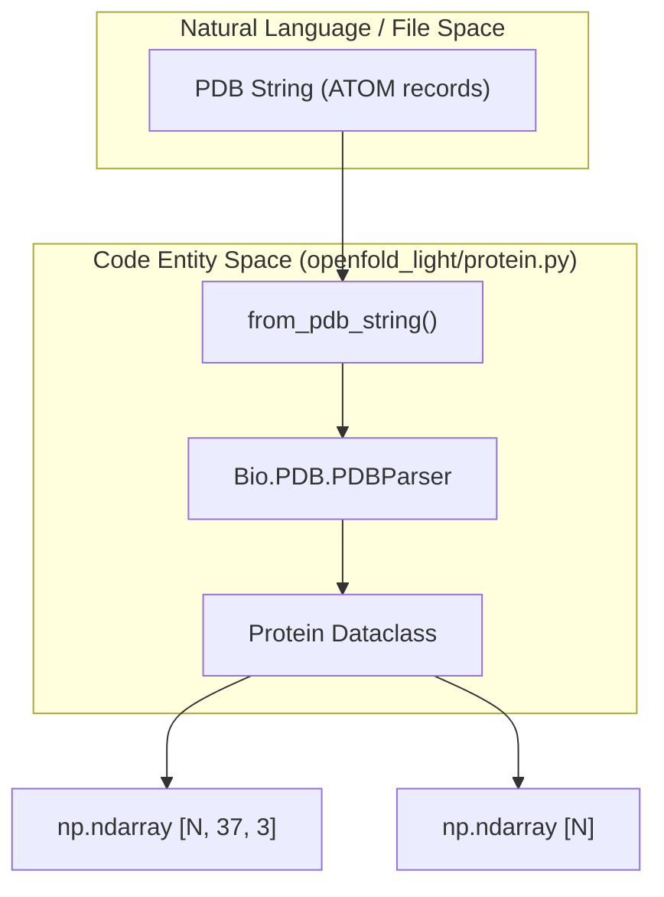
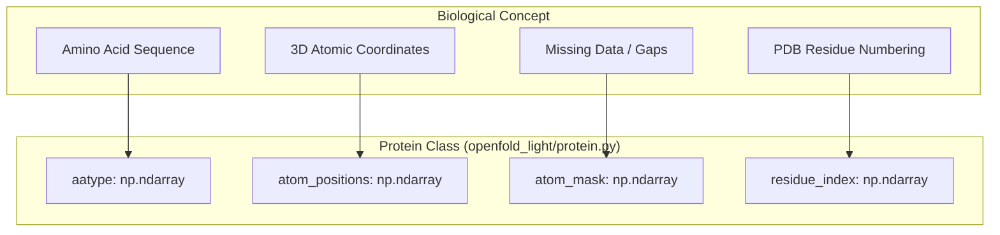

# Protein Data Structures & PDB Parsing

> **Relevant source files**
> * [openfold_light/errors.py](https://github.com/Genentech/equifold/blob/2e466856/openfold_light/errors.py)
> * [openfold_light/protein.py](https://github.com/Genentech/equifold/blob/2e466856/openfold_light/protein.py)

This page documents the core data structures used to represent protein geometry and the utility functions for parsing and serializing these structures. The system relies on a lightweight version of the OpenFold data model, primarily centered around the `Protein` dataclass and its associated conversion methods.

## The Protein Dataclass

The `Protein` class is a frozen dataclass that serves as the primary container for structural information within the `openfold_light` library. It stores atomic coordinates, residue types, and metadata in a format compatible with NumPy operations.

### Implementation Details

The class is defined in [openfold_light/protein.py L32-L54](https://github.com/Genentech/equifold/blob/2e466856/openfold_light/protein.py#L32-L54)

 It uses the following schema:

| Attribute | Type | Description |
| --- | --- | --- |
| `atom_positions` | `np.ndarray` | `[num_res, 37, 3]` array of Cartesian coordinates in Angstroms. Atom order follows `residue_constants.atom_types`. |
| `aatype` | `np.ndarray` | `[num_res]` array of amino acid types (0-20), where 20 is 'X' (unknown). |
| `atom_mask` | `np.ndarray` | `[num_res, 37]` binary float mask (1.0 for present, 0.0 for missing). |
| `residue_index` | `np.ndarray` | `[num_res]` array of PDB residue indices (not necessarily continuous). |
| `b_factors` | `np.ndarray` | `[num_res, 37]` array of temperature factors in square Angstroms. |

**Sources:** [openfold_light/protein.py L31-L54](https://github.com/Genentech/equifold/blob/2e466856/openfold_light/protein.py#L31-L54)

## PDB Parsing & Generation

EquiFold provides utilities to bridge the gap between standard PDB file strings and the internal `Protein` representation.

### from_pdb_string

This function converts a PDB format string into a `Protein` object [openfold_light/protein.py L56-L135](https://github.com/Genentech/equifold/blob/2e466856/openfold_light/protein.py#L56-L135)

 It uses `Bio.PDB.PDBParser` to process the input [openfold_light/protein.py L72-L73](https://github.com/Genentech/equifold/blob/2e466856/openfold_light/protein.py#L72-L73)

* **Single Chain Constraint:** By default, it expects a single chain. If `chain_id` is not provided and multiple chains are found, it raises a `ValueError` [openfold_light/protein.py L84-L89](https://github.com/Genentech/equifold/blob/2e466856/openfold_light/protein.py#L84-L89)
* **Residue Mapping:** Residues are mapped from 3-letter codes to 1-letter codes using `residue_constants.restype_3to1` [openfold_light/protein.py L105](https://github.com/Genentech/equifold/blob/2e466856/openfold_light/protein.py#L105-L105)
* **Atom Filtering:** Only atoms defined in `residue_constants.atom_types` are retained; others are ignored [openfold_light/protein.py L113-L114](https://github.com/Genentech/equifold/blob/2e466856/openfold_light/protein.py#L113-L114)

### to_pdb

The `to_pdb` function performs the inverse operation, serializing a `Protein` instance back into a standard PDB string [openfold_light/protein.py L191](https://github.com/Genentech/equifold/blob/2e466856/openfold_light/protein.py#L191-L191)

 This is used during inference to generate the final `.pdb.gz` outputs.

### PDB Parsing Data Flow

The following diagram illustrates how a raw PDB string is transformed into the internal code entities.

**PDB to Protein Object Transformation**

**Sources:** [openfold_light/protein.py L56-L135](https://github.com/Genentech/equifold/blob/2e466856/openfold_light/protein.py#L56-L135)

 [openfold_light/protein.py L32-L54](https://github.com/Genentech/equifold/blob/2e466856/openfold_light/protein.py#L32-L54)

## ProteinNet Parsing

For compatibility with ProteinNet datasets, the library includes `from_proteinnet_string` [openfold_light/protein.py L138-L189](https://github.com/Genentech/equifold/blob/2e466856/openfold_light/protein.py#L138-L189)

* **Coordinate Scaling:** ProteinNet uses picometers; the parser converts these to Angstroms using `PICO_TO_ANGSTROM` (0.01) [openfold_light/protein.py L29](https://github.com/Genentech/equifold/blob/2e466856/openfold_light/protein.py#L29-L29)  [openfold_light/protein.py L172](https://github.com/Genentech/equifold/blob/2e466856/openfold_light/protein.py#L172-L172)
* **Tag Parsing:** It uses regex to split the input string into tags like `[PRIMARY]`, `[TERTIARY]`, and `[MASK]` [openfold_light/protein.py L139-L143](https://github.com/Genentech/equifold/blob/2e466856/openfold_light/protein.py#L139-L143)
* **Backbone Focus:** Typically populates N, CA, and C positions [openfold_light/protein.py L145](https://github.com/Genentech/equifold/blob/2e466856/openfold_light/protein.py#L145-L145)

**Sources:** [openfold_light/protein.py L138-L189](https://github.com/Genentech/equifold/blob/2e466856/openfold_light/protein.py#L138-L189)

## Error Handling

The `openfold_light.errors` module defines custom exceptions for the data pipeline.

* **MultipleChainsError:** A specialized exception raised when a single-chain operation encounters a structure with multiple chains [openfold_light/errors.py L21-L22](https://github.com/Genentech/equifold/blob/2e466856/openfold_light/errors.py#L21-L22)

**Sources:** [openfold_light/errors.py L17-L22](https://github.com/Genentech/equifold/blob/2e466856/openfold_light/errors.py#L17-L22)

## Summary of Data Structures

The following diagram maps the high-level concepts of protein structure to the specific implementation details in the `Protein` class.

**Conceptual to Code Mapping**

**Sources:** [openfold_light/protein.py L32-L54](https://github.com/Genentech/equifold/blob/2e466856/openfold_light/protein.py#L32-L54)