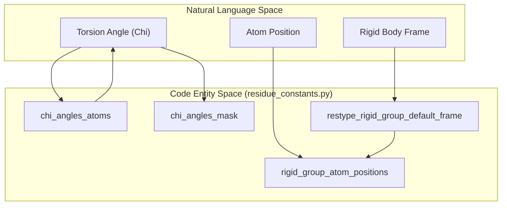
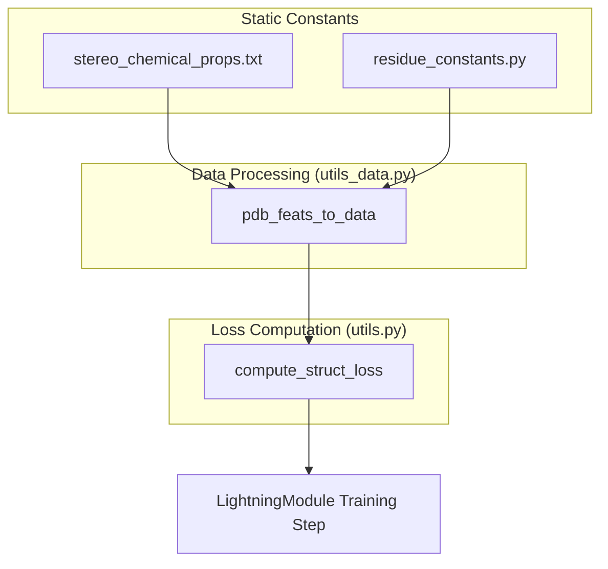

# Residue Constants & Stereo-Chemical Properties

> **Relevant source files**
> * [openfold_light/residue_constants.py](https://github.com/Genentech/equifold/blob/2e466856/openfold_light/residue_constants.py)
> * [openfold_light/stereo_chemical_props.txt](https://github.com/Genentech/equifold/blob/2e466856/openfold_light/stereo_chemical_props.txt)

This page documents the fundamental chemical and geometric constants used throughout EquiFold to define protein structure. These constants reside primarily in `openfold_light/residue_constants.py` and `openfold_light/stereo_chemical_props.txt`. They provide the ground-truth mappings for atom types, residue-specific geometries, rigid group definitions for side chains, and the physical constraints used to calculate structural violation losses during training and inference.

## 1. Residue Mappings and Atom Types

EquiFold utilizes standardized mappings to convert between amino acid names, single-letter codes, and integer indices. The primary atom representation uses a "dense" 37-atom format (`atom37`) to represent all possible heavy atoms across the 20 standard amino acids.

### Key Mappings

* **Restype Definitions**: Mappings between 3-letter codes, 1-letter codes, and indices are defined in `restype_1to3`, `restype_3to1`, and `restype_order` [openfold_light/residue_constants.py L440-L475](https://github.com/Genentech/equifold/blob/2e466856/openfold_light/residue_constants.py#L440-L475)
* **Atom37**: A standardized ordering of 37 heavy atoms. The mapping from residue type to the subset of these 37 atoms it contains is defined in `residue_atoms` [openfold_light/residue_constants.py L537-L561](https://github.com/Genentech/equifold/blob/2e466856/openfold_light/residue_constants.py#L537-L561)
* **Atom Types**: The list of all 37 unique atom names (e.g., "N", "CA", "CB", "OG1") is stored in `atom_types` [openfold_light/residue_constants.py L494-L534](https://github.com/Genentech/equifold/blob/2e466856/openfold_light/residue_constants.py#L494-L534)

### Sources:

* [openfold_light/residue_constants.py L440-L561](https://github.com/Genentech/equifold/blob/2e466856/openfold_light/residue_constants.py#L440-L561)

---

## 2. Rigid Group Geometry

EquiFold represents side chains using a hierarchical rigid body model. Each residue is composed of up to 8 rigid groups:

1. **Group 0**: Backbone (N, CA, C, CB).
2. **Group 3**: Carbonyl oxygen (Psi rotation).
3. **Groups 4-7**: Side chain torsion angles ($\chi_1, \chi_2, \chi_3, \chi_4$).

### Rigid Group Definitions

The positions of atoms within these groups are defined relative to a local coordinate system where the rotation axis lies along the x-axis.

| Constant | Description |
| --- | --- |
| `rigid_group_atom_positions` | XYZ coordinates of atoms relative to their parent rigid group frame [openfold_light/residue_constants.py L144-L428](https://github.com/Genentech/equifold/blob/2e466856/openfold_light/residue_constants.py#L144-L428) |
| `chi_angles_atoms` | The four atoms defining each $\chi$ dihedral angle per residue type [openfold_light/residue_constants.py L35-L79](https://github.com/Genentech/equifold/blob/2e466856/openfold_light/residue_constants.py#L35-L79) |
| `chi_angles_mask` | A binary mask indicating which $\chi$ angles are valid for a given residue [openfold_light/residue_constants.py L83-L104](https://github.com/Genentech/equifold/blob/2e466856/openfold_light/residue_constants.py#L83-L104) |
| `chi_pi_periodic` | Identifies $\chi$ angles with $180^\circ$ symmetry (e.g., PHE $\chi_2$) [openfold_light/residue_constants.py L108-L130](https://github.com/Genentech/equifold/blob/2e466856/openfold_light/residue_constants.py#L108-L130) |

### Coordinate System Mapping

The following diagram illustrates how the natural language concept of "Side Chain Torsions" is mapped to specific code entities within `residue_constants.py`.

**Side Chain Torsion Mapping**

### Sources:

* [openfold_light/residue_constants.py L35-L130](https://github.com/Genentech/equifold/blob/2e466856/openfold_light/residue_constants.py#L35-L130)
* [openfold_light/residue_constants.py L144-L428](https://github.com/Genentech/equifold/blob/2e466856/openfold_light/residue_constants.py#L144-L428)

---

## 3. Stereo-Chemical Properties

Physical constraints for proteins are stored in `openfold_light/stereo_chemical_props.txt`. This file contains experimentally derived means and standard deviations for bond lengths and angles.

### Data Categories

1. **Bonds**: Mean lengths and standard deviations for every standard covalent bond in the 20 amino acids (e.g., `CA-CB` for ALA is $1.520 \pm 0.021 \text{\AA}$) [openfold_light/stereo_chemical_props.txt L2-L154](https://github.com/Genentech/equifold/blob/2e466856/openfold_light/stereo_chemical_props.txt#L2-L154)
2. **Angles**: Mean values and standard deviations for bond angles (e.g., `N-CA-C` is $111.0^\circ \pm 2.7^\circ$) [openfold_light/stereo_chemical_props.txt L158-L300](https://github.com/Genentech/equifold/blob/2e466856/openfold_light/stereo_chemical_props.txt#L158-L300)

These values are parsed and used by `utils.compute_struct_loss` to penalize structures that deviate significantly from ideal geometry.

### Inter-Residue Geometry

Specific constants define the geometry of the peptide bond between residues:

* **CA-CA Distance**: Fixed at $3.802 \text{\AA}$ for trans-configurations [openfold_light/residue_constants.py L30](https://github.com/Genentech/equifold/blob/2e466856/openfold_light/residue_constants.py#L30-L30)
* **Van der Waals Radii**: Used for steric clash detection, mapped via `atom_type_radius` [openfold_light/residue_constants.py L650-L689](https://github.com/Genentech/equifold/blob/2e466856/openfold_light/residue_constants.py#L650-L689)

### Sources:

* [openfold_light/stereo_chemical_props.txt L1-L300](https://github.com/Genentech/equifold/blob/2e466856/openfold_light/stereo_chemical_props.txt#L1-L300)
* [openfold_light/residue_constants.py L30](https://github.com/Genentech/equifold/blob/2e466856/openfold_light/residue_constants.py#L30-L30)
* [openfold_light/residue_constants.py L650-L689](https://github.com/Genentech/equifold/blob/2e466856/openfold_light/residue_constants.py#L650-L689)

---

## 4. Implementation Data Flow

The constants defined here serve as the "source of truth" for the structural components of the model. The diagram below shows how these constants flow from static definitions into the structural violation loss calculations.

**Stereo-Chemical Data Flow for Loss Calculation**

### Key Functions

* **`make_atom14_to_atom37_map`**: Generates a mapping to convert between the sparse 14-atom representation (used in some model steps) and the full 37-atom representation [openfold_light/residue_constants.py L612-L636](https://github.com/Genentech/equifold/blob/2e466856/openfold_light/residue_constants.py#L612-L636)
* **`restype_atom14_mask`**: A mask indicating which of the 14 potential atom slots are used by each residue type [openfold_light/residue_constants.py L588-L609](https://github.com/Genentech/equifold/blob/2e466856/openfold_light/residue_constants.py#L588-L609)

### Sources:

* [openfold_light/residue_constants.py L588-L636](https://github.com/Genentech/equifold/blob/2e466856/openfold_light/residue_constants.py#L588-L636)
* [openfold_light/stereo_chemical_props.txt L1-L157](https://github.com/Genentech/equifold/blob/2e466856/openfold_light/stereo_chemical_props.txt#L1-L157)