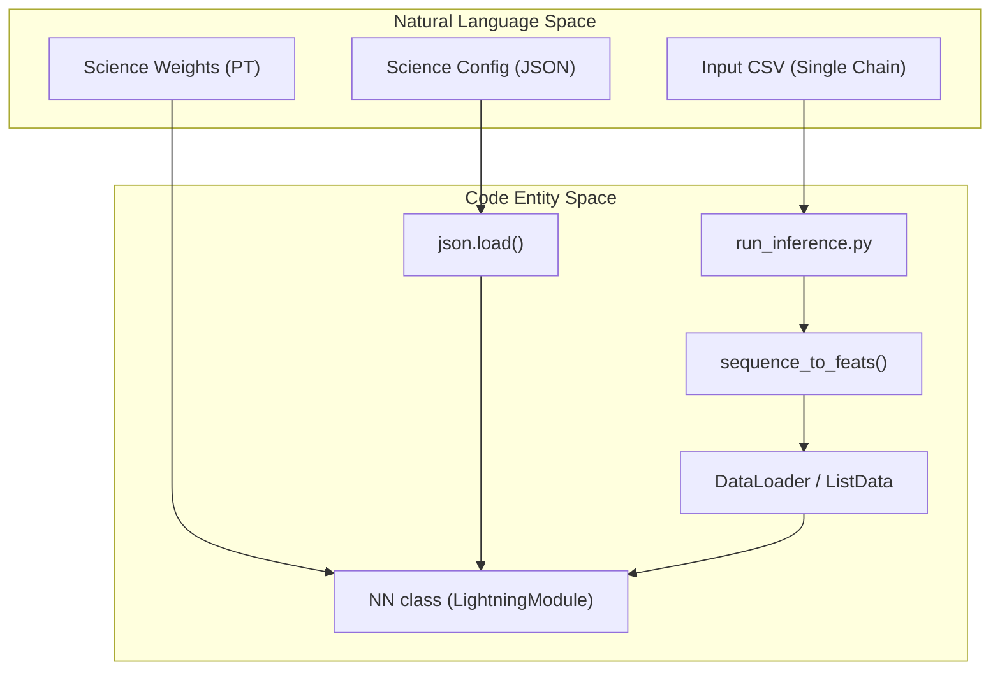
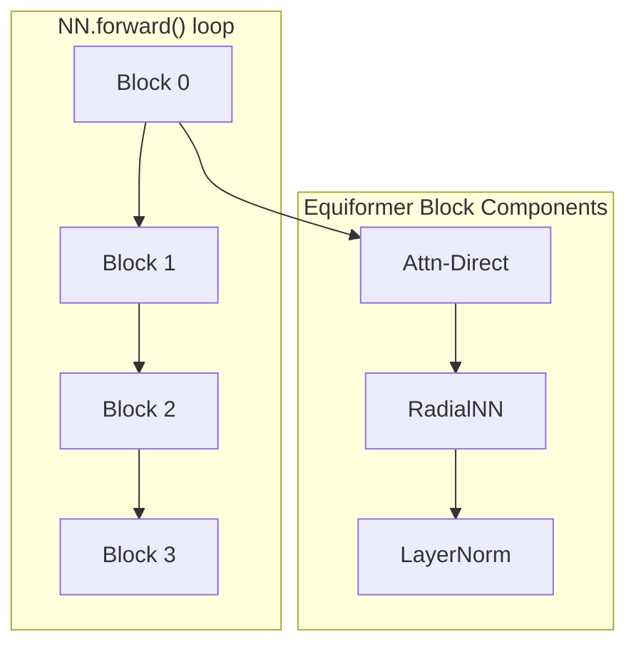

# Science / Mini-Protein Model

> **Relevant source files**
> * [models/science_config.json](https://github.com/Genentech/equifold/blob/2e466856/models/science_config.json)
> * [models/science_weights.pt](https://github.com/Genentech/equifold/blob/2e466856/models/science_weights.pt)

The **Science / Mini-Protein Model** is a specialized variant of the EquiFold architecture optimized for folding single-chain proteins and mini-proteins. Unlike the antibody-specific model, this configuration handles generic amino acid sequences and utilizes a distinct set of hyperparameters and training schedules to achieve structural accuracy on diverse topologies.

## Configuration & Hyperparameters

The model is defined by `models/science_config.json`, which specifies the architectural depth, attention mechanism, and optimization constraints. Key differences from the antibody model include a tighter FAPE clipping value and a longer learning rate annealing schedule.

### Model Architecture Parameters

| Parameter | Value | Description |
| --- | --- | --- |
| `num_blocks` | 4 | Number of iterative refinement blocks `models/science_config.json:1` |
| `num_layers` | 2 | Number of Equiformer layers per block `models/science_config.json:1` |
| `nc` | 64 | Scalar feature dimension (channels) `models/science_config.json:1` |
| `rc` | 32.0 | Radial cutoff for graph edge construction `models/science_config.json:1` |
| `interaction_type` | `attn-direct` | Uses geometric attention for message passing `models/science_config.json:1` |
| `attn_num_heads` | 2 | Number of attention heads in the Equiformer layer `models/science_config.json:1` |

### Optimization & Loss

| Parameter | Value | Description |
| --- | --- | --- |
| `fape_clip_val` | 10.0 | Maximum value for FAPE loss per residue pair `models/science_config.json:1` |
| `lr_anneal_final_step` | 200,000 | Total steps for the cosine annealing schedule `models/science_config.json:1` |
| `weight_struct_loss` | 0.5 | Weight for structural violation losses (bonds/clashes) `models/science_config.json:1` |
| `slerp_warmup` | `true` | Enables Spherical Linear Interpolation for rotations `models/science_config.json:1` |

**Sources:**

* `models/science_config.json`

---

## Data Flow: Single-Chain Inference

The science model processes input as a single continuous chain. The inference pipeline maps the input CSV to a graph representation where nodes are amino acid beads and edges are defined by the radial cutoff `rc`.

### System to Code Mapping: Inference Setup

The following diagram illustrates how the `run_inference.py` script initializes the science model and prepares data.

**Sources:**

* `run_inference.py:27-75` (CLI and model loading)
* `utils_data.py:165-207` (sequence_to_feats implementation)

---

## Model Weights (science_weights.pt)

The weights file `models/science_weights.pt` contains the state dictionary for the `NN` class. Because `distinct_blocks` and `distinct_embeddings` are set to `true` in the config, each of the 4 blocks maintains its own unique set of parameters.

### Weight Structure Overview

The weights are organized into three primary categories corresponding to the `NN` class components:

1. **Embeddings (`embs`)**: 4 distinct embedding modules (one per block) that map amino acid types to scalar (`embed_s`) and vector (`embed_v`) features `models/science_weights.pt:3-10`.
2. **Equivariant Networks (`enns`)**: 4 refinement blocks, each containing: * `embed_edge`: Encodes relative positional information into edges `models/science_weights.pt:11`. * `layers`: 2 Equiformer layers containing `radialnn` (MLP-based radial basis functions) and `pre_attn_dtp_linear` (Degree-Typed Projection) `models/science_weights.pt:12-25`. * `layer_norm`: Equivariant LayerNorm for stability `models/science_weights.pt:14-17`.
3. **Heads**: Final projections for coordinate updates.

**Sources:**

* `models/science_weights.pt:1-30`
* `models/science_config.json:1`

---

## Implementation Details

### Iterative Refinement

The science model performs 4 iterations (blocks). In each iteration, the model predicts a set of translations ($t$) and rotations ($R$) to update the coarse-grained bead positions.

### Single-Chain Featurization

In `utils_data.py`, the `sequence_to_feats` function treats the input as a single entity. For the science model, the `chain_id` is typically ignored or set to a default value, ensuring that all residues are part of one contiguous global index `cg_to_idx` `utils_data.py:170-190`.

### FAPE Clipping

A critical scientific hyperparameter for this model is `fape_clip_val=10.0`. During training, the Frame Aligned Point Error (FAPE) is capped at 10 Ångströms. This prevents outliers in the predicted structure from generating massive gradients that could destabilize the learning of smaller, stable mini-protein folds `models/science_config.json:1`.

**Sources:**

* `models/science_config.json:1`
* `utils_data.py:165-207`
* `models/nn.py` (Iterative loop logic)