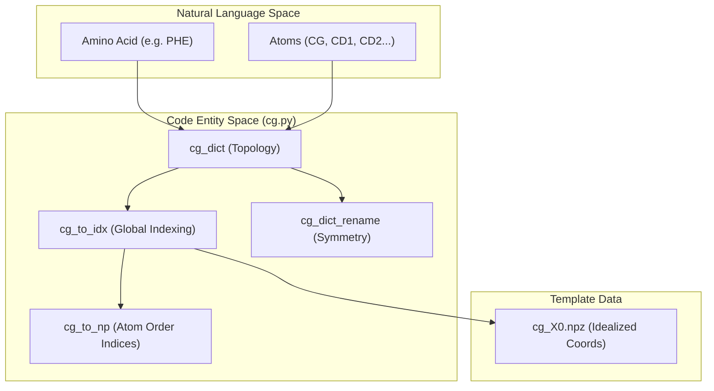
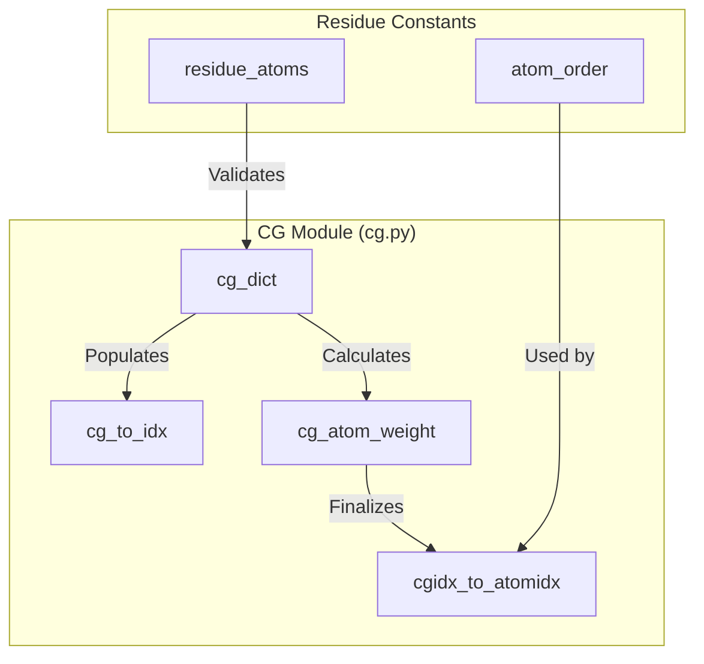

# Coarse\-Grained Representation

# Coarse\-Grained Representation

> **Relevant source files**
> - [cg\.py](https://github.com/Genentech/equifold/blob/2e466856/cg.py)
> - [cg\_X0\.npz](https://github.com/Genentech/equifold/blob/2e466856/cg_X0.npz)

 EquiFold operates on a coarse\-grained \(CG\) representation of protein structures rather than an all\-atom model\. This representation decomposes the 20 standard amino acids into a set of "beads" or nodes, where each node represents a rigid group of atoms\. This approach reduces the computational complexity of the equivariant neural network while maintaining sufficient geometric detail to reconstruct all\-atom coordinates\.

## Topology Definition \(`cg_dict`\)

 The fundamental decomposition of amino acids into CG nodes is defined in `cg_dict`\. Each amino acid is mapped to a list of tuples, where each tuple contains the names of atoms belonging to that specific CG node\.

 - **Backbone Nodes**: Most residues contain at least two backbone\-related nodes: - A primary backbone node \(typically `C`, `CA`, `CB`, `N`\)\. - A secondary backbone node for the carbonyl oxygen \(`C`, `CA`, `O`\)\.
- **Sidechain Nodes**: Additional nodes are defined based on the chemical structure of the sidechain \(e\.g\., `ARG` has 4 nodes, while `GLY` has only 2\)\.

 The mapping ensures that every atom belonging to a residue \(as defined in `openfold_light.residue_constants.residue_atoms`\) is assigned to at least one CG node [cg\.py L37-L38](https://github.com/Genentech/equifold/blob/2e466856/cg.py#L37-L38)

### Example Decompositions

| Residue | CG Node 0 Atoms | CG Node 1 Atoms | Sidechain Nodes |
| --- | --- | --- | --- |
| ALA | C, CA, CB, N | C, CA, O | N/A |
| ARG | C, CA, CB, N | C, CA, O | \(CB, CG, CD\), \(NE, NH1, NH2, CZ\) |
| GLY | C, CA, N | C, CA, O | N/A |
| PHE | C, CA, CB, N | C, CA, O | \(CG, CD1, CD2, CE1, CE2, CZ\) |

 Sources: [cg\.py L10-L31](https://github.com/Genentech/equifold/blob/2e466856/cg.py#L10-L31) [cg\.py L37-L38](https://github.com/Genentech/equifold/blob/2e466856/cg.py#L37-L38)

## Global Indexing and Type Mapping

 EquiFold uses a global indexing system to identify CG node types across all amino acids\. This is managed via the `cg_to_idx` mapping, which assigns a unique integer to every possible \(Residue Type, Node Index\) pair\.

 - **`cg_to_idx`**: Maps `(resname_to_idx[res], node_index)` to a global `idx` [cg\.py L41-L46](https://github.com/Genentech/equifold/blob/2e466856/cg.py#L41-L46)
- **`NUM_CG_TYPES`**: The total number of unique CG node types \(61 in the current implementation\) [cg\.py L48](https://github.com/Genentech/equifold/blob/2e466856/cg.py#L48-L48)
- **`N_CG_MAX`**: The maximum number of atoms contained within a single CG node \(9 atoms, found in the `TRP` sidechain node\) [cg\.py L34](https://github.com/Genentech/equifold/blob/2e466856/cg.py#L34-L34)

### Coordinate Templates \(`cg_X0.npz`\)

 The file `cg_X0.npz` contains the idealized local coordinates for every CG node type\. When the model predicts the 3D position and orientation \(frame\) of a CG node, these template coordinates are transformed into global space to place the constituent atoms\. The template is stored as a numpy array of shape `(NUM_CG_TYPES, N_CG_MAX, 3)` [cg\_X0\.npz L1](https://github.com/Genentech/equifold/blob/2e466856/cg_X0.npz#L1-L1)

 Sources: [cg\.py L41-L55](https://github.com/Genentech/equifold/blob/2e466856/cg.py#L41-L55) [cg\_X0\.npz L1](https://github.com/Genentech/equifold/blob/2e466856/cg_X0.npz#L1-L1)

## Symmetry and Ambiguity Handling

 Certain amino acids possess 180\-degree rotational symmetries in their sidechains \(e\.g\., the terminal oxygens in ASP or the ring in PHE\)\. EquiFold handles these through a renaming/permutation scheme defined in `cg_dict_rename` [cg\.py L58-L79](https://github.com/Genentech/equifold/blob/2e466856/cg.py#L58-L79)

 - **Symmetry Definition**: For ambiguous nodes, a permutation tuple defines which atoms are equivalent under rotation\. For example, in `ASP`, the third node `(CG, OD1, OD2)` has a permutation `(0, 2, 1)`, indicating `OD1` and `OD2` can be swapped [cg\.py L61](https://github.com/Genentech/equifold/blob/2e466856/cg.py#L61-L61)
- **`cg_atom_ambiguous_np`**: A boolean mask indicating which atoms within which CG types are subject to naming ambiguity [cg\.py L89](https://github.com/Genentech/equifold/blob/2e466856/cg.py#L89-L89)
- **Loss Calculation**: These permutations are used during training to ensure that the model is not penalized for predicting a symmetric state that is chemically identical but numerically different from the ground truth\.

 Sources: [cg\.py L58-L89](https://github.com/Genentech/equifold/blob/2e466856/cg.py#L58-L89)

## Mapping Logic Flow

 The following diagram illustrates the relationship between the natural amino acid definitions and the code entities that manage the coarse\-grained graph\.

 **CG Representation Data Flow**

 Sources: [cg\.py L10-L13](https://github.com/Genentech/equifold/blob/2e466856/cg.py#L10-L13) [cg\.py L41-L46](https://github.com/Genentech/equifold/blob/2e466856/cg.py#L41-L46) [cg\.py L52-L55](https://github.com/Genentech/equifold/blob/2e466856/cg.py#L52-L55) [cg\_X0\.npz L1](https://github.com/Genentech/equifold/blob/2e466856/cg_X0.npz#L1-L1)

## Reverse Mapping \(CG to All\-Atom\)

 To reconstruct all\-atom coordinates from the coarse\-grained nodes, the system tracks the contribution of each node to its constituent atoms\. Since some atoms \(like `CA`\) appear in multiple CG nodes for a single residue, a weighting scheme is used\.

 - **`cg_atom_weight`**: A `Counter` that tracks how many CG nodes a specific atom belongs to within a residue [cg\.py L93-L95](https://github.com/Genentech/equifold/blob/2e466856/cg.py#L93-L95)
- **`cgidx_to_atomidx`**: A mapping that stores the residue name, atom name, local atom index, and the weight factor for every atom in every global CG type [cg\.py L97-L102](https://github.com/Genentech/equifold/blob/2e466856/cg.py#L97-L102)

 This metadata allows the `utils.py` functions to perform a weighted average of atom positions when multiple CG frames predict the location of the same atom\.

 **Entity Association Diagram**

 Sources: [cg\.py L7-L8](https://github.com/Genentech/equifold/blob/2e466856/cg.py#L7-L8) [cg\.py L37-L38](https://github.com/Genentech/equifold/blob/2e466856/cg.py#L37-L38) [cg\.py L93-L102](https://github.com/Genentech/equifold/blob/2e466856/cg.py#L93-L102)

---
*Source: [https://deepwiki.com/Genentech/equifold/2.1-coarse-grained-representation](https://deepwiki.com/Genentech/equifold/2.1-coarse-grained-representation) on DeepWiki*