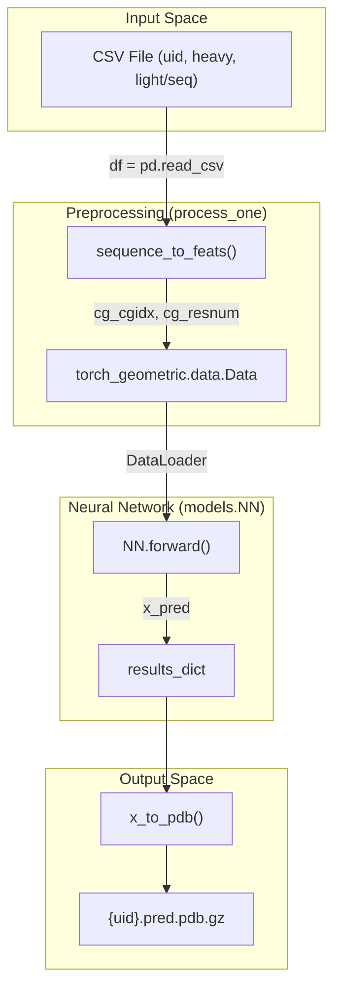
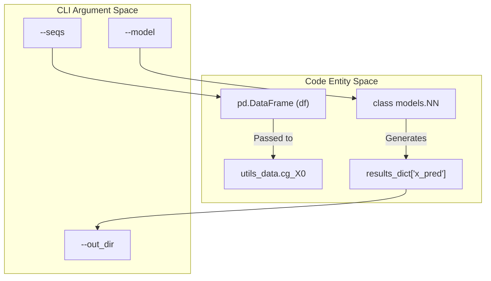

# Getting Started & Installation

# Getting Started & Installation

> **Relevant source files**
> - [README\.md](https://github.com/Genentech/equifold/blob/2e466856/README.md?plain=1)
> - [run\_inference\.py](https://github.com/Genentech/equifold/blob/2e466856/run_inference.py)

 This page provides a technical guide for setting up the EquiFold environment, installing its specialized geometric deep learning dependencies, and executing the inference pipeline\. EquiFold leverages equivariant neural networks and coarse\-grained representations to predict protein structures from amino acid sequences\.

## Environment Setup

 EquiFold requires a specific set of dependencies, particularly for geometric deep learning \(PyTorch Geometric\) and equivariant operations \(`e3nn`\)\. The project supports both GPU \(NVIDIA A100/CUDA 11\.3\) and CPU\-only environments\.

### GPU Installation \(Recommended\)

 The following commands initialize a Conda environment for GPU\-accelerated inference\.

```
# Create and activate environmentconda create -n ef python=3.9 -yconda activate ef # Install core PyTorch and CUDA toolkitconda install pytorch=1.11 cudatoolkit=11.3 -c pytorch -y # Install PyTorch Geometric and related wheelspip install torch-scatter torch-sparse torch-cluster torch-spline-conv torch-geometric -f https://data.pyg.org/whl/torch-1.11.0+cu113.html  # Install geometric and bioinformatics utilitiespip install e3nn pytorch-lightning biopython pandas tqdm einops
```

 Sources: [README\.md?plain=1 L12-L20](https://github.com/Genentech/equifold/blob/2e466856/README.md?plain=1#L12-L20)

### CPU Installation

 For local development or environments without NVIDIA GPUs:

```
conda create -n ef python=3.9 -yconda activate efconda install pytorch=1.12 -c pytorch -yconda install pyg -c pygpip install e3nn pytorch-lightning biopython pandas tqdm einops
```

 Sources: [README\.md?plain=1 L22-L29](https://github.com/Genentech/equifold/blob/2e466856/README.md?plain=1#L22-L29)

## Project Structure & Model Weights

 Before running inference, ensure the `models/` directory contains the necessary weights and configuration files\. EquiFold ships with two pre\-trained variants:

| Model Type | Weight File | Config File | Description |
| --- | --- | --- | --- |
| Antibody | ab\_weights\.pt | ab\_config\.json | Optimized for paired heavy/light chains\. |
| Science | science\_weights\.pt | science\_config\.json | Optimized for mini\-proteins and single chains\. |

 Sources: [README\.md?plain=1 L32-L34](https://github.com/Genentech/equifold/blob/2e466856/README.md?plain=1#L32-L34) [run\_inference\.py L58-L59](https://github.com/Genentech/equifold/blob/2e466856/run_inference.py#L58-L59)

## Running Your First Inference

 The entry point for generating structures is `run_inference.py`\. This script handles sequence featurization, model instantiation, and PDB generation\.

### Execution Examples

 **For Antibodies:**

```
python run_inference.py --model ab --model_dir models --seqs tests/data/inference_ab_input.csv --ncpu 1 --out_dir out_tests
```

 **For Mini\-Proteins:**

```
python run_inference.py --model science --model_dir models --seqs tests/data/inference_science_input.csv --ncpu 1 --out_dir out_tests
```

 Sources: [README\.md?plain=1 L39-L45](https://github.com/Genentech/equifold/blob/2e466856/README.md?plain=1#L39-L45)

### CLI Arguments

 The `run_inference.py` script accepts the following arguments:

| Argument | Default | Choices | Description |
| --- | --- | --- | --- |
| \-\-model | ab | ab, science | Selection of the pre\-trained model architecture\. |
| \-\-model\_dir | models | N/A | Path to the directory containing \.pt and \.json files\. |
| \-\-seqs | None | N/A | Path to the input CSV file containing sequences\. |
| \-\-ncpu | 1 | N/A | Number of CPUs for parallel sequence featurization\. |
| \-\-out\_dir | out | N/A | Directory where \.pdb\.gz results will be saved\. |

 Sources: [run\_inference\.py L49-L55](https://github.com/Genentech/equifold/blob/2e466856/run_inference.py#L49-L55)

## Implementation Details & Data Flow

 The inference pipeline bridges raw string sequences to 3D atomic coordinates through a multi\-stage process involving multiprocessing for data preparation and a forward pass through the `NN` \(Neural Network\) module\.

### Inference Pipeline Logic

 1. **Model Loading**: The script reads the configuration JSON to instantiate the `NN` class [run\_inference\.py L60-L62](https://github.com/Genentech/equifold/blob/2e466856/run_inference.py#L60-L62) and loads the state dictionary from the weights file [run\_inference\.py L63](https://github.com/Genentech/equifold/blob/2e466856/run_inference.py#L63-L63)
2. **Data Preparation \(`process_one`\)**: For each row in the CSV, `process_one` calls `sequence_to_feats` [run\_inference\.py L19-L21](https://github.com/Genentech/equifold/blob/2e466856/run_inference.py#L19-L21) to convert amino acids into coarse\-grained \(CG\) nodes\.
3. **Graph Construction**: The `torch_geometric.data.Data` object is built, incorporating template coordinates `cg_X0` [run\_inference\.py L33-L43](https://github.com/Genentech/equifold/blob/2e466856/run_inference.py#L33-L43)
4. **Forward Pass**: The `model` \(an instance of `models.NN`\) processes the batch [run\_inference\.py L92](https://github.com/Genentech/equifold/blob/2e466856/run_inference.py#L92-L92)
5. **PDB Generation**: The predicted coordinates `x_pred` are converted to PDB format using `x_to_pdb` and written to a compressed file [run\_inference\.py L98-L102](https://github.com/Genentech/equifold/blob/2e466856/run_inference.py#L98-L102)

### Data Flow Diagram: Sequence to Structure

 The following diagram illustrates how natural language sequence inputs are transformed into code\-level entities and processed by the system\.



 Sources: [run\_inference\.py L17-L45](https://github.com/Genentech/equifold/blob/2e466856/run_inference.py#L17-L45) [run\_inference\.py L68-L102](https://github.com/Genentech/equifold/blob/2e466856/run_inference.py#L68-L102)

### Entity Mapping: CLI to Internal Objects

 This diagram maps the command\-line arguments and high\-level concepts to specific variables and classes within the codebase\.



 Sources: [run\_inference\.py L49-L65](https://github.com/Genentech/equifold/blob/2e466856/run_inference.py#L49-L65) [run\_inference\.py L68-L76](https://github.com/Genentech/equifold/blob/2e466856/run_inference.py#L68-L76) [run\_inference\.py L92-L98](https://github.com/Genentech/equifold/blob/2e466856/run_inference.py#L92-L98)

---
*Source: [https://deepwiki.com/Genentech/equifold/1.1-getting-started-and-installation](https://deepwiki.com/Genentech/equifold/1.1-getting-started-and-installation) on DeepWiki*